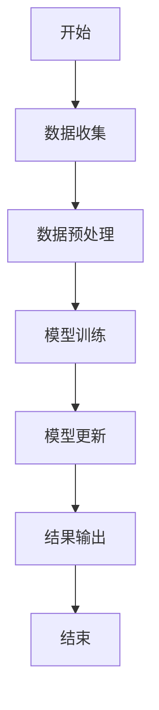
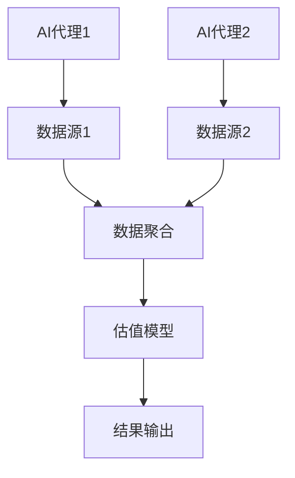
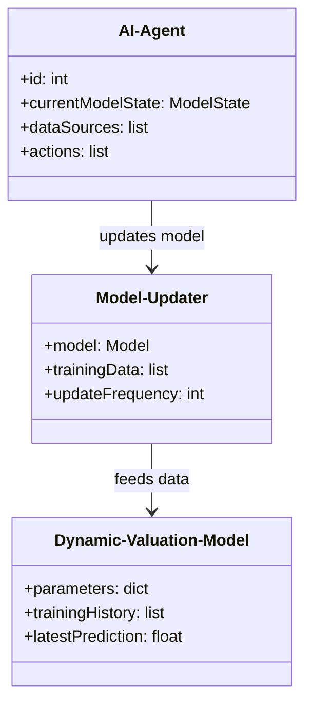

                 


# AI agents协作构建动态估值模型：适应快速变化的市场

> 关键词：AI代理、动态估值模型、金融市场、实时数据、协作机制

> 摘要：本文详细探讨了AI代理如何协作构建动态估值模型，以适应快速变化的市场环境。通过分析AI代理的核心功能、动态估值模型的算法原理、系统架构设计以及实际项目案例，本文为读者提供了从理论到实践的全面指南。

---

## 第一部分：AI Agent与动态估值模型的背景介绍

### 第1章：AI Agent的基本概念

#### 1.1 AI Agent的定义与特点
- **AI Agent**：能够感知环境、自主决策并采取行动的智能实体。
- **特点**：
  - **自主性**：无需外部干预，自主执行任务。
  - **反应性**：能够实时感知环境变化并做出反应。
  - **协作性**：能够与其他AI代理或系统协同工作。

#### 1.2 动态估值模型的定义与特点
- **动态估值模型**：一种能够根据实时数据和市场变化动态调整的估值模型。
- **特点**：
  - **实时性**：能够快速响应市场变化。
  - **适应性**：能够根据新数据自动调整模型参数。
  - **准确性**：通过AI代理的协作，提高估值的准确性。

#### 1.3 AI Agent在动态估值模型中的作用
- **数据收集**：实时监控市场数据，如价格、成交量等。
- **模型更新**：根据实时数据调整估值模型的参数。
- **决策支持**：基于动态估值结果，提供投资建议。

### 第2章：问题背景与问题描述

#### 2.1 市场快速变化的背景
- 当今金融市场变化迅速，传统静态估值模型难以应对。
- 例如，突发事件（如疫情、政策变化）可能导致市场估值瞬间波动。

#### 2.2 传统估值模型的局限性
- **静态性**：无法实时调整，导致估值滞后。
- **缺乏自适应性**：无法根据市场变化自动优化模型。

#### 2.3 AI Agent协作的必要性
- **实时性**：AI代理能够实时收集和处理数据，确保模型的及时更新。
- **协作性**：多个AI代理协同工作，提高模型的准确性和鲁棒性。

---

## 第二部分：AI Agent协作的动态估值模型

### 第3章：动态估值模型的算法原理

#### 3.1 动态估值模型的算法流程



- **数据收集**：从多个来源收集实时数据，如API接口、数据库等。
- **数据预处理**：清洗数据，处理缺失值和异常值。
- **模型训练**：使用机器学习算法训练模型，如ARIMA、LSTM等。
- **模型更新**：根据实时数据不断优化模型参数。
- **结果输出**：输出动态估值结果，并提供给决策者。

#### 3.2 AI代理协作的具体实现



- **数据聚合**：多个AI代理从不同数据源收集数据，经过聚合后输入模型。
- **模型训练**：使用时间序列分析或强化学习算法，训练动态估值模型。
- **结果输出**：将动态估值结果实时反馈给用户或系统。

---

## 第三部分：系统分析与架构设计

### 第4章：系统架构设计

#### 4.1 系统功能设计



- **AI Agent**：负责数据收集和模型更新。
- **Model Updater**：负责模型的训练和优化。
- **Dynamic Valuation Model**：负责生成动态估值结果。

#### 4.2 系统架构图


---

## 第四部分：项目实战

### 第5章：项目实战

#### 5.1 项目背景

- **项目目标**：构建一个基于AI代理的动态估值系统，用于股票市场的实时估值。
- **技术栈**：
  - 数据收集：使用Yahoo Finance API。
  - 数据处理：Python的Pandas库。
  - 模型训练：使用TensorFlow和Keras。
  - 系统部署：使用Flask构建Web界面。

#### 5.2 核心代码实现

```python
import pandas as pd
import numpy as np
from tensorflow.keras.models import Sequential
from tensorflow.keras.layers import LSTM, Dense
import requests

# 数据收集
def get_market_data(ticker):
    url = f"https://api.yfinance.yahoo.com/stock/v2/get/{ticker}"
    response = requests.get(url)
    data = response.json()
    return data['priceData']['regularMarketPrice']

# 数据预处理
def preprocess_data(dataframe):
    dataframe = dataframe.fillna(method='ffill')
    return dataframe

# LSTM模型构建
def build_model(input_shape):
    model = Sequential()
    model.add(LSTM(units=50, input_shape=input_shape))
    model.add(Dense(1))
    model.compile(optimizer='adam', loss='mean_squared_error')
    return model

# 模型训练
def train_model(model, X_train, y_train):
    model.fit(X_train, y_train, epochs=10, batch_size=32)
    return model

# 动态估值
def dynamic_valuation(ticker):
    data = get_market_data(ticker)
    processed_data = preprocess_data(data)
    model = build_model((processed_data.shape[1], 1))
    trained_model = train_model(model, processed_data, labels)
    prediction = trained_model.predict(processed_data[-1:])
    return prediction[0][0]
```

---

## 第五部分：总结与展望

### 第6章：总结与展望

- **总结**：AI代理通过协作构建动态估值模型，能够实时适应市场变化，提高估值的准确性和及时性。
- **展望**：未来，随着AI技术的发展，动态估值模型将更加智能化和自动化，进一步提升金融市场的分析能力。

---

通过以上步骤，我们可以清晰地看到AI代理在动态估值模型中的重要性及其实际应用。从理论到实践，本文为读者提供了全面的指导，帮助他们理解并实现基于AI代理的动态估值系统。

