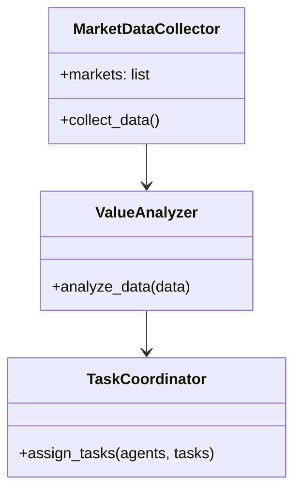

                 


# 目录大纲：《AI agents协作进行跨市场价值比较：发现全球机会》

## 第一部分：引言

## 第1章：引言

### 1.1 问题背景

#### 1.1.1 AI代理的定义与核心功能
AI代理（Artificial Intelligence Agents）是指能够感知环境并采取行动以实现目标的智能实体。它们可以是软件程序或物理设备，具备自主决策、学习和适应的能力。

#### 1.1.2 跨市场价值比较的必要性
在跨国投资中，准确评估不同市场的价值至关重要。传统的市场分析依赖于人类专家，效率低下且受主观因素影响。AI代理通过协作可以高效地收集、分析和比较市场数据，为投资者提供更精准的决策支持。

#### 1.1.3 全球机会发现的重要性
在全球化背景下，市场机会往往存在于不同国家和行业中。通过AI代理协作，投资者可以快速识别跨市场的潜在机会，抓住全球经济趋势中的利润点。

### 1.2 问题描述

#### 1.2.1 当前市场分析的挑战
传统市场分析依赖大量手动数据收集和复杂模型，耗时且成本高昂。同时，单一市场的分析难以捕捉全局机会，且难以应对市场的动态变化。

#### 1.2.2 AI代理协作的优势
AI代理能够快速处理大量数据，提供实时分析，并通过协作实现更全面的市场覆盖。它们可以同时分析多个市场，发现潜在的跨市场关联和机会。

### 1.3 问题解决

#### 1.3.1 AI代理协作的解决方案
通过分布式计算和协作算法，AI代理可以协同工作，分别负责不同市场的分析，并将结果整合以提供全局视角。

#### 1.3.2 跨市场价值比较的具体步骤
1. 数据收集：从多个市场获取经济指标、公司财务数据等。
2. 数据清洗：处理缺失值和异常数据。
3. 价值评估：使用AI模型评估各市场的投资价值。
4. 比较分析：找出跨市场的差异和机会。

### 1.4 边界与外延

#### 1.4.1 解决方案的适用范围
适用于跨国投资、风险管理等领域，尤其在需要实时数据分析和跨市场比较的场景。

#### 1.4.2 解决方案的限制
受限于数据质量和模型的准确性，AI代理协作可能在处理高度复杂或不确定的市场环境时面临挑战。

### 1.5 概念结构与核心要素

#### 1.5.1 核心概念的层次结构
市场分析 → 数据处理 → 价值评估 → 跨市场比较 → 投资决策。

#### 1.5.2 核心要素的详细说明
- 数据来源：金融市场数据、经济指标等。
- 分析模型：机器学习算法、统计模型。
- 协作机制：任务分配、结果整合。

---

## 第二部分：AI代理协作基础

## 第2章：AI代理协作的核心概念

### 2.1 AI代理协作的基本原理

#### 2.1.1 代理的定义与分类
AI代理可以是软件代理（如交易算法）或物理代理（如自动化机器人）。它们根据环境信息采取行动，以实现特定目标。

#### 2.1.2 协作机制的类型
- 分散协作：每个代理独立决策，通过通信共享信息。
- 中央协调：有一个中心代理协调任务分配和结果整合。

### 2.2 代理协作的关键技术

#### 2.2.1 通信协议
- 数据格式：JSON、XML等。
- 通信方式：HTTP API、WebSocket。

#### 2.2.2 任务分配算法
- 基于拍卖的任务分配：代理竞标任务，最高出价者执行。
- 基于负载均衡的任务分配：根据计算能力分配任务。

### 2.3 代理协作的优势与挑战

#### 2.3.1 优势分析
- 高效性：多个代理同时处理任务，提高效率。
- 全局视角：整合各代理的分析结果，提供全面的市场观点。

#### 2.3.2 挑战与解决方案
- 同步问题：使用分布式系统技术解决异步通信。
- 冗余问题：通过优化算法减少重复计算。

---

## 第三部分：跨市场价值比较的AI代理协作方法

## 第3章：跨市场价值比较的理论基础

### 3.1 市场价值比较的核心要素

#### 3.1.1 市场分析指标
- GDP增长率、失业率、通胀率等宏观经济指标。
- 行业增长率、利润率等微观经济指标。

#### 3.1.2 价值评估标准
- 市盈率（P/E）、市净率（P/B）、股息率等。

### 3.2 跨市场比较的数学模型

#### 3.2.1 数据预处理方法
- 数据清洗：处理缺失值、异常值。
- 标准化：将数据转换为统一格式。

#### 3.2.2 模型构建步骤
1. 数据收集与预处理。
2. 选择分析模型（如回归分析、聚类分析）。
3. 模型训练与优化。
4. 模型部署与应用。

---

## 第四部分：算法原理与实现

## 第4章：AI代理协作算法

### 4.1 算法概述

#### 4.1.1 算法的基本原理
AI代理协作算法通过任务分配、数据处理和结果整合，实现跨市场的价值比较。

#### 4.1.2 算法的输入输出
- 输入：多个市场的数据集。
- 输出：各市场的价值评估结果和跨市场的比较分析。

### 4.2 算法实现步骤

#### 4.2.1 数据预处理
```python
import pandas as pd
data = pd.read_csv('market_data.csv')
data = data.dropna()
```

#### 4.2.2 任务分配
使用基于拍卖的任务分配算法：
```python
def assign_task(agents, tasks):
    for task in tasks:
        bids = {agent: agent.bid(task) for agent in agents}
        winner = max(bids, key=lambda k: bids[k])
        winner.execute(task)
```

#### 4.2.3 数据分析
使用回归分析评估市场价值：
```python
from sklearn.linear_model import LinearRegression
model = LinearRegression()
model.fit(X, y)
predictions = model.predict(X_test)
```

#### 4.2.4 结果整合
将各市场的分析结果整合：
```python
results = {market: analysis_result for market, analysis_result in zip(markets, results)}
global_report = integrate(results)
```

---

## 第五部分：系统分析与架构设计

## 第5章：系统架构设计

### 5.1 问题场景介绍

#### 5.1.1 项目介绍
构建一个AI代理协作平台，用于跨市场的价值比较和投资机会发现。

### 5.2 系统功能设计

#### 5.2.1 领域模型设计
使用Mermaid类图展示系统模块：


### 5.3 系统架构设计

#### 5.3.1 系统架构图
```mermaid
container {
    Title: AI Agent Collaboration System
    partition MarketData {
        MarketDataCollector
    }
    partition ValueAnalysis {
        ValueAnalyzer
    }
    partition TaskCoordination {
        TaskCoordinator
    }
}
```

### 5.4 接口设计与交互流程

#### 5.4.1 系统接口
- MarketDataCollector接口：收集市场数据。
- ValueAnalyzer接口：分析数据并返回结果。
- TaskCoordinator接口：分配任务并协调结果。

#### 5.4.2 交互流程
使用Mermaid序列图展示交互步骤：
```mermaid
sequenceDiagram
    participant Agent1
    participant Agent2
    participant TaskCoordinator
    Agent1->TaskCoordinator: 请求任务
    TaskCoordinator->Agent1: 分配任务
    Agent1->MarketDataCollector: 收集数据
    MarketDataCollector->Agent1: 返回数据
    Agent1->ValueAnalyzer: 分析数据
    ValueAnalyzer->Agent1: 返回结果
    Agent1->TaskCoordinator: 提交结果
    TaskCoordinator->整合结果
```

---

## 第六部分：项目实战

## 第6章：构建AI代理协作平台

### 6.1 环境安装

#### 6.1.1 安装Python环境
```bash
pip install python
pip install numpy pandas scikit-learn
```

#### 6.1.2 安装其他依赖
安装必要的库：
```bash
pip install requests matplotlib
```

### 6.2 核心代码实现

#### 6.2.1 代理类
```python
class Agent:
    def __init__(self, id):
        self.id = id
        self.data = None
    def bid(self, task):
        return self.data.get(task, 0)
    def execute(self, task):
        # 数据分析逻辑
        pass
```

#### 6.2.2 任务协调器
```python
class TaskCoordinator:
    def __init__(self, agents, tasks):
        self.agents = agents
        self.tasks = tasks
    def assign_task(self):
        # 实现任务分配逻辑
        pass
```

### 6.3 案例分析

#### 6.3.1 数据分析案例
使用回归分析模型分析不同市场的GDP增长率：
```python
import pandas as pd
from sklearn.linear_model import LinearRegression

data = pd.read_csv('gdp_data.csv')
model = LinearRegression()
model.fit(data[['year']], data['gdp_growth'])
predictions = model.predict([[2024]])
print(predictions[0])
```

#### 6.3.2 结果整合与分析
整合各市场的分析结果，生成全局报告，识别投资机会。

### 6.4 项目总结

#### 6.4.1 成果总结
成功构建了AI代理协作平台，实现了跨市场的价值比较。

#### 6.4.2 经验总结
- 数据质量对模型准确性影响重大。
- 任务分配算法的选择影响系统效率。

#### 6.4.3 改进方向
优化算法，提高系统实时性和准确性。

---

## 第七部分：总结与展望

## 第7章：总结与展望

### 7.1 全书总结

#### 7.1.1 全书核心内容回顾
介绍了AI代理协作在跨市场价值比较中的应用，详细讲解了算法实现和系统架构设计。

### 7.2 最佳实践 tips

#### 7.2.1 技术实现 tips
- 使用高效的通信协议和任务分配算法。
- 确保数据质量和实时性。

#### 7.2.2 系统设计 tips
- 模块化设计便于维护和扩展。
- 定期更新模型以适应市场变化。

### 7.3 展望

#### 7.3.1 未来研究方向
- 更智能的任务分配算法。
- 更精确的市场分析模型。

#### 7.3.2 技术趋势
- 结合区块链技术确保数据安全。
- 利用边缘计算提高实时性。

---

通过以上目录大纲，读者可以系统地了解AI代理协作在跨市场价值比较中的应用，从基础概念到算法实现，再到项目实战，逐步深入理解这一技术。

