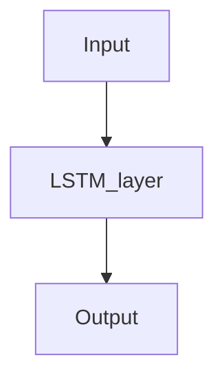
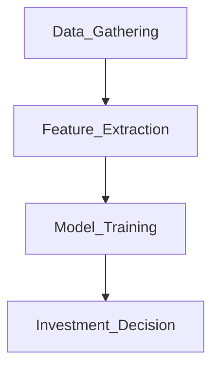

                 


# AI agents在价值投资中的宏观经济分析应用

> 关键词：AI代理，价值投资，宏观经济分析，强化学习，时间序列分析

> 摘要：本文探讨AI代理在价值投资中的宏观经济分析应用，通过逐步分析，介绍AI代理的核心原理、算法模型及系统架构，结合实际案例，展示其在投资决策中的潜力。

---

# 第一部分: AI代理与宏观经济分析基础

# 第1章: AI代理与宏观经济分析概述

## 1.1 AI代理的基本概念

### 1.1.1 AI代理的定义与特点

AI代理是一种能够感知环境、自主决策并执行任务的智能实体。其特点包括自主性、反应性、目标导向和学习能力。AI代理在投资领域，能够根据市场数据做出实时决策。

### 1.1.2 AI代理的核心原理

AI代理通过感知环境信息，利用算法进行推理和学习，从而做出决策。常见的AI代理类型包括基于规则的代理和基于学习的代理。

### 1.1.3 AI代理与传统投资分析的区别

传统投资分析依赖于人类分析师的主观判断，而AI代理能够快速处理大量数据，提供客观的分析结果。AI代理的优势在于数据处理能力、速度和一致性。

## 1.2 宏观经济分析的基本概念

### 1.2.1 宏观经济分析的定义与范围

宏观经济分析研究整体经济系统的运行，包括GDP、利率、通货膨胀等指标。这些指标对价值投资决策具有重要影响。

### 1.2.2 宏观经济指标的分类与作用

宏观经济指标分为总量指标、结构指标和价格指标。总量指标如GDP、失业率，结构指标如行业分布，价格指标如通胀率。这些指标帮助投资者评估经济趋势。

### 1.2.3 宏观经济分析在价值投资中的重要性

宏观经济分析帮助投资者识别系统性风险和投资机会。通过分析宏观经济指标，投资者可以做出更明智的投资决策。

## 1.3 AI代理在宏观经济分析中的应用前景

### 1.3.1 AI代理在宏观经济预测中的优势

AI代理能够处理海量数据，发现传统方法难以察觉的模式和趋势。其在宏观经济预测中的优势包括高效性、准确性和实时性。

### 1.3.2 AI代理在投资决策中的潜在价值

AI代理能够快速响应市场变化，优化投资组合。通过分析宏观经济指标，AI代理可以帮助投资者做出更精准的投资决策。

### 1.3.3 宏观经济分析的挑战与AI代理的解决方案

宏观经济分析面临数据复杂性和模型局限性的问题。AI代理通过机器学习和大数据处理能力，能够有效克服这些挑战。

## 1.4 本章小结

---

# 第二部分: AI代理的核心概念与原理

# 第2章: AI代理的核心原理

## 2.1 AI代理的决策机制

### 2.1.1 基于强化学习的决策模型

强化学习是一种通过试错机制优化决策的算法。AI代理通过与环境交互，获得奖励，逐步优化决策策略。

### 2.1.2 基于监督学习的决策模型

监督学习通过历史数据训练模型，预测未来的结果。AI代理可以根据历史经济数据，预测未来的经济趋势。

### 2.1.3 基于生成对抗网络的决策模型

生成对抗网络（GAN）通过两个网络的对抗训练，生成逼真的数据。AI代理可以利用GAN生成虚拟经济数据，用于测试和优化策略。

## 2.2 宏观经济指标的特征提取

### 2.2.1 时间序列分析的基本原理

时间序列分析研究数据随时间的变化规律。常用的方法包括ARIMA和GARCH模型，用于预测未来的经济指标。

### 2.2.2 常见宏观经济指标的特征提取方法

通过统计分析和机器学习方法，提取宏观经济指标的特征，如趋势、周期性和波动性。特征提取有助于提高模型的预测能力。

### 2.2.3 基于AI代理的特征提取优化

AI代理可以通过深度学习模型自动提取特征，捕捉数据中的复杂模式。这使得特征提取更加高效和准确。

## 2.3 AI代理与宏观经济数据的关联

### 2.3.1 宏观经济数据的多维度分析

宏观经济数据涉及多个维度，如经济、政治和社会因素。AI代理能够综合分析这些因素，提供全面的经济分析。

### 2.3.2 AI代理在数据关联中的作用

AI代理通过关联分析，识别不同经济指标之间的关系，帮助投资者理解经济系统的运行机制。

### 2.3.3 数据关联的挑战与解决方案

数据关联面临数据稀疏性和噪声干扰的挑战。AI代理通过先进的算法和数据处理技术，能够有效克服这些挑战。

## 2.4 本章小结

---

# 第三部分: AI代理的算法原理与数学模型

# 第3章: 基于强化学习的宏观经济预测模型

## 3.1 强化学习的基本原理

### 3.1.1 强化学习的定义与核心概念

强化学习通过智能体与环境的交互，学习最优策略。核心概念包括状态、动作、奖励和策略。

### 3.1.2 状态、动作与奖励的定义

状态表示环境的当前情况，动作是智能体的决策，奖励是对决策的反馈。

### 3.1.3 基于深度强化学习的模型结构

深度强化学习结合深度学习和强化学习，利用神经网络处理复杂状态空间。

## 3.2 宏观经济预测的强化学习模型

### 3.2.1 状态空间的构建

状态空间包括宏观经济指标，如GDP增长率、失业率等。

### 3.2.2 动作空间的设计

动作空间定义了智能体的可能决策，如买入、卖出或持有。

### 3.2.3 奖励函数的定义

奖励函数根据智能体的决策和真实结果，给予正向或负向反馈。

## 3.3 模型训练与优化

### 3.3.1 策略梯度方法

策略梯度法通过优化策略的参数，直接最大化奖励的期望。

### 3.3.2 值函数方法

值函数方法通过估计状态-动作对的值，指导策略优化。

### 3.3.3 离线与在线训练的对比

离线训练使用历史数据，在线训练利用实时数据，适应动态环境。

## 3.4 本章小结

---

# 第四部分: 系统架构与项目实战

# 第4章: 系统架构设计

## 4.1 系统功能模块划分

### 4.1.1 数据获取模块

数据获取模块负责收集宏观经济指标，如GDP、利率等。

### 4.1.2 特征提取模块

特征提取模块利用时间序列分析和机器学习方法，提取特征。

### 4.1.3 模型训练模块

模型训练模块使用强化学习算法，训练宏观经济预测模型。

### 4.1.4 投资决策模块

投资决策模块根据预测结果，生成投资建议。

## 4.2 系统架构设计

### 4.2.1 模块之间的关系

数据获取模块提供输入，特征提取模块处理数据，模型训练模块生成预测结果，投资决策模块做出决策。

### 4.2.2 数据流与控制流设计

数据流从数据源到特征提取，再到模型训练和决策模块。控制流根据模块的执行状态，协调各部分工作。

### 4.2.3 系统的可扩展性设计

系统采用模块化设计，便于添加新的数据源或算法。

## 4.3 系统接口设计

### 4.3.1 数据接口

定义数据获取和特征提取的接口，确保模块之间的数据交互。

### 4.3.2 投资决策接口

定义投资决策模块的接口，供上层调用。

## 4.4 系统交互设计

### 4.4.1 交互流程

数据获取 -> 特征提取 -> 模型训练 -> 投资决策。

### 4.4.2 交互过程中的异常处理

设计异常处理机制，确保系统稳定运行。

## 4.5 项目实战

### 4.5.1 环境安装

安装Python、TensorFlow、Keras等必要的库。

### 4.5.2 核心实现代码

```python
import numpy as np
import pandas as pd
from tensorflow.keras.models import Model
from tensorflow.keras.layers import Input, LSTM, Dense

# 数据获取模块
data = pd.read_csv('macroeconomic_data.csv')

# 特征提取模块
features = data[['GDP', ' unemployment_rate', 'inflation_rate']]
scaler = StandardScaler()
scaled_features = scaler.fit_transform(features)

# 模型训练模块
input_layer = Input(shape=(None, 3))
lstm_layer = LSTM(64)(input_layer)
output_layer = Dense(1)(lstm_layer)
model = Model(inputs=input_layer, outputs=output_layer)
model.compile(optimizer='adam', loss='mean_squared_error')

# 训练模型
model.fit(scaled_features, targets, epochs=100, batch_size=32)

# 投资决策模块
predicted_values = model.predict(new_data)
investment_decision = 'buy' if predicted_values > threshold else 'sell'
```

### 4.5.3 代码应用解读

上述代码展示了数据获取、特征提取、模型训练和投资决策的实现。使用LSTM模型进行时间序列预测，根据预测结果做出投资决策。

### 4.5.4 案例分析

假设模型预测未来三个月GDP将增长，失业率下降，通胀率稳定。投资决策模块建议买入股票，增加投资组合。

## 4.6 本章小结

---

# 第五部分: 最佳实践与总结

# 第5章: 最佳实践与总结

## 5.1 小结

AI代理在宏观经济分析中的应用前景广阔，通过强化学习和深度学习算法，能够提高投资决策的准确性和效率。

## 5.2 注意事项

在实际应用中，需要注意数据质量和模型的可解释性，避免过度依赖AI代理。

## 5.3 拓展阅读

建议阅读相关书籍和论文，深入理解AI代理和宏观经济分析的结合应用。

---

# 附录: 数学公式与算法流程图

## 附录A: 强化学习算法流程图

```mermaid
graph TD
    A[开始] --> B[初始化环境]
    B --> C[选择动作]
    C --> D[执行动作，获得奖励]
    D --> E[更新策略]
    E --> F[判断是否结束]
    F --> G[结束] {是}
    F --> C {否}
```

## 附录B: LSTM模型结构



## 附录C: 系统架构图



---

# 参考文献

1. 线性代数书籍
2. 概率论书籍
3. 强化学习教材
4. 时间序列分析书籍
5. 宏观经济学教材
6. 相关技术文档

---

通过上述目录大纲，可以系统地学习AI代理在宏观经济分析中的应用，从基础概念到算法实现，再到系统设计和实战应用，帮助读者全面掌握相关知识。

