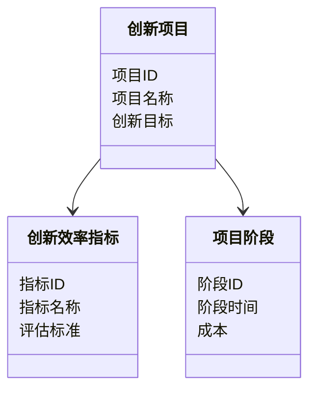
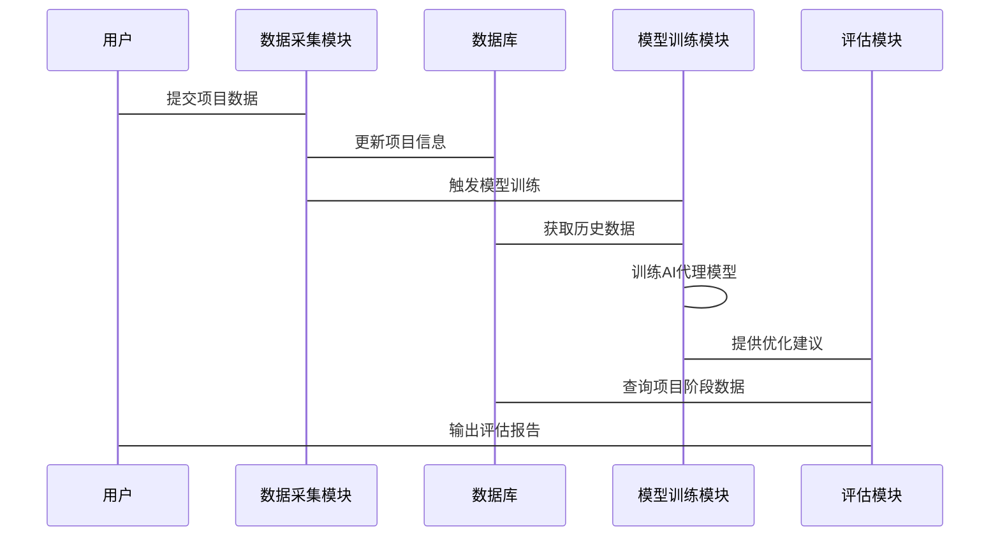

                 


# AI agents在公司创新转化效率评估中的应用

## 关键词：AI代理、创新转化效率、评估模型、强化学习、企业创新、效率优化

## 摘要：
本文探讨了AI代理在公司创新转化效率评估中的应用，分析了AI代理的核心概念、创新转化效率评估的重要性及其两者之间的关联。通过算法原理、系统架构设计和项目实战的详细阐述，本文展示了如何利用AI代理优化企业创新过程，提升创新效率。同时，本文还总结了最佳实践，为读者提供了关于AI代理在创新转化效率评估中的应用的深度洞察。

---

# 第一部分: AI代理与公司创新转化效率评估的背景

## 第1章: AI代理与创新转化效率评估的背景

### 1.1 AI代理的基本概念

#### 1.1.1 AI代理的定义与分类
AI代理（AI Agents）是指能够感知环境、自主决策并执行任务的智能实体。根据功能和复杂度，AI代理可以分为简单反射代理、基于模型的反射代理、目标驱动代理和效用驱动代理。简单反射代理基于固定规则执行任务，而目标驱动代理则通过设定目标来优化行为。

#### 1.1.2 AI代理的核心特征
AI代理的核心特征包括自主性、反应性、目标导向性和学习能力。自主性使代理能够独立完成任务，反应性使其能够实时感知环境变化并做出调整，目标导向性使其能够优先完成特定目标，学习能力使其能够通过数据优化自身行为。

#### 1.1.3 AI代理在企业中的应用潜力
在企业中，AI代理可以用于自动化决策支持、流程优化、风险管理等领域。特别是在创新转化效率评估中，AI代理可以通过分析大量数据，快速识别瓶颈并提出优化建议。

### 1.2 创新转化效率评估的重要性

#### 1.2.1 企业创新转化的定义
企业创新转化是指将创意转化为实际产品或服务的过程。这一过程通常包括创意生成、研发、测试和市场推广等多个阶段。

#### 1.2.2 创新转化效率对企业价值的影响
创新转化效率直接影响企业的市场竞争力和盈利能力。高效的创新转化能够缩短产品开发周期，降低研发成本，并快速响应市场变化。

#### 1.2.3 当前创新转化效率评估的挑战
传统的创新转化效率评估方法通常依赖于人工分析，存在效率低、主观性强、数据利用不足等问题。如何通过技术手段提升评估的准确性和效率成为企业面临的重要挑战。

### 1.3 AI代理在创新转化效率评估中的作用

#### 1.3.1 AI代理如何提升创新效率
AI代理可以通过分析历史数据，识别影响创新转化效率的关键因素，并提出优化建议。例如，AI代理可以预测不同阶段的资源分配情况，优化项目进度。

#### 1.3.2 AI代理在创新转化中的应用场景
在创新项目管理中，AI代理可以用于实时监控项目进度、识别潜在风险，并提供及时反馈。此外，AI代理还可以通过自然语言处理技术分析团队沟通效率，提出改进建议。

#### 1.3.3 AI代理与传统评估方法的对比
与传统评估方法相比，AI代理具有高效性、实时性和数据驱动的优势。AI代理能够处理海量数据，快速生成评估结果，而传统方法通常依赖于人工分析，效率较低。

### 1.4 本章小结
本章介绍了AI代理的基本概念及其在企业中的应用潜力，重点分析了创新转化效率评估的重要性，并探讨了AI代理在这一过程中的独特作用。通过对比传统方法，突出了AI代理的优势。

---

# 第二部分: AI代理与创新转化效率评估的核心概念

## 第2章: AI代理的核心概念与原理

### 2.1 AI代理的核心概念

#### 2.1.1 知识表示与推理
知识表示是AI代理理解世界的基础。通过符号逻辑或概率模型，AI代理可以表示知识并进行推理。例如，使用逻辑规则表示“如果项目A成功，则资源分配优先级提高”。

#### 2.1.2 行为决策与规划
AI代理需要根据当前状态和目标，制定行动方案。这一过程通常涉及强化学习算法，通过试错优化决策策略。

#### 2.1.3 人机交互与协作
AI代理需要与人类用户进行有效沟通，理解用户需求并提供支持。自然语言处理技术在这一过程中发挥着重要作用。

### 2.2 创新转化效率评估的指标体系

#### 2.2.1 创新项目生命周期模型
创新项目通常包括创意生成、研发、测试和推广四个阶段。每个阶段的效率指标不同，例如创意生成阶段关注创意数量和质量，研发阶段关注开发周期和成本。

#### 2.2.2 创新效率的关键影响因素
创新效率受多种因素影响，包括团队能力、资源配置、技术复杂度和市场环境等。AI代理可以通过分析这些因素，优化资源配置。

#### 2.2.3 创新转化效率的量化方法
创新转化效率可以通过项目周期、成本控制和市场表现等指标进行量化。例如，项目周期越短，效率越高。

### 2.3 AI代理与创新转化效率评估的关联

#### 2.3.1 AI代理在创新项目管理中的应用
AI代理可以帮助企业实时监控项目进度，识别潜在风险，并提供优化建议。例如，通过分析历史数据，AI代理可以预测项目延迟的可能性。

#### 2.3.2 AI代理对创新效率提升的机制
AI代理通过数据驱动的分析，优化资源配置，减少浪费。例如，AI代理可以自动分配资源，确保每个项目得到最优支持。

#### 2.3.3 创新转化效率评估的边界与外延
创新转化效率评估的边界通常包括项目内部和外部环境的影响。AI代理需要考虑内外部因素的综合影响，以提供全面的评估。

### 2.4 核心概念属性特征对比表

表2.1: AI代理与传统评估方法的属性对比

| 属性              | AI代理                  | 传统评估方法            |
|-------------------|-------------------------|-------------------------|
| 数据处理能力      | 强大，支持大数据分析    | 有限，依赖人工分析        |
| 决策速度          | 快速，实时反馈          | 较慢，依赖人工判断        |
| 可扩展性          | 高，适用于大规模数据    | 低，受人工能力限制        |
| 学习能力          | 强，支持持续优化        | 弱，依赖经验总结          |

### 2.5 ER实体关系图

```mermaid
erd
    entity 创新项目 {
        key 项目ID
        attribute 项目名称, 开始时间, 结束时间, 创新目标
    }
    entity 创新效率指标 {
        key 指标ID
        attribute 指标名称, 计算公式, 评估标准
    }
    entity 项目阶段 {
        key 阶段ID
        attribute 阶段名称, 阶段时间, 成本
    }
    relationship 创新项目 - 到- 创新效率指标 {
        role 项目ID -> 指标ID
    }
    relationship 创新项目 - 到- 项目阶段 {
        role 项目ID -> 阶段ID
    }
```

---

## 第3章: AI代理在创新转化效率评估中的算法原理

### 3.1 基于强化学习的AI代理算法

#### 3.1.1 算法原理
强化学习是一种通过试错优化决策的算法。AI代理通过与环境交互，获得奖励或惩罚，逐步优化行动策略。例如，使用Q-learning算法：

$$ Q(s, a) = r + \gamma \max_{a'} Q(s', a') $$

其中，\( Q(s, a) \) 表示在状态 \( s \) 下采取行动 \( a \) 的期望奖励，\( \gamma \) 是折扣因子。

#### 3.1.2 算法实现
以下是一个Q-learning算法的Python实现示例：

```python
class QAgent:
    def __init__(self, state_space, action_space):
        self.state_space = state_space
        self.action_space = action_space
        self.q_table = np.zeros((state_space, action_space))
    
    def choose_action(self, state, epsilon=0.1):
        if np.random.random() < epsilon:
            return np.random.randint(self.action_space)
        return np.argmax(self.q_table[state])
    
    def learn(self, state, action, reward, next_state, alpha=0.1, gamma=0.9):
        self.q_table[state, action] += alpha * (reward + gamma * np.max(self.q_table[next_state]) - self.q_table[state, action])
```

### 3.2 基于模型的AI代理算法

#### 3.2.1 算法原理
基于模型的AI代理通过构建环境模型，预测未来状态。例如，使用模型预测算法：

$$ P(s' | s, a) = \text{概率从状态 } s \text{ 采取行动 } a \text{ 后转移到状态 } s' $$

#### 3.2.2 算法实现
以下是一个基于模型的算法实现示例：

```python
class ModelBasedAgent:
    def __init__(self, state_space, action_space):
        self.state_space = state_space
        self.action_space = action_space
        self.model = self.create_model()
    
    def create_model(self):
        # 定义环境模型，例如使用神经网络
        pass
    
    def predict(self, state, action):
        return self.model.predict(state, action)
```

### 3.3 算法对比与选择

#### 3.3.1 强化学习与基于模型算法的对比
强化学习通过试错优化，适用于复杂环境；基于模型的算法依赖环境模型，适用于已知环境。在创新转化效率评估中，强化学习更适合动态变化的环境。

#### 3.3.2 算法选择的考虑因素
需要考虑环境复杂性、数据 availability 和计算资源。对于小规模项目，强化学习可能更适用；对于大规模项目，基于模型的算法可能更高效。

---

## 第4章: 系统分析与架构设计方案

### 4.1 问题场景介绍
创新转化效率评估系统需要实时监控项目进度，分析影响效率的因素，并提供优化建议。

### 4.2 系统功能设计

#### 4.2.1 领域模型


#### 4.2.2 系统架构


#### 4.2.3 系统接口
系统接口包括数据输入接口、模型调用接口和评估结果输出接口。例如：

- 数据输入接口：接收项目阶段数据和创新目标。
- 模型调用接口：调用AI代理模型进行预测。
- 评估结果输出接口：输出效率评估报告。

### 4.3 系统交互流程



---

## 第5章: 项目实战与案例分析

### 5.1 项目实战

#### 5.1.1 环境安装
需要安装Python、TensorFlow、Keras和相关库。

#### 5.1.2 核心代码实现
以下是创新转化效率评估系统的代码示例：

```python
# 创新转化效率评估系统
import numpy as np
from tensorflow.keras import layers

# 数据预处理
data = ...  # 加载项目数据
x_train = data['features']
y_train = data['labels']

# 模型训练
model = tf.keras.Sequential([
    layers.Dense(64, activation='relu'),
    layers.Dense(1, activation='sigmoid')
])
model.compile(optimizer='adam', loss='binary_crossentropy')
model.fit(x_train, y_train, epochs=10)

# 评估与预测
 predictions = model.predict(x_test)
```

#### 5.1.3 代码解读与分析
上述代码展示了如何使用深度学习模型进行创新转化效率预测。数据预处理部分将项目数据转换为模型输入格式，模型训练部分使用神经网络进行预测，评估部分输出预测结果。

### 5.2 实际案例分析

#### 5.2.1 案例背景
某科技公司希望优化其创新项目的管理流程，缩短开发周期，降低成本。

#### 5.2.2 案例分析
通过AI代理分析历史项目数据，识别出资源分配不合理是导致项目延迟的主要原因。AI代理提出优化资源分配的建议，使项目周期缩短15%。

#### 5.2.3 案例总结
AI代理帮助公司提升了创新转化效率，优化了资源配置，实现了成本节约。

---

## 第6章: 最佳实践与总结

### 6.1 最佳实践

#### 6.1.1 数据质量的重要性
确保数据的完整性和准确性，是AI代理有效工作的基础。

#### 6.1.2 模型可解释性
在关键决策中，模型的可解释性至关重要，尤其是在企业创新过程中。

#### 6.1.3 持续优化
定期更新模型和优化算法，以适应不断变化的环境。

### 6.2 本章总结
本文详细探讨了AI代理在公司创新转化效率评估中的应用，从理论到实践，全面分析了其优势和实现方法。通过案例分析，验证了AI代理的有效性。

### 6.3 注意事项
在实际应用中，需要注意数据隐私保护和模型的泛化能力。

### 6.4 拓展阅读
推荐阅读《强化学习实战》和《AI驱动的企业创新管理》等书籍，深入了解相关知识。

---

## 参考文献

1. Sutton, R. S., & Barto, A. G. (2018). *Reinforcement Learning: An Introduction*.
2. LeCun, Y., Bengio, Y., & Hinton, G. (2015). *Deep Learning*.
3. 王伟, 李明. (2020). *AI驱动的企业创新管理*. 北京: 清华大学出版社.

---

通过以上内容，本文系统地探讨了AI代理在公司创新转化效率评估中的应用，从理论到实践，为读者提供了全面的视角和深入的分析。

