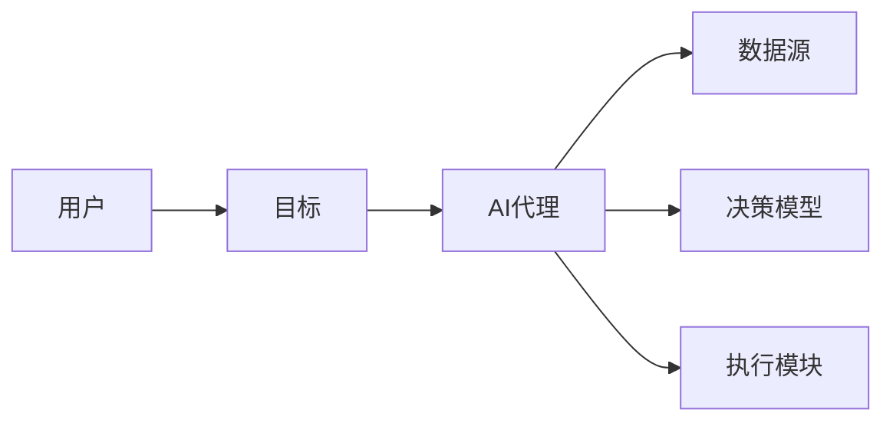
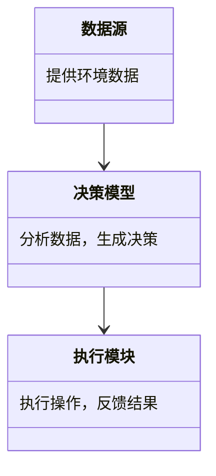
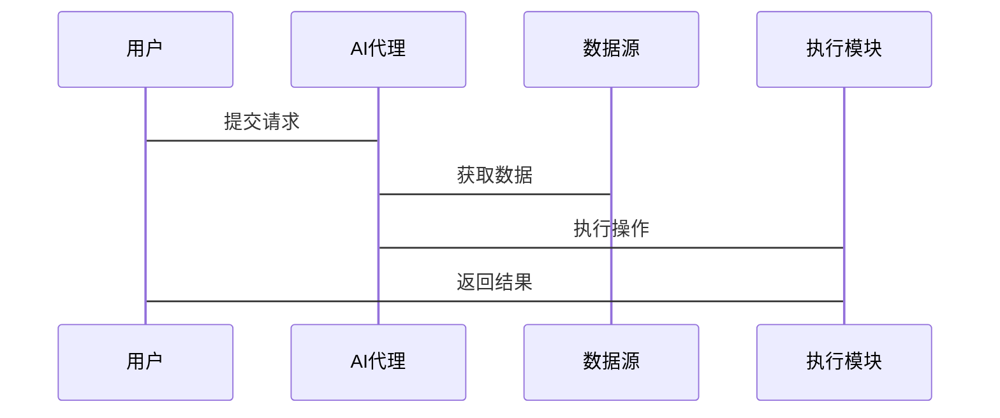

                 


# AI agents在公司可持续发展实践评估中的应用

## 关键词：AI代理，可持续发展，公司评估，算法原理，系统设计，项目实战

## 摘要：  
本文探讨了AI代理在公司可持续发展实践评估中的应用，从背景介绍、核心概念、算法原理到系统设计和项目实战，全面解析AI代理如何助力公司实现可持续发展目标。通过对比分析、数学建模和实际案例，揭示AI代理在提升企业可持续性评估效率和准确性的潜力。

---

# 第一部分: AI代理与公司可持续发展概述

## 第1章: 可持续发展与AI代理的背景

### 1.1 可持续发展的概念与挑战

#### 1.1.1 可持续发展的定义与核心要素  
可持续发展是指在满足当代需求的同时，不损害后代满足其需求的能力。其核心要素包括经济、社会和环境三个方面：  
- **经济可持续性**：确保企业盈利能力和经济效率。  
- **社会可持续性**：关注员工福利、社会责任和公平性。  
- **环境可持续性**：减少资源消耗和环境污染。  

#### 1.1.2 公司可持续发展面临的挑战  
- 数据量大且复杂，难以高效整合。  
- 可持续发展目标与公司业务的关联性不明确。  
- 缺乏实时监控和反馈机制。  

#### 1.1.3 AI代理在可持续发展中的作用  
AI代理通过自动化数据处理、智能决策和实时反馈，帮助公司实现可持续发展目标。例如，优化资源分配、减少碳排放和提高员工福祉。

### 1.2 AI代理的基本概念

#### 1.2.1 AI代理的定义与分类  
AI代理是指能够感知环境、做出决策并执行操作的智能实体。根据功能可分为：  
- **简单反射代理**：基于预设规则执行任务。  
- **基于模型的代理**：使用内部模型进行复杂决策。  
- **学习型代理**：通过经验改进性能。  

#### 1.2.2 AI代理的核心特征  
- **自主性**：无需人工干预即可运行。  
- **反应性**：能实时感知环境变化并调整行为。  
- **目标导向性**：根据目标优化决策和行动。  

#### 1.2.3 AI代理与传统自动化工具的区别  
| 特性 | AI代理 | 传统自动化工具 |  
|------|--------|----------------|  
| 决策能力 | 强大，可学习和优化 | 基于固定规则 |  
| 环境适应性 | 高，能动态调整 | 低，依赖预设条件 |  
| 数据处理能力 | 强，支持大数据分析 | 有限，处理简单任务 |  

---

## 第2章: AI代理的核心概念与联系

### 2.1 AI代理的核心原理

#### 2.1.1 AI代理的感知机制  
AI代理通过传感器或数据接口获取环境信息，例如：  
- **文本分析**：识别报告中的关键信息。  
- **图像识别**：分析监控视频中的异常情况。  
- **数据预处理**：清洗和转换原始数据。  

#### 2.1.2 AI代理的决策机制  
AI代理基于感知信息和内部模型做出决策，常用方法包括：  
- **基于规则的决策**：使用预定义的条件判断。  
- **基于概率的决策**：利用概率论进行风险评估。  
- **强化学习决策**：通过试错优化策略。  

#### 2.1.3 AI代理的执行机制  
AI代理根据决策结果执行操作，例如：  
- **API调用**：触发系统操作。  
- **用户交互**：通过界面反馈结果。  
- **日志记录**：保存操作记录以便审计。  

### 2.2 AI代理的核心要素对比表

| 要素 | 描述 | 示例 |
|------|------|------|
| 感知模块 | 数据输入与处理 | 文本分析、图像识别 |
| 决策模块 | 策略生成与优化 | 状态空间、动作空间 |
| 执行模块 | 行为输出与反馈 | API调用、用户交互 |

### 2.3 AI代理的实体关系图



---

## 第3章: AI代理的算法原理

### 3.1 AI代理的感知算法

#### 3.1.1 文本分析算法  
常用自然语言处理技术，如分词、实体识别和情感分析，提取关键信息。例如，使用Python的`nltk`库进行文本分词。

#### 3.1.2 图像识别算法  
利用卷积神经网络（CNN）进行图像分类，如使用`TensorFlow`训练图像识别模型。

#### 3.1.3 数据预处理与特征提取  
通过标准化、归一化和降维技术处理数据，例如使用`pandas`进行数据清洗。

### 3.2 AI代理的决策算法

#### 3.2.1 基于概率的决策模型  
使用贝叶斯网络进行概率推理，例如计算某项政策的实施概率。

#### 3.2.2 基于强化学习的决策模型  
通过强化学习优化决策策略，例如使用Q-learning算法：

$$ Q(s, a) = r + \gamma \max_{a'} Q(s', a') $$

#### 3.2.3 基于规则的决策模型  
根据预定义规则进行决策，例如“如果员工满意度低于70%，则触发预警”。

### 3.3 AI代理的数学模型

#### 3.3.1 状态空间与动作空间的数学表示
$$ S = \{s_1, s_2, ..., s_n\} $$
$$ A = \{a_1, a_2, ..., a_m\} $$

#### 3.3.2 基于强化学习的Q-learning算法
$$ Q(s, a) = r + \gamma \max_{a'} Q(s', a') $$

---

## 第4章: AI代理的系统分析与架构设计

### 4.1 问题场景介绍  
以某公司为例，希望通过AI代理优化供应链管理，减少碳排放。

### 4.2 系统功能设计

#### 4.2.1 领域模型


### 4.3 系统架构设计

#### 4.3.1 系统架构图


### 4.4 系统接口设计  
定义API接口，如：
- `/api/data/upload`：上传数据
- `/api/decision/make`：触发决策
- `/api/action/execute`：执行操作

### 4.5 系统交互设计



---

## 第5章: 项目实战

### 5.1 环境安装

#### 5.1.1 安装Python
```bash
python --version
```

#### 5.1.2 安装依赖
```bash
pip install numpy pandas scikit-learn
```

### 5.2 系统核心实现

#### 5.2.1 数据预处理
```python
import pandas as pd

def preprocess_data(data):
    # 数据清洗
    data.dropna(inplace=True)
    # 标准化
    from sklearn.preprocessing import StandardScaler
    scaler = StandardScaler()
    data = scaler.fit_transform(data)
    return data
```

#### 5.2.2 决策模型实现
```python
from sklearn.tree import DecisionTreeClassifier

def create_decision_model():
    model = DecisionTreeClassifier()
    return model
```

#### 5.2.3 执行模块实现
```python
def execute_action(action):
    print(f"执行操作：{action}")
    return "操作完成"
```

### 5.3 代码应用解读

#### 5.3.1 数据预处理
- 使用`pandas`读取数据并清洗。
- 使用`scikit-learn`进行数据标准化。

#### 5.3.2 决策模型
- 使用决策树模型进行分类，预测最优行动方案。

#### 5.3.3 系统交互
- 用户提交请求，AI代理处理数据并触发执行模块。

### 5.4 实际案例分析

#### 5.4.1 案例背景
某公司希望优化供应链管理，减少碳排放。

#### 5.4.2 数据分析
分析运输路线和碳排放数据，发现主要排放源。

#### 5.4.3 决策与执行
AI代理建议改用绿色物流，执行模块调整运输计划。

### 5.5 项目小结

---

## 第6章: 最佳实践与总结

### 6.1 最佳实践

#### 6.1.1 数据质量管理
确保数据准确性和完整性。

#### 6.1.2 模型优化
定期更新模型以适应新数据。

#### 6.1.3 系统监控
实时监控系统性能，及时排除故障。

### 6.2 小结

### 6.3 注意事项

#### 6.3.1 数据隐私
确保数据处理符合隐私保护法规。

#### 6.3.2 系统容错
设计容错机制以应对异常情况。

#### 6.3.3 持续学习
定期更新模型和规则，保持系统性能。

### 6.4 拓展阅读

#### 6.4.1 加强学习
深入学习强化学习技术，提升决策能力。

#### 6.4.2 跨领域应用
探索AI代理在其他领域的应用潜力。

---

## 结语  
通过本文的系统分析和实际案例，读者可以深入了解AI代理在公司可持续发展评估中的应用。希望本文能为相关领域的研究和实践提供有价值的参考。

