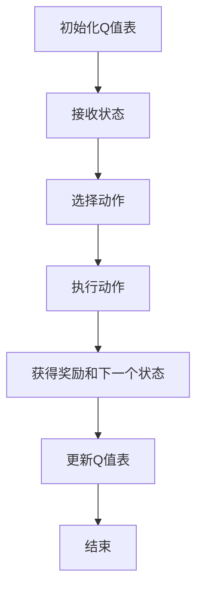
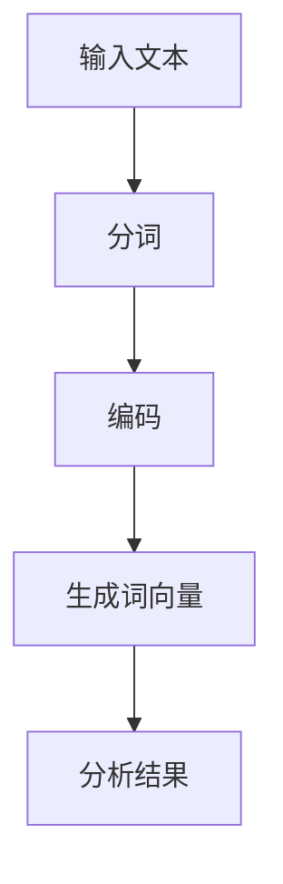
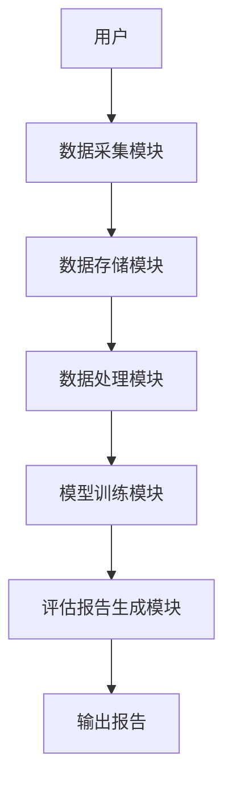
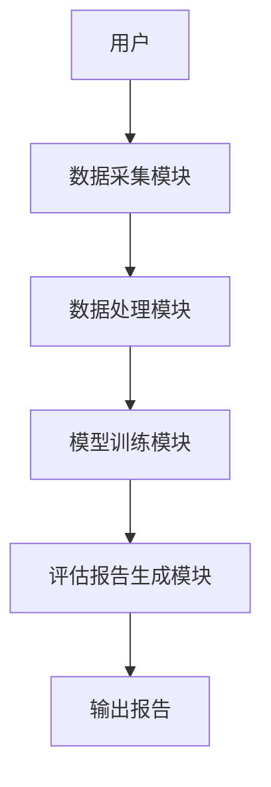

                 


# AI agents在公司商业模式可持续性评估中的应用

## 关键词：AI代理、可持续性评估、商业模式、算法原理、系统架构

## 摘要：  
随着人工智能技术的快速发展，AI代理（AI agents）在企业运营中的应用日益广泛。本文探讨了AI代理在公司商业模式可持续性评估中的应用，分析了其在数据收集、模式识别和优化建议等方面的优势。通过介绍相关算法原理、系统架构设计和实际案例，本文详细阐述了如何利用AI代理技术提升企业商业模式的可持续性评估效率和准确性。文章还讨论了AI代理在实际应用中的挑战与解决方案，为读者提供了深入的技术见解和实践指导。

---

# 第一部分: AI代理与企业商业模式可持续性评估背景

## 第1章: AI代理与可持续性评估概述

### 1.1 AI代理的基本概念  
#### 1.1.1 AI代理的定义  
AI代理（AI Agent）是指能够感知环境、自主决策并执行任务的智能体。它通过传感器获取数据，利用算法进行分析和推理，最终做出决策或执行操作。  

#### 1.1.2 AI代理的核心特征  
AI代理具有以下核心特征：  
1. **自主性**：能够在没有外部干预的情况下独立运作。  
2. **反应性**：能够实时感知环境变化并做出响应。  
3. **目标导向**：具有明确的目标，能够优化决策以实现目标。  
4. **学习能力**：通过机器学习算法不断优化自身的性能。  

#### 1.1.3 AI代理与传统自动化工具的区别  
AI代理与传统自动化工具的主要区别在于其智能性和适应性。AI代理能够理解上下文、推理因果关系并做出复杂决策，而传统自动化工具仅能执行预定义的任务。  

### 1.2 可持续性评估的基本概念  
#### 1.2.1 可持续性评估的定义  
可持续性评估是对企业商业模式在经济、社会和环境三个维度上的可持续性进行分析和评价的过程。  

#### 1.2.2 企业商业模式可持续性的影响因素  
企业商业模式的可持续性受到以下因素的影响：  
1. **经济因素**：盈利能力、成本控制、资源利用率。  
2. **社会因素**：社会责任、员工福祉、客户满意度。  
3. **环境因素**：碳排放、资源消耗、废弃物处理。  

#### 1.2.3 可持续性评估的指标体系  
可持续性评估的指标体系通常包括以下几类：  
1. **经济指标**：净收益、投资回报率、成本占比。  
2. **社会指标**：员工满意度、客户忠诚度、社会责任履行情况。  
3. **环境指标**：能源消耗、碳排放量、废弃物处理率。  

### 1.3 AI代理在可持续性评估中的作用  
#### 1.3.1 AI代理在数据收集与处理中的应用  
AI代理能够从多种数据源（如企业系统、公开数据、社交媒体）中收集数据，并通过自然语言处理和数据挖掘技术进行清洗和预处理。  

#### 1.3.2 AI代理在模式识别与预测中的优势  
AI代理能够利用机器学习算法识别商业模式中的潜在问题，并预测未来的发展趋势。例如，通过时间序列分析预测企业的财务健康状况。  

#### 1.3.3 AI代理在优化建议中的价值  
AI代理能够根据评估结果提出优化建议，例如调整供应链管理以降低碳排放，或优化定价策略以提高盈利能力。  

### 1.4 本章小结  
本章介绍了AI代理的基本概念、可持续性评估的核心指标以及AI代理在可持续性评估中的应用价值。通过AI代理，企业能够更高效地进行商业模式的可持续性评估，并制定相应的优化策略。

---

## 第2章: 企业商业模式可持续性评估的背景与挑战  

### 2.1 当前企业商业模式的多样性  
#### 2.1.1 不同行业商业模式的差异  
不同行业的商业模式差异显著。例如，科技企业可能依赖订阅模式，而传统制造业可能依赖批售模式。  

#### 2.1.2 新型商业模式的崛起  
近年来，共享经济、订阅制、平台经济等新型商业模式的崛起对企业可持续性评估提出了新的挑战。  

#### 2.1.3 商业模式创新对企业可持续性的影响  
商业模式的创新能够显著影响企业的可持续性。例如，通过数字化转型降低运营成本，提高资源利用率。  

### 2.2 可持续性评估的复杂性  
#### 2.2.1 数据来源的多样性  
可持续性评估需要整合来自不同部门、不同数据源的数据，增加了评估的复杂性。  

#### 2.2.2 评估指标的多维度性  
可持续性评估需要同时考虑经济、社会和环境三个维度的指标，使得评估过程更加复杂。  

#### 2.2.3 不同利益相关者的诉求差异  
企业内部的管理层、员工，以及外部的客户、供应商、监管机构等利益相关者对可持续性的诉求可能不同，增加了评估的难度。  

### 2.3 AI代理在可持续性评估中的优势  
#### 2.3.1 高效的数据处理能力  
AI代理能够快速处理海量数据，并通过机器学习算法提取有价值的信息。  

#### 2.3.2 智能的模式识别能力  
AI代理能够识别复杂的模式，例如通过自然语言处理技术分析客户反馈，识别潜在的可持续性问题。  

#### 2.3.3 自适应的优化能力  
AI代理能够根据实时数据动态调整评估策略，提供更精准的优化建议。  

### 2.4 本章小结  
本章分析了当前企业商业模式的多样性和可持续性评估的复杂性，并探讨了AI代理在解决这些问题中的独特优势。通过AI代理，企业能够更高效、更智能地进行可持续性评估，并制定切实可行的优化策略。

---

# 第二部分: AI代理的核心技术与算法原理  

## 第3章: AI代理的核心技术原理  

### 3.1 强化学习算法  
#### 3.1.1 强化学习的基本原理  
强化学习是一种通过试错方式优化决策的算法。AI代理通过与环境交互，不断调整策略以最大化累积奖励。  

#### 3.1.2 Q-learning算法的实现  
Q-learning算法是一种经典的强化学习算法，其核心思想是通过更新Q值表来优化决策。  

$$ Q(s, a) = Q(s, a) + \alpha \left[r + \max_{a'} Q(s', a') - Q(s, a)\right] $$  

其中，$\alpha$是学习率，$r$是奖励，$s$是当前状态，$a$是当前动作，$s'$是下一个状态。  

#### 3.1.3 策略梯度方法的介绍  
策略梯度方法通过直接优化策略参数来最大化期望奖励。其核心思想是通过梯度上升法调整策略参数，使得累积奖励最大化。  

### 3.2 自然语言处理技术  
#### 3.2.1 Transformer模型的基本结构  
Transformer模型是一种基于自注意力机制的深度学习模型，广泛应用于自然语言处理任务。其核心结构包括编码器和解码器。  

#### 3.2.2 BERT模型在文本理解中的应用  
BERT模型是一种预训练语言模型，能够通过自监督学习理解上下文语义。它在文本分类、问答系统等领域表现出色。  

#### 3.2.3 GPT模型在文本生成中的应用  
GPT模型是一种基于Transformer的生成模型，能够生成连贯的自然语言文本。它在内容生成、对话系统等领域具有广泛应用。  

### 3.3 知识图谱构建技术  
#### 3.3.1 知识图谱的定义与构建方法  
知识图谱是一种以图结构形式表示知识的工具，其构建方法包括数据抽取、实体识别和关系抽取。  

#### 3.3.2 实体识别与关系抽取算法  
实体识别算法通过模式匹配和上下文理解提取文本中的实体信息，关系抽取算法则通过依赖句法分析和语义推理识别实体之间的关系。  

#### 3.3.3 知识图谱的表示与推理  
知识图谱的表示通常采用三元组形式（subject, predicate, object）。通过推理算法，AI代理能够从知识图谱中推导出隐含的知识。  

---

## 第4章: 用于商业模式评估的算法实现  

### 4.1 基于强化学习的评估算法  
#### 4.1.1 算法原理  
通过强化学习算法，AI代理能够从历史数据中学习到最优的评估策略。例如，通过状态-动作-奖励机制，AI代理能够逐步优化评估指标的选择。  

#### 4.1.2 算法实现  
以下是基于Q-learning的评估算法实现示例：  

```python
import numpy as np

class AI-Agent:
    def __init__(self, state_space, action_space):
        self.state_space = state_space
        self.action_space = action_space
        self.Q = np.zeros((state_space, action_space))

    def take_action(self, state):
        return np.argmax(self.Q[state, :])

    def update_Q(self, state, action, reward, next_state):
        self.Q[state, action] += 0.1 * (reward + np.max(self.Q[next_state, :]) - self.Q[state, action])
```

#### 4.1.3 算法流程图  


### 4.2 基于自然语言处理的文本分析算法  
#### 4.2.1 算法原理  
通过自然语言处理技术，AI代理能够从文本数据中提取关键信息，例如客户反馈、市场报告等。  

#### 4.2.2 算法实现  
以下是基于BERT模型的文本分析算法实现示例：  

```python
from transformers import BertTokenizer, BertModel

class TextAnalyzer:
    def __init__(self):
        self.tokenizer = BertTokenizer.from_pretrained('bert-base-uncased')
        self.model = BertModel.from_pretrained('bert-base-uncased')

    def analyze_text(self, text):
        inputs = self.tokenizer(text, return_tensors='np')
        outputs = self.model(inputs.input_ids, inputs.attention_mask)
        return outputs.last_hidden_state
```

#### 4.2.3 算法流程图  


### 4.3 本章小结  
本章介绍了AI代理在商业模式评估中的算法实现，包括强化学习算法和自然语言处理算法。通过这些算法，AI代理能够高效地处理数据、识别模式，并提供优化建议。

---

# 第三部分: 企业商业模式可持续性评估的系统分析  

## 第5章: 可持续性评估指标体系设计  

### 5.1 评估指标的设计原则  
#### 5.1.1 指标的选择标准  
指标的选择应遵循科学性、可操作性和全面性原则。  

#### 5.1.2 指标权重的确定方法  
指标权重可以通过层次分析法（AHP）或熵值法等方法确定。  

#### 5.1.3 指标体系的构建步骤  
1. 确定评估目标；  
2. 收集相关指标；  
3. 筛选核心指标；  
4. 确定指标权重；  
5. 构建指标体系。  

### 5.2 基于知识图谱的指标关联分析  
#### 5.2.1 知识图谱的构建  
通过知识图谱，可以将企业运营中的各种指标及其关系可视化。  

#### 5.2.2 指标关联的推理算法  
基于知识图谱的推理算法能够发现指标之间的隐含关系。  

#### 5.2.3 指标关联的可视化  
通过可视化工具，可以直观展示指标之间的关联关系。  

### 5.3 本章小结  
本章详细阐述了可持续性评估指标体系的设计原则和构建方法，并介绍了基于知识图谱的指标关联分析方法。通过这些方法，企业能够更全面、更深入地进行可持续性评估。

---

## 第6章: 系统架构设计与实现  

### 6.1 系统功能模块设计  
#### 6.1.1 数据采集模块  
数据采集模块负责从企业系统、公开数据源等渠道获取数据。  

#### 6.1.2 数据处理模块  
数据处理模块负责对采集到的数据进行清洗、转换和预处理。  

#### 6.1.3 模型训练模块  
模型训练模块负责利用机器学习算法对数据进行建模和训练。  

#### 6.1.4 评估报告生成模块  
评估报告生成模块根据模型输出生成可持续性评估报告。  

### 6.2 系统架构设计  
#### 6.2.1 系统架构图  


#### 6.2.2 关键模块交互流程图  


### 6.3 系统接口设计  
#### 6.3.1 数据接口  
数据接口用于与企业系统、数据源进行数据交互。  

#### 6.3.2 模型接口  
模型接口用于与其他模块或外部系统进行交互。  

### 6.4 本章小结  
本章详细描述了系统功能模块设计和系统架构设计，展示了AI代理在企业商业模式可持续性评估中的应用架构。通过模块化设计和系统化架构，企业能够高效地进行可持续性评估。

---

# 第四部分: 项目实战  

## 第7章: 基于AI代理的可持续性评估项目实施  

### 7.1 项目背景与需求分析  
#### 7.1.1 项目背景  
某制造企业希望利用AI代理技术优化其商业模式的可持续性评估。  

#### 7.1.2 项目需求  
1. 实现实时数据采集与处理；  
2. 构建可持续性评估指标体系；  
3. 提供优化建议与报告。  

### 7.2 项目实施步骤  
#### 7.2.1 数据采集与预处理  
通过企业系统接口获取财务数据、生产数据、客户反馈等信息。  

#### 7.2.2 模型训练与优化  
利用强化学习算法和自然语言处理算法训练评估模型，并通过交叉验证优化模型性能。  

#### 7.2.3 系统集成与测试  
将模型集成到企业系统中，进行功能测试和性能测试。  

### 7.3 项目成果展示  
#### 7.3.1 系统功能展示  
通过系统界面展示可持续性评估结果和优化建议。  

#### 7.3.2 优化建议的案例分析  
以某制造企业为例，展示AI代理提出的优化建议，例如降低碳排放、优化供应链管理等。  

### 7.4 本章小结  
本章通过一个实际项目展示了AI代理在企业商业模式可持续性评估中的应用。通过项目实施，企业能够显著提高评估效率和准确性，并获得有价值的优化建议。

---

# 第五部分: 总结与展望  

## 第8章: 总结与展望  

### 8.1 总结  
本文详细探讨了AI代理在企业商业模式可持续性评估中的应用，分析了其在数据处理、模式识别和优化建议等方面的优势。通过算法实现和系统设计，展示了AI代理在实际应用中的潜力和价值。  

### 8.2 展望  
随着AI技术的不断进步，AI代理在企业可持续性评估中的应用将更加广泛和深入。未来的研究方向包括：  
1. 开发更高效的算法，提高评估精度；  
2. 探索多模态数据的融合方法，提升评估的全面性；  
3. 加强AI代理的自适应能力，提高其在动态环境中的表现。  

### 8.3 最佳实践 tips  
- 在实施AI代理项目时，应充分考虑数据质量和多样性；  
- 定期对模型进行更新和优化，以适应业务需求的变化；  
- 注重与业务团队的协作，确保技术与业务的深度融合。  

### 8.4 本章小结  
本文总结了AI代理在企业商业模式可持续性评估中的应用成果，并展望了未来的研究方向。通过不断的技术创新和实践积累，AI代理将为企业可持续发展提供更有力的支持。

---

## 关键词：  
AI代理、可持续性评估、商业模式、算法原理、系统架构  

## 摘要：  
本文探讨了AI代理在企业商业模式可持续性评估中的应用，分析了其在数据处理、模式识别和优化建议等方面的优势。通过算法实现和系统设计，展示了AI代理在实际应用中的潜力和价值。

