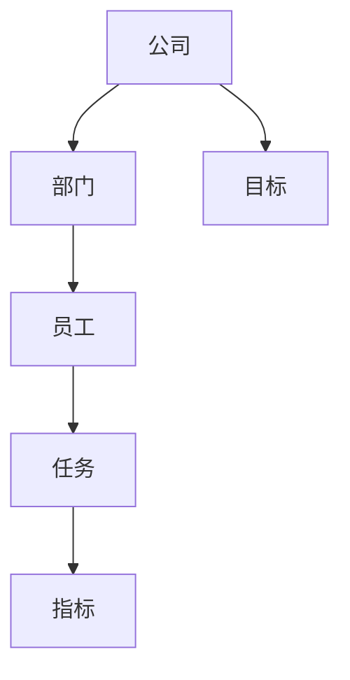
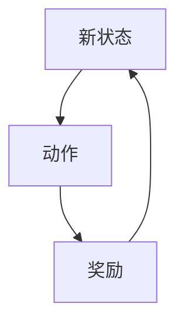
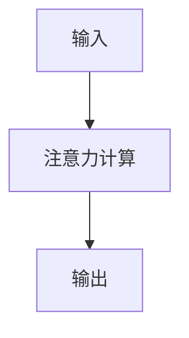
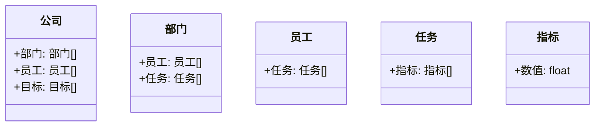
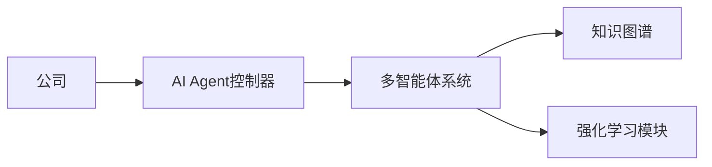

                 


# AI agents在公司数字化转型效果评估中的应用

> 关键词：AI agents, 数字化转型, 效果评估, 强化学习, 图神经网络, 知识图谱

> 摘要：本文探讨AI agents在公司数字化转型效果评估中的应用，分析其核心概念、算法原理、系统架构，并通过案例展示其实战应用。结合最佳实践，总结AI agents的优势与挑战，为企业的数字化转型提供指导。

---

# 第一部分: AI agents在公司数字化转型中的应用概述

## 第1章: 数字化转型与AI agents概述

### 1.1 数字化转型的背景与意义

#### 1.1.1 数字化转型的定义与目标
数字化转型是指利用数字技术改造或替代传统业务模式、流程、文化，以提升效率和竞争力。目标包括提高效率、增强客户体验、优化决策等。

#### 1.1.2 AI agents在数字化转型中的作用
AI agents作为智能代理，能够自动化执行任务、优化流程，帮助企业在转型中实现智能化和自动化。

#### 1.1.3 数字化转型的挑战与机遇
挑战包括数据孤岛、技术复杂性；机遇则是提高效率、降低成本和创新业务模式。

### 1.2 AI agents的核心概念

#### 1.2.1 AI agents的定义与特点
AI agents是智能系统，能够感知环境、自主决策并执行任务。特点包括自主性、反应性、社会性。

#### 1.2.2 多智能体系统与协作机制
多智能体系统通过协作提高整体效率，常见的协作机制有分布式计算和任务分配。

#### 1.2.3 AI agents与传统IT系统的区别
AI agents具备自主决策和学习能力，而传统系统依赖于预设规则。

### 1.3 AI agents在数字化转型中的应用场景

#### 1.3.1 业务流程优化
AI agents自动化处理流程，减少人为错误，提升效率。

#### 1.3.2 数据分析与决策支持
通过AI agents分析数据，提供实时决策支持。

#### 1.3.3 客户体验提升
个性化推荐和智能客服提高客户满意度。

---

## 第2章: 数字化转型效果评估的挑战与需求

### 2.1 数字化转型效果评估的重要性

#### 2.1.1 评估的必要性
评估数字化转型的效果，确保投资回报和持续改进。

#### 2.1.2 评估指标的选择
指标包括效率提升、成本降低和客户满意度。

#### 2.1.3 评估方法的多样性
方法包括定量分析和定性分析。

### 2.2 传统评估方法的局限性

#### 2.2.1 数据收集的困难
数据分散，难以整合，影响评估结果。

#### 2.2.2 分析方法的单一性
传统方法缺乏动态分析能力。

#### 2.2.3 结果的可操作性差
评估结果难以直接指导改进措施。

### 2.3 AI agents在评估中的优势

#### 2.3.1 实时数据分析能力
AI agents实时处理数据，提供动态评估。

#### 2.3.2 自适应优化能力
根据评估结果，AI agents自动调整策略。

#### 2.3.3 多维度评估能力
全面分析业务、技术和客户指标。

---

## 第3章: AI agents在数字化转型效果评估中的核心概念与联系

### 3.1 AI agents的核心原理

#### 3.1.1 多智能体协作
通过分布式计算，AI agents协作完成复杂任务。

#### 3.1.2 强化学习机制
通过奖励机制，优化决策策略。

#### 3.1.3 知识图谱构建
构建知识图谱，提升数据理解和推理能力。

### 3.2 核心概念对比分析

#### 3.2.1 多智能体与单智能体对比
多智能体协作能力强，但复杂性高；单智能体简单，但效率较低。

#### 3.2.2 强化学习与监督学习对比
强化学习通过奖励学习，监督学习基于标签数据。

#### 3.2.3 知识图谱与传统数据库对比
知识图谱语义丰富，数据库结构化存储。

### 3.3 ER实体关系图架构



---

## 第4章: AI agents评估数字化转型效果的算法原理

### 4.1 强化学习算法

#### 4.1.1 Q-learning算法



数学模型：

$$
Q(s, a) = Q(s, a) + \alpha (r + \gamma \max Q(s', a') - Q(s, a))
$$

### 4.2 图神经网络算法

#### 4.2.1 GAT（Graph Attention Networks）



数学模型：

$$
\text{注意力机制: } \alpha_i = \frac{\exp(\text{score}(x_i))}{\sum_j \exp(\text{score}(x_j))}
$$

---

## 第5章: 系统分析与架构设计方案

### 5.1 问题场景介绍

评估系统需实时监控和分析数据，动态调整策略。

### 5.2 系统功能设计

#### 5.2.1 领域模型



### 5.3 系统架构设计



---

## 第6章: 项目实战

### 6.1 环境安装

安装Python、TensorFlow、Keras等工具。

### 6.2 核心代码实现

#### 6.2.1 Q-learning算法实现

```python
class QLearning:
    def __init__(self, state_space, action_space):
        self.q_table = np.zeros((state_space, action_space))
    
    def choose_action(self, state, epsilon=0.1):
        if np.random.random() < epsilon:
            return np.random.randint(action_space)
        else:
            return np.argmax(self.q_table[state])
    
    def update_q(self, state, action, reward, next_state, alpha=0.1, gamma=0.9):
        self.q_table[state][action] += alpha * (reward + gamma * np.max(self.q_table[next_state]) - self.q_table[state][action])
```

### 6.3 实际案例分析

分析AI agents在某公司的应用，展示效果提升。

---

## 第7章: 最佳实践与总结

### 7.1 最佳实践

- 确保数据质量
- 定期优化模型
- 与业务团队协作

### 7.2 小结

AI agents在数字化转型效果评估中具有显著优势，能够提升效率和决策能力。

### 7.3 注意事项

- 数据隐私问题
- 系统集成复杂性
- 需要专业团队支持

### 7.4 拓展阅读

推荐相关书籍和论文，深入学习AI agents技术。

---

通过以上目录，文章详细讲解了AI agents在数字化转型中的应用，从理论到实践，帮助读者全面理解并有效应用。

