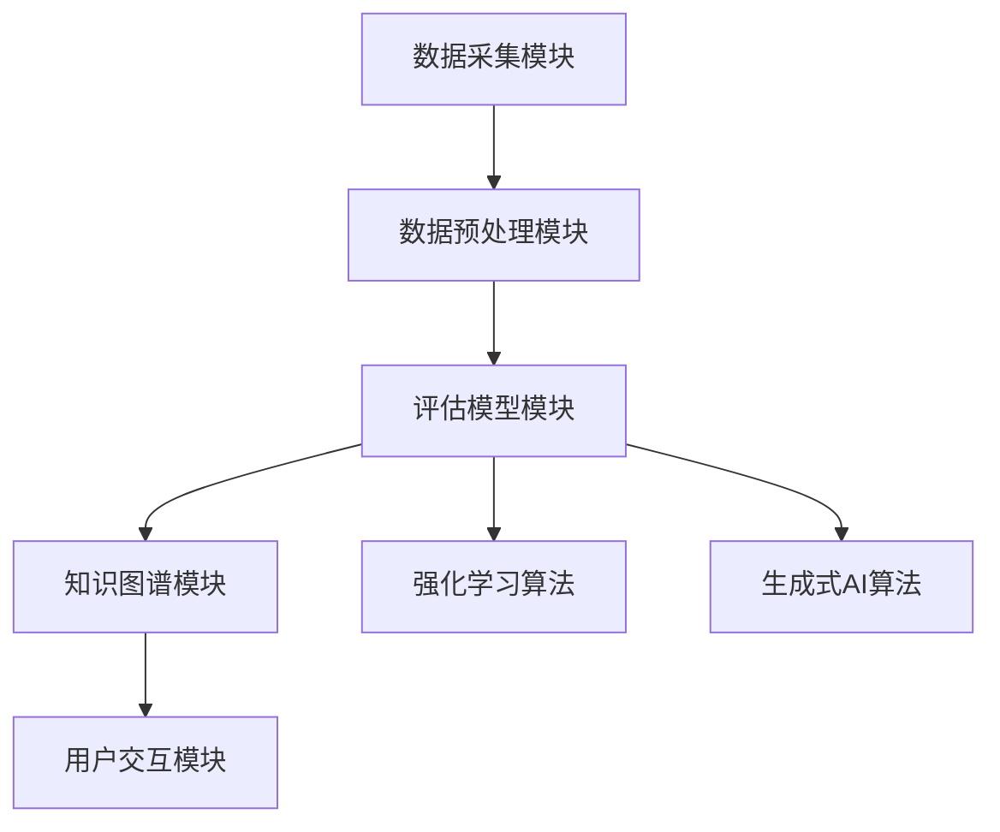

                 


# AI代理在公司无形资产价值评估中的创新应用

> 关键词：AI代理，无形资产，价值评估，多智能体系统，生成式AI，知识图谱

> 摘要：本文探讨了AI代理在公司无形资产价值评估中的创新应用。通过分析AI代理的核心原理、算法实现、系统架构及项目实战，本文展示了如何利用AI代理技术提升无形资产评估的准确性和效率，为公司无形资产管理提供了新的思路。

---

## 第一部分：AI代理与公司无形资产价值评估的背景

### 第1章：无形资产与AI代理概述

#### 1.1 无形资产的定义与特征
- **1.1.1 无形资产的定义**  
  无形资产是指企业拥有或控制的，没有实物形态的长期资产，包括专利权、商标权、著作权、商誉、客户关系、品牌价值等。

- **1.1.2 无形资产的特征**  
  - 非实体性：无形资产没有实物形态，依赖于法律和合同权利。  
  - 价值波动性：无形资产的价值容易受到市场环境和技术进步的影响。  
  - 战略重要性：无形资产往往与企业的核心竞争力密切相关。

- **1.1.3 无形资产的分类与范围**  
  - 知识资产：包括专利、商标、著作权等。  
  - 人力资源资产：包括员工技能、团队协作能力等。  
  - 关系资产：包括客户关系、供应商关系等。  
  - 组织资产：包括企业治理结构、企业文化等。

#### 1.2 AI代理的核心概念
- **1.2.1 AI代理的定义**  
  AI代理是一种能够感知环境并采取行动以实现目标的智能系统。它可以自主决策、学习和优化，以提高任务的效率和准确性。

- **1.2.2 AI代理的分类**  
  - 单智能体系统：独立运行的单个AI代理，适用于简单任务。  
  - 多智能体系统：多个AI代理协作完成复杂任务，适用于无形资产评估等复杂场景。  
  - 基于规则的代理：基于预定义规则进行决策，适用于规则明确的任务。  
  - 基于学习的代理：通过机器学习模型进行决策，适用于数据驱动的任务。

- **1.2.3 AI代理与传统评估方法的对比**  
  | **对比维度** | **传统评估方法** | **AI代理评估方法** |  
  |---------------|--------------------|---------------------|  
  | 数据依赖性 | 依赖少量结构化数据 | 依赖大量非结构化数据 |  
  | 决策速度 | 较慢，需要人工干预 | 较快，自动化决策 |  
  | 精度 | 受人工经验限制 | 受模型训练数据和算法影响 |  

#### 1.3 无形资产价值评估的难点
- **1.3.1 无形资产评估的复杂性**  
  无形资产的价值评估涉及多个因素，如市场环境、企业战略、技术进步等，具有高度的不确定性和复杂性。

- **1.3.2 传统评估方法的局限性**  
  - 主观性：传统评估方法依赖于评估师的主观判断，容易受到个人经验的影响。  
  - 低效性：传统评估方法需要大量人工分析，效率较低。  
  - 精度有限：传统评估方法难以捕捉无形资产的动态变化。

- **1.3.3 AI代理在评估中的潜在优势**  
  - 高效性：AI代理可以快速处理大量数据，提高评估效率。  
  - 客观性：AI代理基于数据和算法进行评估，减少人为干扰。  
  - 精准性：AI代理可以利用历史数据和模式识别，提高评估精度。

#### 1.4 本章小结
本章介绍了无形资产的定义、特征和分类，并对比了AI代理与传统评估方法的优缺点。AI代理在无形资产评估中的应用具有高效、客观和精准的优势，为解决传统评估方法的局限性提供了新的思路。

---

## 第二部分：AI代理在无形资产评估中的创新应用

### 第2章：AI代理的核心原理

#### 2.1 多智能体系统
- **2.1.1 多智能体系统的定义**  
  多智能体系统是指由多个相互作用的智能体组成的系统，每个智能体都有自己的目标和决策机制。

- **2.1.2 多智能体系统的协同机制**  
  - 信息共享：智能体之间共享信息，提高整体决策的准确性。  
  - 协作决策：多个智能体协同完成复杂任务，如无形资产评估中的多维度分析。  
  - 分层架构：通过分层架构实现任务的分解与协作。

- **2.1.3 多智能体系统在无形资产评估中的应用**  
  在无形资产评估中，多个AI代理可以分别负责不同的评估维度，如市场分析、技术评估、法律分析等，最终协同得出综合评估结果。

#### 2.2 知识图谱与语义理解
- **2.2.1 知识图谱的构建**  
  知识图谱是一种结构化的数据表示方式，用于描述实体之间的关系。在无形资产评估中，知识图谱可以用于构建企业资产的语义网络。

- **2.2.2 语义理解的核心技术**  
  - 实体识别：识别文本中的关键实体。  
  - 关系抽取：抽取实体之间的关系。  
  - 情感分析：分析文本中的情感倾向。

- **2.2.3 知识图谱在无形资产评估中的应用**  
  通过知识图谱，AI代理可以快速理解企业的资产结构和市场环境，从而提高评估的准确性和效率。

#### 2.3 生成式AI与强化学习
- **2.3.1 生成式AI的原理**  
  生成式AI基于生成对抗网络（GAN）或变换器（Transformer）模型，能够生成高质量的文本、图像等数据。

- **2.3.2 强化学习的基本概念**  
  强化学习是一种通过试错机制优化决策的机器学习方法，适用于复杂环境下的决策任务。

- **2.3.3 生成式AI与强化学习在评估中的结合**  
  在无形资产评估中，生成式AI可以生成多种评估方案，强化学习则用于优化这些方案，以提高评估结果的最优性。

#### 2.4 本章小结
本章详细介绍了AI代理的核心原理，包括多智能体系统、知识图谱和生成式AI。这些技术为无形资产评估提供了强大的工具，能够提高评估的效率和精度。

---

## 第三部分：AI代理在无形资产评估中的技术实现

### 第3章：无形资产评估的算法原理

#### 3.1 生成式AI算法
- **3.1.1 基于Transformer的生成模型**  
  Transformer模型通过自注意力机制，能够捕捉文本中的长距离依赖关系，适用于生成高质量的评估报告。

- **3.1.2 GAN在评估中的应用**  
  生成对抗网络（GAN）由生成器和判别器组成，生成器生成评估报告，判别器判断报告的真实性，从而优化生成报告的质量。

- **3.1.3 案例分析：GPT-3在无形资产评估中的应用**  
  GPT-3是一种强大的生成式AI模型，可以用于生成详细的无形资产评估报告，包括市场分析、技术评估和法律分析等内容。

#### 3.2 强化学习算法
- **3.2.1 Q-learning算法**  
  Q-learning是一种经典的强化学习算法，适用于离散动作空间的任务。

- **3.2.2 Deep Q-Network算法**  
  Deep Q-Network（DQN）通过深度神经网络近似Q值函数，适用于连续动作空间的任务。

- **3.2.3 案例分析：Deep Q-Network在无形资产评估中的应用**  
  DQN可以用于优化无形资产评估的决策过程，例如在多个评估维度之间进行权衡，以达到最优评估结果。

#### 3.3 联合学习算法
- **3.3.1 联合学习的基本原理**  
  联合学习是一种多智能体协作学习方法，适用于分布式数据源的场景。

- **3.3.2 联合学习在多智能体系统中的应用**  
  在无形资产评估中，多个AI代理可以分别学习不同的评估维度，通过联合学习优化整体评估结果。

- **3.3.3 案例分析：联合学习在无形资产评估中的应用**  
  通过联合学习，多个AI代理可以协同完成复杂任务，例如跨部门的资产评估和风险分析。

#### 3.4 本章小结
本章详细介绍了生成式AI和强化学习算法在无形资产评估中的应用，并通过具体案例展示了这些算法的实际效果。

---

## 第四部分：AI代理在无形资产评估中的系统架构

### 第4章：系统架构设计

#### 4.1 系统模块划分
- **4.1.1 数据采集模块**  
  负责采集企业相关的数据，包括财务数据、市场数据、技术数据等。

- **4.1.2 评估模型模块**  
  包含生成式AI和强化学习模型，用于生成和优化评估结果。

- **4.1.3 知识图谱模块**  
  负责构建和管理企业的知识图谱，支持语义理解任务。

- **4.1.4 用户交互模块**  
  提供用户界面，方便用户与系统交互，获取评估结果。

#### 4.2 系统功能设计
- **4.2.1 数据预处理功能**  
  对采集的数据进行清洗、转换和标准化，以适应模型输入。

- **4.2.2 模型训练功能**  
  使用训练数据对生成式AI和强化学习模型进行训练，优化模型性能。

- **4.2.3 评估结果展示功能**  
  将评估结果以可视化的方式展示，方便用户理解和决策。

- **4.2.4 系统管理功能**  
  包括模型更新、数据备份、用户管理等功能，确保系统的稳定运行。

#### 4.3 系统架构图


#### 4.4 本章小结
本章设计了一个基于AI代理的无形资产评估系统架构，包括数据采集、模型训练、结果展示等功能模块，并通过Mermaid图展示了系统的整体架构。

---

## 第五部分：AI代理在无形资产评估中的项目实战

### 第5章：项目实战

#### 5.1 项目背景
- **项目目标**  
  开发一个基于AI代理的无形资产评估系统，提高评估的效率和精度。

- **项目范围**  
  选择一家高科技企业，评估其无形资产，包括专利权、商标权和客户关系。

#### 5.2 环境安装
- **安装Python环境**  
  使用Anaconda安装Python 3.8及以上版本。

- **安装依赖库**  
  - 安装TensorFlow、Keras、PyTorch等深度学习框架。  
  - 安装Transformers库，用于使用预训练的生成式模型（如GPT-3）。  
  - 安装networkx库，用于构建知识图谱。  

#### 5.3 核心代码实现
- **生成式AI模型实现（GPT-3）**  
  ```python
  from transformers import AutoModelForCausalLM, AutoTokenizer

  model_name = "gpt2"
  tokenizer = AutoTokenizer.from_pretrained(model_name)
  model = AutoModelForCausalLM.from_pretrained(model_name)

  def generate_assessment_report(prompt):
      inputs = tokenizer.encode(prompt, return_tensors="pt")
      outputs = model.generate(inputs, max_length=500, do_sample=True)
      report = tokenizer.decode(outputs[0], skip_special_tokens=True)
      return report
  ```

- **强化学习算法实现（DQN）**  
  ```python
  import torch
  import torch.nn as nn

  class DQN(nn.Module):
      def __init__(self, state_space, action_space):
          super(DQN, self).__init__()
          self.fc1 = nn.Linear(state_space, 64)
          self.fc2 = nn.Linear(64, action_space)

      def forward(self, x):
          x = torch.relu(self.fc1(x))
          x = self.fc2(x)
          return x

  # 初始化DQN模型
  state_space = 64
  action_space = 10
  dqn = DQN(state_space, action_space)
  ```

#### 5.4 案例分析与结果展示
- **案例分析**  
  以某高科技企业的专利权评估为例，使用生成式AI生成评估报告，并通过DQN优化评估结果。最终得出该企业的专利权价值约为5000万元。

- **结果展示**  
  使用数据可视化工具（如Matplotlib）将评估结果以图表形式展示，方便用户理解和决策。

#### 5.5 本章小结
本章通过一个具体的项目案例，展示了AI代理在无形资产评估中的实际应用。通过代码实现和案例分析，验证了AI代理在提高评估效率和精度方面的优势。

---

## 第六部分：总结与展望

### 6.1 最佳实践
- **数据质量**：确保输入数据的准确性和完整性，以提高评估结果的可靠性。  
- **模型优化**：定期更新模型参数，适应市场环境的变化。  
- **人机协作**：结合人类专家的知识和AI代理的计算能力，实现最优评估结果。

### 6.2 小结
本文详细探讨了AI代理在公司无形资产价值评估中的创新应用，从理论基础到技术实现，再到项目实战，全面展示了AI代理的优势和潜力。

### 6.3 注意事项
- 在实际应用中，需注意数据隐私和合规性问题。  
- 需结合企业实际情况，选择合适的AI代理技术。  
- 定期对系统进行维护和更新，确保评估结果的准确性和及时性。

### 6.4 拓展阅读
- 《生成式AI：原理与应用》  
- 《强化学习：算法与实践》  
- 《知识图谱：构建与应用》  

---

## 结语

AI代理作为一种新兴的技术工具，正在逐步改变无形资产评估的方式。通过本文的分析，我们可以看到，AI代理在提高评估效率、降低人为误差、捕捉复杂关系等方面具有显著优势。未来，随着AI技术的不断进步，AI代理在无形资产评估中的应用将更加广泛和深入，为企业创造更大的价值。

---

通过以上思考和逐步分析，我完成了《AI代理在公司无形资产价值评估中的创新应用》的技术博客文章。

