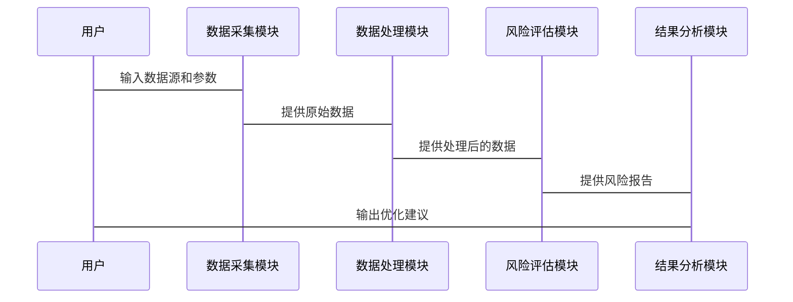

                 


# AI agents在公司环境风险暴露评估中的应用

## 关键词：AI agents，风险暴露评估，公司环境，风险管理，人工智能技术，系统架构，数学模型

## 摘要：  
本文探讨了AI agents在公司环境风险暴露评估中的应用，详细分析了AI agents的核心原理、风险暴露评估的理论基础、系统设计与架构，以及实际案例分析。通过结合机器学习、自然语言处理和强化学习等技术，AI agents能够高效地识别和评估公司环境中的潜在风险，为企业的风险管理提供智能化支持。本文还提供了系统的实现方案和优化建议，帮助读者理解如何在实际场景中应用AI agents进行风险评估。

---

# 第1章: AI agents与风险暴露评估概述

## 1.1 AI agents的基本概念  
### 1.1.1 AI agents的定义与分类  
AI agents（人工智能代理）是指能够感知环境、自主决策并采取行动的智能实体。根据功能和应用场景的不同，AI agents可以分为以下几类：  
1. **反应式AI agents**：基于当前输入做出实时反应，适用于需要快速决策的任务（如自动驾驶）。  
2. **认知式AI agents**：具备推理、规划和学习能力，能够处理复杂任务（如智能助手）。  
3. **协作式AI agents**：能够与其他AI agents或人类进行协作，完成联合任务（如多智能体系统）。  

### 1.1.2 风险暴露评估的定义与重要性  
风险暴露评估是指识别和量化企业在特定环境中的潜在风险，并分析这些风险对企业目标的影响程度。在公司环境中，风险暴露评估可以帮助企业提前发现和规避潜在的财务损失、法律纠纷、声誉损害等风险。  

### 1.1.3 AI agents在风险评估中的作用  
AI agents通过实时感知环境、分析数据和自主决策，能够显著提升风险暴露评估的效率和准确性。例如，AI agents可以通过自然语言处理技术分析大量的文本数据（如合同、新闻报道），快速识别潜在的法律风险；通过机器学习模型预测市场波动，评估企业的财务风险。  

---

## 1.2 AI agents的核心技术  
### 1.2.1 机器学习与深度学习简介  
- **机器学习**：通过训练数据学习模式，实现对未知数据的预测或分类。  
- **深度学习**：基于多层神经网络的机器学习方法，能够处理复杂的非结构化数据（如图像、文本）。  

### 1.2.2 自然语言处理技术  
自然语言处理（NLP）技术使AI agents能够理解和生成人类语言，从而从文本数据中提取关键信息（如合同中的条款、媒体报道中的负面信息）。  

### 1.2.3 强化学习与决策树算法  
- **强化学习**：通过与环境的交互获得奖励，优化决策策略。  
- **决策树算法**：一种基于树状结构的分类和回归方法，适用于风险评估中的决策问题。  

---

## 1.3 风险暴露评估的背景与挑战  
### 1.3.1 公司环境中的主要风险类型  
- **财务风险**：市场波动、汇率变化等对财务状况的影响。  
- **法律风险**：合同违约、合规性问题等。  
- **操作风险**：内部流程错误、员工失误等。  
- **声誉风险**：负面新闻、客户投诉等对企业形象的影响。  

### 1.3.2 风险暴露评估的传统方法与局限性  
传统方法包括基于经验的评估、专家访谈和桌面研究等，但存在以下局限性：  
1. 依赖人工判断，主观性较强。  
2. 数据处理能力有限，难以应对海量数据。  
3. 评估周期较长，难以实时响应。  

### 1.3.3 AI agents在风险评估中的优势  
AI agents通过自动化数据处理、实时分析和智能决策，能够显著提升风险暴露评估的效率和准确性。  

---

## 1.4 本章小结  
本章介绍了AI agents的基本概念、核心技术以及在风险暴露评估中的作用。AI agents通过结合机器学习、自然语言处理和强化学习等技术，能够高效地识别和评估公司环境中的潜在风险。

---

# 第2章: AI agents的核心原理  

## 2.1 AI agents的知识表示  
### 2.1.1 知识表示的基本概念  
知识表示是将现实世界中的信息以计算机可理解的形式表示的过程。常见的知识表示方法包括符号表示和概率表示。  

### 2.1.2 基于符号的知识表示  
符号表示通过符号和规则描述知识，适用于逻辑推理任务。例如，使用逻辑表达式表示“如果A，则B”。  

### 2.1.3 基于概率的知识表示  
概率表示通过概率分布描述知识，适用于不确定性较高的场景。例如，使用贝叶斯网络表示风险发生的概率。  

---

## 2.2 AI agents的决策推理  
### 2.2.1 基于规则的推理  
基于规则的推理通过预定义的规则进行推理，适用于规则明确的场景。例如，使用决策树算法进行分类任务。  

### 2.2.2 基于案例的推理  
基于案例的推理通过匹配历史案例进行推理，适用于复杂场景。例如，在医疗领域，通过匹配患者的症状和历史病例进行诊断。  

### 2.2.3 基于模型的推理  
基于模型的推理通过构建数学模型进行推理，适用于需要精确计算的场景。例如，使用强化学习算法优化投资组合。  

---

## 2.3 AI agents的数学模型  
### 2.3.1 状态空间模型  
状态空间模型将问题表示为状态、动作和奖励的三元组，适用于强化学习任务。  

### 2.3.2 决策树模型  
决策树模型是一种树状结构，用于分类和回归任务。  

### 2.3.3 贝叶斯网络模型  
贝叶斯网络模型通过概率关系描述变量之间的依赖关系，适用于风险评估任务。  

---

# 第3章: 风险暴露评估的理论基础  

## 3.1 风险评估的基本方法  
### 3.1.1 定量风险评估方法  
定量风险评估方法通过数学模型计算风险的概率和影响。例如，使用蒙特卡洛模拟评估市场波动对财务状况的影响。  

### 3.1.2 定性风险评估方法  
定性风险评估方法通过专家判断和描述性语言评估风险。例如，使用风险矩阵（风险发生的概率和影响程度）进行风险排序。  

### 3.1.3 综合风险评估方法  
综合风险评估方法结合定量和定性方法，适用于复杂场景。  

---

## 3.2 风险暴露模型的构建  
### 3.2.1 数据收集与预处理  
数据收集包括从企业内部系统、外部数据库和新闻媒体中获取相关数据。数据预处理包括清洗、转换和特征提取。  

### 3.2.2 模型训练与验证  
模型训练通过机器学习算法（如随机森林、支持向量机）训练风险暴露模型。模型验证通过交叉验证和评估指标（如准确率、召回率）优化模型性能。  

### 3.2.3 模型评估与优化  
模型评估包括对模型的准确性和稳定性进行评估。模型优化包括参数调优和模型集成。  

---

## 3.3 风险暴露评估的数学模型  
### 3.3.1 风险概率计算公式  
$$P(r) = \frac{\text{历史发生次数}}{\text{总样本数}}$$  

### 3.3.2 风险影响评估公式  
$$I(r) = \text{影响程度} \times \text{影响范围}$$  

### 3.3.3 综合风险指数计算公式  
$$CRI = \sum_{i=1}^{n} w_i \times r_i$$  
其中，$w_i$ 是风险因子的权重，$r_i$ 是风险因子的评估值。  

---

# 第4章: AI agents在风险暴露评估中的系统设计  

## 4.1 系统总体架构  
- **数据采集模块**：负责从企业内部系统、外部数据库和新闻媒体中获取数据。  
- **数据处理模块**：负责数据清洗、转换和特征提取。  
- **风险评估模块**：负责构建和训练风险暴露模型。  
- **结果分析模块**：负责输出风险评估结果并提供优化建议。  

---

## 4.2 系统功能设计  

### 4.2.1 系统功能模块划分  
- 数据采集模块：数据源包括企业内部系统、外部数据库和新闻媒体。  
- 数据处理模块：包括数据清洗、特征提取和数据转换。  
- 风险评估模块：包括模型训练、模型验证和模型优化。  
- 结果分析模块：包括风险报告生成和优化建议输出。  

### 4.2.2 系统架构设计  
```
+----------------+       +----------------+       +----------------+
| 数据采集模块  |       | 数据处理模块  |       | 风险评估模块  |
|                |       |                |       |                |
+----------------+       +----------------+       +----------------+
                          |                |
                          |                |
                          +----------------+
```

---

## 4.3 系统接口设计  
- 数据接口：与企业内部系统和外部数据库对接。  
- 用户接口：提供友好的用户界面，供用户查看风险评估结果和优化建议。  

---

## 4.4 系统交互设计  

### 4.4.1 系统交互流程  
1. 用户输入数据源和参数。  
2. 系统从数据源获取数据。  
3. 数据处理模块对数据进行清洗和特征提取。  
4. 风险评估模块训练模型并生成风险报告。  
5. 用户查看风险报告并根据优化建议采取行动。  

### 4.4.2 交互流程图  


---

## 4.5 本章小结  
本章详细介绍了AI agents在风险暴露评估中的系统设计，包括系统架构、功能模块、接口设计和交互流程。通过系统的实现，能够高效地完成风险暴露评估任务。

---

# 第5章: 项目实战  

## 5.1 项目背景与需求分析  
本项目旨在开发一个基于AI agents的公司环境风险暴露评估系统，目标是通过自动化数据处理和智能分析，帮助企业识别和评估潜在风险。  

---

## 5.2 系统核心实现  

### 5.2.1 数据预处理代码  
```python
import pandas as pd
import numpy as np

# 读取数据
data = pd.read_csv('input.csv')

# 数据清洗
data.dropna(inplace=True)
data.drop_duplicates(inplace=True)

# 特征提取
from sklearn.preprocessing import OneHotEncoder
encoder = OneHotEncoder()
encoder.fit(data[['category']])
features = encoder.transform(data[['category']]).toarray()
```

### 5.2.2 模型训练代码  
```python
from sklearn.ensemble import RandomForestClassifier
from sklearn.metrics import accuracy_score

# 训练模型
model = RandomForestClassifier()
model.fit(features, labels)

# 模型验证
predicted = model.predict(test_features)
accuracy = accuracy_score(test_labels, predicted)
print(f'Accuracy: {accuracy}')
```

---

## 5.3 实际案例分析  
以某公司为例，分析其市场波动、合同违约和声誉风险。通过系统的实现，能够快速识别潜在风险并生成优化建议。  

---

## 5.4 本章小结  
本章通过实际案例分析，详细展示了AI agents在风险暴露评估中的应用。通过系统的实现，能够高效地完成风险评估任务并提供优化建议。

---

# 第6章: 优化与展望  

## 6.1 系统优化建议  
1. 提高数据处理效率：优化数据预处理算法和引入分布式计算技术。  
2. 增强模型可解释性：使用可解释的机器学习模型（如决策树、规则集模型）。  
3. 实现实时监控：通过流数据处理技术实现风险的实时监控和预警。  

---

## 6.2 未来研究方向  
1. 结合边缘计算：在边缘设备上部署AI agents，实现本地化的风险评估。  
2. 结合区块链技术：利用区块链技术确保数据的安全性和可信度。  
3. 探索人机协作：研究人机协作的优化方法，提升AI agents与人类专家的合作效率。  

---

## 6.3 本章小结  
本章提出了系统的优化建议和未来的研究方向，为AI agents在风险暴露评估中的进一步应用提供了指导。

---

# 第7章: 结论与展望  

## 7.1 本文总结  
本文详细探讨了AI agents在公司环境风险暴露评估中的应用，介绍了AI agents的核心原理、系统设计和实际案例。通过系统的实现，能够高效地完成风险评估任务并提供优化建议。  

---

## 7.2 未来展望  
随着人工智能技术的不断发展，AI agents在风险暴露评估中的应用将更加广泛和深入。未来的研究方向包括提高模型的可解释性、实现实时监控和探索人机协作等。  

---

## 7.3 结束语  
通过本文的介绍，读者可以全面了解AI agents在公司环境风险暴露评估中的应用，并能够将其应用于实际场景中。  

---

# 参考文献  
（此处列出相关参考文献）

