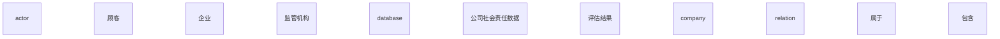
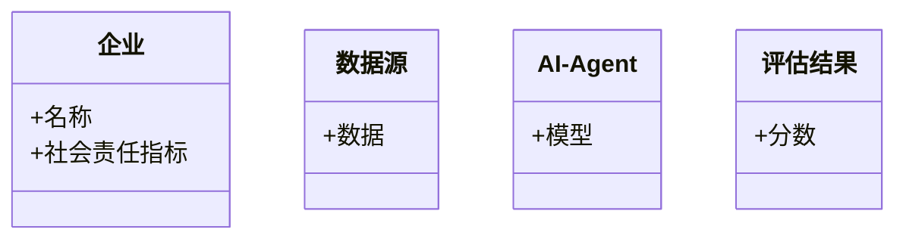
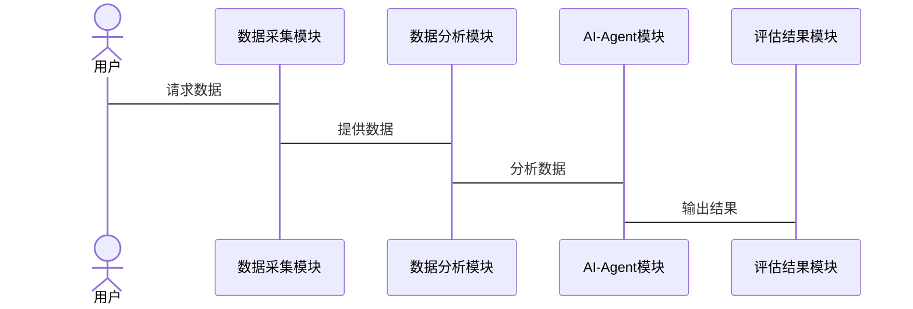

                 


# AI agents在公司社会责任评估中的应用

## 关键词：AI agents, 公司社会责任, 企业责任评估, 人工智能技术, 评估体系, 社会影响

## 摘要：  
本文探讨了人工智能代理（AI agents）在公司社会责任评估中的应用，分析了其核心概念、算法原理、系统设计及实际应用案例，展示了AI技术如何提升企业社会责任评估的效率和准确性。

---

# 正文

## 第一部分: AI agents与公司社会责任评估的背景介绍

## 第1章: AI agents与公司社会责任评估概述

### 1.1 AI agents的核心概念

#### 1.1.1 AI agents的定义  
人工智能代理（AI agents）是能够感知环境、自主决策并执行任务的智能实体。它们可以是软件程序或物理设备，具备学习、推理和自适应能力。

#### 1.1.2 AI agents的基本特征  
- **自主性**：无需外部干预，自主完成任务。  
- **反应性**：能实时感知环境变化并做出反应。  
- **目标导向**：基于目标驱动行为。  

#### 1.1.3 AI agents与传统算法的区别  
AI agents不仅执行预设任务，还能自适应调整策略，适用于动态复杂环境。

### 1.2 公司社会责任评估的背景

#### 1.2.1 公司社会责任的定义  
公司社会责任（Corporate Social Responsibility, CSR）指企业在追求经济利益的同时，对社会、环境和利益相关者负责的行为。

#### 1.2.2 公司社会责任评估的重要性  
帮助企业识别和改进社会责任表现，提升企业形象，增强竞争力。

#### 1.2.3 公司社会责任评估的现状  
传统评估依赖人工收集和分析数据，效率低，且主观性较强。

### 1.3 AI agents在公司社会责任评估中的应用背景

#### 1.3.1 问题背景  
传统评估方法效率低、成本高，难以应对海量数据和复杂场景。

#### 1.3.2 问题描述  
评估过程耗时，数据不一致，缺乏动态调整能力。

#### 1.3.3 问题解决  
引入AI agents，实现数据自动采集、分析和优化。

#### 1.3.4 边界与外延  
AI agents的应用局限于企业内部数据，需与其他系统集成。

#### 1.3.5 核心要素组成  
包括数据采集、分析、决策和反馈机制。

---

## 第2章: AI agents与公司社会责任评估的核心概念与联系

### 2.1 核心概念原理

#### 2.1.1 AI agents的原理  
通过感知环境、学习和推理，制定最优策略。

#### 2.1.2 公司社会责任评估的原理  
基于数据和指标，评估企业在社会责任方面的表现。

#### 2.1.3 两者的结合原理  
AI agents通过数据处理和分析，辅助评估过程。

### 2.2 核心概念属性特征对比

| 特性       | AI agents                     | 公司社会责任评估           |
|------------|-------------------------------|---------------------------|
| 自主性       | 高                            | 低                        |
| 反应性       | 高                            | 中                        |
| 目标导向性    | 强                            | 弱                        |

### 2.3 ER实体关系图  


---

## 第3章: AI agents的算法原理

### 3.1 多智能体协作算法

#### 3.1.1 算法流程  
1. 数据采集：从企业和社会获取相关数据。  
2. 数据处理：清洗和预处理数据。  
3. 模型训练：训练AI agents进行预测和决策。  
4. 输出结果：生成社会责任评估报告。

#### 3.1.2 算法实现  
```python
class AI_Agent:
    def __init__(self, state_space, action_space):
        self.state_space = state_space
        self.action_space = action_space
        self.model = self.build_model()

    def build_model(self):
        # 网络结构
        pass

    def act(self, state):
        # 选择动作
        pass
```

#### 3.1.3 算法优缺点  
- 优点：高效处理多源数据。  
- 缺点：需要大量数据支持。

### 3.2 基于强化学习的AI agents

#### 3.2.1 强化学习原理  
通过奖励机制，优化AI agents的决策策略。

#### 3.2.2 应用实例  
AI agents通过强化学习优化社会责任投资组合。

#### 3.2.3 实例分析  
使用贝叶斯定理进行概率计算，优化评估结果。  
$$ P(A|B) = \frac{P(B|A)P(A)}{P(B)} $$

---

## 第4章: 系统分析与架构设计

### 4.1 问题场景介绍  
企业需要实时监控和评估社会责任表现。

### 4.2 系统功能设计

#### 4.2.1 领域模型类图  


### 4.3 系统架构设计

#### 4.3.1 系统架构图  
```mermaid
containerDiagram
    container 企业系统 {
        component 数据采集模块
        component 数据分析模块
        component AI-Agent模块
        component 评估结果模块
    }
```

### 4.4 接口设计与交互流程

#### 4.4.1 序列图  


---

## 第5章: 项目实战

### 5.1 环境安装  
安装Python、深度学习框架（如TensorFlow）和相关库。

### 5.2 核心代码实现

#### 5.2.1 数据采集模块  
```python
import requests

def fetch_data(url):
    response = requests.get(url)
    return response.json()
```

#### 5.2.2 数据分析模块  
```python
import pandas as pd

def preprocess_data(data):
    df = pd.DataFrame(data)
    return df.dropna()
```

#### 5.2.3 AI-Agent模块  
```python
class AI-Agent:
    def train(self, data):
        # 训练模型
        pass

    def evaluate(self, data):
        # 评估数据
        pass
```

### 5.3 案例分析  
分析某企业的社会责任表现，展示AI agents如何优化评估结果。

### 5.4 项目小结  
总结项目实现过程中的关键点和经验。

---

## 第6章: 最佳实践、小结、注意事项与拓展阅读

### 6.1 最佳实践  
- 数据质量至关重要。  
- 持续优化模型。  
- 确保数据隐私合规。

### 6.2 小结  
AI agents在公司社会责任评估中展现了巨大潜力，能够提升效率和准确性。

### 6.3 注意事项  
- 数据隐私问题需谨慎处理。  
- 模型需不断更新以适应变化。  

### 6.4 拓展阅读  
推荐相关书籍和论文，供深入学习。

---

# 结语

通过系统化的分析和实践，AI agents正在改变公司社会责任评估的方式，为企业和社会创造更多价值。

