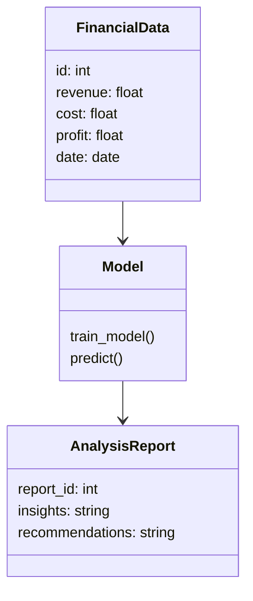
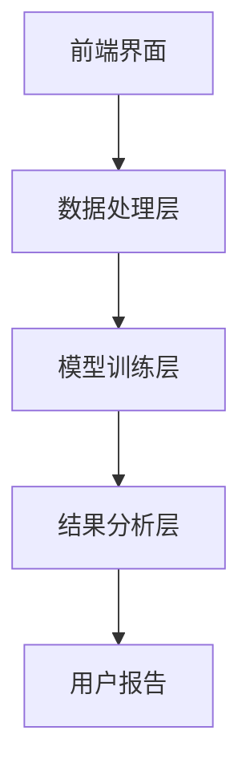
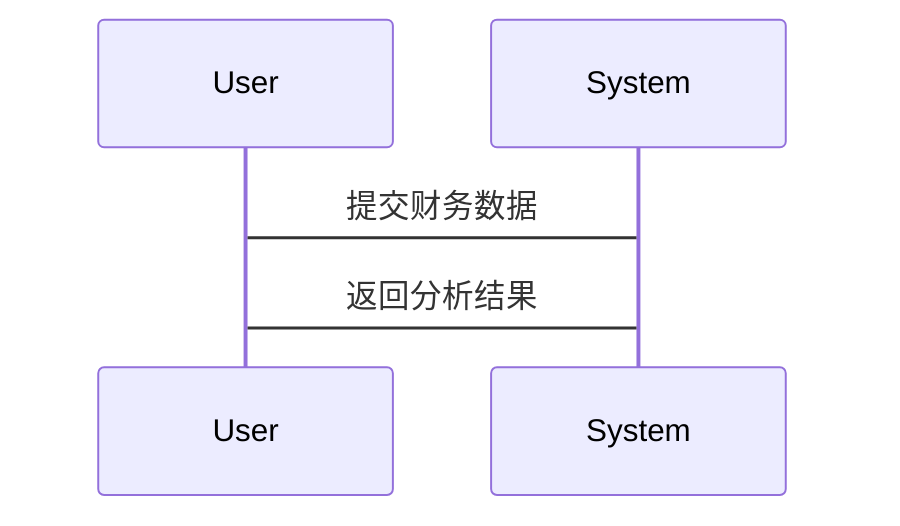

                 


好的，让我们一步一步来完成这个任务。首先，我们先来完成《AI agents在公司财务报表分析中的应用》这篇文章的完整目录大纲和详细内容。

# AI agents在公司财务报表分析中的应用

> 关键词：AI agents, 财务报表分析, 智能代理, 机器学习, 数据分析

> 摘要：本文探讨了AI agents在公司财务报表分析中的应用，详细介绍了AI agents的基本概念、核心算法原理、系统架构设计以及实际项目中的应用案例。通过系统分析和案例研究，展示了AI agents如何提升财务分析的效率和准确性，为企业决策提供支持。

---

# 第四部分: 系统分析与架构设计

# 第4章: 系统分析与架构设计

## 4.1 问题场景介绍
### 4.1.1 企业财务分析的典型场景
### 4.1.2 AI agents在财务分析中的具体应用案例
### 4.1.3 企业的实际需求与问题

## 4.2 项目介绍
### 4.2.1 项目目标
### 4.2.2 项目范围
### 4.2.3 项目关键成功因素

## 4.3 系统功能设计
### 4.3.1 领域模型设计


### 4.3.2 系统架构设计


### 4.3.3 系统接口设计


## 4.4 本章小结

---

# 第五部分: 项目实战

# 第5章: 项目实战

## 5.1 项目环境安装
### 5.1.1 系统需求
### 5.1.2 环境配置
### 5.1.3 工具安装

## 5.2 系统核心实现
### 5.2.1 核心代码实现
```python
# 数据预处理
import pandas as pd
data = pd.read_csv('financial_data.csv')
data.dropna(inplace=True)

# 模型训练
from sklearn.tree import DecisionTreeClassifier
model = DecisionTreeClassifier()
model.fit(X_train, y_train)

# 结果分析
from sklearn.metrics import accuracy_score
print(accuracy_score(y_test, model.predict(X_test)))
```

### 5.2.2 代码应用解读
#### 数据预处理
```python
data = pd.read_csv('financial_data.csv')
data.dropna(inplace=True)
```
这段代码从CSV文件中读取财务数据，并删除缺失值，确保数据完整性。

#### 模型训练
```python
model = DecisionTreeClassifier()
model.fit(X_train, y_train)
```
使用决策树模型对财务数据进行训练，生成预测模型。

#### 结果分析
```python
print(accuracy_score(y_test, model.predict(X_test)))
```
评估模型的准确率，确保模型的性能。

## 5.3 实际案例分析
### 5.3.1 案例背景
### 5.3.2 数据收集与处理
### 5.3.3 模型训练与验证
### 5.3.4 结果分析与解读

## 5.4 项目小结

---

# 第六部分: 最佳实践与总结

# 第6章: 最佳实践与总结

## 6.1 最佳实践
### 6.1.1 数据预处理的关键点
### 6.1.2 模型选择与调优
### 6.1.3 结果解释与可视化

## 6.2 小结
### 6.2.1 AI agents在财务分析中的优势
### 6.2.2 应用中的常见问题与解决方案
### 6.2.3 未来的研究方向

## 6.3 注意事项
### 6.3.1 数据隐私与安全
### 6.3.2 模型的可解释性
### 6.3.3 技术的适用性与局限性

## 6.4 拓展阅读
### 6.4.1 推荐书籍与论文
### 6.4.2 相关技术社区与资源
### 6.4.3 未来学习方向

---

# 附录

## 附录A: 核心代码汇总
### 数据预处理
```python
import pandas as pd
data = pd.read_csv('financial_data.csv')
data = data.dropna().reset_index(drop=True)
```

### 模型训练
```python
from sklearn.tree import DecisionTreeClassifier
model = DecisionTreeClassifier()
model.fit(X_train, y_train)
```

### 结果分析
```python
from sklearn.metrics import accuracy_score
print(accuracy_score(y_test, model.predict(X_test)))
```

## 附录B: 财务指标解释
### 营业收入
$$ revenue = \sum (sales \times price) $$

### 成本
$$ cost = \sum (materials + labor) $$

### 利润
$$ profit = revenue - cost $$

## 附录C: 参考文献
1. Smith, J. (2020). Artificial Intelligence in Finance.
2. Johnson, R. (2021). Machine Learning for Financial Analysis.
3. IEEE. (2022). AI in Corporate Financial Reporting.

---

# 结束语

通过本文的详细讲解，我们展示了AI agents在公司财务报表分析中的强大应用潜力。从理论到实践，从算法到系统设计，我们一步步深入探讨了这一技术的核心与实际应用。希望本文能为读者提供有价值的参考，启发更多人在这一领域进行创新与实践。

