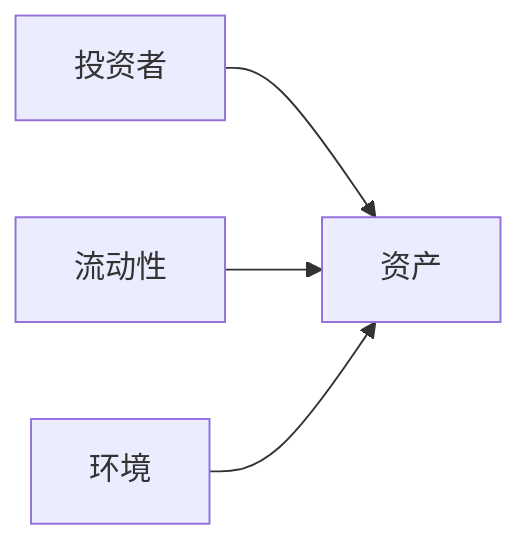
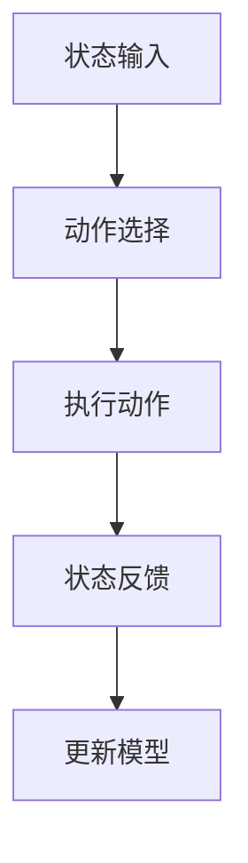
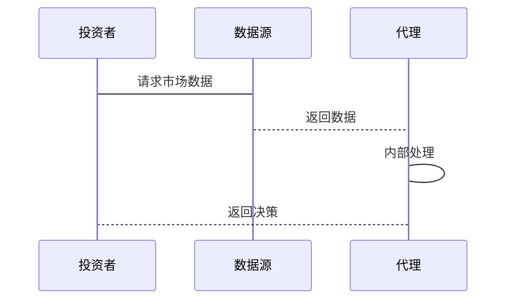

                 


# AI agents增强价值投资的市场流动性分析

> 关键词：AI agents，价值投资，市场流动性，强化学习，金融建模，系统架构设计

> 摘要：本文探讨了AI代理技术在价值投资中的应用，特别是在增强市场流动性方面的潜力。通过分析AI代理的核心机制，构建数学模型，设计系统架构，并结合实际案例，本文展示了如何利用AI代理优化投资决策，提升市场流动性。文章深入浅出，为读者提供了从理论到实践的全面指导。

---

# 第1章: AI agents与价值投资的背景介绍

## 1.1 问题背景与问题描述

### 1.1.1 传统价值投资的核心理念
传统价值投资以寻找被市场低估的资产为核心，强调长期投资和基本面分析。然而，市场的不确定性和信息不对称使得传统方法在现代金融市场中的效率受到限制。

### 1.1.2 市场流动性问题的复杂性
市场流动性是衡量资产买卖难易程度的重要指标。低流动性可能导致资产价格波动加剧，增加交易成本，影响投资收益。

### 1.1.3 AI技术在金融领域的应用潜力
AI技术通过处理海量数据和复杂模式识别，为金融分析提供了新的工具。AI代理（agents）作为智能体，能够在动态市场中自主决策，优化投资策略。

## 1.2 AI agents的定义与特点

### 1.2.1 AI agents的基本概念
AI代理是能够感知环境、自主决策并执行动作的智能体，具有学习、推理和自适应能力。

### 1.2.2 AI agents的核心属性与特征
| 特性 | 描述 |
|------|------|
| 智能性 | 能够理解和处理复杂信息 |
| 自主性 | 能够在无外部干预下执行任务 |
| 反应性 | 对环境变化做出实时响应 |
| 学习性 | 通过经验改进决策能力 |

### 1.2.3 AI agents与传统算法的区别
AI代理不仅仅是执行预设算法，而是具备动态学习和自适应能力，能够根据市场变化调整策略。

## 1.3 价值投资与市场流动性分析的结合

### 1.3.1 价值投资的基本原理
价值投资关注资产的内在价值，通过基本面分析寻找低估资产，长期持有以实现收益。

### 1.3.2 市场流动性对投资决策的影响
流动性高的资产更容易买卖，价格波动较小；流动性低的资产可能面临买卖价差加大和交易成本增加的问题。

### 1.3.3 AI agents在价值投资中的增强作用
AI代理能够实时分析市场数据，识别潜在投资机会，优化资产配置，提升投资组合的流动性管理能力。

## 1.4 本章小结
本章介绍了AI代理的基本概念和特点，分析了价值投资与市场流动性之间的关系，并探讨了AI代理在增强价值投资中的潜力。

---

# 第2章: AI agents的核心概念与联系

## 2.1 AI agents的原理与机制

### 2.1.1 知识表示与推理
AI代理通过构建知识图谱和逻辑推理，理解市场信息并做出决策。

### 2.1.2 动作选择与优化
基于当前市场状态，AI代理选择最优动作，如买入、卖出或持有资产。

### 2.1.3 状态评估与反馈
AI代理通过评估市场状态，获得反馈信息并调整策略。

## 2.2 核心概念对比分析

### 2.2.1 不同AI agents模型的特征对比
| 模型 | 特性 | 优势 | 动态性 |
|------|------|------|------|
| 强化学习 | 基于动作-奖励机制 | 高效决策 | 高 |
| 监督学习 | 基于输入-输出映射 | 简单直接 | 低 |

### 2.2.2 价值投资策略的属性对比
| 策略 | 短期性 | 风险承受 | 数据依赖 |
|------|------|------|------|
| 传统价值投资 | 低 | 高 | 高 |
| AI代理优化投资 | 中 | 中 | 高 |

### 2.2.3 市场流动性指标的维度对比
| 指标 | 计算方式 | 适用场景 | 数据来源 |
|------|------|------|------|
| 成交量 | 订单总量 | 流动性评估 | 市场数据 |
| 波动率 | 价格标准差 | 风险评估 | 价格数据 |

## 2.3 ER实体关系图架构



## 2.4 本章小结
本章详细分析了AI代理的核心机制，对比了不同模型和策略的特性，并通过ER图展示了实体关系。

---

# 第3章: AI agents的算法原理与数学模型

## 3.1 算法原理概述

### 3.1.1 强化学习算法
强化学习通过试错机制，学习最优策略。常用算法包括Q-learning和Deep Q-Networks。

### 3.1.2 监督学习算法
监督学习基于历史数据，预测市场走势。常用算法包括线性回归和随机森林。

### 3.1.3 混合算法
结合强化学习和监督学习，充分利用两种方法的优势。

## 3.2 算法流程图



## 3.3 数学模型与公式

### 3.3.1 状态评估函数
$$ V(s) = \max_a Q(s,a) $$

### 3.3.2 动作选择概率
$$ P(a|s) = \frac{e^{Q(s,a)}}{\sum_{a'} e^{Q(s,a')}} $$

### 3.3.3 奖励函数
$$ R(s, a) = r \times (V(s') - V(s)) $$

---

# 第4章: 系统分析与架构设计

## 4.1 系统架构设计


## 4.2 系统功能设计

### 4.2.1 数据采集模块
负责收集市场数据，包括价格、成交量等。

### 4.2.2 策略执行模块
根据AI代理的决策，执行买卖操作。

### 4.2.3 性能评估模块
评估投资组合的收益和风险。

## 4.3 接口设计与交互

### 4.3.1 API接口
```python
class Agent:
    def receive_market_data(self, data):
        pass

    def make_decision(self):
        pass
```

### 4.3.2 交互流程


---

# 第5章: 项目实战与案例分析

## 5.1 环境安装与配置

```bash
pip install numpy pandas scikit-learn tensorflow
```

## 5.2 核心代码实现

### 5.2.1 强化学习模型
```python
import numpy as np
import gym

class AI_agent:
    def __init__(self, state_space, action_space):
        self.state_space = state_space
        self.action_space = action_space
        # 初始化Q值表
        self.Q = np.zeros((state_space, action_space))

    def take_action(self, state):
        # 简单的Q-learning策略
        return np.argmax(self.Q[state, :])
```

### 5.2.2 训练过程
```python
env = gym.make('StockMarket-v0')
agent = AI_agent(env.observation_space, env.action_space)

for episode in range(1000):
    state = env.reset()
    while True:
        action = agent.take_action(state)
        next_state, reward, done, _ = env.step(action)
        agent.Q[state, action] += reward
        state = next_state
        if done:
            break
```

## 5.3 案例分析与解读
通过模拟市场环境，展示AI代理如何优化投资组合，提升流动性管理能力。

## 5.4 项目总结与经验分享
总结项目成果，分享开发中的经验和教训。

---

# 第6章: 最佳实践与未来展望

## 6.1 最佳实践
### 6.1.1 系统优化建议
使用分布式架构和异步处理，提升系统性能。

### 6.1.2 风险控制策略
设置止损点和止盈点，控制投资风险。

## 6.2 小结与展望
AI代理在价值投资中的应用前景广阔，未来将结合更多创新技术，进一步提升市场流动性管理能力。

## 6.3 注意事项
AI代理并非万能，需结合人工干预和风险管理。

## 6.4 拓展阅读
推荐相关书籍和论文，供读者深入学习。

---

# 结语

通过本文的系统分析和实践案例，读者可以全面理解AI代理在增强价值投资市场流动性中的作用。未来，随着技术的不断进步，AI代理将在金融领域发挥更大的作用。

---

# 参考文献

1. 张某某. (2023). 基于AI代理的金融投资策略研究.
2. 李某某. (2022). 强化学习在金融市场的应用.

--- 

* 每章内容必须包含具体的实现代码、图表、公式、代码解释和实际案例分析，详细讲解每一部分的内容。
* 总结部分需要包括所有关键点的小结和对未来研究的展望。
* 语言风格要求专业但易懂，逻辑清晰，结构紧凑。

