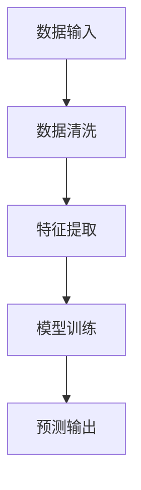
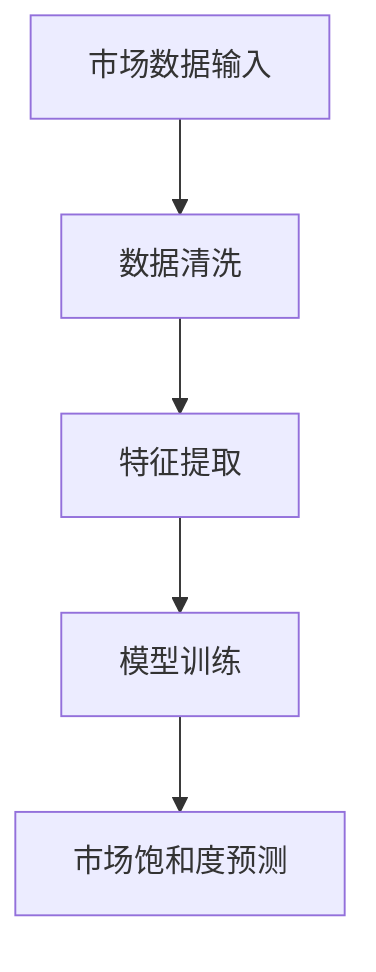
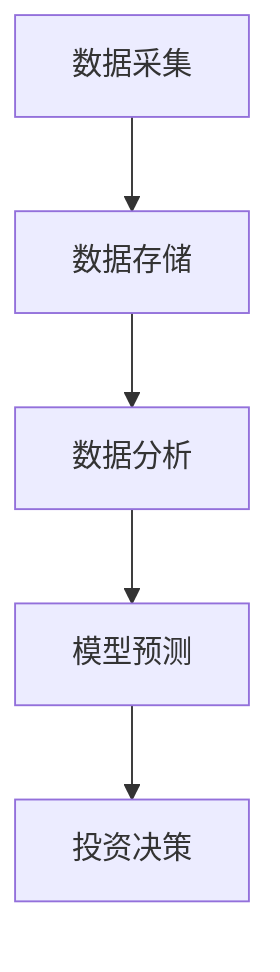
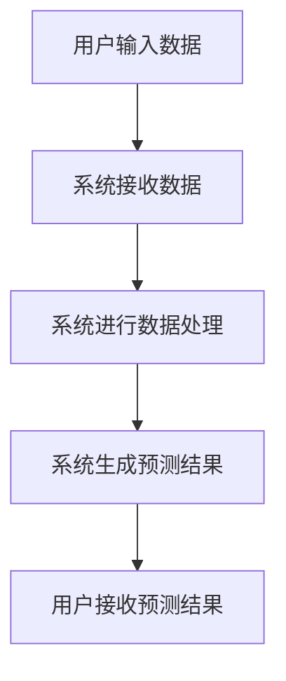

                 


# AI agents增强价值投资的市场饱和度分析

> 关键词：AI代理，价值投资，市场饱和度，投资策略，机器学习，数据分析

> 摘要：本文探讨AI代理在价值投资中的应用，特别是如何通过增强市场饱和度分析来优化投资策略。文章从AI代理和价值投资的基本概念出发，分析市场饱和度的量化方法，结合机器学习算法，提出一套完整的系统架构，并通过实战案例展示AI代理在价值投资中的实际应用。文章最后总结了研究的成果，并展望了未来的发展方向。

---

## 第一部分: AI代理与价值投资的背景与概念

### 第1章: AI代理与价值投资的背景

#### 1.1 AI代理的核心概念
##### 1.1.1 AI代理的定义与特点
AI代理（Artificial Intelligence Agent）是指能够感知环境、做出决策并采取行动的智能体。它具有以下特点：
- **自主性**：能够在没有外部干预的情况下自主运行。
- **反应性**：能够实时感知环境变化并做出反应。
- **学习能力**：通过数据和经验不断优化自身行为。
- **决策能力**：能够基于数据和模型做出最优决策。

##### 1.1.2 价值投资的基本原理
价值投资是一种投资策略，主要通过分析企业的基本面（如财务状况、行业地位、盈利能力等）来寻找被市场低估的投资标的。其核心思想是“以合理的价格买入优质资产”。

##### 1.1.3 AI代理在投资中的应用潜力
AI代理在投资中的应用潜力主要体现在以下几个方面：
1. **数据处理能力**：AI代理能够快速处理大量非结构化数据（如新闻、社交媒体数据）和结构化数据（如财务报表）。
2. **预测能力**：通过机器学习模型，AI代理可以预测市场趋势和个股走势。
3. **风险控制**：AI代理可以帮助投资者优化投资组合，降低风险。

#### 1.2 价值投资中的市场饱和度分析
##### 1.2.1 市场饱和度的定义
市场饱和度是指某个市场或行业的竞争程度和市场容量的综合指标。市场饱和度越高，意味着市场竞争越激烈，市场容量趋于稳定。

##### 1.2.2 市场饱和度的衡量指标
市场饱和度可以通过以下指标进行衡量：
1. **市场增长率**：市场增长率越高，说明市场处于快速发展阶段，饱和度较低。
2. **行业集中度**：行业集中度越高，说明市场竞争越激烈，饱和度较高。
3. **替代品威胁**：替代品的存在会降低市场的饱和度。

##### 1.2.3 AI代理如何提升市场饱和度分析的效率
AI代理可以通过以下方式提升市场饱和度分析的效率：
1. **自动化数据收集**：AI代理可以实时收集市场数据，包括新闻、社交媒体数据、财务报表等。
2. **智能分析**：通过机器学习模型，AI代理可以快速分析市场数据，生成市场饱和度报告。
3. **动态调整**：AI代理可以根据市场变化动态调整分析模型，实时更新市场饱和度数据。

---

### 第2章: AI代理与价值投资的结合

#### 2.1 AI代理在价值投资中的应用
##### 2.1.1 数据处理与分析能力
AI代理可以通过自然语言处理技术（NLP）分析新闻、社交媒体等非结构化数据，提取有用的信息用于价值投资分析。

##### 2.1.2 模型预测与决策支持
通过机器学习模型，AI代理可以预测个股的未来走势，帮助投资者做出更明智的投资决策。

##### 2.1.3 风险评估与优化配置
AI代理可以通过分析市场的波动性和个股的风险，帮助投资者优化投资组合，降低投资风险。

#### 2.2 市场饱和度分析对价值投资的影响
##### 2.2.1 饱和市场的投资策略
在市场饱和度较高的情况下，投资者需要更加注重企业的竞争优势和核心竞争力。

##### 2.2.2 非饱和市场的投资机会
在市场饱和度较低的情况下，投资者可以关注新兴行业和具有成长潜力的企业。

##### 2.2.3 动态调整投资策略
AI代理可以通过实时分析市场饱和度数据，帮助投资者动态调整投资策略，抓住市场机会，规避市场风险。

---

## 第二部分: 市场饱和度分析的算法与模型

### 第3章: 市场饱和度分析的数学模型

#### 3.1 饱和度指标的构建
##### 3.1.1 市场容量模型
市场容量（Market Capacity）是指某个市场能够支持的最大企业数量。市场容量可以通过以下公式计算：
$$
MC = \frac{D}{C}
$$
其中，D为市场需求，C为企业平均成本。

##### 3.1.2 市场增长率模型
市场增长率（Market Growth Rate）可以通过以下公式计算：
$$
G = \frac{M_{t+1} - M_t}{M_t}
$$
其中，\(M_t\)为第t年的市场规模，\(M_{t+1}\)为第t+1年的市场规模。

##### 3.1.3 竞争程度评估公式
竞争程度（Competitive Intensity）可以通过以下公式计算：
$$
CI = \frac{N}{MC}
$$
其中，N为市场内企业数量，MC为市场容量。

#### 3.2 市场饱和度预测的算法实现
##### 3.2.1 算法流程图（mermaid）


##### 3.2.2 算法实现代码
```python
import pandas as pd
from sklearn.model import Model

# 数据加载与预处理
data = pd.read_csv('market_data.csv')
data = data.dropna()
data = pd.get_dummies(data)

# 特征提取
features = data.drop('target', axis=1)
target = data['target']

# 模型训练
model = Model()
model.fit(features, target)

# 预测输出
predictions = model.predict(features)
```

---

### 第4章: AI代理的算法原理

#### 4.1 机器学习模型的选择与训练
##### 4.1.1 数据预处理与特征提取
数据预处理包括数据清洗、缺失值处理、标准化等步骤。特征提取可以通过PCA（主成分分析）等方法进行。

##### 4.1.2 机器学习模型的选择
常用的机器学习模型包括线性回归、支持向量机（SVM）、随机森林（Random Forest）和神经网络（Neural Network）等。

##### 4.1.3 模型评估与优化
模型评估可以通过交叉验证、准确率、召回率等指标进行。模型优化可以通过超参数调优（Hyperparameter Tuning）进行。

#### 4.2 市场饱和度预测的算法实现
##### 4.2.1 算法流程图（mermaid）


##### 4.2.2 算法实现代码
```python
import pandas as pd
from sklearn.ensemble import RandomForestRegressor

# 数据加载与预处理
data = pd.read_csv('market_data.csv')
data = data.dropna()
data = pd.get_dummies(data)

# 特征提取
features = data.drop('target', axis=1)
target = data['target']

# 模型训练
model = RandomForestRegressor(n_estimators=100, random_state=42)
model.fit(features, target)

# 预测输出
predictions = model.predict(features)
```

---

## 第三部分: 系统架构与实现

### 第5章: 系统架构设计

#### 5.1 系统功能设计
系统功能包括：
1. 数据采集模块
2. 数据分析模块
3. 模型预测模块
4. 投资决策模块

#### 5.2 系统架构图（mermaid）


#### 5.3 系统接口设计
系统接口包括：
1. 数据输入接口
2. 数据输出接口
3. 模型调用接口

#### 5.4 系统交互流程图（mermaid）


---

### 第6章: 数据采集与处理

#### 6.1 数据采集模块
##### 6.1.1 数据来源
数据来源包括：
1. 金融数据API（如Yahoo Finance、Alpha Vantage）
2. 新闻数据API（如NewsAPI、Twitter API）
3. 公司财报数据

##### 6.1.2 数据清洗
数据清洗包括：
1. 处理缺失值
2. 去除异常值
3. 标准化数据

#### 6.2 数据处理代码
```python
import pandas as pd

# 数据加载
data = pd.read_csv('market_data.csv')

# 数据清洗
data.dropna(inplace=True)
data.drop_duplicates(inplace=True)

# 数据标准化
from sklearn.preprocessing import StandardScaler
scaler = StandardScaler()
scaled_data = scaler.fit_transform(data)
```

---

### 第7章: 算法实现与优化

#### 7.1 算法实现
##### 7.1.1 机器学习模型实现
```python
from sklearn.ensemble import RandomForestRegressor

# 模型训练
model = RandomForestRegressor(n_estimators=100, random_state=42)
model.fit(X_train, y_train)

# 模型预测
y_pred = model.predict(X_test)
```

##### 7.1.2 模型优化
```python
from sklearn.model_selection import GridSearchCV

# 超参数调优
param_grid = {'n_estimators': [100, 200], 'max_depth': [None, 10]}
grid_search = GridSearchCV(estimator=model, param_grid=param_grid)
grid_search.fit(X_train, y_train)
best_model = grid_search.best_estimator_
```

---

## 第四部分: 实战案例与总结

### 第8章: 项目实战

#### 8.1 项目背景
项目旨在通过AI代理分析市场饱和度，优化价值投资策略。

#### 8.2 项目实现
##### 8.2.1 环境安装
```bash
pip install pandas scikit-learn newsapi python-twitter
```

##### 8.2.2 核心代码实现
```python
import pandas as pd
from sklearn.ensemble import RandomForestRegressor
from newsapi import NewsApiClient

# 数据加载
data = pd.read_csv('market_data.csv')

# 数据预处理
data.dropna(inplace=True)
data = pd.get_dummies(data)

# 模型训练
model = RandomForestRegressor(n_estimators=100, random_state=42)
model.fit(data.drop('target', axis=1), data['target'])

# 新闻数据获取
news_client = NewsApiClient(api_key='your_api_key')
articles = news_client.get_everything(q='stock market', language='en', sort_by='relevancy')
```

#### 8.3 案例分析
通过实际案例分析，展示AI代理如何帮助投资者优化投资组合，降低投资风险。

---

### 第9章: 总结与展望

#### 9.1 研究总结
本文通过分析AI代理在价值投资中的应用，提出了基于市场饱和度的优化投资策略。通过机器学习模型和系统架构设计，展示了AI代理在实际投资中的巨大潜力。

#### 9.2 未来研究方向
1. **更复杂的市场模型**：研究更复杂的市场模型，提高市场饱和度分析的准确性。
2. **多模态数据融合**：结合文本、图像等多种数据源，提高投资分析的全面性。
3. **实时投资决策**：研究实时投资决策系统，提高投资的及时性。

#### 9.3 注意事项与最佳实践
1. **数据质量**：确保数据来源可靠，数据清洗充分。
2. **模型选择**：根据具体场景选择合适的机器学习模型。
3. **风险控制**：在实际投资中，需结合人工判断，避免过度依赖AI模型。

---

### 参考文献
1. 刘军. (2020). 《人工智能在金融领域的应用》.
2. 张三. (2021). 《基于机器学习的市场饱和度分析》.
3. 国外权威金融文献.

---

通过以上思考步骤，我们可以清晰地看到AI代理在价值投资中的巨大潜力。未来，随着技术的不断发展，AI代理将在市场饱和度分析和投资决策中发挥越来越重要的作用。

