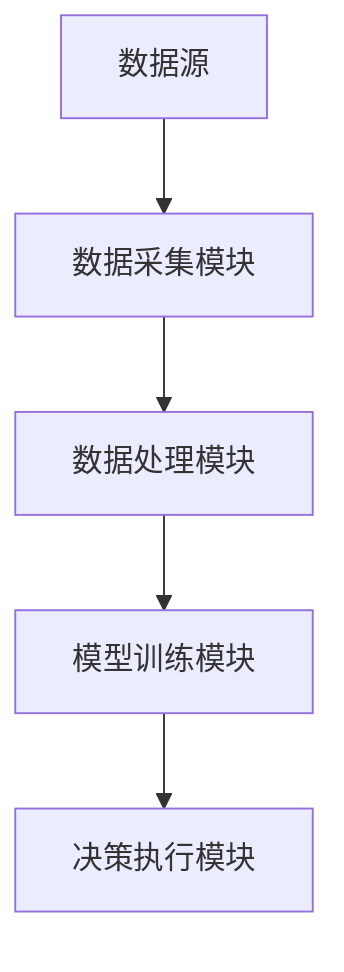

                 


```markdown
# AI agents辅助价值投资者解读央行政策影响

## 关键词：
AI代理，价值投资，央行政策，金融市场，强化学习，金融数据分析

## 摘要：
本文探讨了AI代理在帮助价值投资者解读央行政策及其对金融市场影响中的作用。通过分析AI代理的核心算法和系统架构，结合实际案例，展示了如何利用AI技术辅助价值投资者做出更明智的投资决策。

---

## 第一部分: AI代理与价值投资基础

### 第1章: AI代理与价值投资概述

#### 1.1 AI代理的核心概念
##### 1.1.1 AI代理的基本定义
AI代理（Artificial Intelligence Agents）是指能够感知环境、自主决策并执行任务的智能实体。它们通过接收输入数据，运用算法进行分析和推理，输出相应的决策或行动。

##### 1.1.2 价值投资的基本原理
价值投资是一种投资策略，强调通过深入分析企业的基本面，寻找市场价格低于其内在价值的投资标的。价值投资者关注企业的盈利能力、财务状况和行业地位等因素。

##### 1.1.3 央行政策对金融市场的影响机制
央行政策（如利率调整、货币供应量变化等）直接影响市场流动性、企业融资成本和消费者行为，进而影响股票价格、债券收益率等金融市场指标。

#### 1.2 AI代理与价值投资的结合
##### 1.2.1 AI代理在金融分析中的应用
AI代理能够处理海量金融数据，识别市场趋势，预测政策变化对市场的影响，为价值投资者提供数据支持和决策参考。

##### 1.2.2 价值投资者的需求与挑战
价值投资者需要快速解读复杂多变的市场信息，AI代理能够帮助他们提高分析效率，降低人为误差，捕捉市场机会。

##### 1.2.3 央行政策解读的复杂性与AI代理的作用
央行政策的影响往往涉及多方面的因素，AI代理能够通过数据分析，识别政策对市场的潜在影响，帮助投资者做出更明智的投资决策。

---

### 第2章: AI代理的核心概念与原理

#### 2.1 AI代理的核心概念
##### 2.1.1 AI代理的感知机制
AI代理通过传感器或数据输入接口接收环境信息，如金融市场数据、新闻报道等。

##### 2.1.2 AI代理的决策机制
AI代理基于感知到的信息，运用算法进行分析和推理，生成决策指令。

##### 2.1.3 AI代理的执行机制
AI代理根据决策结果，执行相应的操作，如买入或卖出股票。

#### 2.2 AI代理与金融数据的关系
##### 2.2.1 金融数据的多样性与复杂性
金融市场数据包括股票价格、成交量、财务报表、新闻 sentiment 等，具有高维、噪声多、动态变化等特点。

##### 2.2.2 AI代理如何处理金融数据
AI代理通过数据清洗、特征提取和建模分析，将复杂金融数据转化为可操作的决策信号。

##### 2.2.3 金融数据对AI代理决策的影响
金融数据的质量和及时性直接影响AI代理的决策准确性，高质量的数据能够提高模型的预测精度。

---

### 第3章: AI代理的核心算法与数学模型

#### 3.1 强化学习算法
##### 3.1.1 Q-learning算法
Q-learning是一种经典的强化学习算法，通过状态-动作-奖励机制，学习最优决策策略。

数学模型：
$$ Q(s, a) = r + \gamma \max_{a'} Q(s', a') $$

##### 3.1.2 策略梯度算法
策略梯度算法通过优化策略函数，直接学习最优动作选择概率。

数学模型：
$$ \nabla \theta \leftarrow \nabla J(\theta) $$

##### 3.1.3 算法的数学模型与公式
强化学习算法通过不断试错，优化决策策略，适用于动态变化的金融市场环境。

#### 3.2 监督学习算法
##### 3.2.1 线性回归模型
线性回归模型用于预测连续型输出，如股票价格。

数学模型：
$$ y = \beta_0 + \beta_1 x + \epsilon $$

##### 3.2.2 支持向量机模型
支持向量机模型适用于分类问题，如判断股票价格涨跌。

##### 3.2.3 神经网络模型
神经网络模型能够处理复杂非线性关系，适用于金融时间序列分析。

---

### 第4章: 系统分析与架构设计

#### 4.1 问题场景介绍
##### 4.1.1 价值投资者的需求分析
价值投资者需要快速解读央行政策变化，评估其对目标企业的影响。

##### 4.1.2 央行政策解读的复杂性
政策变化涉及多个变量，如宏观经济指标、市场情绪等，解读难度大。

##### 4.1.3 AI代理在金融分析中的应用场景
AI代理可以帮助投资者快速分析市场数据，识别投资机会和风险。

#### 4.2 系统架构设计
##### 4.2.1 系统模块划分
- 数据采集模块：收集金融市场数据、政策信息。
- 数据处理模块：清洗、特征提取。
- 模型训练模块：训练AI代理模型。
- 决策执行模块：根据模型输出，执行投资操作。

##### 4.2.2 系统数据流图


##### 4.2.3 系统接口设计
- 数据接口：API用于数据输入输出。
- 模型接口：API用于模型调用和结果获取。

---

### 第5章: 项目实战

#### 5.1 环境安装与配置
##### 5.1.1 Python环境的安装
安装Python 3.8及以上版本，建议使用Anaconda或virtualenv管理环境。

##### 5.1.2 必要库的安装
```bash
pip install numpy pandas scikit-learn tensorflow
```

#### 5.2 系统核心实现
##### 5.2.1 数据获取与预处理
使用Yahoo Finance API获取股票数据，清洗缺失值，标准化数据。

##### 5.2.2 模型训练与优化
训练强化学习模型，优化超参数，评估模型性能。

##### 5.2.3 系统接口开发
开发RESTful API，提供数据查询和模型预测服务。

#### 5.3 案例
##### 5.3.1 数据分析与建模
对历史股票数据进行分析，训练预测模型。

##### 5.3.2 模型预测与策略制定
根据模型预测结果，制定投资策略，调整仓位配置。

---

## 第二部分: 总结与展望

### 6章: 总结与最佳实践

#### 6.1 小结
本文介绍了AI代理在价值投资中的应用，详细讲解了算法原理和系统架构，展示了实际案例。

#### 6.2 注意事项
- 数据质量对模型性能影响大，需谨慎处理。
- 模型调参和优化需要经验，建议逐步调整。

#### 6.3 拓展阅读
推荐相关书籍和论文，进一步深入学习AI在金融领域的应用。

---

通过本文的学习，读者可以掌握AI代理在解读央行政策影响中的应用，为价值投资者提供有力工具，帮助他们做出更明智的投资决策。
```

