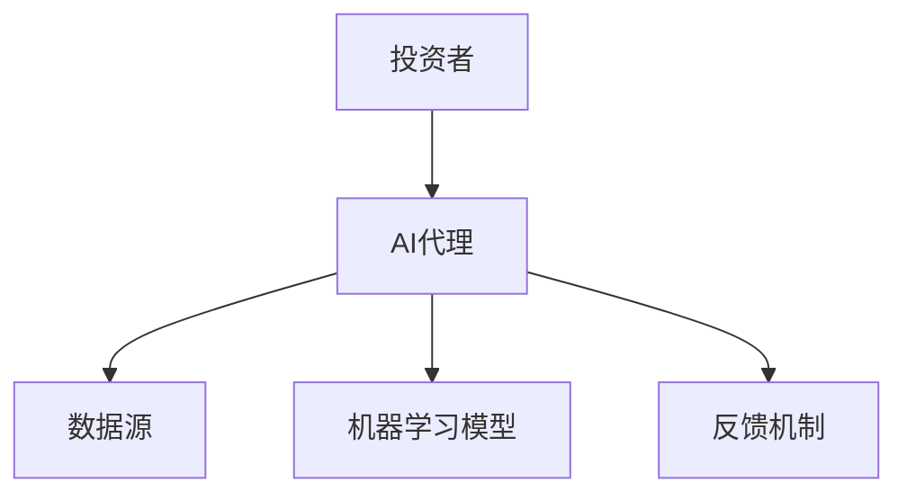
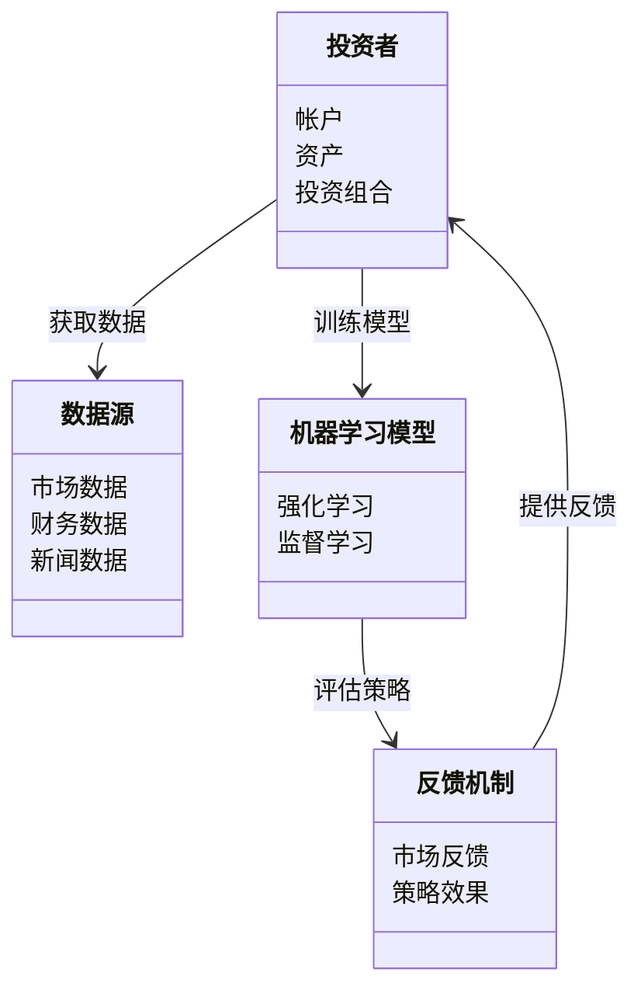
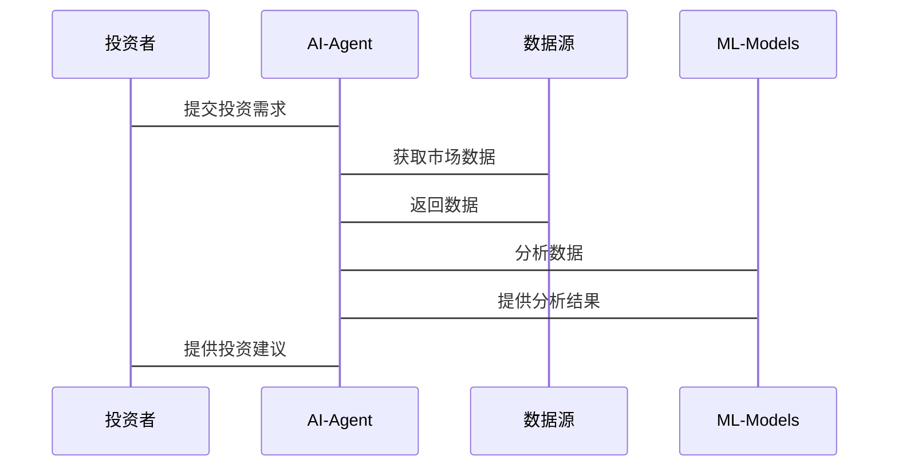

                 


# AI agents辅助价值投资者评估公司的平台生态价值

## 关键词：AI代理、价值投资、平台生态、金融分析、机器学习、投资决策

## 摘要：本文探讨了AI代理在价值投资中的应用，详细分析了AI代理如何通过数据处理、智能决策和实时反馈辅助投资者评估公司平台生态价值。文章从AI代理的基本概念、算法原理、系统架构到实际项目实现，全面解析了其在金融领域的潜力和应用。

---

# 第一部分: AI代理与价值投资概述

## 第1章: AI代理与价值投资的背景

### 1.1 AI代理的基本概念
#### 1.1.1 AI代理的定义与特点
AI代理是一种智能体，能够感知环境、执行任务并做出决策。其特点包括自主性、反应性、目标导向和学习能力。

#### 1.1.2 价值投资的核心理念
价值投资强调通过深入分析公司的基本面，寻找被市场低估的投资标的。其核心在于识别公司长期的内在价值。

#### 1.1.3 AI代理在价值投资中的应用前景
AI代理能够处理海量数据，识别潜在投资机会，帮助投资者做出更明智的决策。

### 1.2 AI代理与价值投资的结合
#### 1.2.1 价值投资中的信息处理挑战
传统价值投资依赖大量手动数据处理，效率低下且容易出错。

#### 1.2.2 AI代理如何辅助投资决策
AI代理通过自动化数据处理、模式识别和预测分析，提升投资决策的效率和准确性。

#### 1.2.3 平台生态价值的定义与重要性
平台生态价值是指公司与其生态系统（如供应商、客户、合作伙伴）之间的相互作用和协同效应。它决定了公司的长期竞争力和价值。

---

## 第2章: 价值投资者的决策需求

### 2.1 价值投资者的核心需求
#### 2.1.1 财务数据的深度分析
投资者需要分析财务报表，识别财务健康状况和潜在风险。

#### 2.1.2 行业趋势的预测
通过分析行业动态，预测市场趋势，识别投资机会。

#### 2.1.3 竞争对手的评估
了解竞争对手的市场地位、产品策略和财务状况，制定有效的投资策略。

### 2.2 平台生态价值的评估维度
#### 2.2.1 公司的市场地位
评估公司在市场中的位置，包括市场份额和品牌影响力。

#### 2.2.2 产品的竞争力
分析产品的独特性、技术创新和市场适应能力。

#### 2.2.3 财务健康状况
通过财务指标（如ROE、净利率）评估公司的盈利能力和发展潜力。

---

## 第3章: AI代理在价值评估中的优势

### 3.1 数据处理能力
#### 3.1.1 大数据的处理与分析
AI代理能够处理和分析海量数据，识别数据中的潜在模式和趋势。

#### 3.1.2 自然语言处理在新闻分析中的应用
通过NLP技术，分析新闻、报告和社交媒体数据，提取情绪和关键信息。

#### 3.1.3 时间序列分析在预测中的作用
利用时间序列分析预测市场趋势，帮助投资者做出前瞻性决策。

### 3.2 智能决策支持
#### 3.2.1 强化学习在投资决策中的应用
强化学习通过试错和反馈优化投资策略，提高决策的准确性。

#### 3.2.2 知识图谱在行业分析中的作用
构建行业知识图谱，帮助投资者识别行业动态和潜在风险。

#### 3.2.3 风险评估与管理
AI代理能够实时监控市场动态，评估投资组合的风险，并提出规避策略。

### 3.3 高效性与准确性
#### 3.3.1 提高决策效率
AI代理能够快速处理和分析数据，缩短决策时间。

#### 3.3.2 减少人为错误
通过自动化分析和机器学习，降低人为判断的偏差和错误。

#### 3.3.3 实时监控与反馈
AI代理能够实时监控市场变化，提供及时的反馈和建议，帮助投资者快速应对市场波动。

---

# 第二部分: AI代理的核心概念与原理

## 第4章: AI代理的核心概念

### 4.1 AI代理的基本原理
#### 4.1.1 感知层：数据采集与处理
AI代理通过传感器、API和爬虫等工具采集数据，并进行清洗和预处理。

#### 4.1.2 决策层：策略制定与优化
基于感知层的数据，AI代理利用机器学习模型制定投资策略，并通过反馈不断优化策略。

#### 4.1.3 执行层：操作与反馈
根据决策层的指令，AI代理执行投资操作，并收集反馈数据，用于后续优化。

### 4.2 AI代理的核心技术
#### 4.2.1 知识图谱构建
通过自然语言处理和信息抽取技术，构建行业知识图谱，帮助投资者理解市场动态。

#### 4.2.2 强化学习
强化学习通过试错和奖励机制优化投资策略，提高决策的准确性和效率。

### 4.3 AI代理的实体关系图



---

## 第5章: AI代理的算法原理

### 5.1 强化学习算法
#### 5.1.1 Q-learning算法
Q-learning算法是一种经典的强化学习算法，通过状态-动作-奖励-状态（SARSA）更新策略。

公式：
$$ Q(s, a) = Q(s, a) + \alpha (r + \gamma \max Q(s', a')) $$

#### 5.1.2 实现步骤
1. 初始化Q表。
2. 选择动作。
3. 执行动作，观察奖励和新状态。
4. 更新Q表。
5. 重复步骤，直到收敛。

#### 5.1.3 Python代码示例
```python
import numpy as np

# 初始化Q表
Q = np.zeros((4, 4))
alpha = 0.1
gamma = 0.9

# Q-learning算法
def q_learning(env):
    for episode in range(1000):
        state = env.reset()
        while not env.done:
            action = np.argmax(Q[state])
            new_state, reward, done = env.step(action)
            Q[state][action] += alpha * (reward + gamma * np.max(Q[new_state]))
            state = new_state
            if done:
                break
    return Q

# 实验环境定义
class Environment:
    def __init__(self):
        self.states = 4
        self.actions = 4
        self.done = False

    def reset(self):
        return 0

    def step(self, action):
        return (action+1) % self.states, 1, False

env = Environment()
Q = q_learning(env)
print(Q)
```

---

## 第6章: 系统分析与架构设计方案

### 6.1 系统应用场景
投资者通过AI代理进行市场分析、风险评估和投资决策。

### 6.2 系统功能设计
#### 6.2.1 领域模型


### 6.3 系统架构设计


### 6.4 接口设计
投资者通过API调用AI代理，获取分析结果和投资建议。

### 6.5 交互流程


---

## 第7章: 项目实战

### 7.1 环境安装
安装Python、TensorFlow、Keras和相关库。

### 7.2 核心实现
实现AI代理的数据采集、模型训练和结果输出。

#### 7.2.1 数据采集
使用爬虫采集市场数据和新闻信息。

#### 7.2.2 模型训练
训练强化学习模型，优化投资策略。

### 7.3 案例分析
分析具体公司的平台生态价值，验证AI代理的有效性。

### 7.4 项目总结
总结项目成果，分析存在的问题和改进方向。

---

## 第8章: 最佳实践与总结

### 8.1 最佳实践
- 数据质量是关键，确保数据来源可靠。
- 模型需要不断优化，根据市场变化调整参数。
- 结合人工分析，避免过度依赖AI。

### 8.2 小结
AI代理通过高效的数据处理和智能决策支持，为价值投资者提供了强大的工具，帮助他们更好地评估公司平台生态价值。

### 8.3 注意事项
- 数据隐私和安全问题需要重视。
- 模型的解释性需要增强，以便投资者理解决策过程。
- 避免过度依赖AI，保持人类的判断和决策能力。

### 8.4 拓展阅读
推荐相关书籍和论文，进一步深入学习AI在金融中的应用。

---

# 结语
通过本文的详细分析，读者可以全面了解AI代理在价值投资中的应用，掌握其核心概念和算法原理，并通过实际项目案例，提升对AI代理辅助投资的理解和应用能力。

