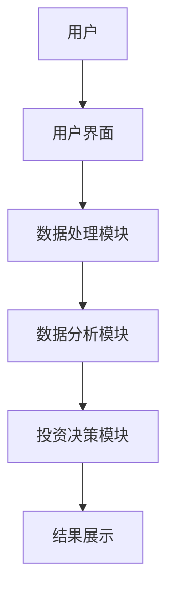

                 


# AI agents辅助价值投资者评估公司的数据变现能力

## 关键词：
- AI agents
- 价值投资者
- 数据变现能力
- 投资决策
- 数据驱动

## 摘要：
随着数据驱动决策的兴起，价值投资者越来越依赖于对数据变现能力的深入分析。本文探讨了AI agents在辅助价值投资者评估公司数据变现能力中的应用，从核心概念、算法原理、系统架构到项目实战，全面解析如何利用AI技术提升投资决策的效率和准确性。

---

## 第一部分: AI agents辅助价值投资者评估公司的数据变现能力

## 第1章: 问题背景与核心概念

### 1.1 问题背景

#### 1.1.1 数据变现能力的定义与重要性
数据变现能力是指企业通过数据资产创造收入和利润的能力。随着数字化转型的推进，数据已成为企业最重要的资产之一。对于价值投资者而言，评估一家公司的数据变现能力，能够帮助他们识别高增长潜力的公司，优化投资组合。

#### 1.1.2 价值投资者的决策逻辑
价值投资者通常关注公司的基本面，包括财务状况、市场地位、管理团队等。然而，在数据驱动的时代，数据变现能力成为评估公司价值的重要维度。投资者需要了解公司如何利用数据创造价值，以及数据资产的质量和潜力。

#### 1.1.3 AI agents与价值投资的结合
AI agents（人工智能代理）能够通过分析大量数据，提供实时的市场洞察和决策支持。它们可以帮助价值投资者快速识别数据驱动的机会和风险，优化投资策略。

---

### 1.2 核心概念

#### 1.2.1 数据变现能力的评估维度
数据变现能力可以从以下几个维度进行评估：
- 数据质量：数据的完整性和准确性。
- 数据资产：数据的规模和多样性。
- 数据安全：数据保护和合规性。
- 数据变现模式：数据 monetization 的方式，如广告、订阅等。

#### 1.2.2 AI agents的基本原理
AI agents是一种能够感知环境、执行任务并优化决策的智能系统。它们通过机器学习算法，从数据中提取模式和洞察，辅助人类完成复杂任务。

#### 1.2.3 价值投资者的决策框架
价值投资者的决策框架通常包括以下几个步骤：
1. 数据收集：获取公司的财务数据、市场数据等。
2. 数据分析：通过数据分析工具，评估公司的基本面。
3. 投资决策：基于分析结果，做出投资决策。

---

## 第2章: 核心概念与联系

### 2.1 数据变现能力评估的核心要素

#### 2.1.1 数据质量与价值
数据质量是数据变现能力的基础。高质量的数据能够为企业创造更高的价值。例如，一家公司如果拥有准确的用户行为数据，可以更好地进行市场细分和精准营销。

#### 2.1.2 数据变现模式
数据变现模式多种多样，包括：
- 广告变现：通过数据驱动的广告投放，获取收入。
- 数据销售：将数据作为产品，出售给第三方。
- 数据驱动的产品：通过数据优化产品和服务，提升用户体验。

#### 2.1.3 数据安全与隐私
数据安全是数据变现过程中不可忽视的问题。公司必须确保数据的合规性和安全性，避免数据泄露和隐私侵犯。

### 2.2 AI agents与价值投资的联系

#### 2.2.1 AI agents在数据处理中的优势
AI agents能够快速处理大量数据，提取有用的洞察。例如，通过自然语言处理技术，AI agents可以分析公司财报，识别潜在的财务风险。

#### 2.2.2 价值投资者的决策支持
AI agents可以帮助价值投资者进行实时市场监控、风险评估和投资组合优化。例如，AI agents可以通过分析市场趋势，识别潜在的投资机会。

#### 2.2.3 数据驱动的投资策略
数据驱动的投资策略强调通过数据分析，识别市场趋势和公司基本面的变化。AI agents能够帮助投资者快速适应市场变化，制定更科学的投资策略。

---

## 第3章: AI agents的算法原理

### 3.1 算法原理概述

#### 3.1.1 强化学习与决策树
强化学习是一种通过试错学习的算法，适用于复杂的决策场景。决策树是一种直观的分类和回归方法，适用于数据分类任务。

#### 3.1.2 监督学习与数据分类
监督学习是一种基于标注数据的算法，适用于分类和回归任务。通过监督学习，AI agents可以将公司数据分为不同类别，例如财务健康和不健康。

#### 3.1.3 聚类分析与市场细分
聚类分析是一种无监督学习方法，适用于市场细分和客户群体分析。通过聚类分析，AI agents可以帮助投资者识别不同市场的潜力。

### 3.2 算法实现与代码示例

#### 3.2.1 强化学习的数学模型
强化学习的核心是Q-learning算法，其数学模型如下：
$$ Q(s, a) = r + \gamma \max_{a'} Q(s', a') $$
其中，\( s \)是状态，\( a \)是动作，\( r \)是奖励，\( \gamma \)是折扣因子。

#### 3.2.2 代码实现与解释
以下是一个简单的强化学习代码示例：

```python
import numpy as np

# 初始化Q表
Q = np.zeros((state_space, action_space))

# 设置超参数
learning_rate = 0.1
gamma = 0.9

# Q-learning算法
for episode in range(episodes):
    state = env.reset()
    while not done:
        # 选择动作
        action = np.argmax(Q[state, :])
        next_state, reward, done = env.step(action)
        # 更新Q值
        Q[state, action] += learning_rate * (reward + gamma * np.max(Q[next_state, :]))
```

#### 3.2.3 算法优化与调优
算法优化包括调整学习率、折扣因子等参数，以提高模型的性能。例如，通过网格搜索或随机搜索，找到最优参数组合。

---

## 第4章: 系统分析与架构设计

### 4.1 系统分析

#### 4.1.1 问题场景介绍
系统需要帮助价值投资者评估公司的数据变现能力。用户需求包括数据收集、分析和投资决策支持。

#### 4.1.2 项目介绍与目标
项目目标是开发一个基于AI agents的投资决策支持系统，帮助投资者评估公司的数据变现能力。

#### 4.1.3 系统功能设计
系统功能包括数据收集、数据分析、投资建议生成等。

### 4.2 系统架构设计

#### 4.2.1 领域模型设计
领域模型包括公司数据、市场数据、用户数据等。

#### 4.2.2 系统架构图
以下是系统架构的Mermaid图：



#### 4.2.3 接口与交互设计
系统接口包括API接口和用户界面。用户可以通过界面提交投资需求，系统通过API接口获取市场数据。

---

## 第5章: 项目实战与案例分析

### 5.1 环境安装与配置

#### 5.1.1 开发环境搭建
开发环境包括Python、Jupyter Notebook、Git等工具。

#### 5.1.2 依赖库安装
需要安装的库包括NumPy、Pandas、Scikit-learn、TensorFlow等。

### 5.2 核心代码实现

#### 5.2.1 数据处理与清洗
使用Pandas进行数据清洗和预处理：

```python
import pandas as pd

# 读取数据
df = pd.read_csv('data.csv')

# 删除缺失值
df.dropna(inplace=True)

# 标准化数据
from sklearn.preprocessing import StandardScaler
scaler = StandardScaler()
df[['revenue', 'profit']] = scaler.fit_transform(df[['revenue', 'profit']])
```

#### 5.2.2 模型训练与优化
使用Scikit-learn进行模型训练和优化：

```python
from sklearn.model_selection import train_test_split
from sklearn.ensemble import RandomForestClassifier
from sklearn.metrics import accuracy_score

# 划分数据集
X_train, X_test, y_train, y_test = train_test_split(df.drop('target', axis=1), df['target'], test_size=0.2)

# 训练模型
model = RandomForestClassifier()
model.fit(X_train, y_train)

# 评估模型
y_pred = model.predict(X_test)
print('Accuracy:', accuracy_score(y_test, y_pred))
```

#### 5.2.3 系统集成与部署
使用Flask框架部署系统：

```python
from flask import Flask, request, jsonify

app = Flask(__name__)

@app.route('/api/predict', methods=['POST'])
def predict():
    data = request.json
    # 数据处理
    # 模型预测
    return jsonify({'result': 'success'})

if __name__ == '__main__':
    app.run(debug=True)
```

### 5.3 案例分析

#### 5.3.1 案例介绍
以某科技公司为例，分析其数据变现能力。

#### 5.3.2 数据分析
使用Python代码分析公司的财务数据和市场数据。

#### 5.3.3 投资决策建议
基于分析结果，生成投资建议，例如是否值得投资。

---

## 第6章: 总结与展望

### 6.1 总结
本文详细介绍了AI agents在辅助价值投资者评估公司数据变现能力中的应用，从核心概念到算法实现，再到系统设计和项目实战，全面解析了如何利用AI技术提升投资决策的效率和准确性。

### 6.2 展望
未来，随着AI技术的不断发展，AI agents在投资领域的应用将更加广泛。投资者可以利用更强大的AI工具，进行更精准的市场分析和投资决策。

---

通过以上内容，您可以逐步构建一篇详细的技术博客文章，涵盖AI agents辅助价值投资者评估公司数据变现能力的各个方面。

