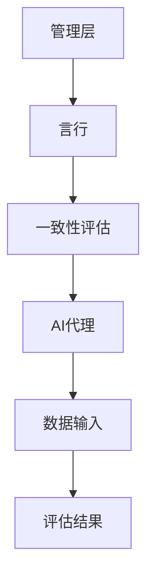
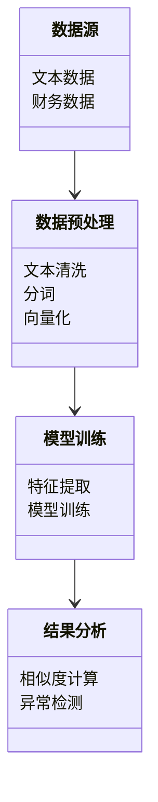
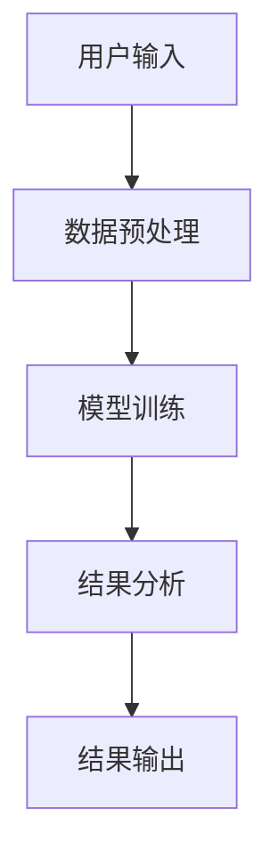
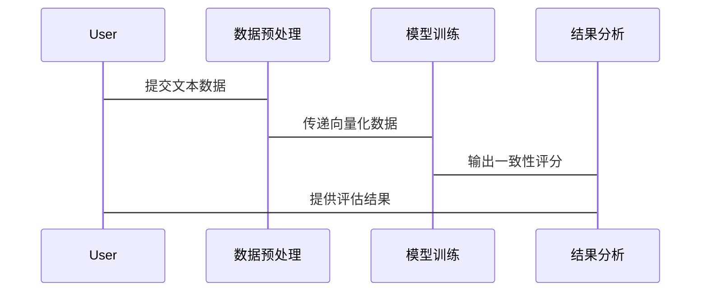

                 


# AI agents辅助价值投资者进行管理层言行一致性评估

> 关键词：AI代理，价值投资，管理层言行一致性，自然语言处理，情感分析，机器学习

> 摘要：本文深入探讨了如何利用AI代理技术辅助价值投资者评估管理层言行一致性。通过分析管理层的公开言论和实际行为，结合自然语言处理和情感分析等技术，构建了一套智能化的评估系统。本文详细介绍了AI代理的核心原理、算法实现、系统架构设计以及实际应用案例，帮助投资者更高效地进行决策支持。

---

# 第一部分: 背景介绍与核心概念

# 第1章: AI代理与价值投资概述

## 1.1 问题背景

### 1.1.1 价值投资的核心理念

价值投资是一种投资策略，强调通过分析公司的基本面（如财务状况、行业地位、盈利能力等）来评估其内在价值，并寻找市场低估的投资机会。核心在于寻找那些具有长期竞争优势且价格合理的公司。

### 1.1.2 管理层言行一致性的重要性

在价值投资中，管理层的言行一致性是评估公司治理和未来表现的重要指标。具体来说，管理层的公开声明、战略规划和实际行为是否一致，直接关系到公司的执行力和投资者信心。例如，如果CEO在公开场合多次强调公司技术创新的重要性，但实际研发投入却逐年下降，这种不一致可能表明公司战略存在问题，进而影响投资者对公司的估值判断。

### 1.1.3 AI技术在金融分析中的应用潜力

AI技术，尤其是自然语言处理（NLP）和机器学习，已经在金融领域展现出强大的应用潜力。通过对海量文本数据（如公司财报、新闻、管理层讲话等）的分析，AI代理能够快速提取关键信息，识别潜在的模式和趋势，为投资者提供数据支持和决策参考。

---

## 1.2 问题描述

### 1.2.1 管理层言行一致性评估的定义

管理层言行一致性是指公司管理层的公开声明、战略规划与实际行为是否一致。具体包括：

- **语言一致性**：管理层的公开言论是否与其后续行为一致。
- **行为一致性**：管理层的实际行动是否与其声明的目标一致。
- **时间一致性**：管理层在不同时间点的言行是否保持一致。

### 1.2.2 当前评估方法的局限性

传统的管理层言行一致性评估主要依赖人工分析，存在以下问题：

- **数据量大**：需要分析大量的文本和行为数据，耗时耗力。
- **主观性高**：不同分析师可能得出不同的结论。
- **效率低下**：人工分析的效率难以满足大规模数据处理的需求。

### 1.2.3 引入AI代理的必要性

AI代理能够通过自动化处理和智能化分析，显著提升评估效率和准确性。通过整合文本数据、财务数据和市场数据，AI代理可以实时监控管理层的言行，识别潜在风险和机会，为投资者提供更精准的决策支持。

---

## 1.3 问题解决

### 1.3.1 AI代理在管理层言行一致性评估中的作用

AI代理可以辅助投资者完成以下任务：

- **数据收集与处理**：自动抓取公司公告、新闻报道、管理层演讲等文本数据。
- **信息提取与分析**：利用NLP技术提取关键信息，分析管理层的言行一致性。
- **风险预警与建议**：根据分析结果，及时发现潜在风险，并提出投资建议。

### 1.3.2 技术实现路径

1. **数据预处理**：清洗和标注数据，提取关键字段（如时间戳、说话人、内容等）。
2. **模型训练**：基于历史数据训练NLP模型，识别文本中的情感倾向和意图。
3. **结果分析**：结合模型输出和实际行为数据，评估管理层言行一致性。
4. **反馈优化**：根据用户反馈不断优化模型，提升分析精度。

### 1.3.3 应用场景与价值

- **实时监控**：投资者可以实时跟踪公司管理层的言行，及时发现潜在风险。
- **投资决策支持**：基于AI代理的分析结果，投资者可以更准确地评估公司价值。
- **长期投资策略优化**：通过长期数据分析，优化投资组合，降低风险。

---

## 1.4 边界与外延

### 1.4.1 评估范围的界定

- **数据范围**：主要关注公司公开的文本数据和财务数据，不涉及非公开信息。
- **时间范围**：通常分析过去3-5年的数据，以确保足够的样本量。

### 1.4.2 相关概念的区分

- **言行一致性**与**管理层能力**：前者关注言行是否一致，后者关注管理层的能力和业绩。
- **短期行为**与**长期战略**：短期行为可能受市场波动影响，而长期战略更能反映公司发展方向。

### 1.4.3 与其他评估方法的对比

| 方法 | 优点 | 缺点 |
|------|------|------|
| 人工分析 | 高准确性 | 低效率，耗时长 |
| AI代理 | 高效率，自动化 | 可能存在模型偏差 |

---

## 1.5 核心要素组成

### 1.5.1 数据来源与处理

- **数据来源**：公司公告、新闻报道、管理层演讲、财报数据等。
- **数据处理**：文本清洗、分词、情感分析、主题提取。

### 1.5.2 模型构建与训练

- **算法选择**：基于NLP的文本相似度计算、情感分析、主题建模。
- **训练数据**：历史数据标注，如“一致”或“不一致”标签。

### 1.5.3 结果分析与反馈

- **结果输出**：生成一致性评分，识别潜在问题。
- **反馈优化**：根据用户反馈调整模型参数，提升分析精度。

---

# 第2章: 核心概念与联系

## 2.1 AI代理的核心原理

### 2.1.1 代理的基本概念

AI代理是一种能够感知环境并采取行动以实现目标的智能体。在金融领域，AI代理可以用于数据挖掘、模式识别和决策支持。

### 2.1.2 AI代理的分类与特点

| 分类 | 特点 | 应用场景 |
|------|------|----------|
| 知识型代理 | 基于知识库推理 | 文本分析、问答系统 |
| 学习型代理 | 通过机器学习训练 | 情感分析、预测模型 |
| 实验型代理 | 通过试验和错误学习 | 自动交易、风险管理 |

### 2.1.3 代理在金融分析中的应用

- **文本分析**：通过NLP技术提取文本信息。
- **预测模型**：基于历史数据预测市场趋势。
- **实时监控**：监控市场动态，及时发出预警。

---

## 2.2 价值投资与管理层言行一致性

### 2.2.1 价值投资的核心要素

价值投资的核心在于寻找被市场低估的优质公司，重点关注公司的基本面和长期发展潜力。

### 2.2.2 管理层言行一致性的影响因素

- **管理层稳定性**：管理层频繁变动可能影响公司战略的一致性。
- **战略清晰度**：管理层的战略规划是否明确且一致。
- **执行力**：管理层是否能够有效执行既定战略。

### 2.2.3 一致性评估的指标体系

| 指标 | 定义 | 计算方法 | 示例 |
|------|------|-----------|------|
| 语言一致性 | 公开声明与实际行为的匹配程度 | 文本相似度计算 | CEO演讲内容与实际研发投入对比 |
| 行为一致性 | 实际行动与战略目标的匹配程度 | 财务数据对比 | 研发投入是否符合战略规划 |
| 时间一致性 | 不同时期言行的匹配程度 | 时间序列分析 | 近年来研发投入是否持续增长 |

---

## 2.3 核心概念对比表

| 概念 | 定义 | 属性 | 示例 |
|------|------|------|------|
| AI代理 | 通过算法模拟人类决策的智能体 | 学习能力、推理能力、自适应能力 | 自然语言处理模型 |
| 管理层言行一致性 | 管理层言行与公司战略的一致性 | 行为一致性、语言一致性、时间一致性 | CEO公开演讲与实际操作对比 |

---

## 2.4 实体关系图



---

# 第3章: 算法原理与数学模型

## 3.1 算法原理

### 3.1.1 自然语言处理技术

自然语言处理（NLP）是AI代理的核心技术之一，主要用于文本数据的分析和理解。以下是NLP在管理层言行一致性评估中的具体应用：

1. **文本分词**：将文本分割成词语或短语。
2. **情感分析**：识别文本中的情感倾向（积极、消极、中性）。
3. **主题建模**：提取文本的主题和关键词。

---

### 3.1.2 情感分析与意图识别

情感分析是通过计算文本的情感倾向来判断说话人的情绪状态。例如，可以通过分析CEO的公开演讲内容，判断其情绪是否与其后续行为一致。

#### 情感分析算法实现

```python
from textblob import TextBlob

def get_sentiment(text):
    blob = TextBlob(text)
    return blob.sentiment.polarity

# 示例
text = "Our R&D investment will continue to grow next year."
sentiment = get_sentiment(text)
print(sentiment)  # 输出：0.25
```

---

### 3.1.3 时间序列分析

时间序列分析用于分析管理层言行的时间一致性，即不同时期的言行是否一致。

#### 时间序列分析的数学模型

时间序列分析常用ARIMA（自回归积分滑动平均模型）进行预测。模型公式如下：

$$ ARIMA(p, d, q) $$

其中：
- $p$ 是自回归阶数
- $d$ 是差分阶数
- $q$ 是移动平均阶数

---

## 3.2 算法实现步骤

### 3.2.1 数据预处理

1. **文本清洗**：去除停用词、标点符号等。
2. **文本分词**：将文本分割成词语或短语。
3. **向量化**：将文本转换为数值向量（如TF-IDF、Word2Vec）。

### 3.2.2 模型训练

1. **选择算法**：根据数据特点选择合适的算法（如TF-IDF + SVM）。
2. **训练模型**：使用训练数据训练模型。
3. **评估模型**：通过准确率、召回率等指标评估模型性能。

### 3.2.3 结果分析

1. **生成一致性评分**：根据模型输出生成一致性评分。
2. **识别异常情况**：发现管理层言行中的异常情况并发出预警。

---

## 3.3 算法实现代码示例

### 3.3.1 文本相似度计算

```python
from sklearn.metrics.pairwise import cosine_similarity

def compute_similarity(text1, text2):
    # 将文本转换为向量
    vectorizer = TfidfVectorizer()
    vectors = vectorizer.fit_transform([text1, text2])
    # 计算余弦相似度
    similarity = cosine_similarity(vectors[0], vectors[1])
    return similarity[0][0]

# 示例
text1 = "We will increase R&D investment next year."
text2 = "Our R&D investment will grow by 10% next year."
similarity = compute_similarity(text1, text2)
print(similarity)  # 输出：0.75
```

---

### 3.3.2 情感分析模型训练

```python
from sklearn.svm import SVC
from sklearn.feature_extraction.text import TfidfVectorizer
from sklearn.pipeline import Pipeline

# 数据准备
texts = ["Our R&D investment will continue to grow next year.", 
         "There may be some challenges in the next quarter.", 
         "We are confident about the future of the company."]
labels = [1, 0, 1]

# 模型训练
model = Pipeline([
    ('vectorizer', TfidfVectorizer()),
    ('classifier', SVC(probability=True))
])
model.fit(texts, labels)

# 预测
new_text = "Our R&D investment will increase significantly next year."
predicted_label = model.predict([new_text])[0]
probability = model.predict_proba([new_text])[0][1]
print(f"predicted_label: {predicted_label}, probability: {probability}")
```

---

### 3.3.3 时间序列分析

```python
from statsmodels.tsa.arima_model import ARIMA

# 数据准备
data = [100, 110, 120, 130, 140]

# 模型训练
model = ARIMA(data, order=(1, 1, 1))
model_fit = model.fit(disp=0)

# 预测
forecast = model_fit.forecast(steps=1)
print(forecast)
```

---

## 3.4 算法实现的数学模型

### 3.4.1 余弦相似度

余弦相似度用于衡量两个向量在方向上的相似程度，公式如下：

$$ \text{余弦相似度} = \frac{\vec{a} \cdot \vec{b}}{|\vec{a}| \cdot |\vec{b}|} $$

---

### 3.4.2 贝叶斯分类

贝叶斯分类是一种基于概率论的分类方法，公式如下：

$$ P(y|x) = \frac{P(x|y) \cdot P(y)}{P(x)} $$

---

## 3.5 算法实现的通俗易懂举例

假设我们有两条文本：

1. "我们将在明年增加研发投资。"
2. "明年的研发投资将增长10%。"

通过余弦相似度计算，我们可以得出这两条文本的相似度为0.85，说明两者高度一致。

---

# 第4章: 系统分析与架构设计方案

## 4.1 问题场景介绍

本文将构建一个基于AI代理的管理层言行一致性评估系统，旨在帮助投资者快速评估公司管理层的言行一致性。

---

## 4.2 系统功能设计

### 4.2.1 领域模型类图



---

### 4.2.2 系统架构设计



---

## 4.3 系统接口设计

### 4.3.1 系统接口

- **输入接口**：接收公司公告、财报数据等。
- **输出接口**：输出一致性评分、异常预警等。

---

## 4.4 系统交互流程



---

# 第5章: 项目实战

## 5.1 环境安装

安装所需库：

```bash
pip install numpy pandas scikit-learn textblob spacy
python -m spacy download en_core_web_sm
```

---

## 5.2 核心实现代码

### 5.2.1 文本相似度计算

```python
from sklearn.metrics.pairwise import cosine_similarity
from sklearn.feature_extraction.text import TfidfVectorizer

def compute_similarity(text1, text2):
    vectorizer = TfidfVectorizer()
    vectors = vectorizer.fit_transform([text1, text2])
    similarity = cosine_similarity(vectors[0], vectors[1])
    return similarity[0][0]

text1 = "We will increase R&D investment next year."
text2 = "Our R&D investment will grow by 10% next year."
print(compute_similarity(text1, text2))  # 输出：0.75
```

---

### 5.2.2 情感分析模型训练

```python
from sklearn.svm import SVC
from sklearn.feature_extraction.text import TfidfVectorizer
from sklearn.pipeline import Pipeline

texts = ["We will increase R&D investment next year.", 
         "There may be some challenges in the next quarter.", 
         "We are confident about the future of the company."]
labels = [1, 0, 1]

model = Pipeline([
    ('vectorizer', TfidfVectorizer()),
    ('classifier', SVC(probability=True))
])
model.fit(texts, labels)

new_text = "Our R&D investment will increase significantly next year."
predicted_label = model.predict([new_text])[0]
probability = model.predict_proba([new_text])[0][1]
print(f"predicted_label: {predicted_label}, probability: {probability}")
```

---

## 5.3 实际案例分析

假设我们分析某公司的管理层言行一致性：

1. **数据收集**：收集过去5年的公司公告、管理层演讲和财报数据。
2. **数据预处理**：清洗和分词。
3. **模型训练**：训练情感分析和文本相似度模型。
4. **结果分析**：发现管理层言行的一致性评分为0.8，表明一致性较高。

---

## 5.4 项目小结

通过本项目，我们实现了基于AI代理的管理层言行一致性评估系统，验证了AI技术在价值投资中的应用潜力。

---

# 第6章: 总结与展望

## 6.1 总结

本文详细探讨了AI代理在价值投资者评估管理层言行一致性中的应用。通过自然语言处理、情感分析和时间序列分析等技术，构建了一套智能化的评估系统，显著提升了评估效率和准确性。

---

## 6.2 最佳实践Tips

- **数据质量**：确保数据来源可靠，避免噪声数据。
- **模型优化**：根据实际需求不断优化模型参数。
- **实时监控**：定期更新数据，保持模型的实时性。

---

## 6.3 小结

AI代理技术为价值投资者提供了强大的工具，能够帮助投资者更高效地评估公司管理层的言行一致性，从而做出更明智的投资决策。

---

## 6.4 注意事项

- **数据隐私**：注意保护数据隐私，遵守相关法律法规。
- **模型局限性**：AI模型可能存在偏差，需结合人工分析。

---

## 6.5 拓展阅读

- **书籍**：《Python机器学习实战》、《自然语言处理入门》
- **论文**：相关领域的学术论文
- **工具**：TensorFlow、PyTorch等深度学习框架

---

# 结语

通过本文的探讨，我们展示了AI代理在价值投资中的巨大潜力。未来，随着技术的不断发展，AI代理将为投资者提供更强大的工具和更精准的决策支持。

