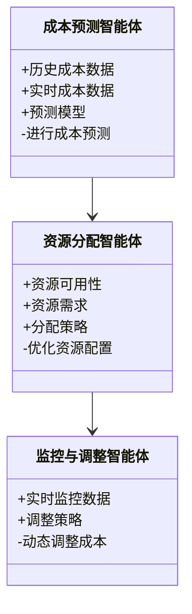

                 


# AI优化的约翰·伯格成本控制策略：多智能体协作

## 关键词：
AI优化，约翰·伯格成本控制策略，多智能体协作，成本预测，强化学习，系统架构，项目实战

## 摘要：
本文详细探讨了如何利用AI技术优化约翰·伯格成本控制策略，并通过多智能体协作实现更高效的成本管理。文章从成本控制的基本概念出发，分析了约翰·伯格策略的核心思想，结合AI技术的最新进展，提出了多智能体协作的实现机制。通过数学模型、算法原理和系统架构的详细讲解，展示了如何在实际项目中应用这些方法，为企业的成本控制提供了新的思路和解决方案。

---

# 第一部分：AI优化的约翰·伯格成本控制策略概述

## 第1章：成本控制的基本概念与背景

### 1.1 成本控制的定义与重要性

#### 1.1.1 成本控制的定义
成本控制是指在企业运营过程中，通过规划、预测、监控和调整各种成本因素，以实现成本最小化或最优化的过程。它是企业管理的重要组成部分，直接影响企业的利润和竞争力。

#### 1.1.2 成本控制在企业管理中的作用
成本控制是企业管理的核心环节之一，它能够帮助企业减少浪费、提高效率、增强市场竞争力。通过科学的成本控制，企业可以更好地应对市场变化，优化资源配置。

#### 1.1.3 成本控制的常见方法与挑战
传统的成本控制方法包括经验估算、历史数据分析等，但这些方法往往缺乏精准性和前瞻性。随着市场竞争的加剧和企业规模的扩大，传统的成本控制方法已难以满足现代企业的需求，亟需引入更先进的技术手段。

---

### 1.2 约翰·伯格成本控制策略

#### 1.2.1 约翰·伯格成本控制策略的核心思想
约翰·伯格策略强调通过数据驱动的方法，结合实时监控和预测分析，实现成本的精准控制。其核心思想是通过不断优化成本预测模型，提高成本控制的准确性和实时性。

#### 1.2.2 约翰·伯格策略在现代企业管理中的应用
约翰·伯格策略广泛应用于制造业、服务业等多个领域，尤其在复杂环境下，其优势更加明显。它通过引入先进的数据分析和优化算法，帮助企业实现更高效的资源配置和成本管理。

#### 1.2.3 约翰·伯格策略的优缺点分析
约翰·伯格策略的优点在于其科学性和精准性，但其缺点在于实施成本较高，且需要大量的数据支持。此外，其模型的复杂性也可能导致实施难度较大。

---

## 第2章：AI在成本控制中的应用背景

### 2.1 AI技术的基本概念与发展趋势

#### 2.1.1 AI技术的定义与发展历程
人工智能（AI）是指模拟人类智能的计算机系统，其发展历程可以追溯到20世纪50年代。随着计算能力的提升和数据量的爆炸式增长，AI技术得到了快速发展。

#### 2.1.2 当前AI技术在企业管理中的应用现状
AI技术在企业管理中的应用日益广泛，尤其是在数据分析、预测和决策支持领域。通过AI技术，企业能够更快速、更准确地进行成本预测和优化。

#### 2.1.3 AI技术在成本控制中的潜在价值
AI技术能够通过海量数据的分析，发现传统方法难以察觉的成本浪费点，从而帮助企业实现更精准的成本控制。

---

### 2.2 多智能体协作的基本概念与优势

#### 2.2.1 多智能体协作的定义
多智能体协作是指多个智能体通过协同工作，共同完成特定任务的过程。在成本控制中，多智能体协作可以通过分工合作，提高成本预测和优化的效率。

#### 2.2.2 多智能体协作的核心优势
多智能体协作的优势在于其能够充分发挥每个智能体的优势，通过协同工作实现更高效的资源利用和更精准的成本控制。

#### 2.2.3 多智能体协作在成本控制中的应用前景
随着AI技术的不断发展，多智能体协作在成本控制中的应用前景广阔。它可以帮助企业在复杂环境下实现更高效的资源配置和成本优化。

---

# 第二部分：约翰·伯格成本控制策略的AI优化方法

## 第3章：约翰·伯格成本控制策略的AI优化框架

### 3.1 约翰·伯格策略的优化目标

#### 3.1.1 成本控制的精准化
通过AI技术，实现成本预测的高精度，从而提高成本控制的精准性。

#### 3.1.2 成本预测的准确性
利用AI技术，结合历史数据和实时信息，提高成本预测的准确性。

#### 3.1.3 成本决策的智能化
通过AI技术，实现成本决策的智能化，减少人为错误，提高决策效率。

---

### 3.2 AI优化框架的设计原则

#### 3.2.1 数据驱动的决策
AI优化框架的核心是数据驱动的决策，通过分析海量数据，发现成本控制的关键点。

#### 3.2.2 多智能体协作的实现
通过多智能体协作，实现任务的分工与合作，提高成本控制的效率和效果。

#### 3.2.3 智能算法的优化
通过不断优化智能算法，提高AI系统的预测和决策能力，从而实现更高效的成本控制。

---

## 第4章：多智能体协作的实现机制

### 4.1 多智能体协作的核心算法

#### 4.1.1 强化学习算法
强化学习是一种通过试错机制优化决策的算法，广泛应用于多智能体协作中。

#### 4.1.2 联合学习算法
联合学习是一种通过多个智能体协作学习的方法，能够提高模型的泛化能力和预测精度。

#### 4.1.3 分布式计算与协作
分布式计算是多智能体协作的重要实现方式，通过分布式计算，可以实现任务的分工与协作。

---

### 4.2 多智能体协作的通信机制

#### 4.2.1 智能体之间的信息传递
通过信息传递，实现智能体之间的协同工作，提高协作效率。

#### 4.2.2 协作任务的分配与协调
通过任务分配和协调，实现智能体之间的高效协作。

#### 4.2.3 智能体的自适应调整
通过自适应调整，实现智能体之间的动态协作，适应环境的变化。

---

## 第5章：多智能体协作的成本控制应用

### 5.1 系统功能设计

#### 5.1.1 领域模型类图


#### 5.1.2 系统架构图
```mermaid
rectangle 系统边界 {
    + 成本预测智能体
    + 资源分配智能体
    + 监控与调整智能体
    + 中央控制模块
}
```

---

### 5.2 项目实战

#### 5.2.1 环境安装
安装Python、TensorFlow、Keras等AI开发环境。

#### 5.2.2 核心代码实现
```python
import numpy as np
from tensorflow.keras import models, layers

# 定义强化学习模型
class AIAssistant:
    def __init__(self):
        self.model = self.build_model()
    
    def build_model(self):
        model = models.Sequential()
        model.add(layers.Dense(64, activation='relu', input_shape=(input_dim,)))
        model.add(layers.Dense(32, activation='relu'))
        model.add(layers.Dense(1, activation='linear'))
        model.compile(optimizer='adam', loss='mean_squared_error')
        return model

    def train(self, data, labels):
        self.model.fit(data, labels, epochs=100, batch_size=32)
```

---

### 5.2.3 实际案例分析
通过具体案例，展示多智能体协作在成本控制中的应用效果，分析结果并总结经验。

---

## 第6章：总结与展望

### 6.1 总结
本文详细探讨了如何利用AI技术优化约翰·伯格成本控制策略，并通过多智能体协作实现更高效的成本管理。通过数学模型、算法原理和系统架构的详细讲解，展示了如何在实际项目中应用这些方法。

### 6.2 应用前景
随着AI技术的不断发展，多智能体协作在成本控制中的应用前景广阔。它可以帮助企业在复杂环境下实现更高效的资源配置和成本优化。

### 6.3 注意事项
在实际应用中，需要注意数据质量、算法选择和系统维护等问题，以确保系统的稳定性和高效性。

### 6.4 拓展阅读
推荐一些相关的技术书籍和论文，供读者进一步学习和研究。

---

# 结语

通过本文的详细讲解，读者可以全面了解AI优化的约翰·伯格成本控制策略，并通过多智能体协作实现更高效的成本管理。希望本文能够为企业的成本控制提供新的思路和解决方案。

