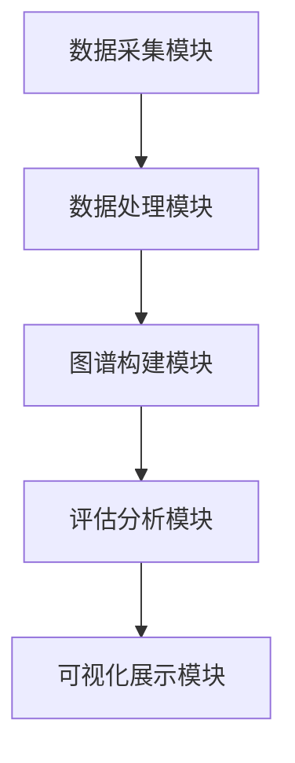

                 


# AI协作分析公司专利引用网络：评估技术领先地位

**关键词：** AI协作、专利引用网络、技术领先、图神经网络、系统架构设计、NLP、文本挖掘

**摘要：**  
随着技术竞争的加剧，企业通过专利布局来保护和提升技术地位变得至关重要。AI协作分析公司专利引用网络，能够帮助企业快速识别技术领先领域，优化研发策略。本文从专利引用网络的构建、AI协作分析的核心算法、技术领先地位评估指标、系统架构设计、项目实战等方面进行详细探讨，为企业提供一种基于AI的高效技术领先评估方法。

---

## 第1章：AI协作分析与专利引用网络概述

### 1.1 问题背景与目标

#### 1.1.1 企业技术竞争与专利的重要性
企业之间的技术竞争日益激烈，专利作为技术保护和创新的重要手段，已成为企业核心竞争力的关键因素。通过分析专利引用网络，企业可以了解自身技术在行业中的位置，发现技术空白点，优化研发资源分配。

#### 1.1.2 专利引用网络的定义与特点
专利引用网络是指将专利视为节点，通过引用关系（如“被引用”、“引用”）构建的网络图。其特点包括：
- **节点化**：每个专利是一个节点。
- **关系化**：节点之间通过引用关系形成边。
- **网络化**：整个网络展示专利之间的关联性。

#### 1.1.3 AI协作分析的目标与意义
AI协作分析的目标是利用机器学习和自然语言处理技术，从专利引用网络中提取有价值的信息，如技术趋势、技术领先企业等。通过AI协作分析，企业可以快速识别技术领先领域，制定更有针对性的研发策略。

### 1.2 专利引用网络的核心概念

#### 1.2.1 专利引用网络的构建原理
专利引用网络的构建基于专利之间的引用关系，通过文本挖掘和图论方法，将专利数据转化为网络图。

#### 1.2.2 引用关系的类型与特征
引用关系主要包括：
- **正向引用**：专利A被专利B引用。
- **逆向引用**：专利B被专利A引用。
- **自引用**：专利A引用自身。

#### 1.2.3 网络结构的属性与分析维度
网络结构属性包括节点度、中心性、聚类系数等。分析维度包括技术领域分布、技术趋势、技术领先企业等。

---

## 第2章：专利引用网络的构建与数据处理

### 2.1 数据采集与预处理

#### 2.1.1 专利数据的获取与清洗
专利数据可以通过专利数据库获取，清洗过程包括去除重复数据、补充缺失值等。

#### 2.1.2 数据格式转换与标准化
将专利数据转换为统一格式，如JSON或CSV，并进行标准化处理，便于后续分析。

#### 2.1.3 数据存储与管理
使用数据库或文件系统存储专利数据，确保数据的高效访问和管理。

### 2.2 专利引用网络的构建流程

#### 2.2.1 引用关系的识别与建模
通过文本挖掘技术识别专利之间的引用关系，构建引用网络的边。

#### 2.2.2 网络图的构建与存储
将节点和边存储为图数据结构，并使用图数据库或图论工具进行管理。

#### 2.2.3 数据可视化与初步分析
使用网络可视化工具（如Gephi）展示专利引用网络，并进行初步的网络分析。

---

## 第3章：AI协作分析的核心算法与原理

### 3.1 文本挖掘技术

#### 3.1.1 专利文本的关键词提取
使用TF-IDF或主题模型提取专利文本中的关键词。

#### 3.1.2 基于NLP的语义分析
利用自然语言处理技术（如BERT）对专利文本进行语义分析，提取技术领域。

#### 3.1.3 文本相似度计算与聚类
通过余弦相似度或聚类算法，将相似的专利聚类，识别技术趋势。

### 3.2 引用网络的图谱分析

#### 3.2.1 图论基础与网络分析方法
介绍图论中的基本概念（如度、中心性）及其在专利网络中的应用。

#### 3.2.2 社会网络分析（SNA）的应用
利用SNA方法（如PageRank算法）识别网络中的重要节点（如技术领先企业）。

#### 3.2.3 强化学习在图谱分析中的应用
使用强化学习算法（如GraphSAGE）对专利网络进行节点分类，识别技术趋势。

---

## 第4章：技术领先地位评估指标

### 4.1 技术领先性的评估维度

#### 4.1.1 引用网络的中心性指标
通过节点的度、PageRank值等中心性指标，评估专利在网络中的重要性。

#### 4.1.2 技术成熟度与创新性评估
结合专利的生命周期和引用次数，评估技术的成熟度和创新性。

#### 4.1.3 市场竞争力分析
通过市场占有率、技术布局等指标，评估技术的市场竞争力。

### 4.2 评估模型与算法选择

#### 4.2.1 基于网络的评估模型
构建多维评估模型，综合考虑技术、市场、法律等因素。

#### 4.2.2 多维度指标的综合评估
使用加权评分法，将多个评估指标进行综合评分，确定技术领先性。

#### 4.2.3 模型的验证与优化
通过实验验证评估模型的有效性，并进行参数优化。

---

## 第5章：系统架构与实现

### 5.1 系统架构设计

#### 5.1.1 系统功能模块划分
- 数据采集模块
- 数据处理模块
- 图谱构建模块
- 评估分析模块
- 可视化展示模块

#### 5.1.2 系统架构设计图（Mermaid）


#### 5.1.3 系统实现的技术选型
- 数据库：Neo4j（图数据库）
- 开发语言：Python
- 机器学习框架：TensorFlow

### 5.2 系统接口与交互设计

#### 5.2.1 系统接口定义
- API接口：提供RESTful接口，供外部调用。
- 数据接口：支持多种数据格式的导入和导出。

#### 5.2.2 用户交互设计
- 用户界面：可视化界面，支持用户进行数据上传、分析任务启动和结果查看。
- 交互流程：用户上传数据，选择分析模块，启动分析任务，查看结果。

---

## 第6章：项目实战与案例分析

### 6.1 项目背景与目标

#### 6.1.1 项目背景
以某行业为例，分析其专利引用网络，评估技术领先企业。

#### 6.1.2 项目目标
识别行业技术领先企业，优化企业技术研发策略。

### 6.2 核心代码实现

#### 6.2.1 数据预处理代码
```python
import pandas as pd
# 读取专利数据
df = pd.read_csv('patent_data.csv')
# 清洗数据
df.dropna(inplace=True)
```

#### 6.2.2 图谱构建代码
```python
from networkx import DiGraph
import neo4j
# 创建图结构
graph = DiGraph()
# 添加节点和边
for patent in df['patent_id']:
    graph.add_node(patent)
    for cited_patent in df['cited_patent']:
        graph.add_edge(patent, cited_patent)
```

#### 6.2.3 评估分析代码
```python
from sklearn.cluster import KMeans
# 文本相似度计算
similarity_matrix = cosine_similarity(vectorized_data)
# 聚类分析
kmeans = KMeans(n_clusters=3).fit(similarity_matrix)
```

### 6.3 案例分析与结果解读

#### 6.3.1 技术领域分布
通过网络图展示不同技术领域的分布，识别技术空白点。

#### 6.3.2 技术领先企业识别
通过中心性指标，识别网络中的重要节点，即技术领先企业。

#### 6.3.3 技术趋势预测
基于图神经网络模型，预测未来技术发展趋势。

---

## 第7章：总结与展望

### 7.1 总结
本文详细介绍了AI协作分析公司专利引用网络的方法，包括数据构建、算法实现、评估指标和系统设计。通过项目实战，验证了方法的有效性。

### 7.2 展望
未来，随着AI技术的不断发展，专利引用网络分析将更加智能化和精准化，为企业技术领先评估提供更有力的支持。

---

**注意事项：**  
- 本文涉及的代码和数据均为示例，实际应用需根据具体需求进行调整。  
- 在实际项目中，需结合企业实际情况选择合适的技术方案。

