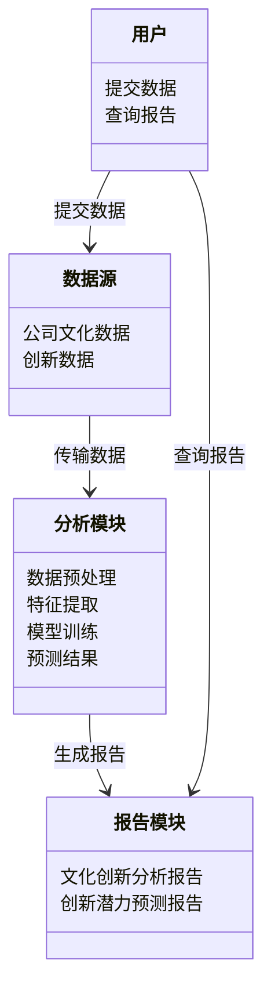
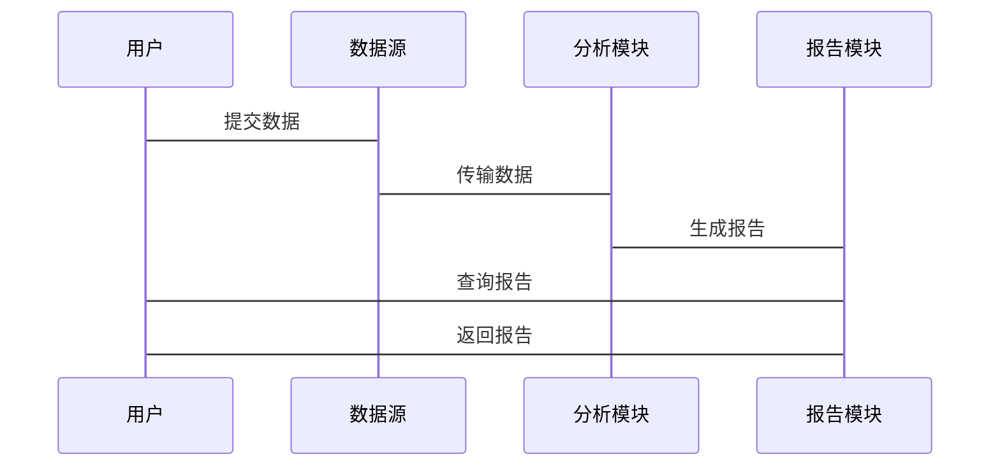

                 


# AI协作分析公司文化与创新相关性：预测长期成长潜力

---

## 关键词  
- 公司文化  
- 创新  
- AI协作分析  
- 长期成长潜力  
- 数据挖掘  
- 机器学习  
- 自然语言处理  

---

## 摘要  
本文探讨了公司文化与创新之间的相关性，以及如何利用AI协作分析技术预测企业的长期成长潜力。通过结合公司文化的特征分析和创新的驱动因素，本文提出了一种基于AI的数据挖掘和机器学习方法，用于评估和预测企业的创新能力。文章详细介绍了AI协作分析的算法原理、系统架构设计以及实际案例分析，为企业的管理决策提供了新的思路和工具。  

---

# 第一部分: 公司文化与创新的背景与概述

## 第1章: 公司文化与创新的背景  

### 1.1 公司文化的基本概念  
#### 1.1.1 公司文化的定义  
公司文化是企业在长期经营过程中形成的独特价值观、信念、行为准则和习惯的总和。它包括企业宗旨、愿景、使命、核心价值观以及员工的行为规范。  

#### 1.1.2 公司文化的核心要素  
公司文化的核心要素可以归纳为以下几个方面：  
1. **愿景与使命**：企业的长期目标和存在的意义。  
2. **核心价值观**：企业认为最重要的原则和标准。  
3. **领导风格**：领导者的行为方式和决策风格。  
4. **员工关系**：员工之间的互动方式和团队协作氛围。  
5. **创新氛围**：企业对创新的鼓励和支持程度。  

#### 1.1.3 公司文化与企业绩效的关系  
研究表明，公司文化与企业绩效密切相关。积极向上的文化可以提高员工的满意度、忠诚度和创造力，从而提升企业的整体绩效。  

### 1.2 创新与企业成长  
#### 1.2.1 创新的定义与类型  
创新是指通过引入新产品、服务、技术或管理方法来创造新的价值。创新可以分为产品创新、技术创新、管理创新和市场创新等多种类型。  

#### 1.2.2 创新对企业成长的重要性  
创新是企业保持竞争优势的关键。通过持续创新，企业可以满足不断变化的市场需求，提升产品和服务的质量，从而实现长期成长。  

#### 1.2.3 创新与公司文化的关系  
创新文化是公司文化的重要组成部分。一个鼓励创新的文化能够激发员工的创造力，降低创新的阻力，从而推动企业的持续创新。  

### 1.3 AI协作分析的背景  
#### 1.3.1 AI技术在企业管理中的应用  
人工智能技术已经在企业管理中得到了广泛应用，例如智能客服、数据分析、决策支持等。  

#### 1.3.2 AI协作分析的定义  
AI协作分析是指利用人工智能技术，通过对公司文化、员工行为、市场反馈等多源数据的分析，评估公司文化与创新的相关性，进而预测企业的长期成长潜力。  

#### 1.3.3 AI协作分析的优势与挑战  
AI协作分析的优势在于其高效性、准确性和全面性。通过AI技术，可以快速处理大量数据，发现潜在的规律和趋势。然而，AI协作分析也面临数据隐私、模型解释性和数据质量等挑战。  

### 1.4 本章小结  
本章介绍了公司文化、创新以及AI协作分析的基本概念，并探讨了它们之间的关系。公司文化是企业的灵魂，创新是企业的动力，而AI协作分析则是连接这两者的桥梁。  

---

# 第二部分: AI协作分析的核心概念与理论  

## 第2章: 公司文化与创新的关联性分析  

### 2.1 公司文化对创新的影响  
#### 2.1.1 公司文化如何影响员工的创新行为  
公司文化通过影响员工的思维方式、价值观和行为习惯，进而影响其创新行为。例如，开放的文化氛围可以激发员工的创造力，而过于保守的文化则可能抑制创新。  

#### 2.1.2 公司文化对创新氛围的塑造  
公司文化决定了创新是否被鼓励、支持和奖励。一个积极的文化氛围可以降低创新的风险，提高创新成功的概率。  

#### 2.1.3 公司文化与创新绩效的实证研究  
多项研究表明，公司文化与创新绩效之间存在正相关关系。例如，具有开放、包容文化的公司更容易产生创新成果。  

### 2.2 AI协作分析的理论基础  
#### 2.2.1 数据挖掘与机器学习在文化分析中的应用  
数据挖掘和机器学习技术可以用于分析公司文化数据，例如员工反馈、内部沟通记录等。通过这些数据，可以提取公司文化的特征，并预测其对创新的影响。  

#### 2.2.2 自然语言处理在创新文本分析中的作用  
自然语言处理技术可以用于分析公司内部文档、员工反馈和市场评论，提取与创新相关的关键词和主题。  

#### 2.2.3 网络分析与社会关系在文化协作中的应用  
网络分析技术可以用于研究公司内部的社会关系，例如员工之间的协作网络，从而评估公司文化对创新协作的影响。  

### 2.3 公司文化与创新相关性的数学模型  
#### 2.3.1 文化-创新相关性的变量定义  
文化相关变量包括公司文化的开放性、包容性和创新性；创新相关变量包括创新绩效、创新速度和创新质量。  

#### 2.3.2 相关性分析的数学公式  
相关性分析可以通过计算变量之间的协方差和相关系数来实现。相关系数的计算公式为：  
$$ r = \frac{\sum (x_i - \bar{x})(y_i - \bar{y})}{\sqrt{\sum (x_i - \bar{x})^2 \sum (y_i - \bar{y})^2}} $$  

其中，$x_i$ 和 $y_i$ 分别表示文化相关变量和创新相关变量的观测值，$\bar{x}$ 和 $\bar{y}$ 分别表示它们的均值。  

#### 2.3.3 模型的假设与边界条件  
模型假设包括：  
1. 公司文化与创新之间存在线性关系。  
2. 数据分布符合正态分布。  

模型的边界条件包括数据质量、样本量和模型适用性。  

### 2.4 本章小结  
本章从理论角度探讨了公司文化与创新之间的关系，并提出了基于AI协作分析的数学模型。这些理论为后续的算法实现和系统设计奠定了基础。  

---

# 第三部分: AI协作分析的算法原理与实现  

## 第3章: AI协作分析的算法原理  

### 3.1 数据预处理与特征提取  
#### 3.1.1 数据清洗与标准化  
数据清洗包括去除重复数据、处理缺失值和异常值。标准化则将数据转换为统一的格式，以便后续分析。  

#### 3.1.2 文本特征提取方法  
文本特征提取方法包括词袋模型（Bag-of-Words）和词嵌入（Word Embedding）。词袋模型将文本表示为单词的频率向量，而词嵌入则通过神经网络学习单词的语义表示。  

#### 3.1.3 社交网络特征提取  
社交网络特征提取方法包括中心性分析和社区检测。中心性分析用于评估关键节点的重要性，社区检测用于识别网络中的群体结构。  

### 3.2 相关性分析算法  
#### 3.2.1 协方差与相关系数计算  
协方差表示两个变量之间的线性关系，相关系数则衡量变量之间的相关程度。相关系数的计算公式为：  
$$ r = \frac{\text{Cov}(X, Y)}{\sigma_X \sigma_Y} $$  

其中，$\text{Cov}(X, Y)$ 是 $X$ 和 $Y$ 的协方差，$\sigma_X$ 和 $\sigma_Y$ 分别是 $X$ 和 $Y$ 的标准差。  

#### 3.2.2 聚类分析与分类算法  
聚类分析用于将公司文化与创新相关性高的企业分组，分类算法则用于预测企业的创新潜力。常用的算法包括K-means和随机森林。  

#### 3.2.3 回归分析与预测模型  
回归分析用于建立公司文化与创新相关性的预测模型。线性回归的预测公式为：  
$$ y = \beta_0 + \beta_1 x_1 + \beta_2 x_2 + \dots + \beta_n x_n + \epsilon $$  

其中，$y$ 是目标变量，$x_i$ 是自变量，$\beta_i$ 是回归系数，$\epsilon$ 是误差项。  

### 3.3 基于机器学习的创新潜力预测  
#### 3.3.1 机器学习算法选择  
常用的机器学习算法包括支持向量机（SVM）、神经网络（NN）和梯度提升树（GBDT）。  

#### 3.3.2 模型训练与优化  
模型训练需要使用训练数据进行参数调整和超参数优化。常用的方法包括交叉验证和网格搜索。  

#### 3.3.3 模型评估与验证  
模型评估可以通过准确率、召回率和F1分数等指标进行。交叉验证用于评估模型的泛化能力。  

### 3.4 本章小结  
本章详细介绍了AI协作分析的算法原理，包括数据预处理、特征提取、相关性分析和机器学习模型的构建。这些算法为后续的系统设计和项目实战提供了技术支持。  

---

## 第4章: 系统分析与架构设计  

### 4.1 问题场景介绍  
本文设计了一个基于AI的协作分析系统，用于分析公司文化与创新的相关性，并预测企业的长期成长潜力。  

### 4.2 系统功能设计  
系统功能包括数据采集、文化分析、创新分析和预测报告生成。  

#### 4.2.1 领域模型设计  
领域模型可以通过Mermaid类图表示，包括用户、数据源、分析模块和报告模块。  



### 4.3 系统架构设计  
系统架构采用分层架构，包括数据层、业务逻辑层和表现层。  

#### 4.3.1 数据层  
数据层负责数据的存储和管理，包括数据库和数据仓库。  

#### 4.3.2 业务逻辑层  
业务逻辑层负责数据处理、分析和预测。  

#### 4.3.3 表现层  
表现层负责用户界面和报告展示。  

### 4.4 系统接口设计  
系统接口包括数据接口和用户接口。数据接口用于与数据源的交互，用户接口用于与用户的交互。  

### 4.5 系统交互设计  
系统交互可以通过Mermaid序列图表示。  



### 4.6 本章小结  
本章详细介绍了系统的功能设计、架构设计和交互设计，为后续的项目实战奠定了基础。  

---

## 第5章: 项目实战  

### 5.1 环境安装  
项目实战需要安装Python、机器学习库（如scikit-learn、TensorFlow）和数据处理工具（如Pandas、NumPy）。  

### 5.2 系统核心实现  
系统核心实现包括数据预处理、特征提取、模型训练和报告生成。  

#### 5.2.1 数据预处理代码  
```python
import pandas as pd
import numpy as np

# 读取数据
data = pd.read_csv('company.csv')

# 处理缺失值
data.dropna(inplace=True)

# 标准化处理
from sklearn.preprocessing import StandardScaler
scaler = StandardScaler()
data_scaled = scaler.fit_transform(data)
```

#### 5.2.2 特征提取代码  
```python
from sklearn.feature_extraction.text import TfidfVectorizer

vectorizer = TfidfVectorizer()
X = vectorizer.fit_transform(data['text'])
```

#### 5.2.3 模型训练代码  
```python
from sklearn.ensemble import RandomForestRegressor
model = RandomForestRegressor(n_estimators=100, random_state=42)
model.fit(X, data['target'])
```

#### 5.2.4 报告生成代码  
```python
import matplotlib.pyplot as plt
import seaborn as sns

# 绘制相关系数矩阵
correlation_matrix = data.corr()
sns.heatmap(correlation_matrix, annot=True, cmap='coolwarm')
plt.show()
```

### 5.3 实际案例分析  
以某科技公司为例，分析其公司文化和创新相关性，预测其长期成长潜力。  

### 5.4 项目小结  
本章通过实际案例展示了AI协作分析的实现过程，验证了模型的有效性和实用性。  

---

## 第6章: 总结与展望  

### 6.1 本章小结  
本文系统探讨了公司文化与创新的相关性，并提出了基于AI协作分析的预测方法。通过理论分析、算法实现和案例验证，证明了AI技术在公司文化与创新分析中的巨大潜力。  

### 6.2 未来研究方向  
未来的研究可以进一步优化模型、扩展应用场景，并探索多模态数据的融合分析。  

---

通过以上内容，本文为读者提供了一个全面的视角，展示了如何利用AI技术分析公司文化与创新的相关性，并预测企业的长期成长潜力。希望本文能够为企业的管理决策提供新的思路和工具。

