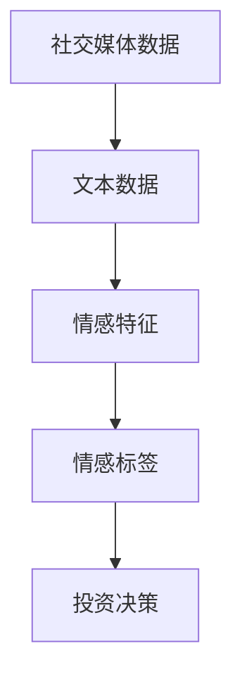
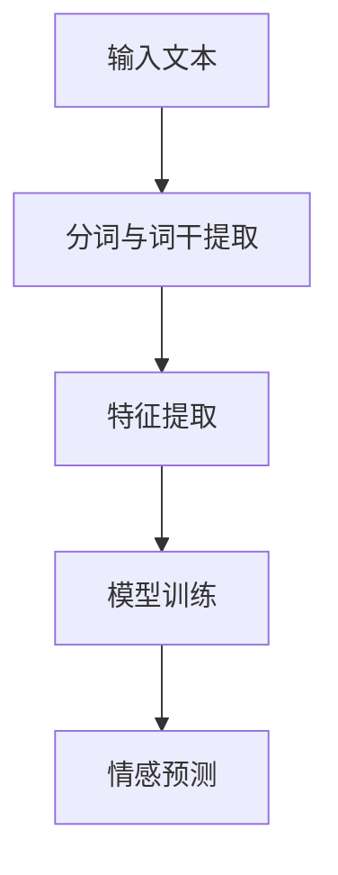
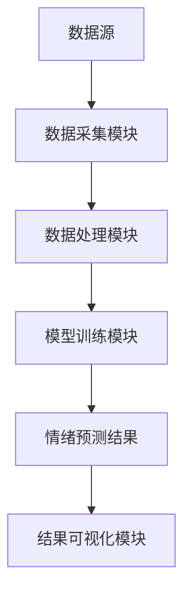

                 


# AI协作分析社交媒体情绪：增强价值投资的时机选择

> 关键词：社交媒体情绪分析，人工智能，价值投资，时机选择，情感计算，大数据分析，自然语言处理

> 摘要：本文探讨了如何利用人工智能协作分析社交媒体情绪，以增强价值投资的时机选择。通过分析社交媒体数据中的情绪信息，结合自然语言处理和大数据分析技术，投资者可以更准确地判断市场情绪，优化投资决策。文章从社交媒体情绪分析的基础概念、核心算法、系统架构到实际应用案例，详细阐述了如何将AI技术应用于价值投资，并通过实例分析展示了其在实践中的有效性。

---

## 第一部分：社交媒体情绪分析的基础

### 第1章：社交媒体数据与AI协作分析概述

#### 1.1 社交媒体数据的特点

- **数据的多样性**：社交媒体数据包括文本、图片、视频等多种形式，其中文本数据是最主要的分析对象。
- **数据的实时性和动态性**：社交媒体数据实时更新，具有高度的动态性，能够反映市场的即时情绪变化。
- **数据的噪声和干扰**：社交媒体数据中存在大量噪声，如拼写错误、表情符号、 slang 等，增加了数据处理的难度。

#### 1.2 AI在社交媒体情绪分析中的作用

- **情绪分析的定义与目标**：情绪分析是指通过自然语言处理技术，识别和分类文本中的情感倾向。其目标是将社交媒体上的文本数据转化为可量化的指标，用于辅助投资决策。
- **AI协作分析的优势**：AI能够快速处理海量数据，提取情绪特征，并通过机器学习模型预测市场情绪，帮助投资者发现潜在的投资机会。
- **情绪分析在投资中的潜在价值**：情绪分析可以帮助投资者捕捉市场情绪的变化，提前发现市场的波动趋势，从而优化投资策略。

#### 1.3 价值投资与时机选择的背景

- **价值投资的基本概念**：价值投资是一种投资策略，旨在通过寻找被市场低估的资产，长期持有以获得超额收益。
- **投资时机选择的重要性**：投资时机的选择对投资收益有着重要影响，尤其是在市场波动较大的情况下，选择合适的时机能够显著提高投资回报。
- **社交媒体情绪对投资决策的影响**：社交媒体上的情绪信息能够反映市场的乐观或悲观情绪，从而对投资决策产生影响。

---

## 第二部分：情绪分析的核心概念与联系

### 第2章：情绪分析的核心概念

#### 2.1 情绪分析的数据预处理

- **文本清洗与标准化**：去除无关字符、统一文本格式、处理大小写等。
- **分词与词干提取**：将文本分割成词语，并进行词干提取，减少词汇的多样性。
- **停用词处理与词袋模型**：去除常见停用词（如“的”、“是”等），构建词袋模型，为后续分析提供基础。

#### 2.2 情感特征提取

- **词袋模型与TF-IDF**：词袋模型将文本表示为词频向量，TF-IDF进一步加权，突出重要词汇。
- **词嵌入模型（如Word2Vec）**：通过训练语料库，生成词向量表示，捕捉词语的语义信息。
- **情感倾向特征提取**：基于词袋模型或词嵌入模型，提取与情感倾向相关的特征。

#### 2.3 情感分析模型的选择

- **基于传统机器学习的模型**：如SVM、随机森林等，适用于小规模数据，易于解释。
- **深度学习模型（如RNN、LSTM）**：适用于大规模数据，能够捕捉长距离依赖关系，但计算复杂度较高。
- **模型性能评估指标**：如准确率、召回率、F1分数等，用于评估模型的性能。

#### 2.4 情感分析的实体关系图



---

## 第三部分：情绪分析的算法原理

### 第3章：情绪分析的算法原理

#### 3.1 基于RNN的情感分析模型

- **RNN的基本原理**：循环神经网络通过处理序列数据，捕捉文本的时序信息。
- **LSTM的结构与优势**：长短期记忆网络通过门控机制，有效解决RNN的梯度消失问题，适用于长文本的情感分析。
- **情感分类的实现流程**：包括数据预处理、特征提取、模型训练和预测等步骤。

#### 3.2 基于SVM的情感分类

- **SVM的基本原理**：支持向量机通过构建超平面，将数据分成不同类别。
- **核函数的选择与应用**：使用核函数将低维数据映射到高维空间，提高分类性能。
- **SVM在情感分类中的优势**：分类准确率高，适合小规模数据集。

#### 3.3 情感分析的数学模型

- **情感分类的条件概率公式**：
  $$ P(y|x) = \frac{P(x|y)P(y)}{P(x)} $$
- **LSTM的长短期记忆机制**：
  $$ f(t) = \sigma(W_f \cdot [h_{t-1}, x_t] + b_f) $$

#### 3.4 算法流程图



---

## 第四部分：社交媒体情绪分析在金融领域的应用

### 第4章：社交媒体情绪与金融市场

#### 4.1 市场情绪分析的基本概念

- **市场情绪的定义**：市场情绪是指投资者对市场的整体看法和态度，通常通过情绪指标量化。
- **社交媒体情绪与市场情绪的关系**：社交媒体上的情绪信息能够反映市场的乐观或悲观情绪，影响市场的走势。

#### 4.2 情感分析在投资决策中的应用

- **情绪指标的构建**：基于社交媒体数据，构建情绪指数，量化市场情绪。
- **情绪指数与投资策略**：根据情绪指数的变化，优化投资策略，选择合适的投资时机。

#### 4.3 价值投资中的情绪分析

- **情绪分析对价值投资的影响**：通过分析社交媒体情绪，识别市场情绪的变化，优化价值投资策略。
- **情绪分析与价值投资的结合**：情绪分析可以帮助投资者发现市场情绪的变化，从而更好地判断资产的价值。

---

## 第五部分：社交媒体情绪分析系统的架构设计

### 第5章：系统架构设计

#### 5.1 系统功能设计

- **数据采集模块**：实时采集社交媒体数据，包括文本、图片、视频等。
- **数据处理模块**：对采集的数据进行清洗、分词和特征提取，为后续分析提供基础。
- **模型训练与预测模块**：基于训练好的情感分析模型，预测市场情绪，生成情绪指数。
- **结果可视化模块**：将预测结果可视化，便于投资者理解和使用。

#### 5.2 系统架构图



---

## 第六部分：项目实战

### 第6章：项目实战与案例分析

#### 6.1 项目环境安装

- **安装必要的库**：如Python的自然语言处理库（NLTK、spaCy）、深度学习框架（TensorFlow、Keras）等。
- **数据集准备**：获取社交媒体数据集，进行清洗和标注。

#### 6.2 系统核心实现

- **数据预处理代码**：
  ```python
  import pandas as pd
  from sklearn.feature_extraction.text import TfidfVectorizer

  df = pd.read_csv('social_media_data.csv')
  vectorizer = TfidfVectorizer()
  X = vectorizer.fit_transform(df['text'])
  ```

- **模型训练代码**：
  ```python
  from sklearn.svm import SVC
  model = SVC()
  model.fit(X, df['label'])
  ```

- **结果可视化代码**：
  ```python
  import matplotlib.pyplot as plt

  plt.plot(history.history['accuracy'], label='accuracy')
  plt.plot(history.history['loss'], label='loss')
  plt.legend()
  plt.show()
  ```

#### 6.3 实际案例分析

- **案例背景**：分析某次市场波动期间的社交媒体情绪变化。
- **数据处理与分析**：提取相关文本数据，进行情绪分析，生成情绪指数。
- **结果解读**：结合情绪指数和市场走势，分析情绪对投资决策的影响。

#### 6.4 项目小结

- **项目总结**：通过实战项目，验证了社交媒体情绪分析在价值投资中的有效性。
- **经验与教训**：数据预处理的重要性，模型调优的必要性，结果可视化的重要性。

---

## 第七部分：总结与展望

### 第7章：总结与展望

#### 7.1 研究总结

- **社交媒体情绪分析的核心价值**：通过分析社交媒体数据，帮助投资者捕捉市场情绪变化，优化投资策略。
- **技术总结**：结合自然语言处理、大数据分析和机器学习技术，构建高效的社交媒体情绪分析系统。

#### 7.2 未来展望

- **技术进步**：随着AI技术的发展，社交媒体情绪分析将更加精准，应用范围将更加广泛。
- **应用场景扩展**：除了金融领域，社交媒体情绪分析还可应用于市场营销、品牌管理等领域。
- **挑战与机遇**：数据隐私、模型解释性等挑战需要进一步解决，同时，技术进步也将带来新的投资机会。

---

通过本文的分析，我们深入探讨了AI协作分析社交媒体情绪的方法，及其在价值投资中的应用。结合理论与实践，我们展示了如何利用社交媒体情绪分析技术，优化投资决策，抓住投资时机，实现价值增长。未来，随着技术的不断进步，社交媒体情绪分析将在投资领域发挥更大的作用，为投资者提供更精准的决策支持。

