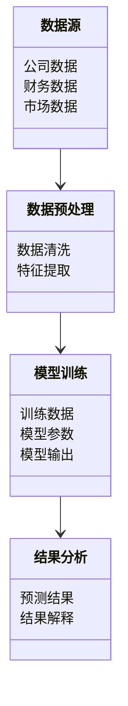
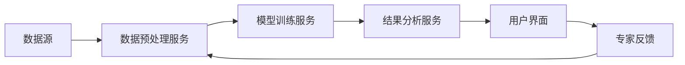
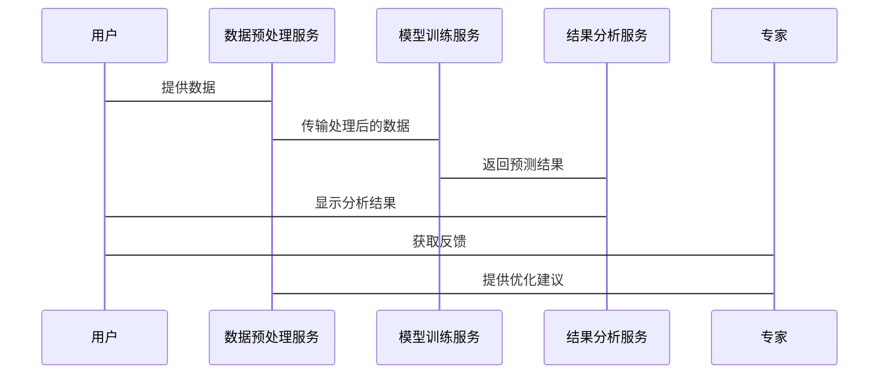

                 


### 第4章: 系统分析与架构设计

#### 4.1 系统分析
- 问题场景：AI协作预测系统需要处理大量数据，提供实时预测和反馈。
- 项目介绍：构建一个基于AI的公司成长性预测系统，整合历史数据、财务指标和市场动态，通过机器学习模型进行预测，并结合专家意见优化结果。

#### 4.2 系统功能设计
- 领域模型：使用Mermaid类图展示系统主要组件和交互。



#### 4.3 系统架构设计
- 使用Mermaid架构图展示系统的主要组件和交互流程。



#### 4.4 系统接口设计
- 接口1：数据预处理接口
- 接口2：模型训练接口
- 接口3：结果分析接口
- 接口4：专家反馈接口

#### 4.5 系统交互流程
- 使用Mermaid序列图展示用户与系统之间的交互流程。



### 第5章: 项目实战

#### 5.1 环境安装
- 安装Python和必要的库：`pip install numpy pandas scikit-learn`

#### 5.2 核心实现代码

```python
import numpy as np
import pandas as pd
from sklearn.model import LinearRegression

# 数据预处理
def preprocess_data(data):
    data.dropna(inplace=True)
    data = pd.get_dummies(data)
    return data

# 模型训练
def train_model(X, y):
    model = LinearRegression()
    model.fit(X, y)
    return model

# 预测与评估
def evaluate_model(model, X_test, y_test):
    y_pred = model.predict(X_test)
    return y_pred, y_test

# 主函数
def main():
    # 加载数据
    data = pd.read_csv('company_growth.csv')
    processed_data = preprocess_data(data)
    X = processed_data.drop('target', axis=1)
    y = processed_data['target']
    # 训练模型
    model = train_model(X, y)
    # 预测与评估
    y_pred, y_test = evaluate_model(model, X, y)
    print('预测结果:', y_pred)
    print('真实结果:', y_test)

if __name__ == '__main__':
    main()
```

#### 5.3 代码解读与分析
- 数据预处理：清洗数据并进行独热编码。
- 模型训练：使用线性回归模型进行训练。
- 预测与评估：对测试数据进行预测，并输出结果。

#### 5.4 案例分析
- 数据来源：公司财务数据、市场数据等。
- 模型训练：使用历史数据训练模型。
- 结果分析：对比预测结果与实际值，评估模型性能。

### 第6章: 总结与展望

#### 6.1 总结
- AI协作预测系统的优势：高效性、准确性。
- 实战案例的价值：验证模型的有效性。

#### 6.2 未来展望
- 模型优化：引入更复杂的算法，如神经网络。
- 数据源扩展：加入更多维度的数据。
- 应用场景拓展：在其他领域进行应用。

### 第7章: 小结

#### 7.1 小结
- 通过AI协作预测系统，我们可以更准确地预测公司成长性，辅助价值投资决策。

### 第8章: 注意事项

#### 8.1 注意事项
- 数据质量：确保数据准确可靠。
- 模型选择：根据实际情况选择合适的算法。
- 结果解释：结合业务背景分析预测结果。

### 第9章: 拓展阅读

#### 9.1 拓展阅读建议
- 《机器学习实战》
- 《深度学习》
- 《金融数据分析与建模》

### 总结
通过本文，我们详细探讨了AI协作预测公司成长性的各个方面，从理论到实践，从算法到系统设计，为价值投资者提供了有力的工具。未来，随着技术的进步，AI在金融领域的应用将更加广泛和深入。

