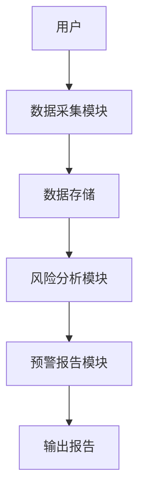

                 


# AI在企业并购整合风险预警中的应用与挑战

## 关键词：企业并购，AI技术，风险预警，机器学习，自然语言处理

## 摘要：  
随着企业并购活动的频繁增加，整合过程中的风险也随之上升。本文探讨了人工智能（AI）技术在企业并购整合风险预警中的应用，分析了AI在数据处理、风险识别和预测模型构建中的优势与挑战。通过详细的技术分析和案例研究，本文揭示了AI如何帮助企业提前识别潜在风险，优化整合策略，从而提升并购成功率。

---

# 第1章: 企业并购整合风险预警的背景与挑战

## 1.1 企业并购的基本概念

### 1.1.1 企业并购的定义  
企业并购（Mergers and Acquisitions，M&A）是指两个或多个企业之间的合并或收购行为。并购整合则是指在并购后，将双方的资源、业务、文化等进行整合的过程。  

### 1.1.2 并购的类型与特点  
- **横向并购**：同一行业内的企业并购，旨在扩大市场份额。  
- **纵向并购**：上下游企业之间的并购，优化供应链。  
- **混合并购**：跨行业并购，寻求多元化发展。  

### 1.1.3 并购整合的必要性与挑战  
- **必要性**：通过整合优化资源配置，提高效率。  
- **挑战**：文化冲突、管理整合、业务协同难度大。  

---

## 1.2 企业并购整合中的风险

### 1.2.1 并购失败的主要原因  
- **战略风险**：并购目标不清晰。  
- **财务风险**：高负债、估值偏差。  
- **整合风险**：组织文化冲突、管理不善。  

### 1.2.2 风险预警的重要性  
通过预警系统，企业可以提前发现潜在风险，采取措施降低损失。  

### 1.2.3 风险预警的核心目标  
- 提供实时风险评估。  
- 辅助决策，优化整合策略。  

---

## 1.3 AI技术在企业并购中的应用前景

### 1.3.1 AI技术的基本概念  
人工智能（AI）是指计算机模拟人类智能的技术，涵盖机器学习、自然语言处理等领域。  

### 1.3.2 AI在企业并购中的潜在应用场景  
- 数据分析与预测。  
- 文本挖掘与情感分析。  
- 风险建模与评估。  

### 1.3.3 AI技术对企业并购整合风险预警的推动作用  
- 提高数据分析效率。  
- 实现精准预测与实时监控。  

---

## 1.4 本章小结  
本章介绍了企业并购的基本概念、整合中的风险以及AI技术的应用前景，为后续内容奠定了基础。  

---

# 第2章: AI技术的核心概念与原理

## 2.1 机器学习的基本原理

### 2.1.1 机器学习的定义与分类  
机器学习是一种通过数据训练模型的技术，分为监督学习、无监督学习和强化学习。  

### 2.1.2 监督学习、无监督学习与强化学习  
- **监督学习**：基于标记数据进行训练，如线性回归。  
- **无监督学习**：基于未标记数据发现模式，如聚类分析。  
- **强化学习**：通过奖励机制优化决策，如游戏AI。  

### 2.1.3 机器学习的核心算法  
- 线性回归：用于预测连续值。  
- 支持向量机（SVM）：用于分类与回归。  
- 随机森林：基于决策树的集成方法。  

---

## 2.2 自然语言处理（NLP）的基本原理

### 2.2.1 NLP的定义与应用领域  
NLP是计算机处理自然语言的技术，应用于文本分类、情感分析等。  

### 2.2.2 分词、句法分析与语义理解  
- **分词**：将文本分割成词语或短语。  
- **句法分析**：分析句子结构。  
- **语义理解**：理解文本的含义。  

### 2.2.3 常见的NLP算法与工具  
- **分词工具**：jieba、NLTK。  
- **情感分析算法**：基于机器学习的分类模型。  

---

## 2.3 数据挖掘与分析的基本原理

### 2.3.1 数据挖掘的定义与流程  
数据挖掘是从大量数据中提取有价值信息的过程，包括数据清洗、特征提取和建模。  

### 2.3.2 数据清洗、特征提取与建模  
- **数据清洗**：处理缺失值和异常值。  
- **特征提取**：选择对目标影响大的特征。  
- **建模**：使用机器学习算法训练模型。  

### 2.3.3 可视化分析与结果解读  
- 使用图表展示数据分布和趋势。  
- 通过可视化工具辅助决策。  

---

## 2.4 本章小结  
本章介绍了机器学习、NLP和数据挖掘的基本原理，为后续AI在企业并购中的应用提供了技术基础。  

---

# 第3章: AI在企业并购整合风险预警中的解决方案

## 3.1 风险预警的核心要素

### 3.1.1 并购前的尽职调查  
- 财务数据审查。  
- 业务模式分析。  

### 3.1.2 并购后的整合管理  
- 人员整合。  
- 业务协同。  

### 3.1.3 风险因素的分类与权重  
- 人员风险。  
- 业务风险。  
- 财务风险。  

---

## 3.2 AI在风险预警中的核心应用

### 3.2.1 数据采集与处理  
- 数据来源：财务报表、新闻报道、社交媒体。  
- 数据清洗：处理缺失值和噪声。  

### 3.2.2 风险因素识别与分析  
- 使用NLP分析文本数据，提取关键词和情感倾向。  
- 通过机器学习识别高风险因素。  

### 3.2.3 风险预测模型的构建与优化  
- 选择合适的算法（如逻辑回归）。  
- 优化模型参数，提高准确率。  

---

## 3.3 基于AI的风险预警系统架构

### 3.3.1 系统的整体架构设计  
- 数据层：存储和处理数据。  
- 算法层：实现风险预测算法。  
- 应用层：提供用户界面和预警报告。  

### 3.3.2 数据流与信息处理流程  
- 数据采集 → 数据清洗 → 特征提取 → 模型训练 → 预警输出。  

### 3.3.3 系统的输入输出与交互方式  
- 输入：企业数据、外部新闻。  
- 输出：风险预警报告。  

---

## 3.4 本章小结  
本章详细介绍了AI在企业并购整合风险预警中的解决方案，包括数据处理、模型构建和系统架构设计。  

---

# 第4章: 基于机器学习的风险预测算法

## 4.1 机器学习在风险预测中的应用

### 4.1.1 线性回归与逻辑回归  
- **线性回归**：用于预测连续值。  
- **逻辑回归**：用于分类问题。  

### 4.1.2 支持向量机（SVM）  
- 适用于小规模数据分类。  

### 4.1.3 随机森林与梯度提升树  
- **随机森林**：集成学习方法，适合高维数据。  
- **梯度提升树**：基于决策树的优化方法。  

---

## 4.2 基于深度学习的风险预测模型

### 4.2.1 神经网络的基本原理  
- **神经网络**：模拟人脑神经元的结构和功能。  

### 4.2.2 卷积神经网络（CNN）与循环神经网络（RNN）  
- **CNN**：适合图像识别。  
- **RNN**：适合序列数据处理。  

### 4.2.3 Transformer架构的应用  
- 基于注意力机制，适用于大规模数据处理。  

---

## 4.3 算法选择与优化策略

### 4.3.1 算法性能评估指标  
- 准确率、召回率、F1值。  

### 4.3.2 超参数调优与模型优化  
- 使用网格搜索或随机搜索进行调优。  

### 4.3.3 模型的泛化能力与鲁棒性  
- 通过交叉验证评估模型的泛化能力。  

---

## 4.4 本章小结  
本章分析了多种机器学习算法在风险预测中的应用，重点介绍了深度学习模型的优势。  

---

# 第5章: 系统架构与实现方案

## 5.1 系统整体架构设计

### 5.1.1 数据层架构  
- 数据库设计：关系型数据库存储结构化数据，NoSQL数据库存储非结构化数据。  

### 5.1.2 算法层架构  
- 模型训练：在训练数据上训练模型。  
- 模型部署：将模型部署到生产环境。  

### 5.1.3 应用层架构  
- 用户界面：提供预警报告的可视化界面。  
- 接口设计：与第三方数据源对接。  

---

## 5.2 系统功能模块设计

### 5.2.1 数据采集模块  
- 从多种数据源采集数据，如API接口、文件导入。  

### 5.2.2 风险分析模块  
- 使用NLP和机器学习算法分析数据，生成风险报告。  

### 5.2.3 预警报告模块  
- 生成实时预警报告，提供风险应对建议。  

---

## 5.3 系统架构图  



---

## 5.4 接口设计与交互流程

### 5.4.1 系统接口设计  
- 数据接口：与数据源对接，获取实时数据。  
- API接口：提供风险预警服务。  

### 5.4.2 系统交互流程  
- 用户提交请求。  
- 系统处理数据并生成报告。  
- 用户查看报告并采取行动。  

---

## 5.5 本章小结  
本章详细描述了系统架构设计和功能模块实现，展示了AI在企业并购整合风险预警中的具体应用。  

---

# 第6章: 项目实战与案例分析

## 6.1 项目背景与目标

### 6.1.1 项目背景  
- 某企业计划并购一家目标公司，需要进行风险评估。  

### 6.1.2 项目目标  
- 使用AI技术构建风险预警模型，辅助决策。  

---

## 6.2 系统核心实现源代码

### 6.2.1 数据预处理代码  

```python
import pandas as pd

# 加载数据
data = pd.read_csv('并购数据.csv')

# 处理缺失值
data = data.dropna()

# 标准化处理
from sklearn.preprocessing import StandardScaler
scaler = StandardScaler()
scaled_data = scaler.fit_transform(data)
```

### 6.2.2 模型训练代码  

```python
from sklearn.model import LogisticRegression

# 训练模型
model = LogisticRegression()
model.fit(scaled_data, target)

# 预测结果
predictions = model.predict(test_data)
```

### 6.2.3 模型评估代码  

```python
from sklearn.metrics import accuracy_score, precision_score, recall_score

# 计算准确率、精确率、召回率
accuracy = accuracy_score(y_true, predictions)
precision = precision_score(y_true, predictions)
recall = recall_score(y_true, predictions)

print(f"准确率: {accuracy}")
print(f"精确率: {precision}")
print(f"召回率: {recall}")
```

---

## 6.3 案例分析与详细解读

### 6.3.1 案例背景  
某企业并购案例中，目标公司存在财务造假风险。  

### 6.3.2 数据分析与模型预测  
- 使用NLP分析新闻数据，发现负面情绪指数较高。  
- 模型预测并购后的整合风险较高。  

### 6.3.3 预警报告与决策建议  
- 提示潜在风险，建议进行深入调查。  
- 调整整合策略，降低风险。  

---

## 6.4 本章小结  
本章通过实际案例展示了AI在企业并购整合风险预警中的应用，验证了模型的有效性。  

---

# 第7章: 总结、最佳实践与未来展望

## 7.1 总结  
本文详细探讨了AI在企业并购整合风险预警中的应用，从技术原理到系统实现，展示了AI如何助力企业降低整合风险。  

---

## 7.2 最佳实践 Tips

### 7.2.1 数据质量管理  
- 确保数据准确性和完整性。  

### 7.2.2 模型优化与更新  
- 定期更新模型，保持预测能力。  

### 7.2.3 人员培训与协作  
- 提高相关人员的技术能力，促进跨部门协作。  

---

## 7.3 注意事项

### 7.3.1 数据隐私与合规性  
- 遵守数据保护法规，确保数据安全。  

### 7.3.2 模型局限性  
- AI模型无法完全预测所有风险，需结合人工判断。  

---

## 7.4 未来展望

### 7.4.1 技术进步  
- 更先进的算法和更大规模的数据将提升模型性能。  

### 7.4.2 应用扩展  
- AI技术将应用于更多领域，如企业战略规划和风险管理。  

---

# 结语  
企业并购整合是一项复杂且高风险的活动，AI技术的应用为企业提供了强大的工具，帮助其在风险预警和整合管理中做出更明智的决策。未来，随着技术的不断进步，AI将在企业并购中发挥更大的作用。  

---

# 参考文献  
[此处列出相关的书籍、论文和资料]  

---

通过以上章节的详细分析与实战案例，本文为读者提供了全面的视角，展示了AI在企业并购整合风险预警中的巨大潜力与实际应用价值。

