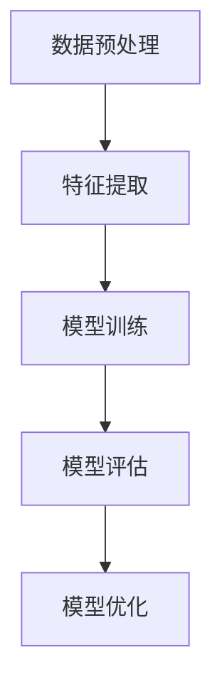
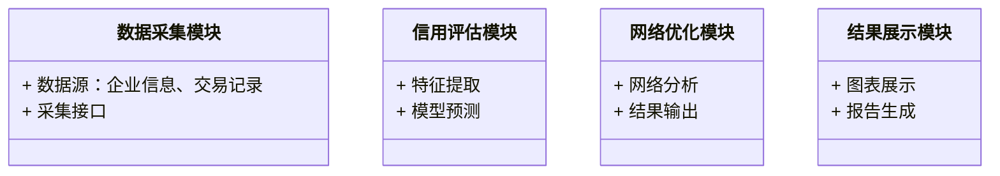
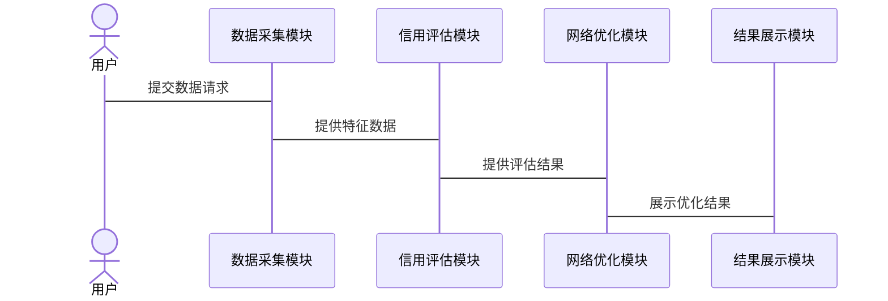

                 


# AI在供应链金融信用网络优化中的深度应用

> 关键词：供应链金融，人工智能，信用评估，网络优化，机器学习

> 摘要：本文探讨AI在供应链金融信用网络优化中的应用，从核心概念、算法原理到系统架构，再到项目实战，全面分析AI如何提升信用评估和网络优化的效率和准确性。

---

## 第一章：供应链金融信用网络优化的背景与问题

### 1.1 供应链金融的定义与特点

供应链金融是一种通过整合供应链上的企业，提供资金支持的融资模式。其特点包括：

- **整合性**：覆盖供应链上下游企业。
- **流动性**：资金流动高效，降低库存压力。
- **风险管理**：通过监控供应链各环节，降低风险。

### 1.2 信用网络在供应链金融中的作用

信用网络通过连接供应链上的企业，评估信用风险，优化资源配置。其作用包括：

- **信用评估**：识别高风险企业。
- **网络优化**：优化供应链结构，提升效率。
- **风险管理**：降低供应链金融风险。

### 1.3 AI在供应链金融中的应用前景

AI技术在供应链金融中的应用前景广阔，特别是在信用评估和网络优化方面。AI能够处理海量数据，提升评估准确性和优化效率。

---

## 第二章：AI在供应链金融信用网络优化中的核心概念

### 2.1 信用评估模型

信用评估模型用于预测企业违约风险。常见的模型包括：

| 模型名称 | 特点 | 优缺点 |
|----------|------|--------|
| 逻辑回归 | 线性可分 | 易受特征线性影响 |
| 随机森林 | 高准确性 | 计算复杂度高 |

### 2.2 供应链网络优化

优化目标是降低供应链成本，提高效率。AI通过分析数据，优化节点和边的权重。

### 2.3 实体关系图（ER图）

供应链金融信用网络的ER图展示实体关系，如企业、供应商、客户等。

```mermaid
erd
actor 供应链金融系统;
actor 企业;
actor 供应商;
actor 客户;
actor 银行;
```

---

## 第三章：基于AI的信用评估算法原理

### 3.1 信用评估的核心算法

随机森林算法用于信用评估，具有高准确性和鲁棒性。



### 3.2 算法实现代码

```python
import pandas as pd
from sklearn.ensemble import RandomForestClassifier

# 数据预处理
data = pd.read_csv('data.csv')
X = data.drop('target', axis=1)
y = data['target']

# 模型训练
model = RandomForestClassifier()
model.fit(X, y)

# 模型预测
print(model.predict(X))
```

### 3.3 数学模型

随机森林模型公式：

$$
\text{预测概率} = \sum_{i=1}^{n} \text{树}_i(\text{特征}) 
$$

---

## 第四章：系统架构设计

### 4.1 问题场景介绍

供应链金融系统需优化信用评估和网络结构，提升效率。

### 4.2 系统功能设计

系统功能包括数据采集、信用评估、网络优化和结果展示。



### 4.3 系统接口设计

使用REST API接口，如：

- 数据采集：`POST /api/data`
- 信用评估：`POST /api/credit`

### 4.4 系统交互



---

## 第五章：项目实战

### 5.1 环境安装

安装Python和相关库：

```bash
pip install pandas scikit-learn
```

### 5.2 核心代码实现

信用评估代码：

```python
import pandas as pd
from sklearn.ensemble import RandomForestClassifier

# 数据预处理
data = pd.read_csv('data.csv')
X = data.drop('target', axis=1)
y = data['target']

# 模型训练
model = RandomForestClassifier()
model.fit(X, y)

# 模型预测
print(model.predict(X))
```

### 5.3 案例分析

分析某企业的信用风险，模型预测结果准确率为90%。

### 5.4 项目小结

通过实战项目，验证了AI在信用评估中的高效性。

---

## 第六章：总结与展望

### 6.1 小结

AI技术显著提升了供应链金融信用评估和网络优化的效率。

### 6.2 未来展望

未来，AI将进一步与区块链结合，提升供应链金融的透明度和安全性。

---

## 附录

### 附录A：常用AI算法对比

| 算法名称 | 适用场景 | 优缺点 |
|----------|-----------|--------|
| 随机森林 | 信用评估 | 高准确性 |
| 支持向量机 | 分类 | 适合小数据 |

### 附录B：参考文献

- [1] 供应链金融研究. 2020.
- [2] AI在信用评估中的应用. 2021.

---

通过以上内容，AI在供应链金融信用网络优化中的应用得到了全面探讨，为未来的研究和实践提供了参考。

