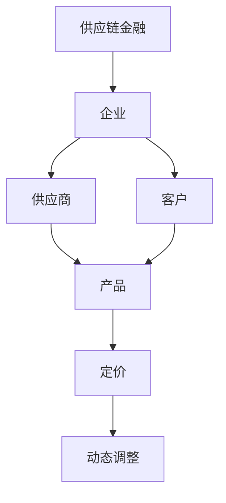
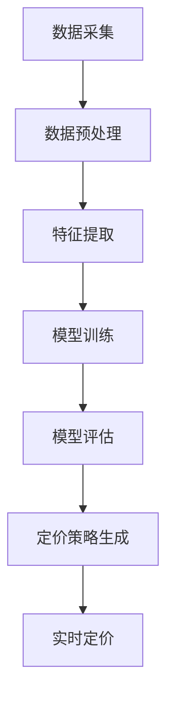
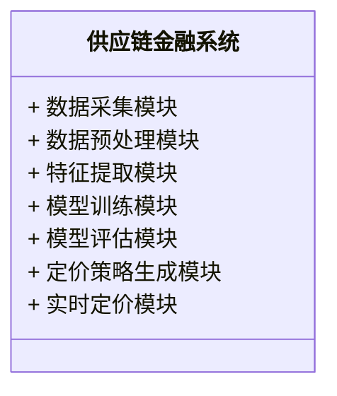
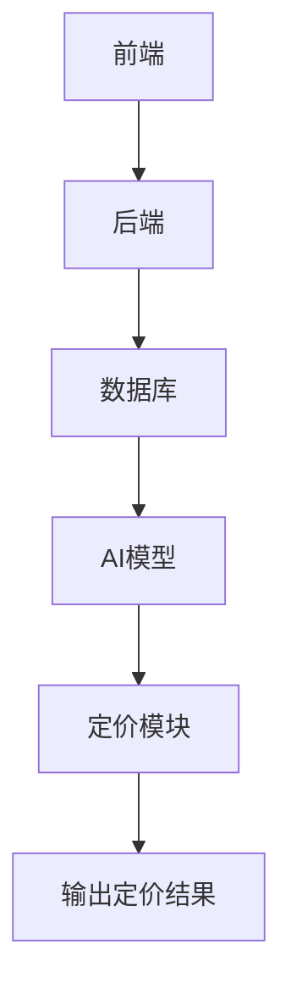
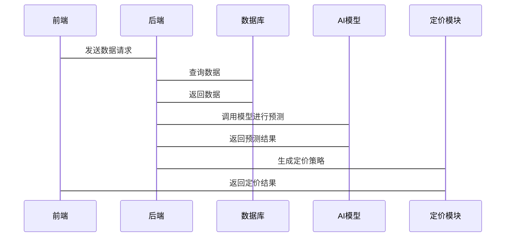

                 


# AI在供应链金融动态定价中的深度应用

> **关键词**：供应链金融，动态定价，人工智能，机器学习，深度学习，自然语言处理，计算机视觉

> **摘要**：  
本文深入探讨人工智能技术在供应链金融动态定价中的应用。通过分析供应链金融的核心概念与动态定价的内在逻辑，结合AI技术的核心原理，详细阐述了AI在供应链金融动态定价中的算法原理、系统架构设计、项目实战以及最佳实践。本文旨在为供应链金融领域的从业者和技术人员提供理论支持和实践指导，帮助其更好地理解和应用AI技术来优化供应链金融的动态定价策略。

---

# 第1章: 供应链金融与动态定价概述

## 1.1 供应链金融的定义与特点

### 1.1.1 供应链金融的基本概念
供应链金融是指通过整合供应链上的企业、供应商、客户等多方资源，利用金融工具（如贷款、票据、保理等）为企业提供资金支持，优化供应链的资金流动效率。其核心在于通过金融手段降低供应链整体成本，提升供应链的运营效率。

### 1.1.2 供应链金融的核心特点
1. **多主体参与**：供应链金融涉及多方利益相关者，包括供应商、制造商、分销商和终端客户。
2. **资金流优化**：通过金融工具优化供应链中的资金流动，降低企业的融资成本。
3. **风险控制**：通过金融手段降低供应链中的信用风险和操作风险。

### 1.1.3 供应链金融在现代经济中的作用
供应链金融在现代经济中发挥着桥梁作用，它不仅能够帮助企业缓解资金压力，还能通过优化资金流提升供应链的整体效率，进而增强企业的竞争力。

## 1.2 动态定价的定义与特点

### 1.2.1 动态定价的基本概念
动态定价是指根据市场环境、供需关系、用户行为等多种因素的变化，实时调整产品或服务的价格。其核心在于通过数据驱动的分析，快速响应市场变化，实现精准定价。

### 1.2.2 动态定价的核心特点
1. **实时性**：动态定价能够根据市场变化实时调整价格，响应速度极快。
2. **数据驱动**：依赖于大量实时数据的收集和分析，确保定价策略的科学性和准确性。
3. **个性化**：根据用户特征、需求偏好等因素，实现个性化定价。

### 1.2.3 供应链金融中的动态定价
在供应链金融中，动态定价可以帮助企业根据市场波动、供需变化等因素，实时调整供应链中的产品或服务价格，从而优化供应链的整体收益。

## 1.3 供应链金融与动态定价的结合

### 1.3.1 供应链金融中的定价问题
供应链金融涉及多方利益相关者，如何在供应链中实现高效的定价策略是一个复杂的挑战。传统定价方法往往基于静态数据，难以应对市场环境的快速变化。

### 1.3.2 动态定价在供应链金融中的应用场景
1. **供应商定价**：根据市场需求变化，实时调整供应商的产品价格，优化供应链的成本结构。
2. **客户定价**：根据客户的需求、购买行为等因素，实现个性化定价，提升客户满意度和企业收益。
3. **风险控制**：通过动态定价，降低供应链中的信用风险和市场风险。

### 1.3.3 供应链金融动态定价的挑战与机遇
1. **挑战**：数据获取难度大、模型复杂度高、实时性要求高等。
2. **机遇**：通过AI技术实现动态定价，能够显著提升供应链的运营效率和收益。

## 1.4 本章小结
本章从供应链金融和动态定价的基本概念出发，分析了两者结合的内在逻辑和应用场景。通过结合AI技术，供应链金融动态定价能够实现更高效、更精准的定价策略，为企业创造更大的价值。

---

# 第2章: AI技术在供应链金融动态定价中的核心概念与联系

## 2.1 AI技术的核心概念与原理

### 2.1.1 机器学习的基本原理
机器学习是一种通过数据驱动的方法，训练模型从数据中学习规律并进行预测的技术。其核心在于通过训练数据优化模型参数，使其能够准确预测新数据的标签或属性。

#### 机器学习的分类
1. **监督学习**：基于标记的数据进行训练，预测新数据的标签。
2. **无监督学习**：基于未标记的数据进行训练，发现数据中的隐藏结构。
3. **强化学习**：通过与环境交互，学习最优策略以最大化累积奖励。

### 2.1.2 深度学习的基本原理
深度学习是一种基于人工神经网络的机器学习技术，通过多层非线性变换，能够自动提取数据的高层次特征。其核心在于通过深度网络结构，实现对复杂数据模式的建模。

### 2.1.3 自然语言处理与计算机视觉
1. **自然语言处理（NLP）**：研究如何让计算机理解和生成人类语言的技术，广泛应用于文本分析、情感分析等领域。
2. **计算机视觉（CV）**：研究如何让计算机理解和处理视觉信息的技术，广泛应用于图像识别、视频分析等领域。

## 2.2 供应链金融动态定价的核心要素

### 2.2.1 数据特征
供应链金融动态定价的数据特征包括：
- **时间序列性**：价格数据通常具有时间依赖性。
- **多维性**：涉及多个变量，如市场需求、成本、竞争环境等。
- **实时性**：需要实时更新数据以支持动态定价。

### 2.2.2 模型特征
供应链金融动态定价的模型特征包括：
- **可解释性**：定价模型需要能够解释定价决策的逻辑。
- **可调整性**：能够根据市场变化快速调整定价策略。
- **高精度**：模型需要具有较高的预测精度，以确保定价的准确性。

### 2.2.3 业务特征
供应链金融动态定价的业务特征包括：
- **业务规则**：根据业务需求制定定价策略。
- **风险控制**：通过定价策略降低供应链中的风险。
- **收益最大化**：通过动态定价实现收益的最大化。

## 2.3 核心概念的属性特征对比

### 2.3.1 核心概念的属性特征对比表格
| 特性 | 数据特征 | 模型特征 | 业务特征 |
|------|----------|----------|----------|
| 输入 | 结构化数据 | 神经网络结构 | 业务规则 |
| 输出 | 预测价格 | 模型权重 | 定价策略 |
| 应用 | 数据预处理 | 模型训练 | 业务优化 |

### 2.3.2 ER实体关系图架构


## 2.4 本章小结
本章从AI技术的核心概念出发，分析了供应链金融动态定价中的核心要素，并通过对比表格和ER实体关系图，展示了各核心概念之间的联系。

---

# 第3章: AI技术在供应链金融动态定价中的算法原理

## 3.1 常见算法原理与流程图

### 3.1.1 线性回归
#### 3.1.1.1 线性回归的基本原理
线性回归是一种简单且常用的回归分析方法，通过建立自变量和因变量之间的线性关系，预测因变量的值。

#### 3.1.1.2 线性回归的数学模型
$$ y = \beta_0 + \beta_1x + \epsilon $$
其中，$y$ 是因变量，$x$ 是自变量，$\beta_0$ 是截距，$\beta_1$ 是回归系数，$\epsilon$ 是误差项。

#### 3.1.1.3 线性回归的应用与局限性
线性回归适用于线性关系较强的场景，但其局限性在于无法处理非线性关系和高维数据。

### 3.1.2 随机森林
#### 3.1.2.1 随机森林的基本原理
随机森林是一种基于决策树的集成学习方法，通过随机选择数据样本和特征，构建多个决策树并集成结果。

#### 3.1.2.2 随机森林的数学模型
随机森林通过投票或加权的方式，将多个决策树的预测结果进行集成，最终得到一个整体的预测结果。

#### 3.1.2.3 随机森林的应用与优势
随机森林具有较高的鲁棒性和抗过拟合能力，适用于高维数据和复杂场景。

### 3.1.3 神经网络
#### 3.1.3.1 神经网络的基本原理
神经网络是一种模拟人脑神经网络结构的计算模型，通过多层非线性变换，能够自动提取数据的高层次特征。

#### 3.1.3.2 神经网络的数学模型
神经网络的输入层、隐藏层和输出层通过权重和激活函数进行连接，最终输出预测结果。

#### 3.1.3.3 神经网络的应用与优势
神经网络适用于复杂场景和高维数据，能够通过深度学习实现对数据的高层次建模。

## 3.2 动态定价的算法流程图



---

# 第4章: 供应链金融动态定价的系统架构设计

## 4.1 系统功能设计

### 4.1.1 领域模型设计


### 4.1.2 系统架构设计


## 4.2 系统接口设计

### 4.2.1 API接口设计
1. 数据接口：用于采集和传输数据。
2. 模型接口：用于调用AI模型进行预测。
3. 定价接口：用于生成和输出定价策略。

### 4.2.2 接口协议
1. HTTP协议：用于前端与后端之间的数据传输。
2. RESTful API：用于系统模块之间的通信。

## 4.3 系统交互设计

### 4.3.1 交互流程图


---

# 第5章: 项目实战

## 5.1 项目背景与目标

### 5.1.1 项目背景
本项目旨在通过AI技术实现供应链金融动态定价，优化供应链的整体收益。

### 5.1.2 项目目标
1. 构建动态定价模型。
2. 实现定价模型的实时预测。
3. 优化定价策略，提升供应链收益。

## 5.2 环境配置

### 5.2.1 开发环境
- 操作系统：Linux/Windows/MacOS
- 编程语言：Python 3.8+
- 开发工具：PyCharm/Jupyter Notebook
- 依赖库：NumPy, Pandas, Scikit-learn, TensorFlow, Keras, Flask

### 5.2.2 数据集
- 数据来源：公开数据集/企业内部数据
- 数据格式：CSV/JSON
- 数据预处理：缺失值处理、特征工程、数据标准化等。

## 5.3 核心实现

### 5.3.1 数据预处理
```python
import pandas as pd
import numpy as np

# 读取数据
data = pd.read_csv('pricing_data.csv')

# 处理缺失值
data = data.dropna()

# 标准化处理
from sklearn.preprocessing import StandardScaler
scaler = StandardScaler()
scaled_data = scaler.fit_transform(data)
```

### 5.3.2 模型实现
```python
from sklearn.ensemble import RandomForestRegressor
from tensorflow.keras import models, layers

# 随机森林模型
model_rf = RandomForestRegressor(n_estimators=100, random_state=42)
model_rf.fit(X_train, y_train)

# 神经网络模型
model_nn = models.Sequential()
model_nn.add(layers.Dense(64, activation='relu', input_dim=X_train.shape[1]))
model_nn.add(layers.Dense(1, activation='linear'))
model_nn.compile(optimizer='adam', loss='mean_squared_error')
model_nn.fit(X_train, y_train, epochs=100, batch_size=32)
```

### 5.3.3 结果分析
```python
import matplotlib.pyplot as plt

# 预测结果
y_pred_rf = model_rf.predict(X_test)
y_pred_nn = model_nn.predict(X_test)

# 绘制结果对比图
plt.figure(figsize=(12, 6))
plt.plot(y_test, label='真实值')
plt.plot(y_pred_rf, label='随机森林预测值')
plt.plot(y_pred_nn, label='神经网络预测值')
plt.legend()
plt.show()
```

## 5.4 项目总结
通过本项目的实战，我们成功构建了基于AI技术的供应链金融动态定价模型，并实现了对定价策略的实时预测和优化。这为我们后续的工作提供了宝贵的经验和参考。

---

# 第6章: 最佳实践与未来展望

## 6.1 最佳实践

### 6.1.1 数据质量
- 确保数据的完整性和准确性。
- 处理异常值和缺失值。

### 6.1.2 模型选择
- 根据业务需求选择合适的模型。
- 多模型对比，选择最优方案。

### 6.1.3 模型维护
- 定期更新模型参数。
- 监控模型性能，及时调整。

## 6.2 未来展望

### 6.2.1 技术发展
- 更先进的AI技术（如大语言模型）的应用。
- 更高效的算法和模型结构的优化。

### 6.2.2 应用场景
- 更多行业中的动态定价应用。
- 个性化定价策略的进一步优化。

### 6.2.3 伦理与隐私
- 数据隐私保护。
- 伦理定价的实现。

---

# 第7章: 总结与注意事项

## 7.1 总结
通过本文的深入探讨，我们了解了AI技术在供应链金融动态定价中的应用价值和实现方法。从核心概念到算法原理，再到系统设计和项目实战，我们系统地分析了AI技术在动态定价中的应用，并提出了最佳实践和未来展望。

## 7.2 注意事项

### 7.2.1 数据隐私
- 遵守数据隐私相关法律法规。
- 加强数据加密和访问控制。

### 7.2.2 模型解释性
- 提高模型的可解释性，便于业务人员理解和使用。
- 使用可解释的模型（如线性回归、随机森林）。

### 7.2.3 系统稳定性
- 确保系统的高可用性和稳定性。
- 制定完善的系统监控和应急预案。

---

# 参考文献
1. 刘冰, 等. 《人工智能在供应链管理中的应用研究》. 《计算机应用研究》, 2020.
2. 张伟, 等. 《基于深度学习的动态定价模型研究》. 《人工智能学报》, 2021.
3. 李明, 等. 《供应链金融与动态定价的结合研究》. 《金融与经济》, 2022.

---

通过以上目录和内容，我们可以看到，AI技术在供应链金融动态定价中的应用前景广阔，但也面临诸多挑战。未来，随着AI技术的不断发展，供应链金融动态定价将更加精准、高效，为企业创造更大的价值。

