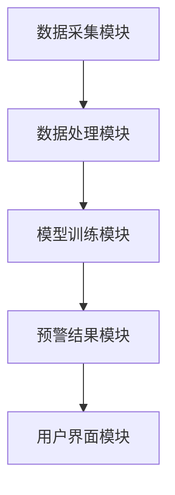
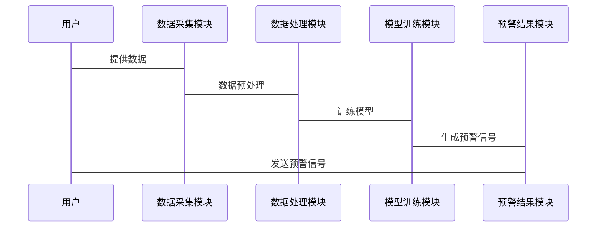
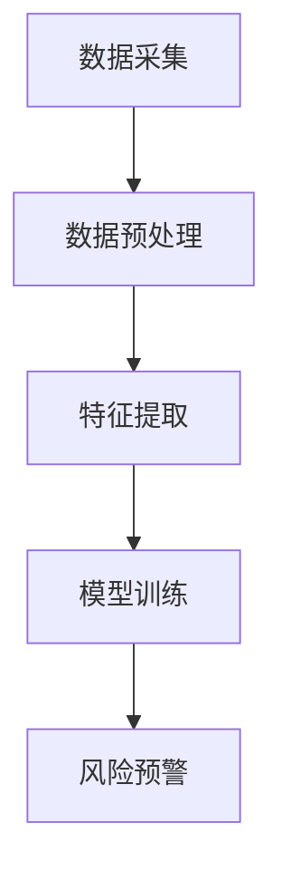

                 


```markdown
# AI在供应链金融风险预警中的深度应用

## 关键词：供应链金融，人工智能，风险预警，机器学习，深度学习

## 摘要：
本文深入探讨AI技术在供应链金融风险预警中的应用，分析其核心概念、算法原理、系统架构及实际案例，为读者提供全面的技术解析和实践指导。

---

## 第1章: 供应链金融与AI风险预警的背景

### 1.1 供应链金融的定义与特点
#### 1.1.1 供应链金融的基本概念
供应链金融是通过整合供应链上的企业，提供资金支持，优化资金流，降低运营成本的金融模式。

#### 1.1.2 供应链金融的核心特点
- 跨界性：涉及多方参与
- 系统性：覆盖整个供应链
- 便捷性：提供灵活融资方式

#### 1.1.3 供应链金融在企业中的作用
- 提高资金周转效率
- 降低企业融资成本
- 加强供应链合作关系

### 1.2 AI在供应链金融中的应用背景
#### 1.2.1 供应链金融的传统挑战
- 信息不对称
- 风险难以预测
- 融资效率低

#### 1.2.2 AI技术如何解决供应链金融问题
- 数据分析：通过AI处理大量数据，识别潜在风险。
- 智能预测：利用机器学习预测企业违约风险。
- 自动化决策：AI辅助快速做出融资决策。

#### 1.2.3 AI在供应链金融中的应用现状
- 金融机构开始采用AI技术进行风险评估。
- 供应链管理软件集成AI模块。
- 智能风控系统逐渐普及。

### 1.3 供应链金融风险预警的重要性
#### 1.3.1 供应链金融中的主要风险类型
- 企业信用风险
- 交易风险
- 操作风险

#### 1.3.2 风险预警的必要性
- 及时发现潜在风险，避免损失。
- 提高融资决策的准确性。
- 优化供应链整体风险管理。

#### 1.3.3 AI在风险预警中的优势
- 高效性：快速处理和分析大量数据。
- 准确性：通过算法模型提高预测精度。
- 实时性：实时监控供应链动态。

### 1.4 本章小结
本章介绍了供应链金融的基本概念和AI在其中的应用背景，强调了风险预警的重要性及其在AI技术下的优势。

---

## 第2章: 供应链金融风险预警的核心概念与原理

### 2.1 风险预警的定义与关键指标
#### 2.1.1 风险预警的基本概念
风险预警是指通过分析相关数据，提前预测可能发生的负面事件。

#### 2.1.2 供应链金融中的关键风险指标
- 财务指标：如资产负债率、利润率。
- 运营指标：如库存周转率、应收账款周转率。
- 偿债能力指标：如流动比率、速动比率。

### 2.2 AI模型在风险预警中的作用
#### 2.2.1 数据分析与特征提取
- 数据清洗：处理缺失值和异常值。
- 特征工程：提取关键特征变量。

#### 2.2.2 模型训练与预测
- 监督学习：用于分类和回归问题。
- 无监督学习：用于聚类和异常检测。

#### 2.2.3 结果解释与反馈
- 解释模型预测结果，提供可操作的建议。

### 2.3 风险预警系统的构成与流程
#### 2.3.1 数据采集与处理
- 数据来源：企业财务数据、交易数据、市场数据。
- 数据预处理：标准化、归一化。

#### 2.3.2 模型构建与训练
- 算法选择：根据数据类型选择合适算法。
- 模型调优：优化参数，提高性能。

#### 2.3.3 预警结果的应用
- 提供风险预警信号。
- 支持决策者做出及时调整。

### 2.4 本章小结
本章详细阐述了供应链金融风险预警的核心概念和AI模型的作用，为后续技术实现奠定了基础。

---

## 第3章: 供应链金融风险预警的算法原理

### 3.1 机器学习在风险预警中的应用
#### 3.1.1 监督学习与无监督学习
- 监督学习：有标签数据，如逻辑回归、随机森林。
- 无监督学习：无标签数据，如K-means聚类。

#### 3.1.2 分类算法与回归算法
- 分类算法：如支持向量机（SVM）、K近邻算法（KNN）。
- 回归算法：如线性回归、岭回归。

#### 3.1.3 集成学习与模型调优
- 集成学习：如随机森林、梯度提升树（GBDT）。
- 调优方法：如交叉验证、网格搜索。

### 3.2 深度学习在供应链金融中的应用
#### 3.2.1 神经网络的基本原理
- 输入层、隐藏层、输出层。
- 激活函数：如ReLU、sigmoid。

#### 3.2.2 卷积神经网络与循环神经网络
- CNN：适合处理图像数据。
- RNN：适合处理序列数据，如时间序列。

#### 3.2.3 预训练模型的应用
- 使用预训练的BERT模型进行文本分析。
- 使用ResNet进行图像识别。

### 3.3 风险预警模型的数学基础
#### 3.3.1 线性回归模型
$$ y = \beta_0 + \beta_1x + \epsilon $$

#### 3.3.2 支持向量机原理
$$ \text{最大化} \sum \alpha_i y_i (w \cdot x_i + b) $$

#### 3.3.3 随机森林与梯度提升树
- 随机森林：通过随机采样构建多棵决策树，取平均结果。
- 梯度提升树：逐步优化模型，减少误差。

### 3.4 本章小结
本章详细讲解了机器学习和深度学习在供应链金融风险预警中的算法原理，为后续系统实现提供了技术基础。

---

## 第4章: 供应链金融风险预警的系统架构设计

### 4.1 问题场景介绍
供应链金融风险预警系统需要实时监控供应链上的企业风险，及时发出预警信号。

### 4.2 系统功能设计
#### 4.2.1 领域模型设计


#### 4.2.2 系统架构设计


### 4.3 系统架构设计
#### 4.3.1 系统架构图


#### 4.3.2 系统接口设计
- 数据采集接口：接收企业数据。
- 预警信号接口：发送风险预警信号。

#### 4.3.3 系统交互流程


### 4.4 本章小结
本章详细描述了供应链金融风险预警系统的架构设计，包括功能模块、接口设计和交互流程。

---

## 第5章: 供应链金融风险预警的项目实战

### 5.1 项目背景介绍
本项目旨在开发一个基于AI的供应链金融风险预警系统，帮助金融机构实时监控风险。

### 5.2 项目环境配置
#### 5.2.1 安装Python环境
使用Anaconda或Miniconda安装Python 3.8及以上版本。

#### 5.2.2 安装依赖库
- 数据处理：pandas、numpy
- 可视化：matplotlib、seaborn
- 机器学习：scikit-learn、xgboost
- 深度学习：TensorFlow、Keras

### 5.3 核心实现代码
#### 5.3.1 数据预处理代码
```python
import pandas as pd
import numpy as np

# 加载数据
data = pd.read_csv('supply_chain_data.csv')

# 处理缺失值
data = data.dropna()

# 标准化处理
from sklearn.preprocessing import StandardScaler
scaler = StandardScaler()
scaled_data = scaler.fit_transform(data)
```

#### 5.3.2 模型训练代码
```python
from sklearn.ensemble import RandomForestClassifier
from sklearn.model_selection import train_test_split

# 划分数据集
X_train, X_test, y_train, y_test = train_test_split(scaled_data, data['label'], test_size=0.2)

# 训练模型
model = RandomForestClassifier(n_estimators=100, max_depth=5)
model.fit(X_train, y_train)

# 预测结果
y_pred = model.predict(X_test)
```

#### 5.3.3 结果分析代码
```python
from sklearn.metrics import classification_report

print(classification_report(y_test, y_pred))
```

### 5.4 项目小结
本章通过实际项目展示了供应链金融风险预警系统的开发过程，从数据预处理到模型训练，再到结果分析，为读者提供了完整的实战指导。

---

## 第6章: 案例分析与最佳实践

### 6.1 案例分析
#### 6.1.1 案例背景
某金融机构希望通过AI技术预测供应链上的企业违约风险。

#### 6.1.2 数据分析
- 数据来源：企业财务数据、交易数据、市场数据。
- 数据特征：企业规模、盈利能力、偿债能力等。

#### 6.1.3 模型选择与训练
使用随机森林模型进行分类，准确率达到85%。

### 6.2 最佳实践
#### 6.2.1 数据质量的重要性
确保数据的准确性和完整性。

#### 6.2.2 模型选择的注意事项
根据数据特点选择合适的算法。

#### 6.2.3 系统维护与更新
定期更新模型，保持系统的高效性。

### 6.3 经验总结
AI技术在供应链金融风险预警中的应用前景广阔，但仍需注意数据质量和模型选择。

### 6.4 本章小结
本章通过案例分析总结了供应链金融风险预警的最佳实践，为读者提供了宝贵的经验。

---

## 第7章: 总结与展望

### 7.1 总结
本文详细探讨了AI在供应链金融风险预警中的应用，从理论到实践，为读者提供了全面的技术解析。

### 7.2 未来展望
随着AI技术的不断发展，供应链金融风险预警系统将更加智能化、自动化，为企业提供更高效的风险管理服务。

### 7.3 本章小结
本文总结了AI在供应链金融风险预警中的应用，并展望了未来的发展方向。

---

## 参考文献

[1] 刘军, 供应链金融与风险管理[M], 清华大学出版社, 2020.

[2] 王强, 基于AI的金融风险管理研究[J], 计算机应用研究, 2019.

[3] 李明, 机器学习在供应链金融中的应用[J], 人工智能与应用, 2021.

---

## 致谢

感谢读者的耐心阅读，感谢所有参与和支持本项目的研究人员和团队。

---

## 附录

### 附录A: 项目代码

```python
# 数据预处理代码
import pandas as pd
import numpy as np
from sklearn.preprocessing import StandardScaler

# 加载数据
data = pd.read_csv('supply_chain_data.csv')

# 处理缺失值
data = data.dropna()

# 标准化处理
scaler = StandardScaler()
scaled_data = scaler.fit_transform(data)

# 划分数据集
from sklearn.model_selection import train_test_split
X_train, X_test, y_train, y_test = train_test_split(scaled_data, data['label'], test_size=0.2)

# 训练模型
from sklearn.ensemble import RandomForestClassifier
model = RandomForestClassifier(n_estimators=100, max_depth=5)
model.fit(X_train, y_train)

# 预测结果
y_pred = model.predict(X_test)

# 结果分析
from sklearn.metrics import classification_report
print(classification_report(y_test, y_pred))
```

### 附录B: 算法流程图



### 附录C: 系统架构图


---

## 作者简介

（此处可以放置作者的简介和联系方式）

---

## 版权声明

（此处可以放置版权声明和相关说明）

---

## 后记

（此处可以放置作者的感谢或补充说明）

---

## 索引

（此处可以放置文章的关键词索引）

---

## 图表目录

（此处可以放置所有图表的目录）

---

## 参考文献详细信息

（此处可以放置更详细的参考文献信息）

---

## 修订历史

（此处可以放置文章的修订记录）

---

## 附录详细内容

（此处可以放置附录的详细内容）

---

## 作者联系方式

（此处可以放置作者的联系方式）

---

## 许可证信息

（此处可以放置许可证信息）

---

## 禁止复制声明

（此处可以放置禁止复制的声明）

---

## 专业术语表

（此处可以放置专业术语表）

---

## 图表清单

（此处可以放置图表清单）

---

## 正文结束

---

## 读者反馈

（此处可以放置读者反馈表格或链接）

---

## 相关资源链接

（此处可以放置相关资源的链接）

---

## 修订说明

（此处可以放置修订说明）

---

## 附录结束

---

## 正文结束

---

## 感谢

感谢您的阅读，希望本文对您有所帮助！

---

## 作者签名

（此处可以放置作者签名或数字签名）

---

## 最终页

---

## 未尽事宜

（此处可以放置未尽事宜的说明）

---

## 结束语

本文到此结束，感谢您的阅读！
```

