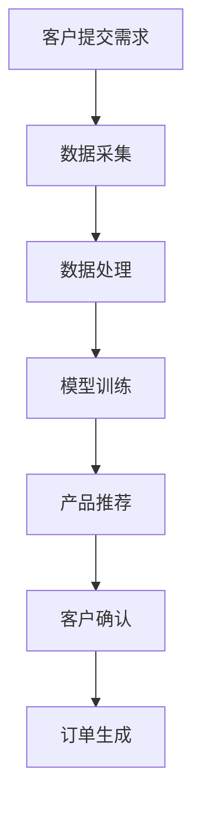

                 


# AI在保险产品个性化定制中的深度应用

> 关键词：人工智能，保险产品，个性化定制，机器学习，深度学习，数据驱动

> 摘要：本文深入探讨了人工智能技术在保险产品个性化定制中的应用，分析了保险行业的现状与挑战，详细讲解了AI在保险产品设计中的核心概念与算法原理，结合实际案例分析了系统的架构设计与实现，最后总结了AI在保险产品个性化定制中的最佳实践与未来发展方向。

---

## 第一部分: AI在保险产品个性化定制中的背景与基础

### 第1章: 保险行业与AI技术的结合

#### 1.1 保险行业的现状与挑战

- **1.1.1 保险行业的痛点分析**
  - 传统保险产品同质化严重，难以满足客户的个性化需求。
  - 风险评估主要依赖经验数据，精准度有限。
  - 保险定价缺乏动态调整机制，难以适应市场变化。

- **1.1.2 传统保险产品的局限性**
  - 产品设计基于经验假设，难以覆盖复杂风险场景。
  - 客户需求多样，传统产品难以满足个性化需求。
  - 保险定价缺乏灵活性，难以适应市场波动。

- **1.1.3 AI技术如何解决保险行业的问题**
  - 利用AI技术进行个性化需求分析，精准匹配保险产品。
  - 通过机器学习模型提升风险评估的准确性和精细度。
  - 实现动态定价，提高保险产品的市场竞争力。

#### 1.2 AI技术的发展与应用

- **1.2.1 AI技术的定义与特点**
  - AI（人工智能）是模拟人类智能的技术，包括学习、推理、自我改进等能力。
  - AI的核心技术包括机器学习、自然语言处理、计算机视觉等。

- **1.2.2 AI在金融行业的应用现状**
  - 风险评估与信用评分：利用机器学习模型分析客户信用风险。
  - 投资组合管理：通过算法交易优化投资组合。
  - 客户服务：智能客服机器人提供24/7的客户支持。

- **1.2.3 AI在保险行业的独特优势**
  - 数据驱动的风险评估：通过大量数据训练模型，提高风险预测的准确性。
  - 个性化产品推荐：基于客户数据定制保险产品，提升客户体验。
  - 动态定价：根据市场变化和客户需求实时调整产品价格。

#### 1.3 保险产品个性化定制的背景

- **1.3.1 个性化定制的定义与特点**
  - 个性化定制是指根据客户的特定需求，量身定制保险产品。
  - 个性化定制的特点包括定制化、动态调整、客户体验优化。

- **1.3.2 个性化保险产品的市场需求**
  - 客户需求多样化：不同客户有不同的风险承受能力和保障需求。
  - 市场竞争加剧：个性化产品能够帮助保险公司脱颖而出。
  - 客户体验提升：个性化产品能够增强客户对保险公司的忠诚度。

- **1.3.3 AI在个性化定制中的作用**
  - 数据采集与处理：AI技术能够高效采集和处理客户数据。
  - 产品设计与推荐：通过机器学习模型设计和推荐个性化保险产品。
  - 动态调整：根据市场变化和客户需求实时调整保险产品。

#### 1.4 本章小结

- 本章分析了保险行业的现状与挑战，探讨了AI技术在保险行业的应用及其独特优势，并介绍了保险产品个性化定制的背景和AI在其中的作用。

---

## 第二部分: AI在保险产品个性化定制中的核心概念与联系

### 第2章: AI与保险产品的核心概念

#### 2.1 AI在保险产品设计中的核心概念

- **2.1.1 数据驱动的保险产品设计**
  - 数据是AI驱动保险产品设计的基础，包括客户数据、市场数据、风险数据等。
  - 数据驱动的设计能够提高产品的精准度和个性化。

- **2.1.2 个性化风险评估模型**
  - 通过机器学习模型对客户进行风险评估，为保险产品设计提供依据。
  - 风险评估模型需要考虑客户的健康状况、职业风险、财务状况等因素。

- **2.1.3 AI驱动的保险产品创新**
  - AI技术能够帮助保险公司发现新的市场机会，设计创新型保险产品。
  - 例如，基于天气数据的农业保险，基于交通数据的车险产品。

#### 2.2 保险产品的个性化定制模型

- **2.2.1 客户需求分析模型**
  - 通过分析客户的年龄、职业、收入、健康状况等因素，确定客户的保险需求。
  - 使用决策树模型进行客户分群，制定个性化的保险方案。

- **2.2.2 产品推荐算法**
  - 基于协同过滤算法推荐保险产品，客户历史购买记录和行为数据为基础。
  - 使用矩阵分解技术提高推荐的准确性。

- **2.2.3 定价模型**
  - 基于机器学习的定价模型，考虑客户的风险特征和市场环境。
  - 使用回归分析模型预测保险产品的价格。

#### 2.3 AI与保险产品的核心联系

- **2.3.1 数据的采集与处理**
  - 数据采集：通过API接口获取客户的健康数据、驾驶行为数据等。
  - 数据处理：清洗、归一化、特征提取等预处理步骤。

- **2.3.2 AI算法在产品设计中的应用**
  - 机器学习算法：线性回归、随机森林、神经网络等。
  - 使用这些算法进行风险评估、产品推荐和定价。

- **2.3.3 个性化定制的实现过程**
  - 数据采集 -> 数据处理 -> 模型训练 -> 产品推荐 -> 动态调整。

#### 2.4 本章小结

- 本章详细讲解了AI在保险产品设计中的核心概念，包括数据驱动的设计、个性化风险评估模型和AI驱动的产品创新，并介绍了个性化定制模型和AI与保险产品的核心联系。

---

## 第三部分: AI在保险产品个性化定制中的算法原理

### 第3章: 基于机器学习的保险产品设计

#### 3.1 机器学习算法概述

- **3.1.1 监督学习**
  - 监督学习是基于标记数据的训练，模型通过输入数据和标签进行学习。
  - 常见的监督学习算法包括线性回归、支持向量机、随机森林等。

- **3.1.2 非监督学习**
  - 非监督学习是基于未标记数据的训练，模型通过数据的分布学习特征。
  - 常见的非监督学习算法包括聚类分析、主题模型等。

- **3.1.3 强化学习**
  - 强化学习是通过试错和奖励机制进行学习，模型通过与环境交互获得奖励。
  - 常见的强化学习算法包括Q-learning、深度强化学习等。

#### 3.2 保险产品设计中的机器学习模型

- **3.2.1 线性回归模型**
  - 线性回归模型用于预测连续型变量，例如保险产品的价格。
  - 公式：$$y = \beta_0 + \beta_1x_1 + \beta_2x_2 + \epsilon$$
  - 应用：预测保险产品的定价。

- **3.2.2 决策树模型**
  - 决策树是一种树状结构，用于分类和回归问题。
  - 使用ID3、C4.5、CART等算法构建决策树。
  - 应用：客户分群和保险产品推荐。

- **3.2.3 支持向量机模型**
  - 支持向量机是一种监督学习算法，用于分类和回归问题。
  - 使用核函数将数据映射到高维空间，寻找最优分割超平面。
  - 应用：风险评估和客户信用评分。

#### 3.3 基于深度学习的保险产品设计

- **3.3.1 神经网络模型**
  - 神经网络是一种仿生的计算模型，由层状结构组成。
  - 包括输入层、隐藏层和输出层。
  - 应用：非线性数据的处理和复杂模式的识别。

- **3.3.2 卷积神经网络**
  - 卷积神经网络（CNN）用于处理图像数据。
  - 包括卷积层、池化层、全连接层。
  - 应用：医学图像分析和自动驾驶保险。

- **3.3.3 循环神经网络**
  - 循环神经网络（RNN）用于处理序列数据。
  - 包括循环层和记忆单元。
  - 应用：时间序列数据分析和自然语言处理。

#### 3.4 本章小结

- 本章详细讲解了机器学习和深度学习算法在保险产品设计中的应用，包括线性回归、决策树、支持向量机、神经网络等模型，并分析了它们在保险产品设计中的应用场景。

---

## 第四部分: AI在保险产品个性化定制中的系统架构设计

### 第4章: 保险产品个性化定制系统的架构设计

#### 4.1 系统功能需求分析

- **4.1.1 客户需求分析模块**
  - 收集客户的年龄、职业、收入、健康状况等信息。
  - 使用决策树模型进行客户分群。

- **4.1.2 产品推荐模块**
  - 基于协同过滤算法推荐保险产品。
  - 使用矩阵分解技术提高推荐的准确性。

- **4.1.3 定价模块**
  - 使用回归分析模型预测保险产品的价格。
  - 考虑客户的风险特征和市场环境。

#### 4.2 系统架构设计

- **4.2.1 分层架构设计**
  - 数据层：存储客户数据和产品数据。
  - 业务逻辑层：处理客户请求和数据查询。
  - 表现层：展示客户界面和交互结果。

- **4.2.2 微服务架构设计**
  - 客户数据服务：负责客户数据的存储和查询。
  - 产品推荐服务：负责产品推荐和定价。
  - 订单管理服务：负责订单处理和支付。

- **4.2.3 数据流设计**
  - 数据采集：通过API接口获取客户数据。
  - 数据处理：清洗、归一化、特征提取。
  - 模型训练：使用机器学习算法训练模型。
  - 产品推荐：根据模型结果推荐保险产品。

#### 4.3 系统设计

- **4.3.1 领域模型**
  - 客户模型：包括客户的基本信息和风险特征。
  - 产品模型：包括产品的基本信息和定价模型。

- **4.3.2 系统架构图**
  ```mermaid
  graph TD
    A[客户] --> B[客户数据服务]
    B --> C[数据处理服务]
    C --> D[机器学习模型]
    D --> E[产品推荐服务]
    E --> F[客户界面]
  ```

- **4.3.3 系统接口设计**
  - API接口：用于数据采集和模型调用。
  - 接口协议：RESTful API，使用JSON格式传输数据。

- **4.3.4 系统交互图**
  ```mermaid
  sequenceDiagram
    participant A as 客户
    participant B as 客户数据服务
    participant C as 数据处理服务
    participant D as 机器学习模型
    participant E as 产品推荐服务
    A -> B: 提交客户信息
    B -> C: 请求数据处理
    C -> D: 请求模型训练
    D -> C: 返回模型结果
    C -> E: 请求产品推荐
    E -> A: 返回推荐结果
  ```

#### 4.4 本章小结

- 本章详细分析了保险产品个性化定制系统的架构设计，包括功能模块、数据流设计和系统架构图，并通过mermaid图展示了系统的交互过程。

---

## 第五部分: AI在保险产品个性化定制中的项目实战

### 第5章: 基于客户数据的保险产品推荐系统

#### 5.1 环境安装

- **Python环境**
  - 安装Python 3.8或更高版本。
  - 使用虚拟环境管理依赖。
- **机器学习库**
  - 安装scikit-learn、xgboost、tensorflow等机器学习库。
- **数据处理工具**
  - 安装pandas、numpy等数据处理库。

#### 5.2 系统核心实现源代码

- **客户数据处理代码**
  ```python
  import pandas as pd
  import numpy as np

  # 数据清洗
  def preprocess_data(data):
      data = data.dropna()
      data = data.drop_duplicates()
      return data

  # 特征提取
  def extract_features(data):
      features = data[['age', 'income', 'occupation']]
      target = data['risk_score']
      return features, target
  ```

- **机器学习模型训练代码**
  ```python
  from sklearn.ensemble import RandomForestClassifier
  from sklearn.model_selection import train_test_split
  from sklearn.metrics import accuracy_score

  def train_model(features, target):
      X_train, X_test, y_train, y_test = train_test_split(features, target, test_size=0.2)
      model = RandomForestClassifier(n_estimators=100)
      model.fit(X_train, y_train)
      y_pred = model.predict(X_test)
      print("Accuracy:", accuracy_score(y_test, y_pred))
      return model
  ```

- **产品推荐代码**
  ```python
  def recommend_product(model, new_customer):
      features, _ = extract_features(data)
      new_features = new_customer.reshape(1, -1)
      risk_score = model.predict(new_features)
      if risk_score[0] > 0.5:
          return "High Risk Product"
      else:
          return "Low Risk Product"
  ```

#### 5.3 代码应用解读与分析

- **数据清洗**
  - 删除缺失值和重复值，确保数据的完整性和准确性。
- **特征提取**
  - 提取客户的年龄、收入和职业信息，作为模型的输入特征。
- **模型训练**
  - 使用随机森林算法训练分类模型，预测客户的风险评分。
- **产品推荐**
  - 根据模型预测结果推荐适合的保险产品，高风险客户推荐高风险产品，低风险客户推荐低风险产品。

#### 5.4 实际案例分析和详细讲解剖析

- **案例背景**
  - 某保险公司希望根据客户的风险评分推荐适合的保险产品。
- **数据准备**
  - 收集客户的年龄、收入、职业和健康状况等信息。
- **模型训练**
  - 使用随机森林算法训练模型，预测客户的健康风险评分。
- **产品推荐**
  - 根据模型预测结果推荐适合的保险产品，如健康保险、人寿保险等。

#### 5.5 本章小结

- 本章通过一个实际案例展示了基于客户数据的保险产品推荐系统的实现，详细讲解了环境安装、数据处理、模型训练和产品推荐的实现过程。

---

## 第六部分: 总结与展望

### 第6章: 总结与展望

#### 6.1 最佳实践

- 数据是AI驱动保险产品设计的核心，确保数据的准确性和完整性。
- 使用多种算法进行模型训练，提高模型的准确性和鲁棒性。
- 定期更新模型，适应市场变化和客户需求。

#### 6.2 小结

- 本文深入探讨了AI在保险产品个性化定制中的应用，从背景分析到算法实现，再到系统设计和项目实战，全面覆盖了AI在保险产品设计中的各个方面。

#### 6.3 注意事项

- 数据隐私保护：确保客户数据的安全性和隐私性。
- 模型解释性：提高模型的可解释性，方便客户理解和信任。
- 模型鲁棒性：确保模型在面对异常数据和市场变化时的稳定性。

#### 6.4 拓展阅读

- 推荐阅读《机器学习实战》、《深度学习入门》等书籍，深入理解机器学习和深度学习的核心概念。
- 关注行业动态，了解AI在保险行业的最新应用和发展趋势。

#### 6.5 本章小结

- 本章总结了AI在保险产品个性化定制中的最佳实践，强调了数据隐私保护和模型解释性的重要性，并展望了未来的发展方向。

---

## 附录

### 附录A: 保险产品个性化定制系统的流程图



### 附录B: 机器学习模型训练代码示例

```python
from sklearn.datasets import make_classification
from sklearn.model_selection import train_test_split
from sklearn.metrics import accuracy_score
from sklearn.ensemble import RandomForestClassifier

# 生成数据
X, y = make_classification(n_samples=1000, n_features=10, random_state=42)

# 划分数据集
X_train, X_test, y_train, y_test = train_test_split(X, y, test_size=0.2)

# 训练模型
model = RandomForestClassifier(n_estimators=100)
model.fit(X_train, y_train)

# 预测结果
y_pred = model.predict(X_test)
print("Accuracy:", accuracy_score(y_test, y_pred))
```

---

通过以上章节的详细分析，本文系统地介绍了AI在保险产品个性化定制中的应用，从理论到实践，为读者提供了全面的知识和实用的代码示例。希望这篇文章能够帮助读者更好地理解AI在保险行业中的潜力和应用。

