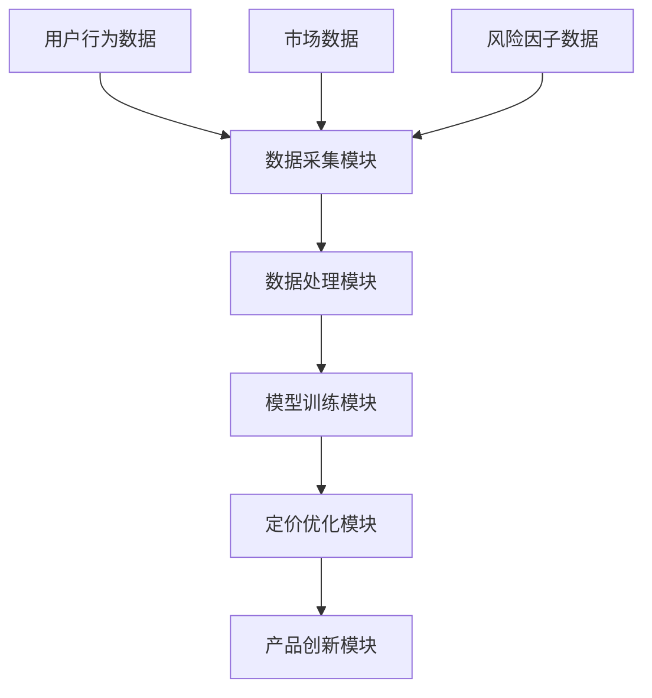

                 


# AI在保险产品创新与风险定价中的深度应用

## 关键词：
- AI
- 保险产品创新
- 风险定价
- 机器学习
- 深度学习
- 数据分析

## 摘要：
本文深入探讨了人工智能（AI）在保险产品创新与风险定价中的应用，结合实际案例和算法原理，系统地分析了AI技术如何推动保险行业的数字化转型。文章从保险行业的痛点与AI技术的结合入手，详细讲解了AI在保险产品设计、风险评估与定价中的核心作用，包括机器学习算法、深度学习模型的应用，以及系统架构的设计与实现。通过本文，读者将全面了解AI如何赋能保险行业，实现产品创新与风险定价的智能化与精准化。

---

# 第1章: 保险行业的数字化转型与AI的应用

## 1.1 保险行业的痛点与挑战

- **传统保险产品的设计难题**
  - 市场需求变化快，产品同质化严重
  - 用户需求分析复杂，难以精准匹配
  - 产品创新周期长，成本高
- **传统风险定价的局限性**
  - 数据维度有限，难以全面评估风险
  - 人工定价的主观性和不准确性
  - 市场波动和复杂因素难以预测

## 1.2 AI技术如何推动保险行业的变革

- **AI技术的核心优势**
  - 数据处理能力强，能够从海量数据中提取价值
  - 算法灵活，适用于复杂场景的预测与决策
  - 实时分析能力，支持动态调整与优化
- **AI在保险行业的应用场景**
  - 产品设计：基于用户行为数据进行产品创新
  - 风险评估：利用机器学习模型预测风险
  - 定价优化：通过深度学习模型实现精准定价
  - 客户服务：智能化客服与个性化推荐

---

# 第2章: AI在保险产品创新中的应用

## 2.1 数据驱动的产品设计

- **用户需求分析**
  - 基于自然语言处理（NLP）技术分析用户反馈
  - 通过聚类分析识别用户需求的共性特征
- **产品定位与设计**
  - 利用协同过滤算法推荐产品设计方案
  - 基于深度学习生成产品原型

## 2.2 机器学习在保险产品创新中的应用

- **机器学习算法在产品设计中的作用**
  - 分类算法：识别潜在客户的需求特征
  - 回归算法：预测产品的市场表现
  - 聚类算法：细分市场，发现新兴需求
- **案例分析：基于机器学习的产品创新**
  - 某保险公司利用随机森林算法分析用户行为数据，推出个性化健康保险产品

---

# 第3章: AI在风险定价中的应用

## 3.1 传统风险定价的局限性

- **数据维度不足**
  - 传统定价模型主要依赖基础险种的保费数据
  - 难以捕捉复杂风险因素
- **定价模型的固定性**
  - 传统模型难以适应市场变化
  - 无法实时更新定价策略

## 3.2 基于机器学习的定价模型

- **线性回归模型**
  - **数学公式**：$$ y = \beta_0 + \beta_1x_1 + \beta_2x_2 + \ldots + \beta_nx_n + \epsilon $$
  - 适用场景：简单线性关系的定价问题
- **决策树与随机森林**
  - **决策树模型**：通过树状结构分割数据，适用于非线性关系
  - **随机森林模型**：通过集成学习提高模型鲁棒性
  - **案例分析**：某保险公司利用XGBoost算法优化车险定价

---

# 第4章: 基于AI的保险产品创新与风险定价系统

## 4.1 系统功能设计

- **系统架构**
  - **数据采集模块**：整合用户行为数据、市场数据、风险因子数据
  - **数据处理模块**：清洗、转换与特征提取
  - **模型训练模块**：基于机器学习算法训练定价模型
  - **产品创新模块**：生成个性化保险产品方案
  - **定价优化模块**：动态调整定价策略

## 4.2 系统架构图（Mermaid）



---

# 第5章: 项目实战——基于AI的保险产品创新与风险定价

## 5.1 环境搭建

- **工具安装**
  - Python 3.8+
  - Scikit-learn、XGBoost、TensorFlow
  - Jupyter Notebook
- **数据准备**
  - 获取保险产品数据集（如车险、健康险数据）

## 5.2 代码实现

### 5.2.1 数据处理与特征提取

```python
import pandas as pd
from sklearn.preprocessing import StandardScaler

# 加载数据
data = pd.read_csv('insurance.csv')

# 特征工程
features = data[['age', 'sex', 'bmi', 'children', ' smoker', 'region']]
target = data['charges']

# 标准化处理
scaler = StandardScaler()
features_scaled = scaler.fit_transform(features)
```

### 5.2.2 模型训练与优化

```python
from sklearn.ensemble import XGBRegressor
from sklearn.metrics import mean_squared_error

# 训练模型
model = XGBRegressor(n_estimators=100, learning_rate=0.1, max_depth=3)
model.fit(features_scaled, target)

# 模型评估
y_pred = model.predict(features_scaled)
print(f"均方误差：{mean_squared_error(target, y_pred)}")
```

### 5.2.3 产品创新与定价

- **案例分析**：基于模型输出的风险评分，动态调整保险产品的覆盖范围和保费
- **实时定价**：通过API接口实现在线定价服务

---

# 第6章: 总结与展望

## 6.1 小结

- AI技术为保险行业的产品创新与风险定价提供了强大的技术支持
- 基于机器学习的定价模型能够显著提高定价的准确性和效率
- 系统化的AI解决方案能够实现保险产品的智能化设计与动态优化

## 6.2 注意事项

- 数据质量对模型性能影响巨大，需重视数据清洗与特征工程
- 模型的可解释性是保险行业的重要考量，需选择适合业务场景的算法
- 需关注数据隐私与合规性，确保符合相关法律法规

## 6.3 拓展阅读

- 《机器学习实战》
- 《深度学习导论》
- 《保险精算与风险定价》

---

通过本文的系统分析与实战案例，我们深入探讨了AI技术在保险产品创新与风险定价中的应用，为保险行业的数字化转型提供了新的思路与方法。未来，随着AI技术的不断发展，保险行业将更加智能化、个性化与精准化。

