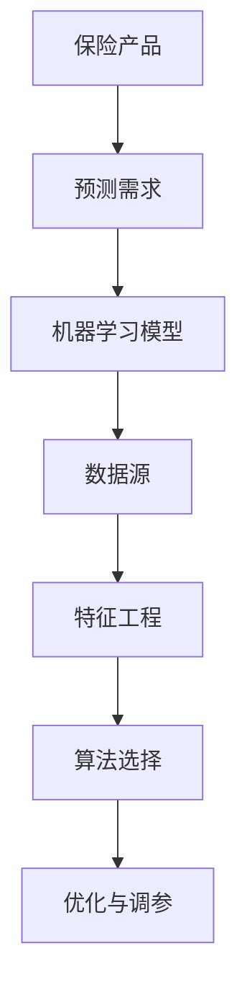
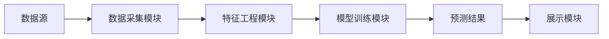
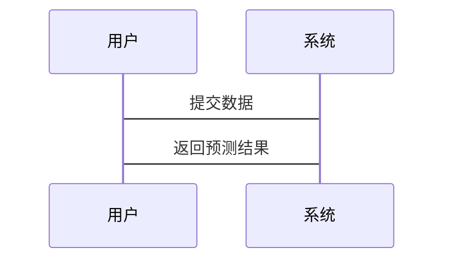

                 


# AI在保险产品需求预测中的创新应用

## 关键词：保险产品需求预测、人工智能、机器学习、深度学习、自然语言处理、时间序列分析

## 摘要：  
随着人工智能技术的飞速发展，保险产品需求预测正逐渐从传统的统计分析方法向数据驱动的智能预测转变。本文深入探讨了AI技术在保险产品需求预测中的创新应用，结合机器学习、深度学习、自然语言处理和时间序列分析等多种技术手段，分析了保险产品需求预测的核心问题、算法原理、系统架构和实际案例。通过详细的技术解析和代码实现，展示了AI技术在保险行业的实际价值和应用前景。

---

## 第一部分: 保险产品需求预测的背景与基础

### 第1章: 保险产品需求预测的背景与挑战

#### 1.1 保险行业的现状与发展趋势
- **1.1.1 保险行业的基本概念与分类**
  - 保险行业的定义与主要业务类型（寿险、产险、健康险等）。
  - 保险产品的生命周期与市场需求分析。
- **1.1.2 保险产品需求预测的重要性**
  - 预测保险产品需求的必要性：精准市场定位、优化产品设计、提升销售效率。
  - 预测错误对保险公司的影响：库存积压、资源浪费、客户流失。
- **1.1.3 传统保险产品需求预测的局限性**
  - 传统方法的局限性：依赖经验判断，数据维度单一，预测精度低。
  - 数据驱动方法的崛起：大数据时代下，数据驱动的预测优势。

#### 1.2 AI技术在保险行业的应用背景
- **1.2.1 AI技术的基本概念与发展趋势**
  - AI的核心概念：模拟人类智能的计算机技术，包括学习、推理、自适应能力。
  - AI在各行业的应用趋势，尤其是保险行业的潜力。
- **1.2.2 AI在保险行业中的典型应用场景**
  - 客户画像与精准营销。
  - 风险评估与理赔预测。
  - 产品推荐与需求预测。
- **1.2.3 保险产品需求预测中的AI创新应用**
  - 数据驱动的预测模型。
  - 基于AI的市场趋势分析。
  - 自然语言处理在保险需求分析中的应用。

#### 1.3 保险产品需求预测的核心问题
- **1.3.1 需求预测的基本概念与目标**
  - 预测对象：保险产品的销售量、市场份额、客户需求。
  - 预测目标：优化产品设计、制定销售策略、提升客户满意度。
- **1.3.2 数据驱动的需求预测方法**
  - 数据来源：历史销售数据、客户行为数据、市场调研数据。
  - 数据预处理：清洗、归一化、特征提取。
- **1.3.3 AI技术在需求预测中的优势**
  - 高维度数据处理能力。
  - 非线性关系建模能力。
  - 实时预测与动态调整能力。

#### 1.4 本章小结
- 总结保险产品需求预测的重要性与挑战。
- 引出AI技术在保险需求预测中的潜力与创新点。

---

## 第二部分: AI在保险产品需求预测中的核心概念与联系

### 第2章: AI技术的核心概念与原理

#### 2.1 机器学习的基本原理
- **2.1.1 机器学习的定义与分类**
  - 监督学习、无监督学习、强化学习的定义与区别。
  - 监督学习的典型应用场景：回归与分类问题。
- **2.1.2 常见的机器学习算法**
  - 线性回归、随机森林、支持向量机（SVM）、神经网络等。
  - 算法选择的依据：数据类型、问题性质、计算资源。
- **2.1.3 机器学习的核心流程**
  - 数据预处理、特征工程、模型训练、评估与优化。

#### 2.2 自然语言处理在保险需求预测中的应用
- **2.2.1 NLP的基本概念与技术**
  - 词嵌入（如Word2Vec、GloVe）、文本分类、情感分析。
  - 基于Transformer的模型（如BERT）在保险需求分析中的应用。
- **2.2.2 文本数据在保险需求预测中的价值**
  - 用户评论、产品描述、市场报告的文本分析。
  - 从文本中提取潜在需求与市场趋势。
- **2.2.3 NLP在保险产品推荐中的应用**
  - 基于用户文本数据的个性化推荐。
  - 自然语言生成技术在保险产品描述中的应用。

#### 2.3 时间序列分析与预测
- **2.3.1 时间序列的基本概念与特征**
  - 时间序列的定义与常见特征（趋势、周期性、随机性）。
  - 时间序列数据的预处理方法。
- **2.3.2 常见的时间序列预测方法**
  - ARIMA、Prophet、LSTM等算法的优缺点。
  - 基于深度学习的时间序列预测模型。
- **2.3.3 AI在时间序列预测中的创新应用**
  - 结合机器学习与时间序列分析的混合模型。
  - 在保险产品需求预测中的具体应用案例。

#### 2.4 核心概念的ER实体关系图


---

## 第三部分: AI在保险产品需求预测中的算法原理与实现

### 第3章: 常见的保险需求预测算法

#### 3.1 线性回归模型
- **3.1.1 线性回归的基本原理**
  - 线性回归的数学模型：$$ y = \beta_0 + \beta_1x_1 + \beta_2x_2 + \ldots + \beta_nx_n + \epsilon $$
  - 最小二乘法的优化目标：$$ \min_{\beta} \sum_{i=1}^n (y_i - \hat{y_i})^2 $$
- **3.1.2 线性回归的实现步骤**
  - 数据预处理：特征标准化、处理缺失值。
  - 模型训练：使用最小二乘法求解系数。
  - 模型评估：R²、均方误差（MSE）。
- **3.1.3 线性回归的优缺点**
  - 优点：简单、易于解释。
  - 缺点：假设线性关系，可能无法捕捉复杂模式。

#### 3.2 随机森林模型
- **3.2.1 随机森林的基本原理**
  - 随机森林是由多个决策树组成的集成模型。
  - 每棵决策树的训练数据通过有放回抽样获得，特征选择采用随机选取。
- **3.2.2 随机森林的数学模型**
  - 输入：特征向量$$ X = [x_1, x_2, \ldots, x_n] $$
  - 输出：预测结果$$ \hat{y} = \text{多数投票}(\text{各树预测结果}) $$
- **3.2.3 随机森林的实现步骤**
  - 数据预处理：特征选择、处理类别变量。
  - 模型训练：构建多棵决策树，计算特征重要性。
  - 模型评估：准确率、召回率、F1分数。

#### 3.3 LSTM模型
- **3.3.1 LSTM的基本原理**
  - LSTM是一种特殊的RNN，用于处理长序列数据。
  - 细胞状态、输入门、遗忘门、输出门的设计。
- **3.3.2 LSTM的数学模型**
  - 输入门：$$ i = \sigma(W_i x + U_i h_{prev}) $$
  - 遗忘门：$$ f = \sigma(W_f x + U_f h_{prev}) $$
  - 细胞状态更新：$$ c = f \cdot c_{prev} + i \cdot tanh(W_c x + U_c h_{prev}) $$
  - 输出门：$$ o = \sigma(W_o x + U_o h_{prev}) $$
  - 最终输出：$$ h = o \cdot tanh(c) $$
- **3.3.3 LSTM在时间序列预测中的应用**
  - 使用LSTM进行保险产品需求的时间序列预测。
  - 模型训练与调参：学习率、批量大小、 epochs。

#### 3.4 算法对比与选择
- **3.4.1 不同算法的性能对比**
  - 线性回归适合线性关系，随机森林适合高维数据，LSTM适合时间序列。
- **3.4.2 算法选择的依据**
  - 数据类型：是否为时间序列、数据维度、是否包含文本。
  - 预测精度要求：复杂模型可能带来过拟合风险。

#### 3.5 算法实现代码示例
- **线性回归代码示例**
```python
import numpy as np
from sklearn.linear_model import LinearRegression

# 数据准备
X = np.array([[1], [2], [3], [4], [5]])
y = np.array([2, 4, 5, 4, 6])

# 模型训练
model = LinearRegression()
model.fit(X, y)

# 预测
print(model.predict([[6]]))  # 输出：[[7.5]]
```

- **随机森林代码示例**
```python
from sklearn.ensemble import RandomForestRegressor

# 数据准备
X = [[x1], [x2], ...]
y = [y1, y2, ...]

# 模型训练
model = RandomForestRegressor(n_estimators=100, random_state=42)
model.fit(X, y)

# 预测
print(model.predict([[x_new]]))
```

- **LSTM代码示例**
```python
import tensorflow as tf
from tensorflow.keras import layers

# 数据准备
timesteps, input_dim = 20, 5
X = np.random.random((1000, timesteps, input_dim))
y = np.random.random((1000, 1))

# 模型构建
model = tf.keras.Sequential()
model.add(layers.LSTM(64, input_shape=(timesteps, input_dim)))
model.add(layers.Dense(1))
model.compile(optimizer='adam', loss='mean_squared_error')

# 模型训练
model.fit(X, y, epochs=5, batch_size=32)
```

---

## 第四部分: 系统分析与架构设计

### 第4章: 保险产品需求预测系统的架构设计

#### 4.1 系统功能设计
- **4.1.1 功能模块划分**
  - 数据采集模块：从数据库中获取历史销售数据、客户行为数据。
  - 特征工程模块：数据清洗、特征提取、特征转换。
  - 模型训练模块：选择合适的机器学习模型进行训练。
  - 预测与展示模块：生成预测结果并可视化。
- **4.1.2 系统功能流程**
  - 数据采集 → 特征工程 → 模型训练 → 预测 → 展示。

#### 4.2 系统架构设计
- **4.2.1 系统架构图**


#### 4.3 接口设计
- **4.3.1 API接口设计**
  - 数据接口：提供REST API用于数据上传与下载。
  - 预测接口：提供API用于实时预测。
- **4.3.2 接口交互流程**
  - 调用数据接口获取数据 → 调用预测接口获取结果。

#### 4.4 系统交互流程
- **4.4.1 用户交互流程**
  - 用户输入数据 → 系统处理 → 返回预测结果。
- **4.4.2 系统交互图**


---

## 第五部分: 项目实战

### 第5章: 基于AI的保险产品需求预测项目

#### 5.1 项目背景与目标
- **项目背景**
  - 某保险公司希望利用AI技术优化保险产品需求预测。
- **项目目标**
  - 建立一个基于机器学习的保险产品需求预测系统。
  - 提高预测精度，优化产品设计与销售策略。

#### 5.2 项目环境与工具
- **开发环境**
  - 操作系统：Linux/Windows/MacOS
  - 开发工具：PyCharm、VS Code
- **技术栈**
  - Python编程语言
  - TensorFlow/Scikit-learn等机器学习库
  - 数据库：MySQL/PostgreSQL
- **数据来源**
  - 历史销售数据
  - 客户行为数据
  - 市场调研数据

#### 5.3 项目核心实现
- **5.3.1 数据预处理**
  ```python
  import pandas as pd
  import numpy as np

  # 数据加载
  df = pd.read_csv('insurance_data.csv')

  # 处理缺失值
  df.dropna(inplace=True)

  # 特征转换
  df['age'] = df['age'].apply(lambda x: x if x > 0 else 0)
  ```

- **5.3.2 特征工程**
  ```python
  from sklearn.preprocessing import StandardScaler

  # 标准化处理
  scaler = StandardScaler()
  features = df[['age', 'income', 'policy_type']]
  scaled_features = scaler.fit_transform(features)
  ```

- **5.3.3 模型训练与优化**
  ```python
  from sklearn.ensemble import RandomForestRegressor
  from sklearn.metrics import mean_squared_error

  # 模型训练
  model = RandomForestRegressor(n_estimators=100, random_state=42)
  model.fit(scaled_features, df['demand'])

  # 模型评估
  y_pred = model.predict(scaled_features)
  print(mean_squared_error(df['demand'], y_pred))
  ```

- **5.3.4 模型部署与预测**
  ```python
  import joblib

  # 模型保存
  joblib.dump(model, 'insurance_demand_model.pkl')
  ```

#### 5.4 项目案例分析
- **5.4.1 案例背景**
  - 某保险公司车险产品的需求预测。
- **5.4.2 数据分析**
  - 收集过去三年的车险销售数据。
  - 提取特征：保费、客户年龄、车型、购买时间。
- **5.4.3 模型预测与结果解读**
  - 使用随机森林模型预测未来一年的车险需求。
  - 结果分析：预测需求与实际需求的对比。

#### 5.5 项目小结
- 总结项目实施的关键步骤与成果。
- 强调AI技术在保险产品需求预测中的实际价值。

---

## 第六部分: 最佳实践与展望

### 第6章: 最佳实践与未来展望

#### 6.1 最佳实践
- **数据质量**
  - 确保数据的完整性和准确性。
- **模型选择**
  - 根据数据类型选择合适的算法。
- **模型优化**
  - 交叉验证、超参数调优。
- **结果解释**
  - 可视化结果，便于业务人员理解。

#### 6.2 未来展望
- **技术进步**
  - 更复杂的深度学习模型（如Transformer）的应用。
- **数据融合**
  - 多源数据的融合分析。
- **实时预测**
  - 实时数据流的处理能力。

#### 6.3 小结
- 总结全文的核心内容。
- 强调AI技术在保险产品需求预测中的重要性。

---

## 结语

通过本文的详细讲解，我们可以看到，AI技术在保险产品需求预测中的应用前景广阔。从算法原理到系统实现，再到实际案例分析，AI技术正在逐步改变保险行业的传统模式。未来，随着技术的不断进步，保险产品需求预测将更加精准、实时和智能化。

