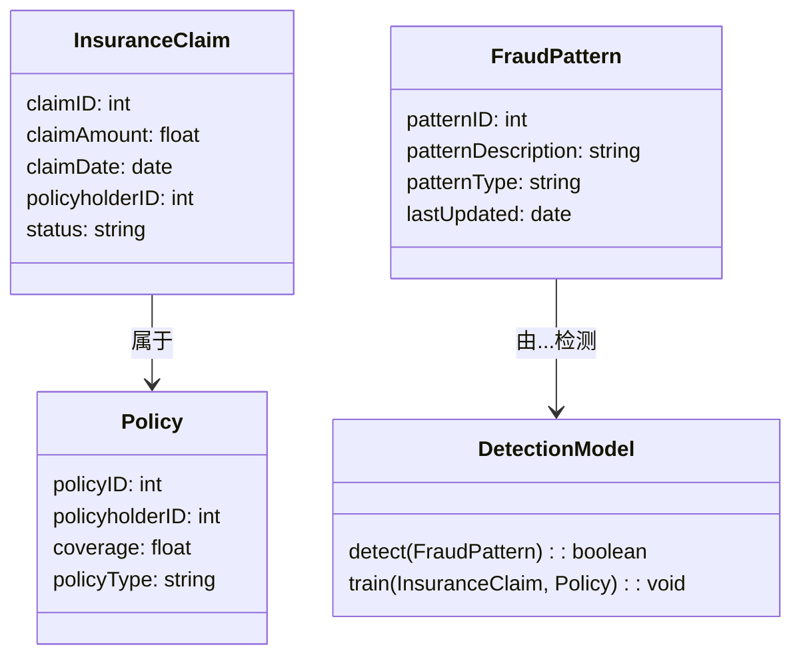
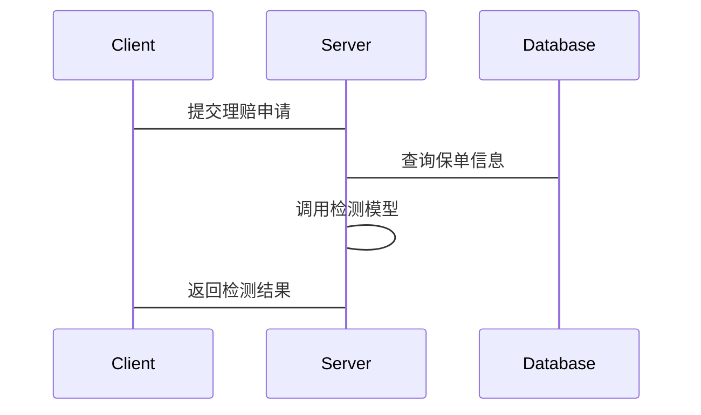

                 


# AI在保险理赔欺诈模式演化检测中的创新应用

## 关键词：人工智能，保险欺诈，模式演化，深度学习，自然语言处理，系统架构

## 摘要：  
随着保险行业的快速发展，保险欺诈问题日益严重，传统的欺诈检测方法逐渐暴露出效率低下、准确性不足的缺陷。本文探讨了人工智能（AI）技术在保险理赔欺诈模式演化检测中的创新应用，结合深度学习、自然语言处理等技术，提出了基于模式演化检测的解决方案。通过分析欺诈模式的动态变化，构建高效的检测模型，并通过系统架构设计和项目实战，展示了AI技术在保险欺诈检测中的实际应用价值和效果。

---

# 第1章 保险行业与欺诈检测概述

## 1.1 保险行业的现状与发展趋势  
### 1.1.1 保险行业的基本概念与业务模式  
保险行业是金融体系的重要组成部分，主要通过承保风险、分散损失的方式为个人和企业提供风险保障。保险业务模式主要包括寿险、财险、健康险等，其中财险领域的理赔欺诈问题尤为突出。

### 1.1.2 保险行业的数字化转型  
随着大数据、人工智能等技术的快速发展，保险行业正逐步从传统模式向数字化、智能化转型。数字化理赔、智能风控等技术的应用，显著提升了保险行业的运营效率和风险管理能力。

### 1.1.3 保险行业的痛点与挑战  
尽管数字化转型为保险行业带来了诸多好处，但保险欺诈问题依然严重。传统的人工审核方式效率低下，且难以发现复杂的欺诈模式。此外，保险欺诈手段不断升级，传统的规则-based检测方法逐渐失效。

## 1.2 保险理赔中的欺诈问题  
### 1.2.1 保险欺诈的定义与分类  
保险欺诈是指投保人或被保险人故意制造虚假的保险事故或夸大损失程度，以骗取保险赔偿的行为。根据欺诈手段的不同，保险欺诈可以分为故意事故型、夸大损失型、虚报保险型等。

### 1.2.2 保险欺诈的常见手段与案例  
常见的保险欺诈手段包括：虚构保险事故、夸大损失金额、伪造投保信息等。例如，某些投保人故意制造交通事故，利用保险公司对理赔流程的不透明性骗取赔偿。

### 1.2.3 保险欺诈对行业的影响  
保险欺诈不仅增加了保险公司的赔付成本，还可能导致保险公司面临偿付压力。此外，欺诈行为会破坏保险市场的公平性，影响保险行业的健康发展。

## 1.3 AI技术在保险欺诈检测中的应用背景  
### 1.3.1 AI技术的发展与保险行业的结合  
人工智能技术的发展为保险行业的风险管理提供了新的可能性。通过深度学习、自然语言处理等技术，可以实现对保险理赔数据的自动化分析和风险评估。

### 1.3.2 传统欺诈检测方法的局限性  
传统的保险欺诈检测方法主要依赖于规则匹配和人工审核。这种方法效率低下，且难以应对复杂多变的欺诈手段。

### 1.3.3 AI在保险欺诈检测中的优势  
AI技术能够通过分析大量的历史数据，发现隐藏在数据中的欺诈模式。深度学习模型可以自动提取数据特征，识别传统方法难以发现的复杂欺诈行为。

---

# 第2章 欺诈模式演化检测的核心概念

## 2.1 欺诈模式的定义与特征  
### 2.1.1 欺诈模式的构成要素  
欺诈模式是指在保险理赔过程中，投保人或被保险人通过特定手段制造虚假保险事故或夸大损失金额的行为模式。欺诈模式的构成要素包括行为特征、时间特征、数据特征等。

### 2.1.2 欺诈模式的动态演化特性  
欺诈模式并不是一成不变的，随着保险行业的反欺诈技术的提升，欺诈行为也在不断演化。例如，某些欺诈分子会通过改变欺诈手段来规避检测。

### 2.1.3 欺诈模式与保险业务的关系  
欺诈模式与保险业务密切相关。识别和分析欺诈模式，可以帮助保险公司制定更有效的风险管理策略，降低欺诈风险。

## 2.2 AI技术在模式演化检测中的应用  
### 2.2.1 机器学习在模式识别中的作用  
机器学习技术可以用于识别保险理赔中的异常模式。通过训练分类器，可以将正常理赔与欺诈理赔区分开来。

### 2.2.2 深度学习在模式演化中的优势  
深度学习技术可以自动提取数据特征，识别复杂的欺诈模式。例如，使用循环神经网络（RNN）可以分析时间序列数据，发现欺诈行为的动态演化规律。

### 2.2.3 自然语言处理在保险文本分析中的应用  
自然语言处理技术可以用于分析保险理赔中的文本数据，例如保单、理赔申请等。通过文本挖掘技术，可以发现隐藏在文本中的欺诈线索。

## 2.3 模式演化检测的核心要素  
### 2.3.1 数据特征提取  
数据特征提取是模式演化检测的关键步骤。需要从保险理赔数据中提取有效的特征，例如理赔金额、理赔时间、投保人信息等。

### 2.3.2 模型训练与优化  
通过训练深度学习模型，可以实现对欺诈模式的自动识别。模型训练过程中需要不断优化参数，提升检测准确率。

### 2.3.3 检测结果的可解释性  
检测结果的可解释性是模式演化检测的重要指标。需要能够清晰地解释模型的决策过程，帮助保险公司理解欺诈行为的本质。

---

# 第3章 欺诈模式演化检测的算法原理

## 3.1 基于深度学习的模式检测算法  
### 3.1.1 神经网络的基本原理  
神经网络是一种人工神经网络，通过多层的神经元连接，实现对数据的非线性映射。神经网络的基本原理包括输入层、隐藏层和输出层。

### 3.1.2 卷积神经网络（CNN）的应用  
卷积神经网络在图像识别中应用广泛，但在保险欺诈检测中也可以用于分析图像数据。例如，可以用于识别伪造的保单或理赔单据。

### 3.1.3 循环神经网络（RNN）的应用  
循环神经网络适合处理序列数据，例如时间序列数据。可以通过RNN分析保险理赔的时间序列数据，发现欺诈行为的动态演化规律。

## 3.2 模式演化检测的数学模型  
### 3.2.1 损失函数的定义与优化  
损失函数用于衡量模型预测值与实际值之间的差异。常用的损失函数包括均方误差（MSE）和交叉熵损失。通过优化损失函数，可以提升模型的检测准确率。

### 3.2.2 模型训练的数学推导  
模型训练过程包括正向传播和反向传播。正向传播计算模型的输出，反向传播通过梯度下降优化模型参数。

### 3.2.3 模型评估的指标与方法  
常用的模型评估指标包括准确率、召回率、F1分数等。通过这些指标可以全面评估模型的性能。

## 3.3 基于时间序列的模式演化检测  
### 3.3.1 时间序列数据的特征提取  
时间序列数据的特征包括均值、方差、趋势等。通过提取这些特征，可以发现欺诈行为的动态变化。

### 3.3.2 基于LSTM的模式演化预测  
长短期记忆网络（LSTM）适合处理时间序列数据。通过LSTM可以预测未来的欺诈模式，帮助保险公司提前防范欺诈行为。

### 3.3.3 时间序列模型的优缺点分析  
时间序列模型的优势在于能够捕捉数据的时序特征，但模型的复杂性和计算成本较高。

---

# 第4章 系统分析与架构设计方案

## 4.1 项目背景与目标  
### 4.1.1 项目背景介绍  
本项目旨在通过AI技术实现保险理赔欺诈模式的动态检测，帮助保险公司降低欺诈风险。

### 4.1.2 项目目标  
- 构建保险理赔欺诈模式演化检测模型
- 实现欺诈模式的动态识别与预警
- 提供可扩展的系统架构，支持大规模数据处理

## 4.2 系统功能设计  
### 4.2.1 领域模型（Mermaid类图）  


### 4.2.2 系统架构设计（Mermaid架构图）  


### 4.2.3 系统接口设计  
- 客户端接口：提交理赔申请、查询理赔状态
- 服务端接口：接收理赔申请、调用检测模型、返回检测结果
- 数据库接口：存储保险 claim 数据、保单信息、欺诈模式数据

### 4.2.4 系统交互流程（Mermaid序列图）  


---

# 第5章 项目实战

## 5.1 环境安装与配置  
### 5.1.1 安装Python与必要的库  
- Python 3.8+
- TensorFlow 2.0+
- Pandas 1.0+
- Scikit-learn 0.24+

### 5.1.2 安装Jupyter Notebook  
Jupyter Notebook是数据科学家常用的工具，可以用于数据探索和模型训练。

## 5.2 系统核心实现源代码  
### 5.2.1 数据预处理代码  
```python
import pandas as pd
import numpy as np

# 加载数据
df = pd.read_csv('insurance_claims.csv')

# 删除缺失值
df = df.dropna()

# 转换为数值型数据
df['claimAmount'] = pd.to_numeric(df['claimAmount'], errors='coerce')
df['claimAmount'] = df['claimAmount'].fillna(0)
```

### 5.2.2 检测模型实现代码  
```python
import tensorflow as tf
from tensorflow.keras import layers

# 构建LSTM模型
model = tf.keras.Sequential()
model.add(layers.Embedding(input_dim=10000, output_dim=64))
model.add(layers.LSTM(64, return_sequences=True))
model.add(layers.LSTM(32))
model.add(layers.Dense(1, activation='sigmoid'))

# 编译模型
model.compile(optimizer='adam', loss='binary_crossentropy', metrics=['accuracy'])

# 训练模型
model.fit(X_train, y_train, epochs=10, batch_size=32)
```

### 5.2.3 模型评估代码  
```python
from sklearn.metrics import accuracy_score, precision_score, recall_score

# 预测结果
y_pred = model.predict(X_test)

# 评估指标
accuracy = accuracy_score(y_test, y_pred.round())
precision = precision_score(y_test, y_pred.round())
recall = recall_score(y_test, y_pred.round())

print(f'Accuracy: {accuracy}')
print(f'Precision: {precision}')
print(f'Recall: {recall}')
```

## 5.3 实际案例分析  
### 5.3.1 数据分析与可视化  
通过可视化工具（如Matplotlib、Seaborn）分析保险理赔数据，发现欺诈模式的特征。

### 5.3.2 模型训练与优化  
通过多次迭代优化模型参数，提升检测准确率。

### 5.3.3 检测结果与案例解读  
通过实际案例解读模型的检测结果，分析欺诈模式的演化趋势。

---

# 第6章 总结与展望

## 6.1 项目总结  
通过本项目，我们成功构建了基于深度学习的保险理赔欺诈模式演化检测系统。系统能够实时检测保险理赔中的欺诈行为，显著降低了保险公司的赔付风险。

## 6.2 经验与教训  
在项目实施过程中，我们发现数据质量和模型调优对检测效果有重要影响。未来需要进一步优化数据预处理流程，提升模型的泛化能力。

## 6.3 未来展望  
随着AI技术的不断发展，保险欺诈检测将更加智能化和自动化。未来可以通过引入联邦学习、边缘计算等技术，进一步提升检测系统的效率和安全性。

---

## 最佳实践 Tips  
- 数据预处理是模型训练的关键，确保数据质量可以显著提升检测准确率。  
- 在模型训练过程中，建议使用交叉验证技术，避免过拟合。  
- 模型部署后，需要定期更新和优化，以应对欺诈模式的动态变化。  

---

## 参考文献  
（此处列出相关的学术论文、技术文档和书籍）

---

通过以上内容，我们可以看到AI技术在保险理赔欺诈模式演化检测中的巨大潜力。未来，随着技术的不断进步，AI将为保险行业带来更多创新和突破。

