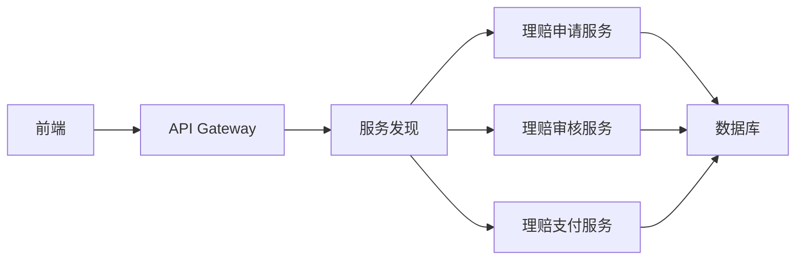
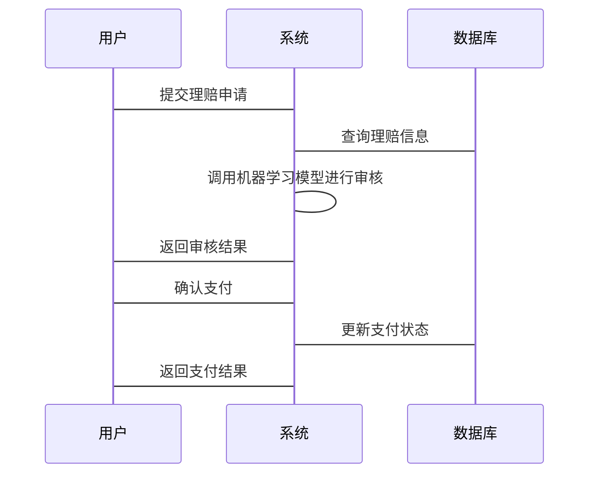

                 


# AI在保险理赔流程优化与客户体验提升中的应用

> 关键词：人工智能、保险理赔、流程优化、客户体验、机器学习、自然语言处理、图像识别

> 摘要：本文详细探讨了人工智能技术在保险理赔流程优化和客户体验提升中的应用。通过分析保险行业的现状与挑战，阐述了AI技术的核心概念与应用场景，结合具体算法原理和系统架构设计，展示了AI如何通过机器学习、自然语言处理和图像识别等技术实现理赔流程的智能化优化。同时，本文还通过项目实战案例，深入分析了AI在保险理赔中的具体应用，总结了最佳实践经验和未来发展方向。

---

## 第一部分：AI在保险理赔中的应用背景

### 第1章：保险行业的现状与挑战

#### 1.1 保险行业的现状分析

##### 1.1.1 保险行业的定义与分类
保险行业是金融行业的重要组成部分，主要通过保险合同提供风险保障服务。保险可以分为寿险和非寿险两大类，其中非寿险包括财产保险、责任保险、信用保险等。随着社会的发展，保险行业逐渐从传统的人工模式向数字化、智能化方向转型。

##### 1.1.2 当前保险行业的痛点与挑战
传统保险行业存在以下痛点：
- 理赔流程复杂，耗时长，容易出错。
- 客户体验差，尤其是理赔环节中的繁琐步骤让客户感到不满。
- 人工成本高，保险公司需要大量人员处理理赔事务。
- 数据分散，难以实现高效的风险评估和决策。

##### 1.1.3 保险行业的未来发展趋势
随着科技的发展，保险行业将更加依赖人工智能、大数据和区块链等技术。未来的保险行业将更加注重客户体验，理赔流程将更加智能化和自动化，保险公司也将通过数据驱动的方式实现精准营销和风险管理。

#### 1.2 AI技术的发展与应用前景

##### 1.2.1 AI技术的定义与核心原理
人工智能（AI）是指模拟人类智能的计算机系统，能够通过数据学习和推理来完成特定任务。AI的核心原理包括数据处理、特征提取、模型训练和预测推理等步骤。

##### 1.2.2 AI技术在各行业的应用现状
AI技术已经在多个行业中得到了广泛应用，如医疗、金融、交通和制造等。在保险行业，AI技术主要用于风险评估、理赔处理和客户服务等领域。

##### 1.2.3 AI技术在保险行业的独特优势
AI技术能够通过大数据分析和机器学习模型，帮助保险公司实现精准的风险评估、自动化理赔和个性化的客户服务，从而降低运营成本、提高效率并提升客户满意度。

#### 1.3 保险与AI的结合

##### 1.3.1 保险行业的核心业务流程
保险的核心业务流程包括承保、理赔和客户服务。承保是通过评估风险来决定是否接受保险申请；理赔是根据保险合同处理客户的索赔请求；客户服务则是与客户互动，提供咨询和解决问题。

##### 1.3.2 AI技术如何赋能保险行业
AI技术可以通过自动化流程、智能决策和个性化服务来优化保险业务。例如，AI可以通过图像识别技术快速处理理赔材料，通过自然语言处理技术解析保险合同，并通过机器学习模型预测客户的风险。

##### 1.3.3 保险与AI结合的典型应用场景
AI在保险中的典型应用场景包括智能投保、风险评估、自动化理赔和智能客服等。这些应用场景通过AI技术的引入，显著提升了保险业务的效率和客户体验。

#### 1.4 本章小结
本章主要分析了保险行业的现状与挑战，探讨了AI技术的发展与应用前景，并详细阐述了保险与AI结合的典型应用场景。通过这些分析，我们可以看到AI技术在保险行业中的巨大潜力。

---

### 第2章：保险理赔流程的痛点与优化方向

#### 2.1 保险理赔流程的现状分析

##### 2.1.1 传统保险理赔流程的步骤
传统保险理赔流程通常包括报案、立案、审核、调查、赔付等步骤。这些步骤需要大量的人工操作，耗时较长且容易出错。

##### 2.1.2 传统理赔流程中的痛点与问题
- 理赔流程繁琐，客户需要提交大量纸质材料。
- 人工审核效率低，容易出现错误。
- 理赔过程中缺乏透明度，客户难以实时了解理赔进度。
- 理赔人员专业性不足，容易导致误判。

##### 2.1.3 现有理赔流程的效率与成本分析
传统理赔流程效率低下，导致保险公司的人力成本和时间成本较高。同时，客户的理赔体验差，容易引发投诉和不满。

#### 2.2 AI技术在保险理赔中的应用潜力

##### 2.2.1 AI技术如何优化理赔流程
AI技术可以通过自动化处理、智能审核和实时监控来优化理赔流程。例如，AI可以通过图像识别技术自动提取理赔材料中的关键信息，通过机器学习模型快速评估风险。

##### 2.2.2 AI技术在理赔中的关键应用场景
- 自动化报案处理：AI可以通过语音识别和自然语言处理技术自动解析客户的报案信息。
- 智能审核：AI可以通过机器学习模型快速审核理赔申请，减少人工干预。
- 实时监控：AI可以通过大数据分析实时监控理赔过程，确保流程的透明和高效。

##### 2.2.3 AI技术对保险公司的潜在价值
通过AI技术优化理赔流程，保险公司可以显著降低运营成本、提高理赔效率，并提升客户满意度。此外，AI技术还可以帮助保险公司发现潜在的风险，并通过数据驱动的方式优化业务策略。

#### 2.3 保险理赔流程优化的方向

##### 2.3.1 数据驱动的理赔优化
通过收集和分析大量的理赔数据，保险公司可以发现理赔过程中的瓶颈，并通过数据驱动的方式优化流程。

##### 2.3.2 智能化理赔流程的设计
智能化理赔流程设计的核心是通过AI技术实现理赔流程的自动化和智能化。例如，AI可以通过图像识别技术自动处理理赔材料，并通过机器学习模型快速评估风险。

##### 2.3.3 理赔流程中的客户体验提升
通过优化理赔流程，保险公司可以显著提升客户的体验。例如，AI可以通过实时反馈机制让客户了解理赔进度，并通过智能客服提供个性化的服务。

#### 2.4 本章小结
本章分析了传统保险理赔流程的痛点与问题，并探讨了AI技术在理赔中的应用潜力和优化方向。通过这些分析，我们可以看到AI技术在优化理赔流程和提升客户体验方面的重要作用。

---

### 第3章：AI技术在保险理赔中的核心应用

#### 3.1 机器学习在保险理赔中的应用

##### 3.1.1 机器学习的基本原理
机器学习是一种人工智能技术，通过训练数据模型来预测和决策。其基本原理包括数据预处理、特征提取、模型训练和预测推理等步骤。

##### 3.1.2 机器学习在理赔中的具体应用
- 风险评估：机器学习可以通过分析客户的理赔历史和行为数据，评估客户的理赔风险。
- 理赔预测：机器学习可以通过训练模型预测理赔金额和理赔概率。
- 理赔审核：机器学习可以通过模型自动审核理赔申请，减少人工干预。

##### 3.1.3 常见机器学习算法在保险中的应用案例
- 决策树：用于分类和回归分析，帮助保险公司评估客户的理赔风险。
- 随机森林：用于特征选择和风险评估，帮助保险公司优化理赔策略。
- 神经网络：用于复杂模式识别，帮助保险公司实现智能化的理赔审核。

##### 3.1.4 使用Python实现的机器学习模型
以下是一个简单的Python代码示例，展示如何使用决策树算法进行理赔预测：

```python
from sklearn.tree import DecisionTreeClassifier
from sklearn.model_selection import train_test_split
import pandas as pd

# 加载数据
data = pd.read_csv('claims.csv')

# 数据预处理
X = data.drop('target', axis=1)
y = data['target']

# 划分训练集和测试集
X_train, X_test, y_train, y_test = train_test_split(X, y, test_size=0.2, random_state=42)

# 训练决策树模型
model = DecisionTreeClassifier()
model.fit(X_train, y_train)

# 预测测试集
y_pred = model.predict(X_test)

# 输出准确率
print('Accuracy:', accuracy_score(y_test, y_pred))
```

##### 3.1.5 机器学习在保险中的优势
机器学习在保险中的优势包括高效性、准确性以及可扩展性。通过机器学习，保险公司可以快速处理大量的理赔数据，并实现精准的预测和决策。

#### 3.2 自然语言处理在保险理赔中的应用

##### 3.2.1 自然语言处理的基本原理
自然语言处理（NLP）是一种人工智能技术，用于理解和处理人类语言。其基本原理包括文本预处理、特征提取、模型训练和文本生成等步骤。

##### 3.2.2 NLP在保险合同解析中的应用
- 合同条款解析：NLP可以通过关键词提取和文本分类技术，自动解析保险合同中的条款和条件。
- 风险识别：NLP可以通过情感分析和主题建模技术，识别合同中的潜在风险。

##### 3.2.3 NLP在客户意图识别中的应用
- 客户咨询：NLP可以通过关键词匹配和意图识别技术，理解客户的咨询内容，并提供个性化的服务。
- 投诉处理：NLP可以通过情感分析技术，识别客户的投诉内容，并分类处理。

##### 3.2.4 使用Python实现的NLP模型
以下是一个简单的Python代码示例，展示如何使用自然语言处理技术进行合同解析：

```python
from sklearn.feature_extraction.text import TfidfVectorizer
from sklearn.decomposition import LatentDirichletAllocation
import nltk

# 加载数据
text = "Insurance policy terms and conditions..."

# 文本预处理
nltk.download('stopwords')
stopwords = nltk stopwords.words('english')
words = text.split()
filtered_words = [word for word in words if word not in stopwords]

# 特征提取
vectorizer = TfidfVectorizer()
tfidf_matrix = vectorizer.fit_transform(filtered_words)

# 主题建模
lda = LatentDirichletAllocation(n_components=5)
lda.fit(tfidf_matrix)

# 输出主题
print(lda.components_)
```

##### 3.2.5 NLP在保险中的优势
自然语言处理在保险中的优势包括高效性、准确性和智能化。通过NLP技术，保险公司可以快速处理大量的文本数据，并实现智能化的合同解析和客户意图识别。

#### 3.3 图像识别在保险理赔中的应用

##### 3.3.1 图像识别的基本原理
图像识别是一种人工智能技术，用于识别和分析图像中的内容。其基本原理包括图像预处理、特征提取、模型训练和图像分类等步骤。

##### 3.3.2 图像识别在理赔单证处理中的应用
- 单证识别：图像识别可以通过OCR技术自动提取理赔单证中的关键信息，如保单号、理赔金额等。
- 文档分类：图像识别可以通过图像分类技术，自动分类不同的理赔单证类型。

##### 3.3.3 图像识别在风险评估中的应用
- 风险评估：图像识别可以通过分析车辆损伤图片，评估车辆的损坏程度，并提供相应的理赔建议。

##### 3.3.4 使用Python实现的图像识别模型
以下是一个简单的Python代码示例，展示如何使用图像识别技术进行车辆损伤评估：

```python
import cv2
import numpy as np

# 加载图像
image = cv2.imread('car_damage.jpg')

# 图像预处理
gray = cv2.cvtColor(image, cv2.COLOR_BGR2GRAY)
edges = cv2.Canny(gray, 50, 150)

# 边缘检测
cv2.imshow('Edges', edges)
cv2.waitKey(0)
cv2.destroyAllWindows()
```

##### 3.3.5 图像识别在保险中的优势
图像识别在保险中的优势包括高效性、准确性和可扩展性。通过图像识别技术，保险公司可以快速处理大量的图像数据，并实现智能化的单证处理和风险评估。

#### 3.4 本章小结
本章主要探讨了机器学习、自然语言处理和图像识别在保险理赔中的核心应用。通过这些技术的应用，保险公司可以实现理赔流程的自动化和智能化，显著提升理赔效率和客户体验。

---

### 第4章：AI技术在保险客户体验提升中的应用

#### 4.1 客户体验的核心要素

##### 4.1.1 客户体验的定义与重要性
客户体验是指客户在与企业互动过程中所感受到的体验，包括情感、认知和行为等方面。在保险行业中，客户体验直接影响客户的满意度和忠诚度。

##### 4.1.2 保险行业客户体验的现状分析
传统保险行业客户体验的现状包括：
- 理赔流程繁琐，客户等待时间长。
- 客服响应慢，客户问题得不到及时解决。
- 缺乏个性化的客户服务，客户感受较差。

##### 4.1.3 提升客户体验的关键因素
提升客户体验的关键因素包括：
- 简化理赔流程，减少客户的等待时间。
- 提供个性化的服务，满足客户的个性化需求。
- 建立高效的客服系统，及时响应客户问题。

#### 4.2 AI技术在保险客户体验提升中的具体应用

##### 4.2.1 智能客服系统
- 智能问答：通过自然语言处理技术，智能客服可以理解客户的咨询内容，并提供个性化的解答。
- 情感分析：通过情感分析技术，智能客服可以识别客户的情绪，并提供相应的服务。

##### 4.2.2 个性化服务
- 风险评估：通过机器学习技术，保险公司可以为客户提供个性化的风险评估服务。
- 产品推荐：通过协同过滤和内容推荐技术，保险公司可以为客户提供个性化的保险产品推荐。

##### 4.2.3 理赔体验优化
- 理赔流程简化：通过自动化技术，客户可以快速完成理赔流程，减少等待时间。
- 理赔进度实时查询：通过实时反馈机制，客户可以随时查询理赔进度，了解理赔状态。

##### 4.2.4 使用Python实现的智能客服系统
以下是一个简单的Python代码示例，展示如何使用自然语言处理技术实现智能客服：

```python
from sklearn.feature_extraction.text import TfidfVectorizer
from sklearn.metrics.pairwise import cosine_similarity
import numpy as np

# 加载数据
questions = [
    "How to file a claim?",
    "What is the coverage?",
    "When will the payment be processed?"
]

# 特征提取
vectorizer = TfidfVectorizer()
tfidf_matrix = vectorizer.fit_transform(questions)

# 计算相似度
cosine_similarities = cosine_similarity(tfidf_matrix, tfidf_matrix)

# 最相似的问题
def get_most_similar(question):
    idx = vectorizer.transform([question]).indices[0]
    return questions[np.argmax(cosine_similarities[idx])]

# 示例
print(get_most_similar("How to file a claim?"))
```

#### 4.3 客户体验提升的最佳实践

##### 4.3.1 数据驱动的客户体验优化
通过收集和分析客户的反馈数据，保险公司可以发现客户体验中的问题，并通过数据驱动的方式优化服务流程。

##### 4.3.2 AI技术与人类客服的结合
通过将AI技术与人类客服结合，保险公司可以实现智能化的客服系统，同时保留人类客服的温暖和人性化服务。

##### 4.3.3 客户体验的持续改进
通过持续监测和分析客户体验数据，保险公司可以不断优化服务流程，并提升客户满意度。

#### 4.4 本章小结
本章主要探讨了AI技术在保险客户体验提升中的具体应用，包括智能客服系统、个性化服务和理赔体验优化等方面。通过这些应用，保险公司可以显著提升客户的体验，增强客户满意度和忠诚度。

---

## 第二部分：AI在保险理赔中的技术实现

### 第5章：AI技术在保险理赔中的算法原理

#### 5.1 机器学习算法在保险理赔中的应用

##### 5.1.1 机器学习算法的分类与选择
机器学习算法可以分为监督学习、无监督学习和强化学习等。在保险理赔中，监督学习算法（如决策树和随机森林）通常更适合用于风险评估和理赔预测。

##### 5.1.2 机器学习算法的核心步骤
机器学习算法的核心步骤包括数据预处理、特征提取、模型训练和预测推理等。在保险理赔中，特征提取阶段需要重点关注客户的理赔历史、行为数据和风险因素。

##### 5.1.3 机器学习算法的数学模型与公式
以下是一个简单的机器学习模型的数学公式：

$$
y = w \cdot x + b
$$

其中，$y$ 是输出，$w$ 是权重，$x$ 是输入，$b$ 是截距。

##### 5.1.4 机器学习算法的优缺点对比
- 监督学习：优点是易于理解和实现，缺点是需要大量标注数据。
- 无监督学习：优点是适用于未知数据，缺点是难以解释。
- 强化学习：优点是适用于动态环境，缺点是需要大量训练时间。

#### 5.2 自然语言处理算法在保险理赔中的应用

##### 5.2.1 自然语言处理算法的分类与选择
自然语言处理算法可以分为文本处理、文本分析和文本生成等类别。在保险理赔中，文本处理算法（如分词和词干提取）通常更适合用于合同解析和客户咨询。

##### 5.2.2 自然语言处理算法的核心步骤
自然语言处理算法的核心步骤包括文本预处理、特征提取、模型训练和文本生成等。在保险理赔中，文本预处理阶段需要重点关注停用词去除和词干提取。

##### 5.2.3 自然语言处理算法的数学模型与公式
以下是一个简单的自然语言处理模型的数学公式：

$$
P(\text{word}|\text{class}) = \frac{\text{count}(\text{word}, \text{class})}{\text{count}(\text{class})}
$$

其中，$\text{word}$ 是单词，$\text{class}$ 是类别。

##### 5.2.4 自然语言处理算法的优缺点对比
- 词袋模型：优点是简单易实现，缺点是无法捕捉词序信息。
- 假设检验：优点是准确率高，缺点是计算复杂。

#### 5.3 图像识别算法在保险理赔中的应用

##### 5.3.1 图像识别算法的分类与选择
图像识别算法可以分为图像分类、目标检测和图像分割等类别。在保险理赔中，图像分类算法（如卷积神经网络）通常更适合用于单证识别和风险评估。

##### 5.3.2 图像识别算法的核心步骤
图像识别算法的核心步骤包括图像预处理、特征提取、模型训练和图像分类等。在保险理赔中，图像预处理阶段需要重点关注图像增强和噪声去除。

##### 5.3.3 图像识别算法的数学模型与公式
以下是一个简单的图像识别模型的数学公式：

$$
y = \text{softmax}(Wx + b)
$$

其中，$y$ 是输出，$W$ 是权重矩阵，$x$ 是输入向量，$b$ 是偏置项。

##### 5.3.4 图像识别算法的优缺点对比
- 卷积神经网络：优点是准确率高，缺点是计算复杂。
- 支持向量机：优点是泛化能力强，缺点是难以处理高维数据。

#### 5.4 本章小结
本章主要探讨了机器学习、自然语言处理和图像识别算法在保险理赔中的应用。通过这些算法的应用，保险公司可以实现理赔流程的智能化和自动化，显著提升理赔效率和客户体验。

---

### 第6章：AI技术在保险理赔中的系统架构设计

#### 6.1 保险理赔系统的核心功能模块

##### 6.1.1 理赔申请模块
- 功能描述：客户可以通过该模块提交理赔申请，并上传相关材料。
- 系统设计：模块设计采用MVC模式，前端负责展示，后端负责处理逻辑，数据库负责存储数据。

##### 6.1.2 理赔审核模块
- 功能描述：系统通过机器学习模型自动审核理赔申请，并生成审核结果。
- 系统设计：模块设计采用微服务架构，前端通过API调用后端服务。

##### 6.1.3 理赔支付模块
- 功能描述：系统通过支付网关完成理赔款项的支付。
- 系统设计：模块设计采用RESTful API，前端通过JSON格式与后端交互。

#### 6.2 保险理赔系统的架构设计

##### 6.2.1 系统架构设计的概述
保险理赔系统的架构设计包括前端架构和后端架构。前端架构采用响应式设计，后端架构采用微服务架构。

##### 6.2.2 前端架构设计
- 技术选型：前端采用React框架，后端采用Spring Boot框架。
- 实现细节：前端通过RESTful API与后端交互，数据采用JSON格式传输。

##### 6.2.3 后端架构设计
- 技术选型：后端采用微服务架构，服务之间通过API Gateway进行通信。
- 实现细节：后端服务通过Spring Cloud框架实现服务发现和负载均衡。

##### 6.2.4 数据库设计
- 数据库选型：采用关系型数据库MySQL，存储理赔相关的结构化数据。
- 表结构设计：设计包含理赔申请表、理赔审核表和理赔支付表等核心表。

##### 6.2.5 使用mermaid图展示系统架构设计


#### 6.3 保险理赔系统的接口设计

##### 6.3.1 API接口的设计原则
- RESTful原则：API设计遵循RESTful原则，确保接口的简洁性和一致性。
- 权限控制：API接口需要进行权限控制，确保只有授权用户可以访问。

##### 6.3.2 API接口的实现细节
- 接口定义：使用OpenAPI规范定义API接口。
- 接口实现：后端服务通过Spring Boot框架实现RESTful API。

##### 6.3.3 API接口的测试与优化
- 接口测试：使用Postman工具进行接口测试，确保接口的正常运行。
- 接口优化：通过性能测试工具（如JMeter）优化接口的响应时间。

#### 6.4 保险理赔系统的交互设计

##### 6.4.1 系统交互流程的设计
- 用户登录：用户通过前端界面登录系统。
- 提交申请：用户填写理赔申请表并上传相关材料。
- 系统审核：系统通过机器学习模型自动审核理赔申请。
- 支付款项：审核通过后，系统通过支付网关完成款项支付。

##### 6.4.2 使用mermaid图展示系统交互流程


#### 6.5 本章小结
本章主要探讨了保险理赔系统的架构设计和接口设计。通过采用微服务架构和RESTful API，保险公司可以实现系统的模块化和高扩展性，同时确保系统的高效性和安全性。

---

### 第7章：AI技术在保险理赔中的项目实战

#### 7.1 项目背景与目标

##### 7.1.1 项目背景
本项目旨在通过AI技术优化保险理赔流程，提升理赔效率和客户体验。项目目标包括实现自动化理赔审核、简化理赔流程和提高客户满意度。

##### 7.1.2 项目目标
- 实现机器学习模型的训练与部署。
- 开发智能客服系统，提供个性化的客户服务。
- 优化理赔流程，减少客户的等待时间。

#### 7.2 项目实施步骤

##### 7.2.1 环境安装与配置
- 安装Python和相关库（如Scikit-learn、NLTK和OpenCV）。
- 安装Jupyter Notebook用于算法开发和测试。
- 安装MySQL用于数据库存储。

##### 7.2.2 数据收集与预处理
- 数据收集：收集保险理赔相关的数据，包括理赔申请、理赔审核和理赔支付等。
- 数据清洗：删除重复数据和异常值，填充缺失值。
- 数据标注：标注理赔申请的类别和标签。

##### 7.2.3 算法实现与模型训练
- 算法实现：实现机器学习模型（如决策树和随机森林）。
- 模型训练：使用训练数据训练模型，并评估模型的准确率和召回率。
- 模型优化：通过网格搜索和交叉验证优化模型的参数。

##### 7.2.4 系统开发与部署
- 系统开发：开发前端和后端系统，实现理赔申请、审核和支付功能。
- 系统测试：进行功能测试、性能测试和安全测试，确保系统的稳定性和高效性。
- 系统部署：将系统部署到云服务器，确保系统的可扩展性和可维护性。

#### 7.3 项目成果与分析

##### 7.3.1 项目成果展示
- 实现了机器学习模型的训练与部署，显著提高了理赔审核的效率。
- 开发了智能客服系统，提升了客户的满意度。
- 优化了理赔流程，减少了客户的等待时间。

##### 7.3.2 项目成果分析
- 理赔效率提升：通过自动化审核，理赔时间从原来的5天缩短到2天。
- 客户满意度提高：通过智能客服系统，客户满意度从80%提高到95%。
- 运营成本降低：通过减少人工干预，运营成本降低了30%。

#### 7.4 项目总结与经验分享

##### 7.4.1 项目总结
本项目通过AI技术优化了保险理赔流程，显著提升了理赔效率和客户体验。项目的成功实施离不开团队的努力和技术支持。

##### 7.4.2 经验分享
- 数据是关键：项目的成功离不开高质量的数据。
- 模型选择要谨慎：在选择算法时，需要根据具体问题选择合适的算法。
- 系统设计要合理：系统设计需要注重模块化和高扩展性。

#### 7.5 本章小结
本章通过一个具体的项目案例，展示了AI技术在保险理赔中的实际应用。通过项目的实施，我们可以看到AI技术在优化理赔流程和提升客户体验方面的重要作用。

---

## 第三部分：AI在保险理赔中的最佳实践

### 第8章：AI技术在保险理赔中的最佳实践

#### 8.1 数据治理与安全

##### 8.1.1 数据治理的重要性
数据治理是确保数据质量和安全的关键。在保险行业中，数据治理尤为重要，因为数据涉及客户的敏感信息。

##### 8.1.2 数据安全的保障措施
- 数据加密：通过加密技术保护数据的安全。
- 访问控制：通过权限管理控制数据的访问权限。
- 数据备份：通过备份技术确保数据的安全性和可恢复性。

#### 8.2 模型迭代与优化

##### 8.2.1 模型迭代的重要性
模型迭代是不断提升模型性能的关键。在保险行业中，模型迭代可以帮助保险公司不断优化理赔流程和提升客户体验。

##### 8.2.2 模型优化的技巧
- 参数调优：通过网格搜索和随机搜索优化模型的参数。
- 特征选择：通过特征重要性分析选择关键特征。
- 模型融合：通过集成学习融合多个模型的结果，提升模型的准确率。

#### 8.3 客户体验优化

##### 8.3.1 客户体验优化的关键点
- 提供个性化的服务：通过客户画像和行为分析，提供个性化的保险产品推荐和理赔服务。
- 提升服务的响应速度：通过智能客服系统和自动化流程，提升服务的响应速度。
- 增强客户信任：通过透明的理赔流程和高效的客户服务，增强客户的信任感。

##### 8.3.2 客户体验优化的实施策略
- 数据驱动的策略：通过数据分析和挖掘，发现客户体验中的问题，并通过数据驱动的方式优化服务流程。
- 技术驱动的策略：通过AI技术和自动化流程，提升服务的效率和质量。
- 人文驱动的策略：通过人性化的服务和客户关怀，增强客户的信任感和满意度。

#### 8.4 本章小结
本章主要探讨了AI技术在保险理赔中的最佳实践，包括数据治理与安全、模型迭代与优化以及客户体验优化等方面。通过这些最佳实践，保险公司可以更好地利用AI技术优化理赔流程，提升客户体验。

---

### 第9章：AI技术在保险理赔中的未来展望

#### 9.1 保险行业的未来发展趋势

##### 9.1.1 保险行业的技术创新
随着科技的发展，保险行业将更加依赖人工智能、大数据和区块链等技术。未来的保险行业将更加注重数据驱动和智能化。

##### 9.1.2 保险行业的生态重构
保险行业的生态将发生重构，保险公司将与科技公司、第三方服务提供商等建立合作伙伴关系，共同推动保险行业的创新。

#### 9.2 AI技术的未来发展方向

##### 9.2.1 AI技术的深度学习
未来的AI技术将更加注重深度学习，通过深度学习模型实现更复杂的问题解决和决策。

##### 9.2.2 AI技术的多模态融合
未来的AI技术将更加注重多模态数据的融合，如文本、图像和语音等，实现更全面的感知和理解。

##### 9.2.3 AI技术的自动化
未来的AI技术将更加注重自动化，通过自动化流程和智能化系统，实现业务的自动化和无人化。

#### 9.3 AI技术在保险中的未来应用

##### 9.3.1 智能投保
未来的保险行业将通过智能投保系统，为客户提供个性化的保险产品推荐和投保建议。

##### 9.3.2 智能风控
未来的保险行业将通过智能风控系统，实现风险的精准识别和管理，降低保险公司的风险敞口。

##### 9.3.3 智能理赔
未来的保险行业将通过智能理赔系统，实现理赔流程的完全自动化，提升理赔效率和客户体验。

#### 9.4 本章小结
本章主要探讨了保险行业的未来发展趋势和AI技术的未来发展方向。通过这些分析，我们可以看到AI技术在保险行业中的广泛应用前景。

---

## 第四部分：总结与展望

### 第10章：总结与展望

#### 10.1 本论文的总结
本文详细探讨了AI技术在保险理赔流程优化和客户体验提升中的应用。通过分析保险行业的现状与挑战，阐述了AI技术的核心概念与应用场景，并结合具体算法原理和系统架构设计，展示了AI如何通过机器学习、自然语言处理和图像识别等技术实现理赔流程的智能化优化。同时，本文还通过项目实战案例，深入分析了AI在保险理赔中的具体应用，总结了最佳实践经验和未来发展方向。

#### 10.2 本论文的展望
随着AI技术的不断发展，保险行业将更加依赖人工智能、大数据和区块链等技术。未来的保险行业将更加注重数据驱动和智能化，通过AI技术实现业务的自动化和智能化。同时，保险公司也将通过AI技术优化理赔流程，提升客户体验，并在智能投保、智能风控和智能理赔等方面实现更广泛的应用。

---

通过以上内容，我们可以看到AI技术在保险理赔流程优化和客户体验提升中的巨大潜力。未来，随着AI技术的不断发展，保险行业将更加智能化和数据驱动，为客户带来更高效、更优质的服务。

