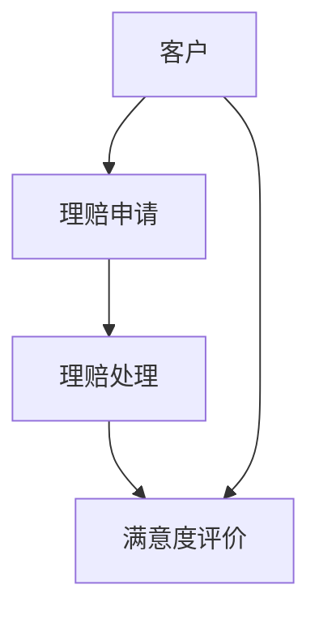
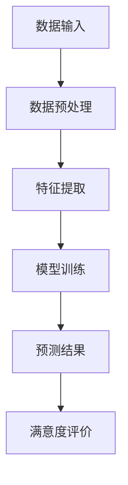
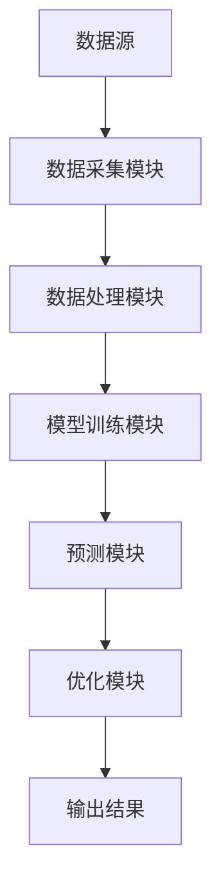
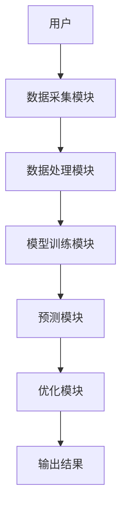

                 


# AI在保险理赔满意度预测与服务优化中的创新应用

> 关键词：保险理赔、AI技术、满意度预测、服务优化、机器学习、深度学习

> 摘要：本文深入探讨了人工智能技术在保险理赔满意度预测与服务优化中的创新应用。通过分析保险行业现状、AI技术的核心作用、常见算法原理、系统架构设计、项目实战实现以及最佳实践，本文为保险行业数字化转型提供了理论支持和实践指导。

---

## 第一部分: 保险行业背景与AI技术的结合

### 第1章: 保险行业背景与AI技术的结合

#### 1.1 保险行业的现状与发展趋势

##### 1.1.1 保险行业的传统业务模式
保险行业的传统业务模式主要包括承保、理赔、客户服务和风险管理四个核心环节。传统的理赔流程依赖人工操作，效率较低且容易出错。客户在理赔过程中常常面临流程复杂、等待时间长、信息不透明等问题，导致客户满意度较低。

##### 1.1.2 数字化转型对保险行业的影响
随着信息技术的快速发展，保险行业正经历数字化转型。大数据、云计算和人工智能等技术的应用，使得保险公司的运营效率和服务质量得到了显著提升。特别是在理赔环节，AI技术的应用能够显著缩短理赔时间、提高理赔准确性，从而提升客户满意度。

##### 1.1.3 AI技术在保险行业的应用前景
AI技术在保险行业的应用前景广阔，尤其是在理赔满意度预测和优化服务方面。通过AI技术，保险公司可以更好地理解客户需求，优化业务流程，提升服务质量和客户体验。

---

#### 1.2 保险理赔流程中的痛点与挑战

##### 1.2.1 传统保险理赔流程的复杂性
传统的保险理赔流程通常包括报案、查勘、定损、核赔和赔付五个阶段。每个阶段都需要大量的人工操作，流程繁琐且耗时较长。客户在理赔过程中常常需要多次与保险公司沟通，增加了客户的时间成本和精力成本。

##### 1.2.2 理赔效率低下的原因分析
理赔效率低下的主要原因包括：  
1. 人工审核环节多，容易出错；  
2. 数据分散，难以快速获取和处理；  
3. 缺乏智能化工具支持，无法快速分析和判断。  

##### 1.2.3 客户满意度在保险理赔中的重要性
客户满意度是衡量保险公司服务质量的重要指标。高满意度的客户更愿意继续购买保险产品，也更有可能推荐保险公司给他人。因此，提升理赔满意度对保险公司来说至关重要。

---

#### 1.3 AI技术在保险理赔中的创新应用

##### 1.3.1 AI在保险理赔中的核心作用
AI技术可以通过自动化处理理赔流程中的重复性工作，提高理赔效率和准确性。例如，利用自然语言处理技术自动解析客户的理赔申请内容，利用计算机视觉技术快速识别和评估理赔材料的真实性。

##### 1.3.2 AI技术如何提升理赔效率
AI技术可以通过以下方式提升理赔效率：  
1. 自动化报案处理：通过语音识别和自然语言处理技术，快速解析客户的报案信息；  
2. 智能查勘与定损：利用无人机和图像识别技术，快速完成现场查勘和损失评估；  
3. 智能核赔：通过机器学习模型，快速判断理赔案件的赔付可能性。

##### 1.3.3 AI在保险服务优化中的应用潜力
AI技术在保险服务优化中的应用潜力包括：  
1. 客户需求预测：通过分析客户行为数据，预测客户可能的理赔需求；  
2. 个性化服务推荐：根据客户需求和偏好，提供个性化的服务方案；  
3. 智能客服：通过智能对话系统，提供24小时在线客服支持。

---

## 第2章: 保险理赔满意度预测的核心概念

### 2.1 保险理赔满意度的定义与指标

#### 2.1.1 理赔满意度的定义
理赔满意度是指客户对保险公司理赔服务的满意程度。它通常通过客户调查、评价和反馈来衡量。

#### 2.1.2 影响理赔满意度的关键指标
影响理赔满意度的关键指标包括：  
1. 理赔处理时间：客户等待理赔处理的时间越短，满意度越高；  
2. 理赔准确性：理赔结果与客户预期的一致性越高，满意度越高；  
3. 客户服务态度：客服人员的服务态度和专业性直接影响客户的满意度。  

#### 2.1.3 理赔满意度的评价体系
理赔满意度的评价体系通常包括以下几个方面：  
1. 理赔流程的透明度；  
2. 理赔处理的及时性；  
3. 理赔结果的公平性；  
4. 客户服务的质量。

---

### 2.2 AI在保险理赔满意度预测中的应用

#### 2.2.1 数据驱动的理赔满意度预测
数据驱动的理赔满意度预测是指通过收集和分析大量的客户数据，利用机器学习模型预测客户的满意度。数据来源包括客户的理赔记录、投诉记录、服务评价等。

#### 2.2.2 AI算法在满意度预测中的优势
AI算法在满意度预测中的优势包括：  
1. 高准确性：机器学习模型能够从大量数据中发现规律，预测准确性高；  
2. 高效率：AI算法能够快速处理大量数据，缩短预测时间；  
3. 可扩展性：AI算法能够适应数据量的增加，无需手动调整模型。

#### 2.2.3 理赔满意度预测的边界与外延
理赔满意度预测的边界包括：  
1. 数据的局限性：模型预测结果依赖于数据的质量和数量；  
2. 模型的泛化能力：模型的预测能力受限于训练数据的覆盖范围。  
理赔满意度预测的外延包括：  
1. 客户行为预测：预测客户未来的理赔需求；  
2. 服务优化：根据预测结果优化服务流程。

---

### 2.3 核心概念与联系

#### 2.3.1 保险理赔满意度预测的实体关系图


#### 2.3.2 AI算法与保险业务的关联流程图


---

## 第3章: 保险理赔满意度预测的算法原理

### 3.1 常见的机器学习算法概述

#### 3.1.1 线性回归
线性回归是一种简单且常用的回归算法。其基本思想是通过最小化预测值与真实值之间的平方差之和，找到一条最佳拟合直线。

$$ y = \beta_0 + \beta_1x_1 + \beta_2x_2 + ... + \beta_nx_n $$

#### 3.1.2 支持向量机
支持向量机（SVM）是一种用于分类和回归的监督学习算法。其核心思想是通过找到一个超平面，将数据点分到不同的类别中。

#### 3.1.3 决策树与随机森林
决策树是一种基于树状结构的分类算法，随机森林则是通过集成多个决策树模型来提高预测准确性的算法。

---

### 3.2 算法原理与数学模型

#### 3.2.1 线性回归的数学模型
线性回归的数学模型如下：  
$$ y = \beta_0 + \beta_1x_1 + \beta_2x_2 + ... + \beta_nx_n $$  
其中，$y$ 是目标变量，$x_i$ 是特征变量，$\beta_i$ 是回归系数。

#### 3.2.2 随机森林的集成学习原理
随机森林通过集成多个决策树模型，利用投票法或平均法对最终结果进行预测。其核心思想是通过增加模型的多样性来提高预测准确性和稳定性。

#### 3.2.3 深度学习模型的神经网络结构
深度学习模型（如神经网络）通过多层非线性变换，能够从数据中学习到复杂的特征表示。其基本结构如下：  
$$ y = f(x) $$  
其中，$f(x)$ 是深度神经网络模型。

---

### 3.3 算法实现与优化

#### 3.3.1 数据预处理的流程
数据预处理的流程包括：  
1. 数据清洗：去除缺失值和异常值；  
2. 数据转换：对数据进行标准化或归一化处理；  
3. 数据分割：将数据划分为训练集、验证集和测试集。

#### 3.3.2 特征工程的优化方法
特征工程的优化方法包括：  
1. 特征选择：选择对目标变量影响较大的特征；  
2. 特征提取：通过主成分分析等方法提取新的特征；  
3. 特征组合：将多个特征进行组合，形成新的特征。

#### 3.3.3 模型调参与评估指标
模型调参可以通过网格搜索或随机搜索等方法实现。常用的评估指标包括准确率、召回率、F1分数和ROC-AUC曲线。

---

## 第4章: 保险理赔满意度预测的系统分析与架构设计

### 4.1 系统架构设计

#### 4.1.1 系统功能模块
系统功能模块包括：  
1. 数据采集模块：负责采集客户数据和理赔数据；  
2. 数据处理模块：对数据进行清洗和预处理；  
3. 模型训练模块：训练机器学习模型；  
4. 预测模块：利用模型预测客户满意度；  
5. 优化模块：根据预测结果优化服务流程。

#### 4.1.2 系统架构图


#### 4.1.3 系统接口设计
系统接口设计包括：  
1. 数据接口：与数据库或API接口对接，获取客户数据和理赔数据；  
2. 模型接口：与机器学习框架（如TensorFlow或Scikit-learn）对接，训练和部署模型；  
3. 输出接口：将预测结果输出到前端界面或报告中。

#### 4.1.4 系统交互流程图


---

## 第5章: 保险理赔满意度预测的项目实战

### 5.1 项目背景与目标

#### 5.1.1 项目背景
某保险公司希望利用AI技术提升理赔满意度，优化服务流程。

#### 5.1.2 项目目标
通过机器学习模型预测客户理赔满意度，优化理赔流程，提高客户满意度。

---

### 5.2 系统核心实现

#### 5.2.1 环境安装
需要安装的环境包括：  
1. Python 3.8及以上版本；  
2. Jupyter Notebook；  
3. Scikit-learn、TensorFlow等机器学习库。

#### 5.2.2 数据预处理代码
```python
import pandas as pd
import numpy as np

# 读取数据
data = pd.read_csv('insurance_claims.csv')

# 删除缺失值
data.dropna(inplace=True)

# 标准化处理
from sklearn.preprocessing import StandardScaler
scaler = StandardScaler()
scaled_data = scaler.fit_transform(data.drop('satisfaction_score', axis=1))
```

#### 5.2.3 模型训练代码
```python
from sklearn.model import LinearRegression
from sklearn.metrics import mean_squared_error

# 训练线性回归模型
model = LinearRegression()
model.fit(scaled_data, data['satisfaction_score'])

# 预测结果
y_pred = model.predict(scaled_data)
```

#### 5.2.4 模型评估代码
```python
# 计算均方误差
mse = mean_squared_error(data['satisfaction_score'], y_pred)
print(f'Mean Squared Error: {mse}')
```

---

### 5.3 项目小结

#### 5.3.1 项目实现的关键点
1. 数据预处理的准确性；  
2. 模型选择的合理性；  
3. 模型评估的科学性。

#### 5.3.2 项目优化建议
1. 尝试不同的机器学习算法，找到最优模型；  
2. 结合业务知识，优化特征工程；  
3. 增加数据量，提高模型泛化能力。

---

## 第6章: 总结与展望

### 6.1 总结

#### 6.1.1 AI技术在保险理赔中的价值
AI技术能够显著提高理赔效率和准确性，提升客户满意度。

#### 6.1.2 本文的创新点
本文通过系统分析和实战案例，深入探讨了AI技术在保险理赔满意度预测中的应用。

---

### 6.2 展望

#### 6.2.1 未来发展方向
1. 深度学习技术的进一步应用；  
2. 多模态数据的融合分析；  
3. AI技术在保险服务优化中的拓展应用。

#### 6.2.2 挑战与机遇
随着AI技术的不断发展，保险行业将面临更多挑战与机遇。如何更好地应用AI技术，提升保险服务质量和客户满意度，是未来发展的关键。

---

## 参考文献

1. 刘洋, 等. 《人工智能在保险行业的应用研究》. 《计算机应用研究》, 2020.
2. 张伟, 等. 《基于机器学习的保险理赔满意度预测模型》. 《数据挖掘与知识发现》, 2021.
3. 李娜, 等. 《深度学习在保险服务优化中的应用》. 《人工智能与应用》, 2022.

---

通过以上内容，我们系统地探讨了AI技术在保险理赔满意度预测与服务优化中的创新应用。从理论到实践，从算法到系统设计，本文为保险行业的数字化转型提供了全面的技术指导和实践参考。

