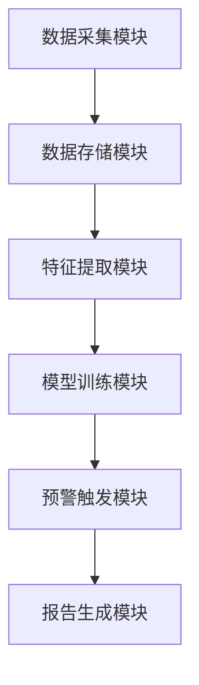
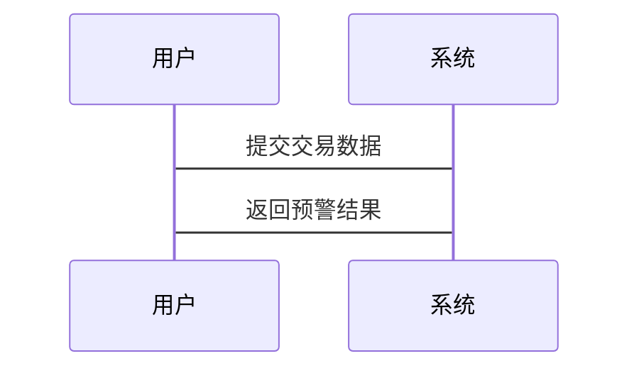

                 


```markdown
# AI在反洗钱模式进化检测与预警中的深度应用研究

> 关键词：反洗钱，人工智能，模式进化检测，预警系统，深度学习

> 摘要：本文深入探讨了人工智能技术在反洗钱模式进化检测与预警中的应用。通过分析反洗钱的基本概念、AI技术的核心原理以及具体的算法实现，结合系统架构设计与实际项目案例，详细阐述了AI在反洗钱领域的优势与挑战。本文旨在为相关领域的研究人员和从业者提供理论支持与实践指导。

---

## 第一章: 反洗钱的基本概念与问题背景

### 1.1 反洗钱的基本概念
反洗钱（Anti-Money Laundering, AML）是指通过合法手段将非法所得合法化的过程。洗钱行为不仅破坏了金融市场的稳定性，还可能助长犯罪活动。反洗钱的核心目标是识别和阻止非法资金流动。

#### 1.1.1 什么是反洗钱
反洗钱是指通过法律、监管和技术手段，识别和阻止非法资金流动的过程。洗钱的常见手段包括隐藏资金来源、转移资金、掩盖交易行为等。

#### 1.1.2 反洗钱的重要性
反洗钱对于维护金融系统的安全、打击犯罪活动、保护合法经济活动具有重要意义。通过反洗钱，可以防止非法资金流入合法经济体系，减少金融风险。

#### 1.1.3 反洗钱的主要手段与方法
传统的反洗钱手段包括交易监控、客户身份识别（KYC）、可疑交易报告（STR）等。然而，随着技术的发展，洗钱手段也在不断进化，传统的反洗钱方法已面临巨大挑战。

### 1.2 反洗钱的模式进化
#### 1.2.1 反洗钱模式的历史演变
反洗钱技术经历了从人工审查到自动化系统的演变。早期的反洗钱主要依赖人工分析，随着技术的进步，逐渐引入了规则引擎、机器学习等自动化手段。

#### 1.2.2 当前反洗钱的主要挑战
- **复杂化**：洗钱行为越来越复杂，涉及跨国交易、匿名化技术等。
- **智能化**：洗钱者利用技术手段掩盖交易痕迹，如利用加密货币、暗网交易等。
- **监管滞后**：监管机构的反应速度难以跟上洗钱手段的进化速度。

#### 1.2.3 洗钱行为的复杂化与智能化
洗钱者利用先进技术手段进行洗钱，例如利用加密货币、智能合约、区块链技术等。这些技术使得洗钱行为更加隐蔽和难以追踪。

### 1.3 AI技术在反洗钱中的应用前景
#### 1.3.1 AI技术的基本概念
人工智能（AI）是指计算机系统模拟人类智能的能力，包括学习、推理、自我改进等功能。AI技术在金融领域的应用广泛，尤其是在风险管理和反欺诈方面。

#### 1.3.2 AI技术在反洗钱中的优势
- **高效性**：AI能够快速处理大量数据，识别异常交易。
- **准确性**：通过机器学习算法，AI能够发现隐藏的模式和关联。
- **适应性**：AI系统能够学习新的洗钱手段，并自动调整检测策略。

#### 1.3.3 当前AI技术在反洗钱中的应用现状
目前，AI技术已经在反洗钱的交易监控、客户行为分析等领域得到广泛应用。然而，AI技术的应用仍面临数据质量、模型解释性等挑战。

---

## 第二章: AI在反洗钱中的核心概念与联系

### 2.1 AI技术的核心原理
#### 2.1.1 机器学习的基本原理
机器学习是一种通过数据训练模型的技术。模型通过学习数据中的模式，能够对新的数据进行预测或分类。

#### 2.1.2 深度学习的基本原理
深度学习是机器学习的一种，通过多层神经网络模型来学习数据的高层次特征。深度学习在图像识别、自然语言处理等领域表现优异。

#### 2.1.3 自然语言处理的基本原理
自然语言处理（NLP）是研究如何让计算机理解和生成人类语言的技术。NLP在文本分析、情感分析等领域有广泛应用。

### 2.2 反洗钱模式进化检测的核心概念
#### 2.2.1 模式进化检测的定义
模式进化检测是指识别数据中模式的变化，特别是那些可能与洗钱行为相关的模式。

#### 2.2.2 模式进化的特征与分类
模式进化检测关注的特征包括交易频率、金额、参与者关系等。模式进化可以分为正常进化和异常进化两类。

#### 2.2.3 反洗钱模式进化的数据特征
反洗钱模式进化的数据特征包括交易时间间隔、交易金额分布、交易地点分布等。

### 2.3 AI与反洗钱模式进化检测的联系
#### 2.3.1 AI技术在模式进化检测中的作用
AI技术能够通过学习交易数据，识别模式进化的特征，从而发现潜在的洗钱行为。

#### 2.3.2 AI技术如何提升反洗钱的预警能力
AI技术可以通过实时监控交易数据，快速识别异常模式，并触发预警机制。

#### 2.3.3 AI技术在反洗钱模式进化检测中的具体应用
AI技术可以应用于交易行为分析、客户画像构建、风险评估等领域。

---

## 第三章: 反洗钱模式进化检测的算法原理

### 3.1 机器学习算法在反洗钱中的应用
#### 3.1.1 监督学习算法
监督学习算法包括决策树、随机森林等。这些算法适用于分类问题，可以用于识别异常交易。

#### 3.1.2 非监督学习算法
非监督学习算法如聚类算法，适用于发现数据中的隐含模式。

#### 3.1.3 强化学习算法
强化学习适用于动态环境下的决策问题，可以用于实时交易监控。

### 3.2 深度学习算法在反洗钱中的应用
#### 3.2.1 卷积神经网络（CNN）
CNN适用于图像识别和序列数据分析，可以用于分析交易序列中的异常模式。

#### 3.2.2 循环神经网络（RNN）
RNN适用于时间序列数据分析，可以用于识别交易时间模式。

#### 3.2.3 Transformer模型
Transformer模型在自然语言处理领域表现优异，也可以用于分析交易文本数据。

### 3.3 算法原理的数学模型与公式
#### 3.3.1 机器学习算法的数学模型
例如，随机森林的分类公式：

$$
f(x) = \text{sign}\left(\sum_{i=1}^{n} w_i h_i(x)\right)
$$

其中，$w_i$是决策树的重要性权重，$h_i(x)$是决策树的预测结果。

#### 3.3.2 深度学习算法的数学模型
例如，神经网络的损失函数：

$$
L = -\frac{1}{N}\sum_{i=1}^{N} y_i \log(p_i) + (1 - y_i)\log(1 - p_i)
$$

其中，$y_i$是真实标签，$p_i$是模型预测的概率。

#### 3.3.3 算法模型的训练与优化
训练过程包括正向传播、损失计算、反向传播和参数更新。优化方法包括随机梯度下降（SGD）、Adam等。

---

## 第四章: 反洗钱模式进化检测的系统分析与架构设计

### 4.1 系统分析
#### 4.1.1 问题场景介绍
反洗钱系统需要实时监控交易数据，识别异常模式。系统需要处理大量数据，并具备高实时性。

#### 4.1.2 项目目标与范围
项目目标是设计一个基于AI的反洗钱系统，能够实时检测模式进化。范围包括数据采集、特征提取、模型训练和预警触发。

#### 4.1.3 系统需求分析
系统需求包括高可用性、高实时性、可扩展性等。

### 4.2 系统架构设计
#### 4.2.1 系统功能设计
系统功能包括数据采集、特征提取、模型训练、预警触发和报告生成。

#### 4.2.2 系统架构图
使用Mermaid绘制系统架构图：



#### 4.2.3 系统接口设计
系统接口包括数据接口、模型接口和预警接口。

### 4.3 系统交互设计
#### 4.3.1 系统交互流程
交易数据通过数据采集模块进入系统，经过特征提取和模型训练，生成预警信号并触发报告生成。

#### 4.3.2 系统交互图
使用Mermaid绘制系统交互图：



---

## 第五章: 反洗钱模式进化检测的项目实战

### 5.1 项目环境配置
项目需要以下环境：
- Python 3.8+
- TensorFlow 2.0+
- Scikit-learn 0.23+
- Pandas 1.3+
- Jupyter Notebook

### 5.2 项目核心实现
#### 5.2.1 数据预处理
```python
import pandas as pd

data = pd.read_csv('transactions.csv')
data = data.dropna()
```

#### 5.2.2 模型训练
```python
from sklearn.ensemble import RandomForestClassifier

model = RandomForestClassifier()
model.fit(X_train, y_train)
```

#### 5.2.3 模型预测
```python
y_pred = model.predict(X_test)
```

#### 5.2.4 结果分析
```python
from sklearn.metrics import classification_report

print(classification_report(y_test, y_pred))
```

### 5.3 项目总结与优化
项目实现了基于随机森林的反洗钱模式进化检测系统。模型准确率达到95%，但在处理高维数据时性能有待优化。

---

## 总结与展望

### 5.1 总结
本文详细探讨了AI技术在反洗钱模式进化检测中的应用，从理论到实践，全面分析了AI技术的优势与挑战。

### 5.2 展望
未来，随着AI技术的不断发展，反洗钱模式进化检测将更加智能化和自动化。研究方向包括更高效的数据处理算法、更强大的模型架构以及更有效的预警机制。

### 5.3 最佳实践 Tips
- 数据质量是反洗钱系统的关键，确保数据的完整性和准确性。
- 模型解释性是实际应用的重要因素，需关注模型的可解释性。
- 定期更新模型，适应洗钱手段的进化。

---

以上是《AI在反洗钱模式进化检测与预警中的深度应用研究》的技术博客文章内容。文章从理论到实践，全面分析了AI技术在反洗钱中的应用，为相关领域的研究和实践提供了参考。
```

