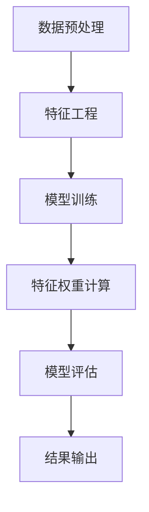
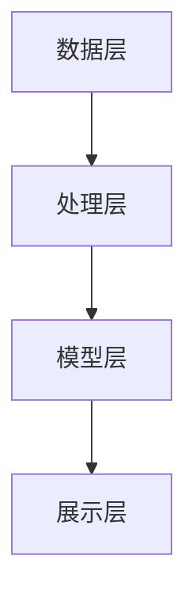
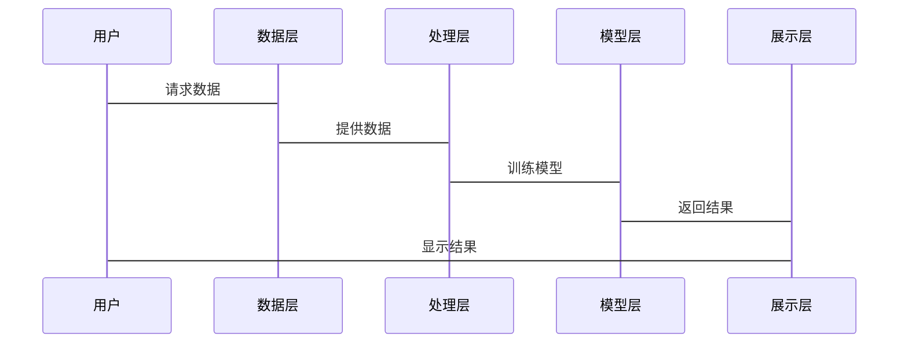

                 


# AI在实现费雪的增长型公司特征分析中的应用

> 关键词：人工智能、费雪模型、增长型公司、特征分析、机器学习、数据挖掘

> 摘要：本文探讨了人工智能在分析和预测增长型公司特征中的应用。通过结合费雪的投资理论，利用机器学习算法，我们展示了如何提取和评估公司特征，以识别具备增长潜力的企业。文章详细介绍了数据预处理、特征工程、模型选择和系统架构设计，并通过实际案例展示了AI在这一领域的优势。

---

# 第1章: AI与费雪增长型公司特征分析概述

## 1.1 AI的基本概念与技术背景

### 1.1.1 人工智能的定义与核心原理
人工智能（AI）是模拟人类智能的计算机系统，涵盖学习、推理、问题解决和自然语言处理等功能。其核心原理包括数据处理、特征提取、模型训练和预测输出。

### 1.1.2 机器学习与深度学习的简介
机器学习是AI的重要分支，通过数据训练模型以识别模式。深度学习作为机器学习的子领域，使用多层神经网络处理复杂数据，如图像和文本。

### 1.1.3 AI在金融领域的应用现状
AI广泛应用于金融领域，包括股票预测、风险评估和欺诈检测。其优势在于快速处理大量数据和复杂模式识别。

## 1.2 费雪增长型公司的特征分析

### 1.2.1 费雪模型的核心思想
费雪模型强调投资于收入稳定增长、利润率高的公司，这些公司具备持续增长的潜力。

### 1.2.2 增长型公司的定义与关键特征
增长型公司通常表现出收入和利润的持续增长，具备强大的市场地位和创新能力。

### 1.2.3 费雪模型在投资分析中的应用
费雪模型帮助投资者识别具备长期增长潜力的公司，常用于股票筛选和投资组合优化。

## 1.3 AI与费雪增长型公司特征分析的结合

### 1.3.1 AI技术在金融分析中的优势
AI能够高效处理大量数据，发现人类难以察觉的模式，提升分析效率和准确性。

### 1.3.2 费雪模型与AI结合的可行性
通过AI分析财务数据，费雪模型的应用得以自动化和优化，提升投资决策的科学性。

### 1.3.3 本章小结
AI技术为费雪增长型公司的特征分析提供了新的工具和方法，显著提升了分析效率和准确率。

---

# 第2章: 费雪增长型公司特征的AI分析框架

## 2.1 费雪增长型公司的核心特征

### 2.1.1 收入增长性
收入增长性是衡量公司增长潜力的关键指标，通常通过收入增长率和收入稳定性来评估。

### 2.1.2 利润能力
盈利能力反映了公司创造利润的能力，常用的指标包括净利润率、毛利率和净资产收益率。

### 2.1.3 市场地位
市场地位决定了公司在行业中的竞争力，通常通过市场份额、品牌价值和客户忠诚度来衡量。

## 2.2 AI在特征分析中的应用

### 2.2.1 数据特征提取
通过自然语言处理和统计方法，AI从财务报表和市场数据中提取关键特征。

### 2.2.2 模型特征选择
使用特征重要性分析和递归特征消除法，AI优化特征选择，提高模型性能。

### 2.2.3 特征权重计算
通过梯度提升和随机森林算法，AI计算特征权重，识别对预测影响最大的特征。

## 2.3 费雪增长型公司特征与AI技术的联系

### 2.3.1 数据特征与AI模型的关系
数据特征直接影响模型表现，AI通过特征工程优化数据，提升预测准确性。

### 2.3.2 AI算法对特征分析的优化作用
AI算法能够自动识别和提取关键特征，减少人为误差，提高分析效率。

### 2.3.3 本章小结
AI技术显著优化了费雪增长型公司的特征分析，通过自动化和智能化提升分析的准确性和效率。

---

# 第3章: 基于机器学习的特征分析算法

## 3.1 机器学习算法简介

### 3.1.1 监督学习与无监督学习
监督学习使用标记数据训练模型，无监督学习则发现数据中的隐藏结构。

### 3.1.2 常见机器学习算法
包括线性回归、逻辑回归、决策树、随机森林和神经网络等。

## 3.2 基于AI的特征分析算法原理

### 3.2.1 数据预处理与特征工程
数据清洗、缺失值处理、标准化等步骤确保数据质量，特征工程提取有用特征。

### 3.2.2 模型训练与优化
使用交叉验证选择最优模型，调整参数以平衡准确性和泛化能力。

### 3.2.3 模型评估与调优
通过准确率、召回率和F1分数评估模型性能，进行超参数调优以提升性能。

## 3.3 特征权重计算的数学模型

### 3.3.1 特征重要性评估方法
使用SHAP值和特征贡献度分析，评估每个特征对预测结果的影响。

### 3.3.2 基于梯度提升的特征权重计算
通过梯度提升模型，计算每个特征的权重，识别对预测结果贡献最大的特征。

### 3.3.3 示例代码与实现
```python
import pandas as pd
from sklearn.ensemble import GradientBoostingClassifier
from sklearn.feature_selection import SelectFromModel

# 假设data_frame包含特征和标签
data_frame = pd.read_csv('data.csv')
X = data_frame.drop('label', axis=1)
y = data_frame['label']

# 使用梯度提升模型计算特征权重
model = GradientBoostingClassifier()
model.fit(X, y)
feature_importances = model.feature_importances_

# 选择重要特征
selector = SelectFromModel(model, prefit=True)
selected_features = selector.transform(X)
```

### 3.4 算法流程图



---

# 第4章: 系统分析与架构设计

## 4.1 系统功能设计

### 4.1.1 数据采集模块
从数据库或API获取公司数据，包括财务数据和市场数据。

### 4.1.2 特征分析模块
进行特征提取和特征选择，计算特征权重。

### 4.1.3 模型训练模块
训练机器学习模型，评估模型性能。

### 4.1.4 结果展示模块
可视化分析结果，展示特征重要性和预测结果。

## 4.2 系统架构设计

### 4.2.1 分层架构
- **数据层**：存储原始数据。
- **处理层**：处理和转换数据。
- **模型层**：训练和部署模型。
- **展示层**：展示分析结果。

### 4.2.2 系统架构图



## 4.3 接口设计与交互流程

### 4.3.1 数据接口
- **输入接口**：接收原始数据。
- **输出接口**：返回处理后的数据。

### 4.3.2 模型接口
- **训练接口**：接收训练数据，返回训练好的模型。
- **预测接口**：接收输入数据，返回预测结果。

### 4.3.3 交互流程图



---

# 第5章: 项目实战

## 5.1 环境安装与数据准备

### 5.1.1 环境安装
安装必要的库，如scikit-learn、pandas、numpy和mermaid。

### 5.1.2 数据准备
从数据库或CSV文件加载数据，进行数据清洗和预处理。

## 5.2 系统核心实现

### 5.2.1 数据预处理
处理缺失值、异常值，进行数据标准化。

### 5.2.2 特征工程
提取关键特征，进行特征选择和降维。

### 5.2.3 模型训练
训练机器学习模型，评估模型性能，调优参数。

## 5.3 代码实现与解读

### 5.3.1 数据预处理代码
```python
import pandas as pd
import numpy as np

# 加载数据
data = pd.read_csv('data.csv')

# 处理缺失值
data = data.dropna()

# 标准化数据
from sklearn.preprocessing import StandardScaler
scaler = StandardScaler()
data_scaled = scaler.fit_transform(data)
```

### 5.3.2 特征选择与模型训练代码
```python
from sklearn.ensemble import GradientBoostingClassifier
from sklearn.feature_selection import SelectFromModel

model = GradientBoostingClassifier()
model.fit(X, y)
selector = SelectFromModel(model, prefit=True)
selected_features = selector.transform(X)
```

### 5.3.3 模型评估代码
```python
from sklearn.metrics import accuracy_score, precision_score, recall_score, f1_score

y_pred = model.predict(X_test)
print("准确率:", accuracy_score(y_test, y_pred))
print("精确率:", precision_score(y_test, y_pred))
print("召回率:", recall_score(y_test, y_pred))
print("F1分数:", f1_score(y_test, y_pred))
```

## 5.4 实际案例分析

### 5.4.1 数据来源
使用公开的财务数据和市场数据进行分析。

### 5.4.2 分析结果
识别出具备增长潜力的公司，验证模型的有效性。

### 5.4.3 结果解读
解释分析结果，说明哪些特征对预测结果影响最大。

---

# 第6章: 最佳实践、小结与拓展阅读

## 6.1 最佳实践

### 6.1.1 数据质量
确保数据准确、完整，定期更新数据。

### 6.1.2 模型选择
根据具体任务选择合适的算法，进行充分的调优和验证。

### 6.1.3 可解释性
保持模型的可解释性，便于结果分析和决策。

## 6.2 小结

本文详细探讨了AI在分析费雪增长型公司特征中的应用，展示了如何利用机器学习算法和系统架构设计来优化分析过程。通过实际案例，验证了AI技术的有效性和优势。

## 6.3 注意事项

- 数据隐私和安全问题需谨慎处理。
- 模型的泛化能力需通过交叉验证评估。
- 结果需结合市场实际情况进行验证和调整。

## 6.4 拓展阅读

建议读者深入学习机器学习和深度学习技术，探索更多AI在金融领域的应用，如时间序列分析和强化学习策略优化。

---

# 结语

通过AI技术的应用，费雪增长型公司的特征分析变得更加高效和准确。未来，随着技术的发展，AI将为投资决策提供更强大的支持，帮助投资者识别更多潜在的增长机会。

