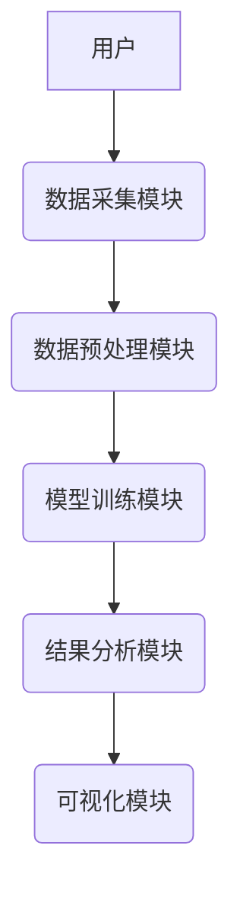

                 


# AI在资产管理绩效归因中的应用

> 关键词：人工智能, 绩效归因, 资产管理, 机器学习, 时间序列分析

> 摘要：随着人工智能技术的快速发展，其在资产管理领域的应用日益广泛。本文深入探讨了AI技术如何应用于绩效归因，分析了传统方法的局限性，介绍了基于机器学习和自然语言处理的创新解决方案，并通过实际案例展示了AI在提高绩效归因效率和准确性方面的重要作用。文章内容涵盖了从理论到实践的各个方面，为资产管理从业者提供了宝贵的参考。

---

## 第1章: 绩效归因的背景与挑战

### 1.1 绩效归因的基本概念

#### 1.1.1 绩效归因的定义与作用
绩效归因是分析投资组合收益来源的过程，旨在识别哪些因素（如资产选择、市场时机、行业选择等）对收益贡献最大。它是资产管理中的核心环节，帮助投资经理优化策略和风险管理。

#### 1.1.2 资产管理中的绩效归因需求
- 投资组合表现的评估
- 风险管理与调整
- 投资决策的支持
- 向客户解释收益来源

#### 1.1.3 绩效归因的边界与外延
- 内部因素：资产配置、选股能力
- 外部因素：市场波动、宏观经济
- 外延：跨资产类别、跨市场分析

### 1.2 传统绩效归因方法的局限性

#### 1.2.1 基于因子模型的传统方法
- 因子分解法：将收益分解为多个因子的贡献
- 优缺点：缺乏灵活性，难以捕捉非线性关系

#### 1.2.2 基于排序法的传统方法
- 排序法：根据资产表现排序，计算贡献
- 优缺点：简单但不够精确，难以处理复杂情况

#### 1.2.3 传统方法的局限性与改进空间
- 数据维度不足
- 非线性关系难以捕捉
- 计算效率低下

### 1.3 AI技术在绩效归因中的应用前景

#### 1.3.1 AI技术的核心优势
- 处理高维数据的能力
- 捕捉非线性关系的能力
- 自动化与实时分析能力

#### 1.3.2 AI在绩效归因中的潜在应用场景
- 多因子模型优化
- 市场情绪分析
- 风险因子识别

#### 1.3.3 未来发展趋势与挑战
- 技术进步：算法优化与数据共享
- 挑战：数据质量、模型解释性、监管合规

## 第2章: AI技术在绩效归因中的核心概念

### 2.1 机器学习在绩效归因中的应用

#### 2.1.1 监督学习与无监督学习在绩效归因中的应用
- 监督学习：预测收益，分类资产
- 无监督学习：聚类分析，发现隐含结构

#### 2.1.2 常见机器学习算法的优缺点对比
| 算法 | 优点 | 缺点 |
|------|------|------|
| 线性回归 | 简单、可解释性高 | 无法处理非线性关系 |
| 支持向量机 | 高维数据表现好 | 参数敏感性高 |
| 随机森林 | 抗噪声能力强 | 解释性差 |

#### 2.1.3 机器学习在绩效归因中的核心流程
- 数据预处理
- 特征提取
- 模型训练
- 结果分析

### 2.2 自然语言处理（NLP）在绩效归因中的应用

#### 2.2.1 NLP的基本概念与技术
- 词嵌入（如Word2Vec）
- 情感分析
- 文本分类

#### 2.2.2 NLP在投资报告分析中的应用
- 投资策略提取
- 市场情绪分析
- 风险预警

#### 2.2.3 NLP在市场情绪分析中的应用
- 通过新闻和社交媒体分析市场情绪
- 结合情绪指标优化投资策略

### 2.3 时间序列分析在绩效归因中的应用

#### 2.3.1 时间序列分析的基本概念
- 时间序列数据的特征（趋势、周期性、随机性）
- 常用模型（ARIMA, GARCH）

#### 2.3.2 时间序列分析在市场数据中的应用
- 预测市场走势
- 分解市场波动

#### 2.3.3 时间序列分析与机器学习的结合
- 结合LSTM进行市场预测
- 用于风险因子识别

### 2.4 核心概念原理对比

#### 2.4.1 机器学习与传统统计方法的对比
| 对比维度 | 机器学习 | 传统统计 |
|----------|----------|-----------|
| 数据需求 | 高 | 低 |
| 模型复杂度 | 高 | 低 |
| 可解释性 | 低 | 高 |

#### 2.4.2 时间序列分析与NLP的对比
| 对比维度 | 时间序列分析 | NLP |
|----------|--------------|------|
| 数据类型 | 时间相关 | 文本 |
| 应用场景 | 市场预测 | 情感分析 |

#### 2.4.3 AI技术在绩效归因中的综合应用
- 综合使用机器学习、NLP和时间序列分析
- 案例：利用LSTM预测市场走势，并结合NLP分析情绪影响

### 2.5 本章小结
本章详细介绍了AI技术在绩效归因中的核心概念，包括机器学习、NLP和时间序列分析的基本原理和应用场景，并通过对比分析，展示了AI技术的优势和潜力。

---

## 第3章: 基于机器学习的绩效归因算法原理

### 3.1 监督学习算法在绩效归因中的应用

#### 3.1.1 线性回归

##### 3.1.1.1 线性回归模型
$$ y = \beta_0 + \beta_1x_1 + \beta_2x_2 + \dots + \beta_nx_n + \epsilon $$

##### 3.1.1.2 应用场景
- 简单线性回归用于单因子分析
- 多元线性回归用于多因子模型

##### 3.1.1.3 代码实现
```python
import pandas as pd
from sklearn.linear_model import LinearRegression

# 数据准备
X = df[['factor1', 'factor2']]
y = df['return']

# 模型训练
model = LinearRegression()
model.fit(X, y)

# 输出系数
print(model.coef_)
```

##### 3.1.1.4 优缺点
- 优点：简单、可解释性强
- 缺点：无法捕捉非线性关系

#### 3.1.2 支持向量机（SVM）

##### 3.1.2.1 SVM模型
$$ \text{最大化} \ 1/\lambda \sum_{i=1}^n \xi_i $$
$$ \text{满足} \ y_i(\omega \cdot x_i + b) \geq 1 - \xi_i $$
$$ \xi_i \geq 0 $$

##### 3.1.2.2 应用场景
- 分类问题：如区分收益来源
- 回归问题：预测收益

##### 3.1.2.3 代码实现
```python
from sklearn.svm import SVR

# 数据准备
X = df[['factor1', 'factor2']]
y = df['return']

# 模型训练
model = SVR()
model.fit(X, y)

# 预测
print(model.predict(X))
```

##### 3.1.2.4 优缺点
- 优点：在高维空间中表现良好
- 缺点：参数敏感，解释性差

#### 3.1.3 随机森林

##### 3.1.3.1 随机森林模型
- 由多个决策树组成
- 通过袋装法和随机特征选择减少过拟合

##### 3.1.3.2 应用场景
- 特征重要性分析
- 回归与分类

##### 3.1.3.3 代码实现
```python
from sklearn.ensemble import RandomForestRegressor

# 数据准备
X = df[['factor1', 'factor2']]
y = df['return']

# 模型训练
model = RandomForestRegressor()
model.fit(X, y)

# 特征重要性
print(model.feature_importances_)
```

##### 3.1.3.4 优缺点
- 优点：抗噪声能力强，可处理高维数据
- 缺点：解释性差

---

### 3.2 无监督学习算法在绩效归因中的应用

#### 3.2.1 K均值聚类

##### 3.2.1.1 K均值聚类模型
- 将数据点分为K个簇
- 使用距离度量（如欧氏距离）进行聚类

##### 3.2.1.2 应用场景
- 将资产分成不同类别，分析其表现原因

##### 3.2.1.3 代码实现
```python
from sklearn.cluster import KMeans

# 数据准备
X = df[['factor1', 'factor2']]

# 模型训练
model = KMeans(n_clusters=3)
model.fit(X)

# 聚类结果
print(model.labels_)
```

##### 3.2.1.4 优缺点
- 优点：简单易实现
- 缺点：K值选择敏感，初始质心影响结果

#### 3.2.2 层次聚类

##### 3.2.2.1 层次聚类模型
- 使用层次化方法构建树状结构
- 常用距离度量和链接策略（如Ward法）

##### 3.2.2.2 应用场景
- 发现数据中的隐含结构
- 用于风险因子分类

##### 3.2.2.3 代码实现
```python
from sklearn.cluster import AgglomerativeClustering

# 数据准备
X = df[['factor1', 'factor2']]

# 模型训练
model = AgglomerativeClustering(n_clusters=3)
model.fit(X)

# 聚类结果
print(model.labels_)
```

##### 3.2.2.4 优缺点
- 优点：无需预先指定K值
- 缺点：计算复杂度高

---

### 3.3 强化学习在绩效归因中的应用

#### 3.3.1 强化学习基本概念
- 通过智能体与环境交互，学习最优策略
- 常用算法：Q-Learning, DQN

#### 3.3.2 在绩效归因中的应用
- 动态资产配置
- 实时市场响应

#### 3.3.3 代码实现（DQN）
```python
import numpy as np
from collections import deque
import random

class DQN:
    def __init__(self, state_size, action_size, gamma=0.99, epsilon=1.0):
        self.state_size = state_size
        self.action_size = action_size
        self.gamma = gamma
        self.epsilon = epsilon
        self.memory = deque(maxlen=10000)
        self.model = self._build_model()

    def _build_model(self):
        # 简单的DQN网络
        pass

    def remember(self, state, action, reward, next_state):
        self.memory.append((state, action, reward, next_state))

    def act(self, state):
        if random.random() < self.epsilon:
            return random.randint(0, self.action_size - 1)
        return self.model.predict(state)[0]

    def replay(self, batch_size):
        # 回放记忆
        pass

    def decay_epsilon(self):
        self.epsilon = max(0.01, self.epsilon * 0.99)
```

#### 3.3.4 优缺点
- 优点：适合动态环境，可实时调整
- 缺点：模型复杂，训练时间长

---

## 第4章: 基于NLP的绩效归因应用

### 4.1 NLP在投资报告分析中的应用

#### 4.1.1 文本预处理
- 分词、去停用词、向量化

#### 4.1.2 投资策略提取
- 利用文本分类识别投资主题

#### 4.1.3 案例分析
- 使用Word2Vec提取报告关键词

#### 4.1.4 代码实现
```python
from gensim.models import Word2Vec

# 示例文本
text = ["投资 高科技 行业 利润 高"]

# 训练模型
model = Word2Vec([text], vector_size=10, window=5, min_count=1, workers=4)

# 查看词向量
print(model.wv['投资'])
```

---

## 第5章: 基于时间序列分析的绩效归因

### 5.1 时间序列分析的基本概念

#### 5.1.1 时间序列数据的特征
- 趋势、周期性、随机性

#### 5.1.2 常用模型
- ARIMA、GARCH、LSTM

---

## 第6章: 系统架构与项目实战

### 6.1 系统架构设计

#### 6.1.1 系统功能模块
- 数据采集与预处理
- 模型训练与部署
- 结果分析与可视化

#### 6.1.2 系统架构图


---

## 第7章: 总结与展望

### 7.1 总结
- AI技术在绩效归因中的优势
- 各种算法的优缺点对比
- 系统架构与项目实现的经验总结

### 7.2 展望
- 技术进步：算法优化与数据共享
- 挑战：数据质量、模型解释性、监管合规
- 未来发展方向：多模态分析、实时反馈机制

---

## 附录: 绩效归因算法实现的Python代码

```python
# 示例代码：基于机器学习的绩效归因
import pandas as pd
from sklearn.ensemble import RandomForestRegressor

# 数据准备
data = pd.DataFrame({
    'factor1': [1, 2, 3, 4, 5],
    'factor2': [5, 4, 3, 2, 1],
    'return': [0.1, 0.2, 0.15, 0.05, 0.3]
})

# 模型训练
model = RandomForestRegressor()
model.fit(data[['factor1', 'factor2']], data['return'])

# 特征重要性
print(model.feature_importances_)
```

---

## 参考文献
（此处列出相关文献和资料）

---

通过以上章节的安排，本文系统地介绍了AI在资产管理绩效归因中的应用，从理论到实践，为读者提供了全面的知识框架和实用的代码示例。

