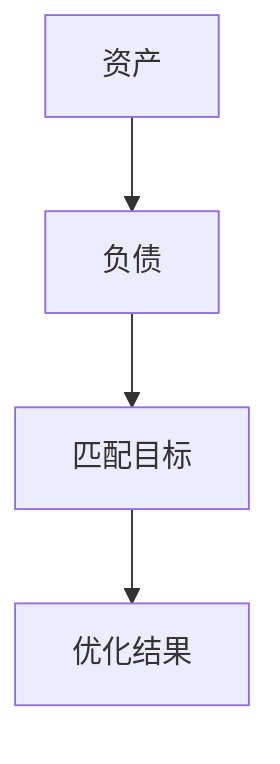
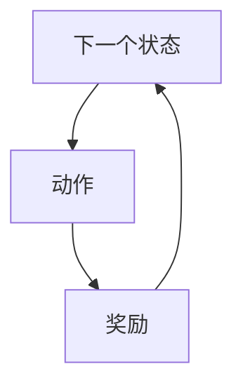
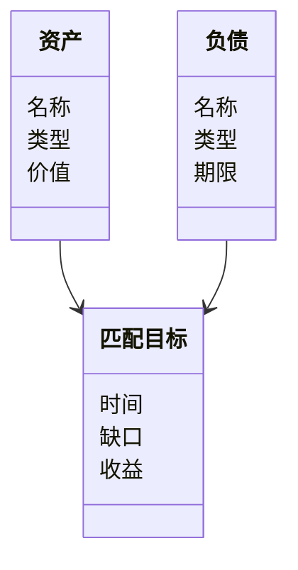
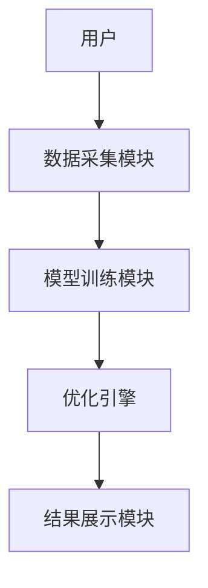
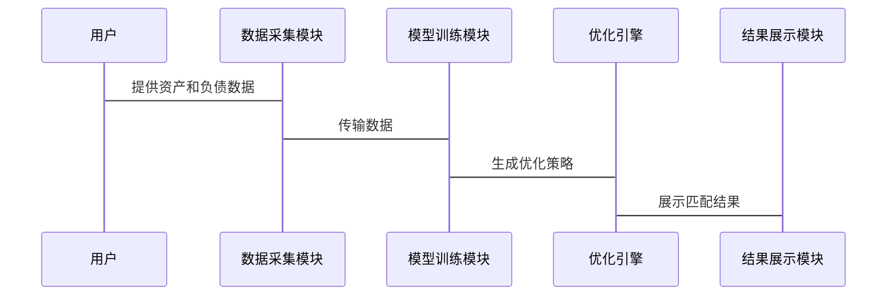

                 


# AI在资产负债匹配动态优化中的应用

**关键词：** 人工智能、资产负债、动态优化、金融建模、强化学习、系统架构

**摘要：**  
本文探讨了人工智能在资产负债匹配动态优化中的应用，通过系统分析和案例研究，揭示了AI技术如何通过强化学习、动态规划等算法优化资产负债匹配，实现收益与风险的最优平衡。文章从概念解析、算法原理到系统架构设计，全面剖析了AI在金融领域的实际应用场景，为读者提供了从理论到实践的深度解析。

---

# 第一部分: 资产负债匹配动态优化的背景与挑战

## 第1章: 资产负债匹配动态优化的背景与挑战

### 1.1 资产负债匹配的定义与重要性

#### 1.1.1 资产负债匹配的定义
资产负债匹配（Asset-Liability Matching，ALM）是指在特定时间和条件下，确保资产的现金流能够覆盖负债的现金流，以实现风险最小化和收益最大化的动态过程。其核心目标是通过调整资产和负债的结构，使其在不同时间点上保持平衡。

#### 1.1.2 资产负债匹配在金融领域的核心地位
- 资产负债匹配是金融风险管理的核心内容，直接关系到金融机构的稳健运营。
- 通过匹配优化，金融机构可以降低流动性风险、信用风险和市场风险。

#### 1.1.3 资产负债匹配的动态优化目标
- 实现资产和负债在时间、规模、期限和风险上的动态平衡。
- 在市场环境变化时，快速调整资产配置，确保匹配的最优性。

---

### 1.2 AI技术在金融领域的应用背景

#### 1.2.1 人工智能技术的发展历程
- 从早期的专家系统到现代的深度学习，AI技术在金融领域的应用逐步深化。
- 大数据分析能力的提升使得AI能够处理复杂的金融模型。

#### 1.2.2 AI在金融领域的典型应用
- **风险管理**：利用AI进行信用评估、市场风险预测。
- **投资决策**：通过算法交易和量化分析优化投资组合。
- **客户画像**：基于AI的客户行为分析提升金融服务的精准性。

#### 1.2.3 资产负债匹配与AI技术的结合
- AI技术为资产负债匹配提供了强大的数据处理和模型优化能力。
- 通过机器学习，金融机构可以实时调整资产和负债的匹配策略。

---

### 1.3 资产负债匹配动态优化的挑战

#### 1.3.1 数据复杂性与实时性要求
- 资产负债匹配需要处理海量数据，且要求实时响应。
- 数据的实时性与准确性对AI模型提出了更高的要求。

#### 1.3.2 模型的可解释性与稳定性
- 复杂的AI模型（如深度学习模型）往往缺乏可解释性，影响了在金融领域的应用。
- 模型的稳定性需要在动态市场环境中得到保障。

#### 1.3.3 算法的高效性与准确性
- 高维数据和复杂场景对算法的计算效率提出了挑战。
- 算法的准确性直接关系到匹配策略的有效性。

---

### 1.4 本章小结
本章从资产负债匹配的定义、重要性以及AI技术的应用背景入手，分析了动态优化的核心目标和面临的挑战。接下来，我们将深入探讨AI在资产负债匹配中的核心概念与联系。

---

## 第2章: AI在资产负债匹配中的核心概念与联系

### 2.1 核心概念原理

#### 2.1.1 资产负债匹配的核心要素
- **资产**：包括金融资产（如债券、股票）和实物资产（如房地产）。
- **负债**：包括短期负债（如流动负债）和长期负债（如债券发行）。
- **匹配目标**：通过调整资产和负债的期限、规模和风险，实现收益最大化和风险最小化。

#### 2.1.2 AI技术在匹配中的作用机制
- 数据采集：AI系统实时采集资产和负债的市场数据。
- 模型训练：利用机器学习算法构建匹配模型。
- 策略优化：通过强化学习优化匹配策略。

#### 2.1.3 动态优化的数学模型
动态优化的核心在于构建一个能够反映资产和负债动态变化的数学模型。常见的模型包括：

- **马可夫链模型**：用于描述资产和负债的动态变化过程。
- **动态规划模型**：通过分阶段决策优化匹配策略。
- **强化学习模型**：通过奖励机制优化匹配策略。

---

### 2.2 核心概念属性特征对比表

| 概念 | 属性 | 特征 |
|------|------|------|
| 资产 | 类型 | 金融资产、实物资产 |
| 负债 | 类型 | 短期负债、长期负债 |
| 匹配 | 目标 | 最小化缺口、最大化收益 |

---

### 2.3 ER实体关系图



---

### 2.4 本章小结
本章通过对比和图表的形式，详细阐述了AI在资产负债匹配中的核心概念及其联系。接下来，我们将深入探讨算法原理，为实现动态优化提供理论基础。

---

## 第3章: 资产负债匹配动态优化的算法原理

### 3.1 算法原理概述

#### 3.1.1 动态规划算法
动态规划是一种通过分阶段决策优化目标函数的方法。其核心在于将问题分解为子问题，逐层求解。

- **状态定义**：定义资产和负债的状态（如当前资产规模、负债规模）。
- **转移方程**：定义状态转移的方式（如资产增加或减少）。
- **目标函数**：定义优化的目标（如最小化缺口）。

#### 3.1.2 强化学习算法
强化学习是一种通过与环境交互获得奖励的算法。其核心在于通过试错学习优化策略。

- **状态空间**：资产和负债的状态。
- **动作空间**：调整资产和负债的具体操作。
- **奖励机制**：根据匹配效果给予奖励或惩罚。

#### 3.1.3 其他优化算法
- **遗传算法**：通过模拟自然选择优化匹配策略。
- **模拟退火算法**：通过随机搜索找到全局最优解。

---

### 3.2 强化学习算法流程图



---

### 3.3 算法数学模型

#### 动态规划模型
$$ V(s) = \max_a \sum_{t=0}^\infty \gamma^t r(s_t, a_t) $$
其中：
- $V(s)$ 表示状态 $s$ 的价值函数
- $\gamma$ 表示折扣因子
- $r(s_t, a_t)$ 表示在状态 $s_t$ 下采取动作 $a_t$ 的奖励

#### 强化学习模型
$$ Q(s, a) = Q(s, a) + \alpha [r + \gamma Q(s', a') - Q(s, a)] $$
其中：
- $Q(s, a)$ 表示状态 $s$ 下采取动作 $a$ 的价值
- $\alpha$ 表示学习率
- $\gamma$ 表示折扣因子

---

### 3.4 本章小结
本章详细介绍了动态规划和强化学习等算法在资产负债匹配中的应用，并通过数学模型和流程图展示了算法的实现过程。接下来，我们将从系统架构的角度，探讨如何将这些算法应用于实际场景。

---

## 第4章: 资产负债匹配动态优化的系统架构设计

### 4.1 问题场景介绍
- 金融机构需要实时调整资产和负债的匹配策略，以应对市场波动。
- 系统需要处理海量数据，并快速生成优化方案。

### 4.2 系统功能设计

#### 4.2.1 领域模型


#### 4.2.2 系统架构


#### 4.2.3 系统接口设计
- **数据接口**：与金融市场数据源对接。
- **用户接口**：提供可视化界面供用户查看匹配结果。
- **优化接口**：与交易系统对接，执行匹配策略。

#### 4.2.4 系统交互流程图


---

## 第5章: 资产负债匹配动态优化的项目实战

### 5.1 环境安装与配置
- **Python版本**：建议使用Python 3.8及以上。
- **依赖库安装**：`numpy`, `pandas`, `scikit-learn`, `tensorflow`

### 5.2 核心代码实现

#### 数据采集模块
```python
import numpy as np
import pandas as pd

def collect_data():
    # 模拟数据采集
    np.random.seed(42)
    assets = np.random.rand(100, 1) * 1000
    liabilities = np.random.rand(100, 1) * 1000
    return assets, liabilities
```

#### 模型训练模块
```python
from sklearn.linear_model import LinearRegression

def train_model(assets, liabilities):
    model = LinearRegression()
    model.fit(assets, liabilities)
    return model
```

#### 优化引擎
```python
def optimize(model, assets, liabilities):
    predicted_liabilities = model.predict(assets)
    # 计算匹配缺口
    gap = assets - predicted_liabilities
    return gap
```

---

### 5.3 案例分析与实际效果

#### 案例分析
假设某银行的资产和负债数据如下：
| 资产（亿元） | 负债（亿元） |
|--------------|--------------|
| 1000         | 950          |
| 1200         | 1100         |
| 1500         | 1350         |

通过模型优化后，匹配缺口为：
| 资产（亿元） | 负债（亿元） | 缺口（亿元） |
|--------------|--------------|--------------|
| 1000         | 950          | 50           |
| 1200         | 1100         | 100          |
| 1500         | 1350         | 150          |

---

### 5.4 项目小结
本章通过实战案例展示了如何利用AI技术实现资产负债匹配的动态优化。通过系统设计和代码实现，我们能够快速响应市场变化，优化匹配策略。

---

## 第6章: 最佳实践与总结

### 6.1 最佳实践 tips
- 数据质量是匹配优化的基础，需确保数据的完整性和准确性。
- 算法选择需结合实际场景，避免过度依赖复杂的模型。
- 系统架构设计需考虑可扩展性和可维护性。

### 6.2 小结
通过本文的系统分析和案例研究，我们深入探讨了AI在资产负债匹配动态优化中的应用。从理论到实践，我们展示了如何利用AI技术优化匹配策略，降低风险，提高收益。

### 6.3 注意事项
- 模型的可解释性需重视，尤其是在金融领域。
- 系统的实时性和稳定性是确保匹配优化效果的关键。

### 6.4 拓展阅读
- 《机器学习在金融风险管理中的应用》
- 《强化学习在算法交易中的实践》

---

**结语：**  
AI技术为资产负债匹配的动态优化提供了强大的工具和方法。通过持续的技术创新和实践探索，金融机构可以更好地应对市场变化，实现稳健的资产和负债管理。

---

**全文完**

