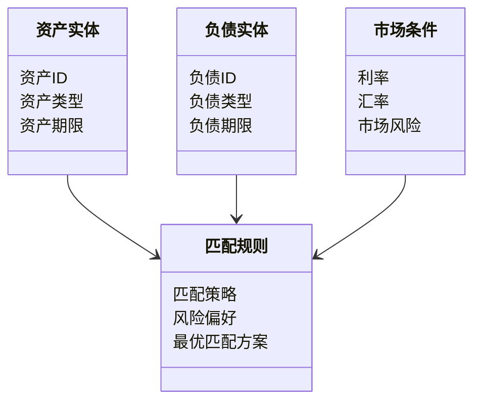
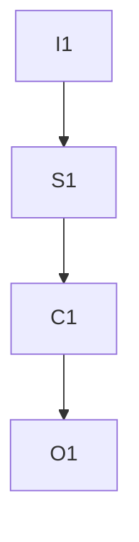
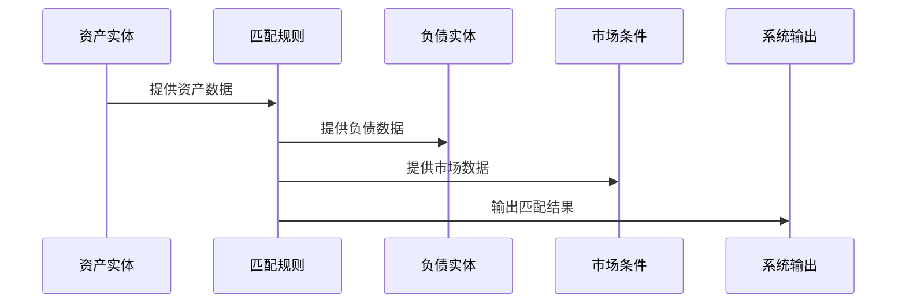

                 


# AI在资产负债匹配管理中的应用

## 关键词：AI，资产负债匹配管理，机器学习，深度学习，金融应用，系统架构

## 摘要：本文探讨了人工智能在资产负债匹配管理中的应用，详细介绍了核心概念、算法原理、系统架构及实际案例，旨在为读者提供全面的理论与实践指导。

---

# 第1章: 资产负债匹配管理的背景与问题

## 1.1 资产负债匹配管理的定义与重要性

### 1.1.1 资产负债匹配管理的定义
资产负债匹配管理是指通过优化资产与负债的期限、风险和收益匹配，确保企业或金融机构的财务稳定性。其核心在于平衡资产的收益性和负债的安全性，以应对市场波动和经济变化。

### 1.1.2 资产负债匹配管理的重要性
在金融领域，资产负债匹配管理是企业风险管理的重要组成部分。通过合理匹配，企业可以降低流动性风险和信用风险，确保资金链的稳定，同时提高资本使用效率。

### 1.1.3 资产负债匹配管理的核心目标
- 优化资产与负债的期限结构，降低错配风险。
- 确保资产收益能够覆盖负债成本，实现净收益最大化。
- 提高资金流动性，应对突发事件和市场波动。

## 1.2 AI在金融领域的应用背景

### 1.2.1 人工智能在金融领域的应用现状
人工智能技术在金融领域的应用日益广泛，涵盖了风险管理、投资决策、信用评估等多个方面。AI通过大数据分析和机器学习算法，帮助金融机构提高决策效率和准确性。

### 1.2.2 资产负债匹配管理中的问题与挑战
传统资产负债匹配管理方法依赖人工判断，存在效率低下、风险识别不全面等问题。随着金融市场复杂性的增加，传统方法难以应对日益增长的业务需求。

### 1.2.3 AI技术在资产负债匹配管理中的优势
AI技术能够快速处理大量数据，识别潜在风险，提供实时监控和预测分析。通过机器学习算法，AI可以优化资产与负债的匹配策略，提高管理效率和准确性。

---

# 第2章: 资产负债匹配管理的核心概念与AI联系

## 2.1 资产负债匹配管理的核心概念

### 2.1.1 资产负债匹配管理的理论基础
资产负债匹配管理基于现代金融理论，特别是久期分析和缺口分析。久期分析用于衡量资产和负债对利率变化的敏感性，缺口分析用于评估资产和负债在不同时间段的错配情况。

### 2.1.2 资产负债匹配管理的关键要素
- 资产负债的期限结构
- 利率风险和流动性风险
- 资本成本和收益匹配

### 2.1.3 资产负债匹配管理的实现方法
- 模型构建：使用久期分析和缺口分析模型。
- 数据分析：通过大数据技术获取和处理相关数据。
- 优化策略：基于模型结果调整资产和负债的配置。

## 2.2 AI在资产负债匹配管理中的应用原理

### 2.2.1 AI技术的核心原理
AI通过机器学习算法，从历史数据中学习资产和负债的匹配规律，构建预测模型，辅助决策者制定优化策略。

### 2.2.2 AI在资产负债匹配管理中的具体应用
- 风险预测：利用机器学习算法预测利率变化和市场波动。
- 资产负债匹配优化：通过深度学习算法优化资产和负债的配置。
- 实时监控：利用自然语言处理技术实时监控市场动态。

### 2.2.3 AI与资产负债匹配管理的结合点
- 数据驱动：AI依赖大量数据进行分析和预测，资产负债匹配管理需要大量历史数据支持。
- 自动化决策：AI能够快速处理数据并生成决策建议，提高管理效率。
- 智能优化：AI通过不断学习和优化模型，提供更精准的匹配策略。

## 2.3 资产负债匹配管理的ER实体关系图

### 2.3.1 实体关系图的定义
ER实体关系图用于描述系统中各个实体及其关系，帮助理解系统的结构和数据流。

### 2.3.2 资产负债匹配管理的ER图设计
```mermaid
erd
  资产负债匹配管理
  --|
  资产实体
    - 资产ID
    - 资产类型
    - 资产期限
  负债实体
    - 负债ID
    - 负债类型
    - 负债期限
  市场条件
    - 利率
    - 汇率
    - 市场风险
  匹配规则
    - 匹配策略
    - 风险偏好
    - 最优匹配方案
```

### 2.3.3 ER图在AI应用中的作用
ER图帮助设计系统的数据结构，为AI算法提供数据输入，确保数据的完整性和一致性。

---

# 第3章: AI在资产负债匹配管理中的算法原理

## 3.1 机器学习算法在资产负债匹配管理中的应用

### 3.1.1 机器学习算法的分类与特点
机器学习算法分为监督学习、无监督学习和强化学习。监督学习适用于预测任务，无监督学习适用于聚类分析，强化学习适用于策略优化。

### 3.1.2 常见机器学习算法在资产负债匹配管理中的应用
- 线性回归：用于预测资产收益和负债成本。
- 支持向量机（SVM）：用于分类资产和负债的风险等级。
- 随机森林：用于特征选择和风险评估。

### 3.1.3 机器学习算法的优缺点
- 优点：计算效率高，适合中小规模数据。
- 缺点：对高维数据处理能力有限，需要特征工程。

## 3.2 深度学习算法在资产负债匹配管理中的应用

### 3.2.1 深度学习算法的定义与特点
深度学习通过多层神经网络提取数据特征，具有强大的非线性建模能力。

### 3.2.2 深度学习算法在资产负债匹配管理中的具体应用
- 卷积神经网络（CNN）：用于图像识别和模式识别。
- 循环神经网络（RNN）：用于时间序列分析和预测。
- 长短期记忆网络（LSTM）：用于处理长序列数据，适合时间依赖性强的任务。

### 3.2.3 深度学习算法的优缺点
- 优点：能够处理高维数据，模型表达能力强。
- 缺点：计算资源需求高，模型解释性差。

## 3.3 算法原理的数学模型与公式

### 3.3.1 机器学习算法的数学模型
线性回归模型：
$$ y = \beta_0 + \beta_1x + \epsilon $$

### 3.3.2 深度学习算法的数学模型
LSTM网络结构：
$$ f_t = \sigma(g(x_t, h_{t-1})) $$

### 3.3.3 算法模型的优缺点对比
- 机器学习模型计算简单，适合中小规模数据。
- 深度学习模型计算复杂，但表达能力强，适合大规模数据。

---

# 第4章: 资产负债匹配管理的系统分析与架构设计

## 4.1 系统分析与需求分析

### 4.1.1 系统分析的定义与方法
系统分析通过需求分析和功能设计，明确系统的输入、输出和处理流程。

### 4.1.2 系统需求分析
- 数据采集：收集资产和负债的历史数据。
- 风险评估：评估资产和负债的风险等级。
- 策略优化：制定最优匹配策略。

## 4.2 系统架构设计

### 4.2.1 领域模型设计


### 4.2.2 系统架构设计


### 4.2.3 接口设计与交互


---

# 第5章: 系统实现与项目实战

## 5.1 项目实战：环境安装与系统实现

### 5.1.1 环境安装
- 安装Python和相关库（如TensorFlow、Scikit-learn）。
- 配置开发环境（如Jupyter Notebook）。

### 5.1.2 系统核心实现源代码
```python
import numpy as np
from sklearn.linear_model import LinearRegression

# 示例数据
assets = np.array([[1, 2], [3, 4], [5, 6]])
liabilities = np.array([[2, 3], [4, 5], [6, 7]])

# 训练模型
model = LinearRegression()
model.fit(assets, liabilities)

# 预测结果
predictions = model.predict([[7, 8]])
print("预测负债为:", predictions)
```

### 5.1.3 代码应用解读与分析
通过线性回归模型，系统可以预测负债的最优匹配方案，帮助决策者优化资产负债结构。

## 5.2 实际案例分析与详细讲解

### 5.2.1 案例背景
某银行面临资产和负债错配风险，希望通过AI技术优化匹配策略。

### 5.2.2 案例分析
- 数据采集：收集资产和负债的历史数据。
- 模型训练：使用机器学习算法训练匹配模型。
- 策略优化：根据模型结果调整资产和负债配置。

## 5.3 项目小结

通过AI技术，系统能够实时监控市场动态，优化资产负债匹配策略，显著降低错配风险。

---

# 第6章: 总结与展望

## 6.1 本章小结
本文详细介绍了AI在资产负债匹配管理中的应用，从理论到实践，为读者提供了全面的指导。

## 6.2 未来展望
随着AI技术的不断发展，资产负债匹配管理将更加智能化和自动化，为企业创造更大的价值。

---

通过以上结构，我们可以系统地了解AI在资产负债匹配管理中的应用，从理论到实践，为读者提供全面的指导。

