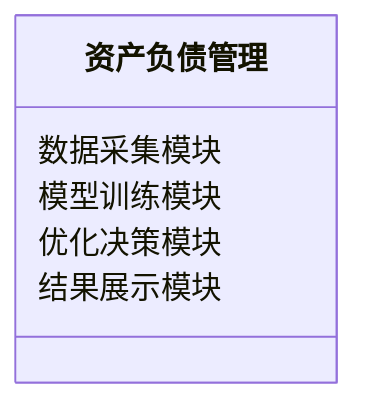
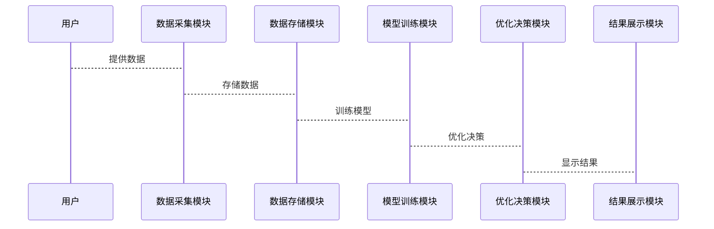
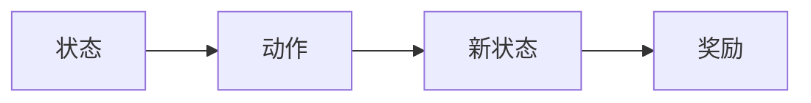

                 

# AI在资产负债管理中的动态优化与压力测试应用

> 关键词：AI，资产负债管理，动态优化，压力测试，机器学习，金融风险控制

> 摘要：本文探讨了人工智能技术在资产负债管理中的动态优化与压力测试应用。通过分析AI技术如何提升动态优化和压力测试的效率与准确性，文章详细介绍了相关算法原理、系统架构设计及实际应用案例，为金融机构在风险管理中的技术应用提供了新的视角和解决方案。

---

## 第一章: 背景介绍

### 1.1 资产负债管理概述

#### 1.1.1 资产负债管理的定义与作用
资产负债管理（Asset-Liability Management，ALM）是金融领域的重要管理方法，旨在通过优化资产与负债的配置，确保机构在不同市场条件下的财务稳定性和收益最大化。其核心在于平衡资产的收益性和负债的安全性，以应对市场波动和风险。

#### 1.1.2 动态优化的概念与意义
动态优化是指在不断变化的市场环境中，实时调整资产和负债的配置以达到最优状态的过程。AI技术通过实时数据分析和预测，能够快速识别市场变化并做出最优决策，显著提升了动态优化的效率和准确性。

#### 1.1.3 压力测试的重要性与应用场景
压力测试用于评估金融机构在极端市场条件下的承受能力，帮助机构识别潜在风险并制定应对策略。AI技术的应用使压力测试更加智能化，能够模拟多种极端场景，提供更精准的风险评估结果。

### 1.2 AI技术在金融领域的应用背景

#### 1.2.1 AI技术的发展与金融行业的结合
AI技术的快速发展为金融行业带来了革命性的变化，尤其是在数据分析、风险控制和决策优化等方面。AI通过处理海量数据，帮助金融机构更高效地进行资产管理和风险控制。

#### 1.2.2 资产负债管理中的传统方法与挑战
传统的资产负债管理依赖于经验丰富的专家和复杂的模型，但在面对快速变化的市场环境时，存在效率低、响应慢等问题。AI技术的引入解决了这些问题，提供了更智能化的解决方案。

#### 1.2.3 AI技术如何解决传统方法的局限性
AI技术通过机器学习、深度学习等算法，能够快速处理和分析大量数据，实时调整资产和负债的配置，显著提升了资产负债管理的效率和准确性。

---

## 第二章: AI在动态优化中的应用原理

### 2.1 动态优化的基本原理

#### 2.1.1 动态优化的定义与特点
动态优化是指在动态变化的市场环境中，实时调整决策变量以达到最优目标的过程。其特点是实时性、动态性和高效性。

#### 2.1.2 动态优化在资产负债管理中的应用
在资产负债管理中，动态优化用于实时调整资产和负债的配置，以应对市场波动和风险变化，确保机构的财务稳定性和收益最大化。

#### 2.1.3 基于AI的动态优化算法
基于AI的动态优化算法包括强化学习、动态规划等方法，通过不断学习和优化，提升决策的准确性和效率。

### 2.2 基于AI的动态优化模型

#### 2.2.1 模型构建的基本步骤
动态优化模型的构建包括数据收集、特征选择、模型训练和优化调优等步骤。AI技术能够自动化完成这些步骤，显著提升模型的效率和准确性。

#### 2.2.2 常见的动态优化算法（如强化学习、动态规划）
强化学习通过奖励机制不断优化决策，动态规划通过分解问题实现最优解。这些算法在动态优化中具有重要应用。

#### 2.2.3 模型的训练与调优
模型训练需要大量数据和高性能计算资源，调优过程包括参数调整和模型优化，以确保模型的最佳性能。

### 2.3 动态优化的实际应用案例

#### 2.3.1 某银行的动态资产配置案例
通过AI技术，某银行实现了动态资产配置，显著提升了资产收益和风险控制能力。

#### 2.3.2 案例中的AI算法实现
案例中使用了强化学习算法，通过模拟市场变化，优化资产配置策略。

#### 2.3.3 案例分析与经验总结
案例分析表明，AI技术显著提升了动态优化的效率和准确性，为金融机构提供了有力支持。

---

## 第三章: 压力测试的原理与方法

### 3.1 压力测试的基本概念

#### 3.1.1 压力测试的定义与目的
压力测试用于评估金融机构在极端市场条件下的承受能力，帮助机构识别潜在风险并制定应对策略。

#### 3.1.2 压力测试的分类与应用场景
压力测试分为敏感性测试、情景测试和极端测试，广泛应用于风险管理和资本规划。

#### 3.1.3 压力测试与风险控制的关系
压力测试是风险控制的重要工具，通过评估潜在风险，帮助机构制定有效的风险管理策略。

### 3.2 基于AI的压力测试方法

#### 3.2.1 数据驱动的压力测试模型
基于AI的压力测试模型通过分析历史数据，识别潜在风险因素，构建风险评估模型。

#### 3.2.2 基于机器学习的压力测试算法
机器学习算法如随机森林和神经网络，能够有效识别复杂的风险模式，提升压力测试的准确性。

#### 3.2.3 压力测试结果的解释与应用
压力测试结果用于评估机构的抗风险能力，并制定相应的风险缓解策略。

### 3.3 压力测试的实际应用案例

#### 3.3.1 某银行的压力测试案例
通过AI技术，某银行成功评估了极端市场条件下的风险，并制定了有效的应对策略。

#### 3.3.2 案例中的AI算法实现
案例中使用了神经网络算法，模拟极端市场情景，评估机构的风险承受能力。

#### 3.3.3 案例分析与经验总结
案例分析表明，AI技术显著提升了压力测试的效率和准确性，为金融机构提供了有力支持。

---

## 第四章: 系统架构与设计

### 4.1 系统功能设计

#### 4.1.1 系统功能模块设计
系统功能模块包括数据采集、模型训练、优化决策和结果展示等部分。

#### 4.1.2 领域模型（使用 Mermaid 类图）

#### 4.1.3 系统架构设计（使用 Mermaid 架构图）

#### 4.1.4 系统接口设计
系统接口包括数据接口、模型接口和用户接口，确保系统的高效运行和良好交互。

#### 4.1.5 系统交互设计（使用 Mermaid 序列图）

### 4.2 算法实现细节

#### 4.2.1 强化学习算法（使用 Mermaid 流程图）

#### 4.2.2 数学公式与模型
动态优化模型可以表示为：
$$
\min_{x} \quad f(x) + \lambda g(x)
$$
其中，\( x \) 是决策变量，\( f(x) \) 是目标函数，\( g(x) \) 是约束函数，\( \lambda \) 是调节参数。

### 4.3 项目实战

#### 4.3.1 环境搭建
需要安装Python、TensorFlow、Keras等工具，并配置相关环境。

#### 4.3.2 数据收集与预处理
收集市场数据，进行清洗和特征提取，为模型训练提供高质量数据。

#### 4.3.3 模型训练
使用机器学习算法训练模型，进行参数调优，确保模型的最佳性能。

#### 4.3.4 压力测试实现
模拟极端市场情景，评估机构的风险承受能力，制定应对策略。

#### 4.3.5 结果分析与优化
分析测试结果，优化模型参数，提升系统的整体性能。

---

## 第五章: 总结与展望

### 5.1 总结
本文详细探讨了AI技术在资产负债管理中的动态优化与压力测试应用，通过实际案例分析，验证了AI技术的有效性和优势。

### 5.2 未来发展方向
未来，随着AI技术的不断进步，动态优化与压力测试将更加智能化和自动化，为金融机构的风险管理提供更有力的支持。

### 5.3 应用前景
AI技术在资产负债管理中的应用前景广阔，将推动金融行业的智能化转型，提升整体风险控制能力。

---

## 参考文献
1. 《机器学习实战》
2. 《深度学习》
3. 《金融风险管理》
4. 相关学术论文和研究报告

---

通过以上内容，我们可以看到，AI技术在资产负债管理中的动态优化与压力测试应用具有重要的现实意义和广阔的应用前景。随着技术的不断发展，AI将为金融行业的风险管理带来更多的创新和突破。

---

## 结语

AI技术的应用不仅提升了资产负债管理的效率和准确性，还为金融机构的风险控制提供了新的解决方案。未来，随着技术的进步，AI在金融领域的应用将更加广泛和深入，为行业的智能化发展注入新的活力。

---

# 完

