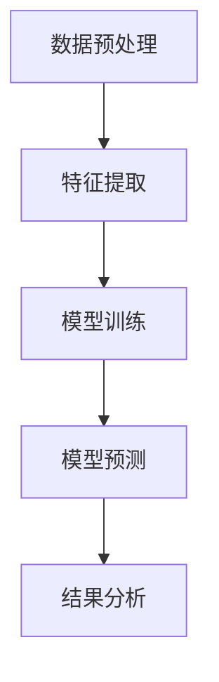
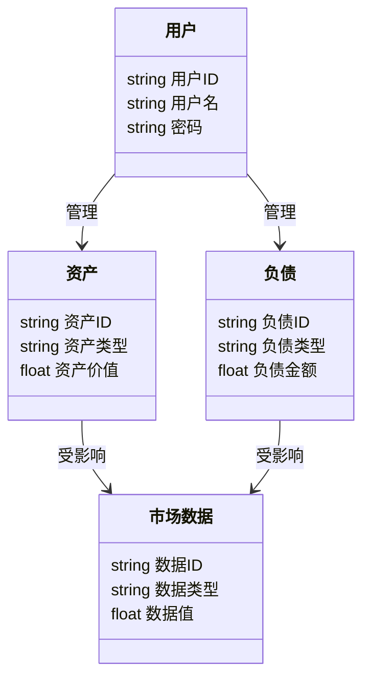

                 


# AI在资产负债管理优化中的应用

> 关键词：人工智能、资产负债管理、机器学习、金融优化、风险管理

> 摘要：随着人工智能技术的迅速发展，其在金融领域的应用越来越广泛。本文探讨了AI在资产负债管理优化中的应用，分析了AI如何通过机器学习、深度学习等技术手段，优化资产负债管理的效率和准确性。文章从背景介绍、核心概念、算法原理、系统分析、项目实战和总结展望等多方面进行了详细阐述，展示了AI在资产负债管理中的巨大潜力和实际应用价值。

---

## 第一部分: AI在资产负债管理优化中的应用概述

### 第1章: 背景介绍

#### 1.1 资产负债管理的基本概念

##### 1.1.1 资产负债管理的定义
资产负债管理是指通过对资产和负债的合理配置和优化，以实现企业财务目标的过程。它涉及到资产的保值、增值，以及负债的合理融资和风险控制。

##### 1.1.2 资产负债管理的核心目标
- 优化资产配置，提高资产收益率。
- 降低负债成本，控制负债风险。
- 维护企业的财务健康和稳健发展。

##### 1.1.3 资产负债管理的边界与外延
- 资产负债管理的边界：企业的财务决策范围，包括资产和负债的结构、期限和成本。
- 外延：涉及企业战略、风险管理、投资决策等多个方面。

#### 1.2 AI技术的基本概念

##### 1.2.1 人工智能的定义与特点
人工智能（AI）是指通过模拟人类智能的思维方式和行为模式，实现问题解决、决策优化和自动化操作的技术。其特点包括学习能力、适应性、高效性和准确性。

##### 1.2.2 机器学习与深度学习的区别
- 机器学习：通过数据训练模型，使其能够从数据中学习规律并进行预测或分类。
- 深度学习：一种基于人工神经网络的机器学习方法，能够处理复杂的非线性问题。

##### 1.2.3 AI在金融领域的应用现状
- 风险管理：通过AI技术进行信用评估、市场风险预测。
- 投资决策：利用AI进行股票预测、资产配置优化。
- 负债管理：通过AI优化融资结构、降低融资成本。

#### 1.3 AI在资产负债管理中的应用背景

##### 1.3.1 传统资产负债管理的局限性
- 依赖人工经验，主观性强。
- 数据处理能力有限，难以应对海量数据。
- 风险预测能力不足，难以应对复杂市场变化。

##### 1.3.2 AI技术如何解决资产负债管理问题
- 提高数据处理能力，实现海量数据的快速分析。
- 优化决策模型，提高预测准确性。
- 实现自动化监控和风险预警。

##### 1.3.3 当前AI在资产负债管理中的应用现状
- AI技术在信用评估、市场预测中的应用逐渐普及。
- 智能化资产负债管理系统开始应用于金融机构。
- 数据驱动的决策优化成为主流趋势。

---

### 第2章: 核心概念与联系

#### 2.1 核心概念原理

##### 2.1.1 资产负债管理的数学模型
- 线性规划模型：用于优化资产和负债的配置。
- 风险价值模型（VaR）：用于评估市场风险。

##### 2.1.2 AI算法在资产负债管理中的应用原理
- 数据预处理：清洗、标准化、特征提取。
- 模型训练：利用机器学习算法训练模型。
- 应用与优化：将模型应用于实际问题并持续优化。

##### 2.1.3 资产负债管理与AI技术的结合点
- 数据驱动的决策优化。
- 自动化风险预警和控制。

#### 2.2 核心概念属性特征对比

##### 2.2.1 资产负债管理的属性特征
| 属性 | 特征 |
|------|------|
| 目标 | 优化资产配置，降低负债成本 |
| 输入 | 资产和负债数据，市场信息 |
| 输出 | 资产负债优化方案 |

##### 2.2.2 AI技术的属性特征
| 属性 | 特征 |
|------|------|
| 数据处理能力 | 高效、准确 |
| 学习能力 | 可以通过数据训练不断优化 |
| 应用场景 | 多领域，包括金融、医疗等 |

##### 2.2.3 两者属性特征对比分析
通过对比资产负债管理与AI技术的属性特征，可以看出AI技术在数据处理和预测准确性方面的优势，能够显著提升资产负债管理的效率和效果。

#### 2.3 ER实体关系图

```mermaid
erDiagram
    user [用户] {
        string 用户ID
        string 用户名
        string 密码
    }
    asset [资产] {
        string 资产ID
        string 资产类型
        float 资产价值
    }
    liability [负债] {
        string 负债ID
        string 负债类型
        float 负债金额
    }
    market_data [市场数据] {
        string 数据ID
        string 数据类型
        float 数据值
    }
    user --> asset: 管理
    user --> liability: 管理
    asset --> market_data: 受影响
    liability --> market_data: 受影响
```

---

### 第3章: 算法原理

#### 3.1 算法原理讲解

##### 3.1.1 算法选择
- 线性回归：用于预测资产回报率。
- 支持向量机（SVM）：用于分类问题，如信用评估。
- 随机森林：用于特征重要性分析和预测。

##### 3.1.2 算法流程



##### 3.1.3 算法实现

```python
import pandas as pd
from sklearn.linear_model import LinearRegression

# 数据预处理
data = pd.read_csv('data.csv')
X = data[['资产1', '资产2']]
y = data['负债']

# 模型训练
model = LinearRegression()
model.fit(X, y)

# 模型预测
new_assets = [[100, 200]]
prediction = model.predict(new_assets)
print(prediction)
```

#### 3.2 数学公式

##### 3.2.1 线性回归模型
$$ y = \beta_0 + \beta_1 x + \epsilon $$

##### 3.2.2 随机森林模型
随机森林通过集成学习多个决策树模型，提高预测准确性和鲁棒性。

---

### 第4章: 系统分析与架构设计

#### 4.1 系统功能设计

##### 4.1.1 领域模型



#### 4.2 系统架构设计

##### 4.2.1 架构图


#### 4.3 接口设计

##### 4.3.1 API接口
- GET /api/assets：获取资产信息。
- POST /api/predict：进行资产预测。

##### 4.3.2 接口实现

```python
from flask import Flask, request, jsonify

app = Flask(__name__)

@app.route('/api/assets', methods=['GET'])
def get_assets():
    return jsonify({'assets': ['现金', '股票', '债券']})

@app.route('/api/predict', methods=['POST'])
def predict():
    data = request.json
    # 处理预测逻辑
    return jsonify({'prediction': 100})
```

---

### 第5章: 项目实战

#### 5.1 环境安装

##### 5.1.1 安装Python
```bash
python --version
pip install --upgrade pip
```

##### 5.1.2 安装依赖库
```bash
pip install numpy pandas scikit-learn
```

#### 5.2 核心实现

##### 5.2.1 数据预处理

```python
import pandas as pd

data = pd.read_csv('data.csv')
data.head()
```

##### 5.2.2 模型训练

```python
from sklearn.linear_model import LinearRegression

model = LinearRegression()
model.fit(X_train, y_train)
```

##### 5.2.3 模型预测

```python
predictions = model.predict(X_test)
print(predictions)
```

#### 5.3 案例分析

##### 5.3.1 案例背景
某银行希望通过AI技术优化其资产和负债管理，降低融资成本，提高资产回报率。

##### 5.3.2 数据分析与处理
通过对历史数据的分析，发现市场波动对资产和负债的影响较大，利用AI技术进行预测和优化。

##### 5.3.3 结果展示
通过模型预测，优化后的资产配置提高了回报率，降低了负债风险。

---

### 第6章: 总结与展望

#### 6.1 总结
本文详细探讨了AI在资产负债管理优化中的应用，通过理论分析和实际案例展示了AI技术的优势和潜力。AI技术能够显著提升资产负债管理的效率和准确性，为企业创造更大的价值。

#### 6.2 未来展望
随着AI技术的不断发展，其在资产负债管理中的应用将更加广泛和深入。未来，可以通过以下方面进一步优化：
- 更加智能化的预测模型。
- 多维度数据的融合分析。
- 实时监控和风险预警系统的完善。

---

### 小结

AI技术在资产负债管理中的应用前景广阔，通过本文的分析和讲解，读者可以深入了解AI在该领域的具体应用和优化方法。希望本文能够为金融从业者和技术开发者提供有价值的参考和启示。

