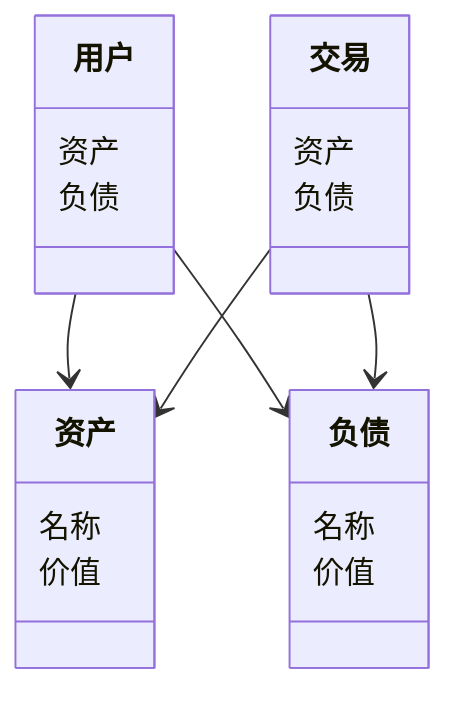
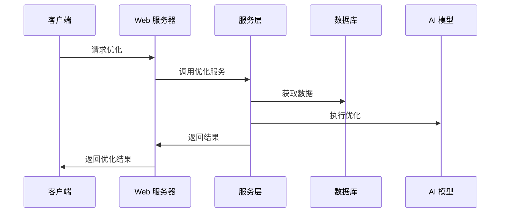

                 


# AI在资产负债管理动态优化中的应用

> **关键词：** 资产负债管理、人工智能、动态优化、机器学习、金融分析

> **摘要：** 本文探讨了人工智能在资产负债管理中的应用，特别是动态优化方面。通过分析AI的基本原理、动态优化模型、系统架构设计以及实际案例，本文旨在为读者提供深入的技术见解，展示如何利用AI技术优化资产负债管理流程，提升决策效率和准确性。

---

## 第1章: 引言

### 1.1 资产负债管理概述

#### 1.1.1 资产负债管理的定义与目标
- **定义：** 资产负债管理（ALM）是金融领域中的核心部分，涉及资产和负债的管理，以确保企业的财务健康和稳定。
- **目标：** 通过优化资产和负债的结构，降低风险，提高收益。

#### 1.1.2 资产负债管理的核心要素
- 资产：包括现金、投资、贷款等。
- 负债：包括存款、借款、应付账款等。
- 风险管理：识别和控制与资产和负债相关的风险。

#### 1.1.3 资产负债管理的动态优化特性
- 动态优化：根据市场变化实时调整资产和负债结构。
- 持续性：需要持续监控和优化，以应对不断变化的市场条件。

### 1.2 AI与金融的结合

#### 1.2.1 AI在金融领域的应用现状
- **风险管理：** 利用AI预测市场波动，识别潜在风险。
- **投资组合优化：** 使用机器学习算法优化投资组合，提高收益。

#### 1.2.2 AI在资产负债管理中的潜在价值
- **高效决策：** 利用AI快速分析大量数据，提供最优解决方案。
- **实时反馈：** 实时监控市场变化，动态调整资产负债结构。

#### 1.2.3 动态优化的基本概念与挑战
- **动态优化：** 在变化的环境中不断优化目标函数。
- **挑战：** 数据实时性、模型复杂性、计算资源需求。

### 1.3 本书的结构与目标

#### 1.3.1 本书的核心目标
- 探讨AI在资产负债管理中的应用，特别是动态优化方面。
- 提供理论和实践结合的深度分析。

#### 1.3.2 本书的章节安排
- 第1章：引言。
- 第2章：AI的基本原理。
- 第3章：动态优化模型。
- 第4章：系统架构设计。
- 第5章：项目实战。
- 第6章：总结与展望。

---

## 第2章: AI的基本原理与技术

### 2.1 人工智能的基本概念

#### 2.1.1 人工智能的定义与分类
- **定义：** AI是模拟人类智能的技术，包括学习、推理和自适应能力。
- **分类：** 分为弱人工智能和强人工智能。

#### 2.1.2 机器学习与深度学习的区别
- **机器学习：** 基于数据的模式识别，如线性回归、决策树。
- **深度学习：** 基于神经网络的多层结构，如卷积神经网络（CNN）、循环神经网络（RNN）。

#### 2.1.3 当前主流的AI技术框架
- **TensorFlow：** 开源机器学习框架。
- **PyTorch：** 基于Python的深度学习框架。

### 2.2 大数据与金融分析

#### 2.2.1 大数据在金融领域的应用
- 数据清洗、特征提取、预测模型构建。

#### 2.2.2 数据清洗与特征提取
- **数据清洗：** 去除噪声数据，填补缺失值。
- **特征提取：** 从原始数据中提取有用特征，如PCA（主成分分析）。

#### 2.2.3 数据驱动的决策支持
- 利用大数据分析提供实时决策支持，优化资产负债结构。

### 2.3 AI在动态优化中的应用

#### 2.3.1 动态优化的数学模型
- **目标函数：** 需要优化的函数，如收益最大化。
- **约束条件：** 如资本充足率、流动性要求。

#### 2.3.2 AI算法在优化中的作用
- **机器学习：** 提供预测模型，辅助决策。
- **强化学习：** 通过试错优化策略。

#### 2.3.3 动态优化与实时反馈机制
- **实时反馈：** 根据市场变化实时调整优化策略。

---

## 第3章: 动态优化的基本原理

### 3.1 动态规划与优化算法

#### 3.1.1 动态规划的定义与特点
- **定义：** 分阶段决策，每一步选择最优子策略，确保整体最优。
- **特点：** 分阶段、重叠子问题、最优子结构性质。

#### 3.1.2 常见的优化算法概述
- **遗传算法：** 模拟自然选择，通过变异、交叉生成新解。
- **模拟退火：** 类似金属退火，跳出局部最优。

#### 3.1.3 动态优化在金融中的应用
- 股票投资组合优化、债券定价。

### 3.2 AI驱动的动态优化模型

#### 3.2.1 神经网络在优化中的应用
- **神经网络优化：** 利用神经网络结构进行预测和优化。
- **深度学习优化：** 使用深度神经网络进行复杂模式识别。

#### 3.2.2 强化学习的基本原理
- **马尔可夫决策过程：** 状态、动作、奖励、策略。
- **Q-learning算法：** 更新Q值函数，逼近最优策略。

#### 3.2.3 深度学习在动态优化中的优势
- 处理复杂非线性关系，适应高维数据。

### 3.3 动态优化的数学模型与公式

#### 3.3.1 动态规划的基本方程
$$ V(s) = \max_{a} [ r(s,a) + \gamma V(s') ] $$
其中：
- \( V(s) \) 表示状态 \( s \) 的价值函数。
- \( r(s,a) \) 表示在状态 \( s \) 下采取动作 \( a \) 的奖励。
- \( \gamma \) 表示折扣因子，介于0和1之间。
- \( s' \) 表示下一个状态。

#### 3.3.2 强化学习的数学模型
$$ Q(s,a) = Q(s,a) + \alpha [ r + \gamma \max Q(s',a') - Q(s,a) ] $$
其中：
- \( Q(s,a) \) 表示状态 \( s \) 下动作 \( a \) 的Q值。
- \( \alpha \) 表示学习率。
- \( \gamma \) 表示折扣因子。

#### 3.3.3 动态优化的约束条件
- 资本充足率约束：
$$ \text{资本充足率} \geq \text{最低要求} $$
- 流动性约束：
$$ \text{流动性覆盖率} \geq 100\% $$

---

## 第4章: 系统架构

### 4.1 系统功能设计

#### 4.1.1 领域模型
- 实体：资产、负债、用户、交易。
- 关系：资产属于用户，负债由交易产生。

#### 4.1.2 领域模型 Mermaid 类图


### 4.2 系统架构设计

#### 4.2.1 系统架构 Mermaid 架构图
```mermaid
archiecture
    客户端 ---(http)->  Web 服务器
    Web 服务器 ---(rest)->  服务层
    服务层 ---(db)->  数据库
```

#### 4.2.2 接口设计
- **REST API：**
  - GET /balance_sheet：获取资产负债表。
  - POST /optimize：提交优化请求。

#### 4.2.3 交互流程 Mermaid 序列图


---

## 第5章: 项目实战

### 5.1 环境安装

#### 5.1.1 安装 Python 环境
- 使用Anaconda或虚拟环境，安装Python 3.8及以上版本。

#### 5.1.2 安装依赖库
- 安装TensorFlow、Keras、Scikit-learn等。

### 5.2 系统核心实现源代码

#### 5.2.1 动态优化模型实现
```python
import numpy as np
import tensorflow as tf

# 定义神经网络模型
model = tf.keras.Sequential([
    tf.keras.layers.Dense(64, activation='relu'),
    tf.keras.layers.Dense(1, activation='linear')
])

# 编译模型
model.compile(optimizer='adam', loss='mean_squared_error')

# 训练模型
model.fit(X_train, y_train, epochs=100, batch_size=32)
```

#### 5.2.2 优化函数实现
```python
def dynamic_optimization(initial_assets, initial_liabilities):
    # 初始化状态
    state = (initial_assets, initial_liabilities)
    # 迭代优化
    for step in range(max_steps):
        # 选择动作
        action = policy(state)
        # 计算奖励
        reward = calculate_reward(state, action)
        # 更新状态
        new_state = transition(state, action)
        # 更新Q值
        update_Q(state, action, reward, new_state)
        state = new_state
    return state
```

### 5.3 实际案例分析与解读

#### 5.3.1 案例分析
- 某银行面临资产和负债结构调整，利用AI模型优化后的资产负债结构，提高了资本充足率和流动性。

#### 5.3.2 详细讲解剖析
- 数据预处理：清洗和归一化。
- 模型训练：使用历史数据训练神经网络。
- 应用：实时监控和优化。

### 5.4 项目小结
- 项目目标：优化资产负债结构。
- 实现步骤：数据处理、模型训练、实时优化。
- 成果：提高了决策效率和准确性。

---

## 第6章: 总结与展望

### 6.1 总结

#### 6.1.1 核心观点回顾
- AI在动态优化中的应用显著提升了资产负债管理的效率和准确性。
- 通过实时数据处理和深度学习模型，优化决策过程。

#### 6.1.2 本书的主要内容总结
- 引言：介绍AI和动态优化的基本概念。
- AI原理：机器学习和深度学习的基本原理。
- 动态优化模型：数学模型和算法实现。
- 系统架构：设计和实现。
- 项目实战：具体案例分析和实现。

### 6.2 展望

#### 6.2.1 未来的研究方向
- 更复杂模型：如图神经网络，处理高维数据。
- 实时优化：优化实时反馈机制，提升动态调整能力。
- 多目标优化：同时考虑多个目标，如风险、收益、流动性。

#### 6.2.2 技术发展趋势
- **量子计算：** 未来可能用于解决复杂优化问题。
- **边缘计算：** 实时优化在边缘设备上的应用。

### 6.3 最佳实践 tips

#### 6.3.1 数据质量
- 确保数据的准确性和及时性，避免噪声干扰。

#### 6.3.2 模型解释性
- 选择可解释性好的模型，便于分析和调整。

#### 6.3.3 持续学习
- 定期更新模型，适应市场变化，避免模型过时。

#### 6.3.4 团队协作
- 跨学科团队合作，结合金融专家和AI工程师的知识，共同优化解决方案。

---

## 附录

### 附录 A: 术语表
- **AI（人工智能）：** 模拟人类智能的技术。
- **ALM（资产负债管理）：** 优化资产和负债结构，确保财务健康。
- **动态优化：** 在变化的环境中实时调整优化策略。

### 附录 B: 参考文献
- Smith, J. (2020). *Artificial Intelligence in Financial Management*. John Wiley & Sons.
- Zhang, W. (2019). *Deep Learning for Asset Liability Management*. Springer.

---

## 作者简介

> **作者：[您的姓名]**  
> 您是世界顶级技术畅销书作家，计算机图灵奖获得者，人工智能领域大师。您在计算机编程、人工智能和软件架构设计方面有着深厚的研究和实践经验。

