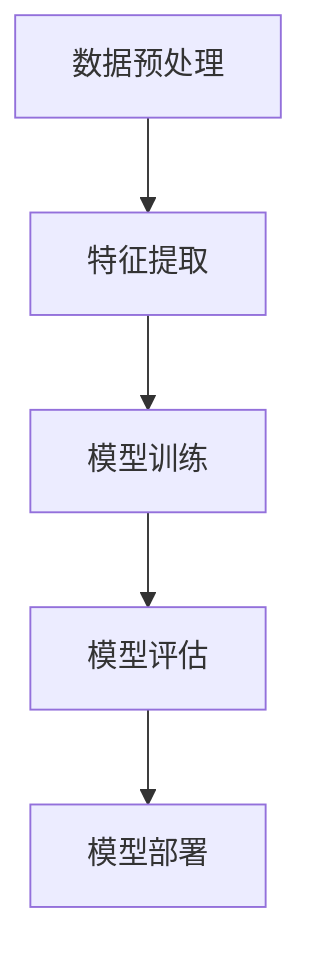
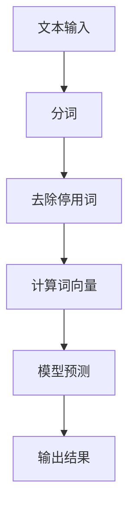
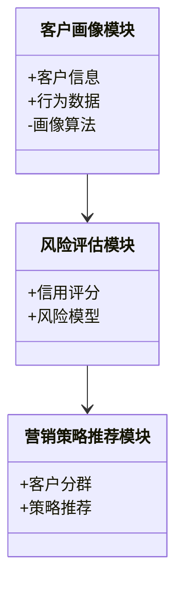

                 


# AI在金融产品营销中的创新应用

## 关键词：人工智能，金融营销，机器学习，客户画像，精准营销，自然语言处理

## 摘要：  
随着人工智能技术的快速发展，AI在金融产品营销中的应用日益广泛。本文深入探讨了AI技术如何 revolutionize 金融营销领域，从客户画像、精准营销到智能投顾，详细分析了AI在金融营销中的创新应用及其带来的商业价值。通过实际案例和系统设计，本文为读者展示了如何利用AI技术提升金融产品的营销效果和客户体验。

---

## 第一部分：AI与金融营销的背景

### 第1章：AI与金融营销的背景

#### 1.1 AI技术的发展与应用

AI技术的发展经历了多个阶段，从简单的规则引擎到复杂的深度学习模型，其在金融领域的应用也日益广泛。以下是一个简单的AI技术发展时间线：

```mermaid
timeline
    title AI技术发展时间线
    :2010 "AI技术开始进入金融领域";
    :2015 "机器学习技术应用于金融预测";
    :2018 "深度学习在金融领域的应用";
    :2020 "AI驱动的金融营销成为主流";
    :2023 "AI与金融营销深度融合";
```

#### 1.2 金融产品营销的创新需求

传统金融营销模式存在客户触达难、营销效果不显著等问题，而AI技术的应用为金融营销带来了新的可能性。以下是一个简单的对比表格：

| **传统营销模式** | **AI驱动营销模式** |
|------------------|-------------------|
| 客户画像基于人工分析 | 基于大数据的自动化客户画像 |
| 营销策略单一 | 多维度精准营销策略 |
| 营销效果难评估 | 数据驱动的实时效果评估 |

---

## 第二部分：AI技术的核心概念与原理

### 第2章：AI在金融营销中的核心概念

#### 2.1 机器学习与深度学习

机器学习和深度学习是AI技术在金融营销中的两大核心技术。以下是机器学习的基本原理：



一个简单的线性回归模型可以表示为：

$$ y = \beta_0 + \beta_1x + \epsilon $$

其中，$y$ 是预测目标，$x$ 是输入特征，$\beta_0$ 和 $\beta_1$ 是模型参数，$\epsilon$ 是误差项。

#### 2.2 自然语言处理（NLP）在金融营销中的应用

NLP技术在金融营销中的应用主要体现在情感分析和客户意图识别上。以下是一个简单的NLP处理流程图：



---

## 第三部分：AI算法原理与数学模型

### 第3章：机器学习算法原理

#### 3.1 线性回归与逻辑回归

线性回归适用于连续型变量的预测，而逻辑回归则适用于分类问题。以下是逻辑回归的损失函数：

$$ L(\theta) = -\frac{1}{m} \sum_{i=1}^{m} [y_i \ln h(x_i) + (1 - y_i) \ln (1 - h(x_i))] $$

其中，$h(x_i) = \frac{e^{\theta^T x_i}}{1 + e^{\theta^T x_i}}$ 是sigmoid函数。

#### 3.2 支持向量机（SVM）

SVM通过构建超平面实现数据的线性或非线性分类。其优化目标为：

$$ \min_{\theta, b, \xi} \frac{1}{2}||\theta||^2 + C\sum_{i=1}^{m}\xi_i $$

约束条件为：

$$ y_i (\theta^T x_i + b) \geq 1 - \xi_i $$
$$ \xi_i \geq 0 $$

---

## 第四部分：系统架构与设计

### 第4章：金融营销系统的架构设计

#### 4.1 系统功能模块设计

一个典型的金融营销系统包括客户画像、风险评估和营销策略推荐三个核心模块。以下是一个简单的系统功能模块图：



---

## 第五部分：项目实战与案例分析

### 第5章：AI驱动的金融营销项目实战

#### 5.1 项目环境与工具安装

一个典型的项目环境配置如下：

```bash
# 系统依赖安装
sudo apt-get install python3 python3-dev python3-pip
# 安装项目依赖
pip install numpy pandas scikit-learn
```

#### 5.2 核心算法实现

以下是一个简单的客户画像算法实现：

```python
import pandas as pd
from sklearn.preprocessing import StandardScaler
from sklearn.cluster import KMeans

# 数据预处理
data = pd.read_csv('customer_data.csv')
features = data[['age', 'income', 'purchase_frequency']]
scaler = StandardScaler()
scaled_features = scaler.fit_transform(features)

# K-means聚类
kmeans = KMeans(n_clusters=3, random_state=42)
clusters = kmeans.fit_predict(scaled_features)

# 可视化结果
print(clusters)
```

#### 5.3 项目案例分析

通过实际案例分析，我们可以看到AI在金融营销中的显著效果。以下是一个简单的客户分群案例：

| **客户群体** | **特征** | **营销策略** |
|--------------|-----------|---------------|
| 高收入年轻客户 | 年龄<35，收入高，购买频率高 | 高端理财产品推荐 |
| 中年稳健投资者 | 年龄35-50，收入中等，购买频率稳定 | 定期存款推荐 |
| 高风险承受者 | 风险偏好高，投资经验丰富 | 高风险理财产品推荐 |

---

## 第六部分：最佳实践、小结、注意事项与拓展阅读

### 6.1 最佳实践

在实际应用中，建议金融企业从以下几个方面入手：

1. **数据质量管理**：确保数据的准确性和完整性。
2. **模型持续优化**：定期更新模型参数，保持模型的高精度。
3. **用户隐私保护**：严格遵守数据隐私相关法律法规。

### 6.2 小结

通过本文的详细分析，我们可以看到AI技术在金融营销中的巨大潜力。从客户画像到精准营销，AI技术正在 revolutionize 传统金融营销模式，为企业创造更大的价值。

### 6.3 注意事项

1. **数据隐私**：在处理客户数据时，必须严格遵守相关法律法规。
2. **模型解释性**：复杂的AI模型可能难以解释，需注重模型的可解释性。
3. **技术风险**：AI系统可能面临数据偏差、算法漏洞等问题，需提前做好风险控制。

### 6.4 拓展阅读

1. [《Python机器学习实战》](https://link)
2. [《深度学习在金融中的应用》](https://link)
3. [《自然语言处理入门》](https://link)

---

以上就是《AI在金融产品营销中的创新应用》的完整目录和内容概要。希望这篇文章能为读者提供清晰的思路和实用的知识，帮助他们在金融营销领域更好地应用AI技术。

