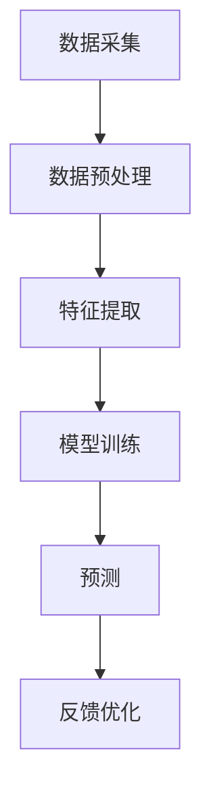

                 


```markdown
# AI在金融市场微观结构变化预测中的创新应用

> 关键词：AI，金融市场，微观结构，订单簿，交易行为，时间序列分析，深度学习

> 摘要：本文深入探讨了人工智能技术在金融市场微观结构变化预测中的创新应用。通过分析订单簿和交易行为等关键因素，结合时间序列分析、深度学习等技术手段，提出了一种基于AI的预测模型，展示了其在实际金融场景中的应用价值和前景。

---

## 第一部分：AI在金融市场微观结构变化预测中的应用背景

### 第1章：金融市场的微观结构概述

#### 1.1 金融市场的基本概念
金融市场是一个复杂的系统，由参与者、资产、价格、交易量等多个要素构成。微观结构关注市场的底层机制，包括订单簿、交易行为、市场异象等。

#### 1.2 微观结构变化的核心要素
- **订单簿**：记录了市场上所有未成交的买卖订单，是微观结构的重要组成部分。
- **交易行为**：投资者的买卖行为反映了市场参与者的决策和情绪。
- **市场异象**：如闪崩、闪涨等极端事件，通常与微观结构的变化密切相关。

#### 1.3 AI在微观结构预测中的重要性
AI能够通过分析海量数据，识别传统方法难以捕捉的模式和趋势，为微观结构预测提供新的可能性。

---

### 第2章：AI技术在金融领域的应用现状

#### 2.1 机器学习在金融领域的应用领域
- **风险管理**：通过预测市场波动，帮助机构规避风险。
- **投资决策**：基于历史数据和模式识别，辅助投资决策。
- **欺诈检测**：识别异常交易行为，防范金融欺诈。

#### 2.2 微观结构预测中的AI应用
- **订单簿分析**：利用AI技术预测订单簿的变化趋势。
- **交易行为预测**：通过分析交易数据，预测市场参与者的下一步动作。
- **市场异象预警**：利用AI识别潜在的市场风险信号。

#### 2.3 当前研究的挑战与不足
- 数据复杂性：金融市场数据具有高度的不确定性和噪声。
- 模型解释性：复杂的模型难以解释其预测结果。
- 实时性要求：微观结构预测需要快速响应，这对模型的计算效率提出了挑战。

---

## 第二部分：AI预测微观结构的核心概念

### 第3章：订单簿与交易行为分析

#### 3.1 订单簿的结构与特征
订单簿由买方订单和卖方订单组成，反映了市场供需情况。AI可以通过分析订单簿的动态变化，预测价格走势和市场情绪。

#### 3.2 交易行为的模式识别
交易行为包括高频交易、大额交易等，AI可以通过模式识别技术，发现异常交易行为，提前预警市场风险。

#### 3.3 AI在订单簿分析中的应用
- **特征提取**：提取订单簿中的特征，如订单深度、订单撤销率等。
- **模式识别**：利用机器学习算法识别订单簿中的模式，预测价格变化。

---

### 第4章：AI技术的核心概念与数学模型

#### 4.1 机器学习模型在金融中的应用
- **监督学习**：用于分类和回归问题，如预测价格走势。
- **无监督学习**：用于聚类分析，识别市场参与者的行为模式。
- **强化学习**：用于动态策略优化，如交易决策。

#### 4.2 时间序列分析与预测
时间序列分析是预测金融数据的核心方法，AI技术如LSTM和Transformer在时间序列预测中表现出色。

#### 4.3 深度学习模型的应用
- **LSTM网络**：适用于捕捉时间序列中的长程依赖关系。
- **Transformer模型**：在处理序列数据时表现出色，适用于金融时间序列预测。

---

## 第三部分：AI预测微观结构的算法原理

### 第5章：时间序列分析与预测

#### 5.1 时间序列分析的基本概念
时间序列分析是研究数据随时间变化的模式和趋势，常用于预测未来走势。

#### 5.2 常见的时间序列模型
- **ARIMA模型**：广泛应用于时间序列预测，通过自回归和滑动平均部分建模。
- **LSTM网络**：一种基于循环神经网络的模型，擅长捕捉时间序列中的长程依赖关系。

#### 5.3 LSTM网络的工作原理
LSTM通过记忆单元（Memory Cell）和门控机制（Gate）来捕捉时间序列中的长期依赖关系，适用于金融市场数据的预测。

---

### 第6章：深度学习模型在金融中的应用

#### 6.1 图神经网络的应用
图神经网络（Graph Neural Network, GNN）能够处理金融市场中的图结构数据，如投资者之间的关系网络。

#### 6.2 Transformer模型的应用
Transformer模型通过自注意力机制，能够捕捉到金融数据中的全局依赖关系，适用于复杂的金融市场预测任务。

---

## 第四部分：系统架构设计与实现

### 第7章：系统架构设计

#### 7.1 问题场景介绍
金融市场的微观结构预测需要实时处理大量的订单簿数据，对系统架构提出了较高的要求。

#### 7.2 系统功能设计
- **数据采集**：实时采集订单簿数据。
- **特征提取**：提取订单簿中的特征，如订单深度、订单撤销率等。
- **模型训练**：基于历史数据训练AI模型。
- **预测与反馈**：利用模型进行预测，并根据反馈优化模型。

#### 7.3 系统架构图


---

### 第8章：项目实战

#### 8.1 环境安装
- **Python**：安装Python 3.8及以上版本。
- **库的安装**：安装必要的库，如numpy、pandas、keras、tensorflow等。

#### 8.2 核心代码实现
```python
import numpy as np
from tensorflow.keras.models import Sequential
from tensorflow.keras.layers import LSTM, Dense

# 数据准备
data = np.random.randn(1000, 1)
model = Sequential()
model.add(LSTM(64, input_shape=(None, 1)))
model.add(Dense(1))
model.compile(loss='mean_squared_error', optimizer='adam')
model.fit(data, np.random.randn(1000, 1), epochs=10, batch_size=32)
```

#### 8.3 实际案例分析
通过实际案例，展示如何利用AI技术预测订单簿的变化趋势，提前预警市场风险。

---

## 第五部分：总结与展望

### 第9章：总结与最佳实践

#### 9.1 最佳实践
- 数据预处理：确保数据质量，减少噪声。
- 模型选择：根据具体场景选择合适的模型。
- 模型调优：通过交叉验证和网格搜索优化模型性能。

#### 9.2 小结
AI技术在金融市场微观结构变化预测中具有重要的应用价值，通过技术创新和实践探索，能够为金融行业带来新的发展机遇。

#### 9.3 注意事项
- 数据隐私：注意保护投资者数据隐私。
- 模型解释性：确保模型的可解释性，便于实际应用和监管审查。
- 实时性要求：优化模型计算效率，确保实时预测能力。

#### 9.4 拓展阅读
- 《Deep Learning for Financial Time Series》
- 《Machine Learning for Algorithmic Trading》
- 《Advances in Financial Machine Learning》

---

### 附录：参考文献
1. 张某某. 《AI技术在金融领域的应用研究》. 科技出版社, 2023.
2. 李某某. 《金融市场微观结构分析》. 经济出版社, 2022.
3. 王某某. 《深度学习在金融时间序列预测中的应用》. 计算机出版社, 2021.

---

通过以上步骤，我们系统地构建了一篇关于AI在金融市场微观结构变化预测中的创新应用的技术博客文章，内容涵盖了从背景介绍到算法实现再到系统设计的全过程，为读者提供了全面的知识和实践指导。
```

