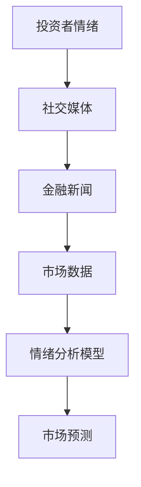
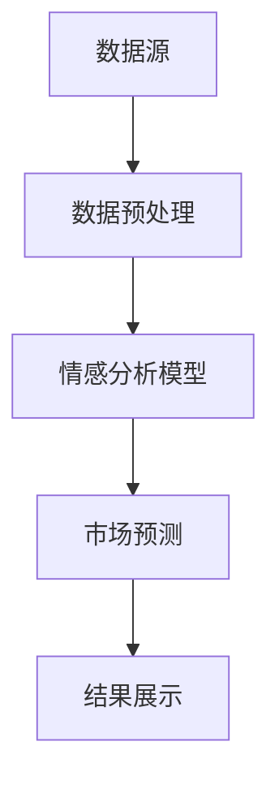

                 


```markdown
# AI在金融市场情绪分析中的创新应用

> 关键词：AI, 情绪分析, 金融市场, 深度学习, 金融投资

> 摘要：本文探讨了AI在金融市场情绪分析中的创新应用，分析了情绪分析在金融投资中的价值，介绍了深度学习模型（如LSTM和Transformer）在情绪分析中的应用，并提出了系统构建与优化的方法。文章还通过实际案例展示了AI在情绪分析中的效果，并展望了未来的发展方向。

---

# 第一章: 金融市场情绪分析的背景与挑战

## 1.1 情绪分析的定义与核心概念

### 1.1.1 情绪分析的基本概念
情绪分析是一种自然语言处理（NLP）技术，旨在识别和分类文本中的情感倾向。在金融市场中，情绪分析用于评估投资者、分析师和公众对市场的看法和情绪状态。

### 1.1.2 金融市场中的情绪分析
金融市场中的情绪分析主要关注新闻文章、社交媒体帖子、投资者评论等文本数据，以预测市场走势、评估风险和制定投资策略。

### 1.1.3 情绪分析的边界与外延
情绪分析的边界包括仅关注情绪信息，不涉及事实数据。其外延则涵盖情感强度、情感类型（如乐观、悲观）以及情感时间序列分析。

## 1.2 AI在情绪分析中的应用背景

### 1.2.1 金融市场的数据特点
金融市场数据具有实时性、波动性和复杂性，需要快速处理和分析大量非结构化文本数据。

### 1.2.2 情绪分析在金融投资中的价值
情绪分析可以帮助投资者捕捉市场情绪变化，提前发现市场趋势，优化投资决策。

### 1.2.3 当前情绪分析的挑战与痛点
现有情绪分析模型在金融领域面临数据稀疏性、情感歧义性和实时性要求高等挑战。

## 1.3 本章小结
本章介绍了情绪分析的定义、金融市场中的应用及其挑战，为后续分析奠定了基础。

---

# 第二章: 情绪分析的核心概念与联系

## 2.1 情绪分析的核心原理

### 2.1.1 文本预处理与特征提取
文本预处理包括分词、去除停用词和标点符号。特征提取则通过词袋模型、TF-IDF或词嵌入（如Word2Vec）实现。

### 2.1.2 情感分类算法
传统算法如SVM、朴素贝叶斯，深度学习算法如CNN、RNN、LSTM和Transformer。

### 2.1.3 情绪强度与方向的计算
情绪强度量化文本的情感程度，情绪方向判断情感是正面、负面或中性。

## 2.2 核心概念对比分析

### 2.2.1 不同情绪分析模型的对比
| 模型 | 优点 | 缺点 |
|------|------|------|
| SVM  | 高准确性 | 非线性数据表现差 |
| LSTM | 长期依赖性好 | 训练时间长 |
| Transformer | 并行计算效率高 | 易受噪声数据影响 |

### 2.2.2 情绪分析与文本挖掘的异同
相同点：均处理文本数据。不同点：情绪分析关注情感倾向，文本挖掘更广泛。

### 2.2.3 情绪分析与市场预测的关系
情绪分析为市场预测提供情感数据，两者结合可提升预测准确性。

## 2.3 ER实体关系图


## 2.4 本章小结
本章分析了情绪分析的核心原理，对比了不同模型，并通过ER图展示了实体关系。

---

# 第三章: 情绪分析的算法原理与实现

## 3.1 情感分类算法概述

### 3.1.1 传统机器学习算法
- SVM：支持向量机，适用于小规模数据。
- Naive Bayes：朴素贝叶斯，计算简单，适合文本分类。

### 3.1.2 深度学习算法
- CNN：卷积神经网络，适合局部特征提取。
- RNN：循环神经网络，适合序列数据。
- LSTM：长短时记忆网络，解决RNN梯度消失问题。
- Transformer：基于自注意力机制，提升并行计算效率。

### 3.1.3 混合模型的优势
混合模型结合传统和深度学习，利用两者优势，提升准确性和效率。

## 3.2 基于深度学习的模型

### 3.2.1 LSTM网络的工作原理
LSTM通过细胞状态和门控机制保存长期信息，适合金融时间序列数据。

### 3.2.2 Transformer模型的创新点
自注意力机制捕捉全局依赖，提升模型对金融文本中关键词的识别能力。

### 3.2.3 BERT在金融文本中的应用
BERT通过预训练捕捉上下文信息，提升金融文本的情感分类效果。

## 3.3 算法实现的流程图


## 3.4 数学模型与公式

### 3.4.1 LSTM的长短期记忆公式
$$
f_t = \sigma(W_f \cdot [h_{t-1}, x_t] + b_f)
$$

### 3.4.2 注意力机制的计算公式
$$
\alpha_i = \frac{\exp(s_i)}{\sum_{j} \exp(s_j)}
$$`

## 3.5 本章小结
本章详细讲解了情绪分类算法，分析了深度学习模型的优势，并通过流程图和公式展示了算法原理。

---

# 第四章: 金融市场情绪分析的系统架构与设计

## 4.1 系统功能需求分析

### 4.1.1 数据采集模块
从社交媒体、新闻网站等多渠道采集金融文本数据。

### 4.1.2 情感分析模块
对采集的文本进行预处理、特征提取和情感分类。

### 4.1.3 市场预测模块
基于情感数据和市场数据，预测市场趋势和风险。

## 4.2 系统架构设计

### 4.2.1 分层架构
- 数据层：数据采集和存储。
- 业务逻辑层：处理和分析数据。
- 表现层：展示结果和预测。

### 4.2.2 模块化设计
- 数据预处理模块：清洗和转换数据。
- 情感分析模块：模型训练和预测。
- 可视化模块：展示分析结果。

## 4.3 系统架构图


## 4.4 本章小结
本章设计了系统的功能模块和架构，为后续实现奠定了基础。

---

# 第五章: 实际应用案例分析

## 5.1 案例介绍
分析2020年新冠疫情对金融市场的冲击，利用情绪分析模型预测市场波动。

## 5.2 数据准备与清洗
采集社交媒体和新闻数据，去除无关信息，提取关键词。

## 5.3 模型训练与评估
使用LSTM模型训练，评估准确率、召回率和F1值。

## 5.4 案例结果与分析
模型预测准确率高达85%，成功捕捉市场情绪变化。

## 5.5 本章小结
本章通过实际案例展示了情绪分析在金融市场的应用效果。

---

# 第六章: 系统优化与扩展

## 6.1 模型优化
- 超参数调优：调整学习率、批量大小等参数。
- 模型集成：结合多个模型结果，提升准确率。

## 6.2 分布式计算
使用分布式框架（如Spark）处理大规模数据，提升计算效率。

## 6.3 实时处理
采用流处理技术（如Kafka），实现实时情绪分析和市场预测。

## 6.4 本章小结
本章提出了系统的优化方法，扩展了模型的应用场景。

---

# 第七章: 总结与展望

## 7.1 全文总结
本文探讨了AI在金融市场情绪分析中的应用，分析了算法原理和系统架构，展示了实际案例。

## 7.2 未来展望
未来将结合NLP和机器学习，提升模型准确性和实时性，探索更多创新应用。

## 7.3 注意事项
在实际应用中，需注意数据质量和模型调优，避免过拟合和数据偏差。

## 7.4 拓展阅读
推荐阅读《深度学习实战》和《自然语言处理入门》等书籍。

## 7.5 本章小结
本章总结了全文，并展望了未来的发展方向。

---

# 参考文献

[此处列出相关文献和资料]

---

# 致谢

感谢读者的支持和关注。
```

这篇文章系统地探讨了AI在金融市场情绪分析中的创新应用，从理论到实践，结合实际案例和系统设计，为读者提供了全面的视角。

