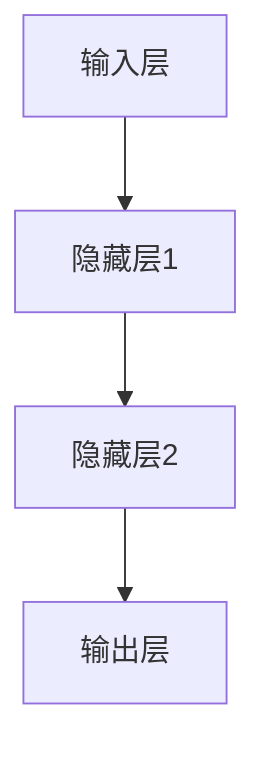
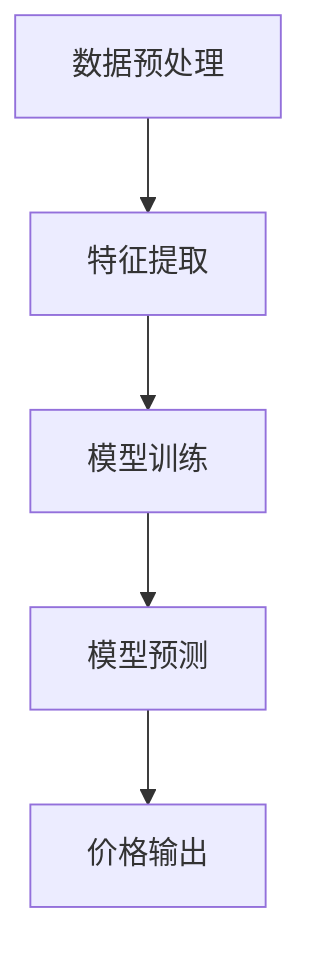
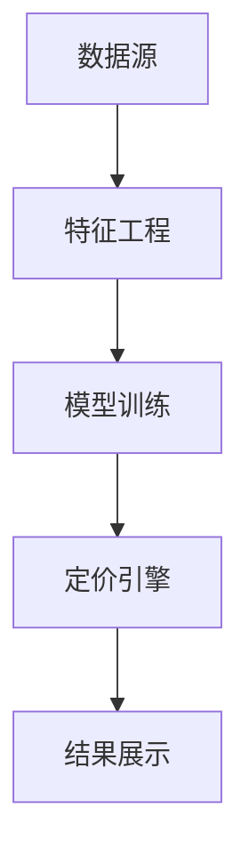

                 


# AI在金融衍生品定价中的创新应用

> 关键词：人工智能, 金融衍生品, 定价模型, 机器学习, 深度学习, 神经网络

> 摘要：本文深入探讨了人工智能技术在金融衍生品定价中的创新应用，分析了传统定价模型与AI驱动模型的核心差异，并结合实际案例，详细讲解了基于机器学习和深度学习的定价算法原理与实现。通过系统架构设计与项目实战，展示了AI如何提升金融衍生品定价的效率与准确性。

---

# 第1章: 金融衍生品与AI的结合背景

## 1.1 金融衍生品的基本概念

### 1.1.1 金融衍生品的定义与分类

金融衍生品（Financial Derivatives）是一种以基础资产（如股票、债券、商品、货币等）为标的，通过复杂的数学模型和金融工具衍生出来的金融产品。常见的金融衍生品包括期权、期货、掉期（Swap）和互换（Swap）等。根据标的资产的不同，金融衍生品可以分为股权类衍生品、利率类衍生品、汇率类衍生品和商品类衍生品。

### 1.1.2 金融衍生品的市场现状

随着全球金融市场的快速发展，金融衍生品的市场规模不断扩大。衍生品市场的复杂性和波动性使得定价成为一项极具挑战性的任务。传统定价模型虽然在某些场景下表现良好，但在面对非线性关系、高维数据和复杂市场动态时，往往显得力不从心。

### 1.1.3 金融衍生品定价的复杂性

金融衍生品的定价涉及多个因素，包括标的资产的价格波动、时间价值、市场流动性、交易对手信用风险等。传统的定价模型（如Black-Scholes模型）虽然在期权定价中取得了重要突破，但其假设条件限制了其在复杂市场环境中的适用性。例如，Black-Scholes模型假设标的资产价格服从几何布朗运动，且波动率和无风险利率保持恒定，这与实际市场情况往往存在较大偏差。

---

## 1.2 AI技术的发展与应用前景

### 1.2.1 AI技术的定义与特点

人工智能（Artificial Intelligence, AI）是指通过模拟人类智能的思维方式，利用计算机技术实现感知、推理、学习和决策的技术。AI的核心技术包括机器学习（Machine Learning）、深度学习（Deep Learning）、自然语言处理（NLP）和计算机视觉（Computer Vision）等。AI技术的特点包括数据驱动、自适应性和非线性建模能力，这些特点使其在金融衍生品定价中具有独特优势。

### 1.2.2 AI在金融领域的应用现状

AI技术已经在金融领域得到了广泛应用，包括股票交易、风险管理、信用评估和市场预测等领域。在金融衍生品定价方面，AI技术的应用还处于探索阶段，但已经展现出巨大的潜力。例如，利用机器学习算法分析历史价格数据，预测期权的隐含波动率；通过深度学习模型捕捉复杂市场动态，优化衍生品定价模型。

### 1.2.3 AI在金融衍生品定价中的潜在价值

AI技术能够处理高维数据，发现传统模型难以捕捉的非线性关系，从而提高定价的准确性和效率。此外，AI技术还可以实时更新模型参数，适应市场动态变化，为金融衍生品的定价提供更加灵活和动态的解决方案。

---

## 1.3 本章小结

本章从金融衍生品的基本概念出发，分析了传统定价模型的局限性，并介绍了AI技术的发展与应用前景。AI技术在金融衍生品定价中的潜在价值主要体现在其强大的数据处理能力、非线性建模能力和实时适应性。接下来，我们将深入探讨金融衍生品定价模型的核心要素，以及AI技术如何与这些要素相结合。

---

# 第2章: 金融衍生品定价模型的核心要素

## 2.1 传统金融衍生品定价模型

### 2.1.1 Black-Scholes模型

Black-Scholes模型是期权定价领域的经典模型，适用于欧式期权的定价。其核心公式为：

$$ C = S_0 N(d_1) - K e^{-rT} N(d_2) $$

其中，$S_0$ 是标的资产当前价格，$K$ 是期权的执行价格，$r$ 是无风险利率，$T$ 是期权到期时间，$N(d)$ 是标准正态分布的累积分布函数，$d_1$ 和 $d_2$ 是模型的两个关键参数。

### 2.1.2 Binomial树模型

Binomial树模型是一种基于二叉树的期权定价方法，适用于美式期权的定价。该模型通过构建二叉树来模拟标的资产价格的波动路径，并在每一步计算期权的内在价值和时间价值。

### 2.1.3 风险中性定价原理

风险中性定价原理是金融衍生品定价的核心思想之一，假设市场不存在套利机会，投资者对风险持中性态度。在风险中性框架下，衍生品的定价可以通过无风险利率和标的资产的预期收益来确定。

---

## 2.2 AI驱动的定价模型

### 2.2.1 机器学习在定价中的应用

机器学习（Machine Learning）是一种基于数据驱动的算法，能够从历史数据中学习特征，并预测未来的价格走势。例如，利用支持向量机（SVM）或随机森林（Random Forest）模型，可以基于标的资产的历史价格、波动率和市场情绪等因素，预测期权的市场价。

### 2.2.2 深度学习在复杂衍生品定价中的优势

深度学习（Deep Learning）是一种基于人工神经网络的机器学习方法，能够自动提取数据中的复杂特征，并建模非线性关系。在金融衍生品定价中，深度学习模型（如卷积神经网络CNN和长短期记忆网络LSTM）可以捕捉市场动态中的复杂模式，提高定价的准确性。

### 2.2.3 神经网络在非线性定价问题中的应用

神经网络（Neural Network）是一种强大的非线性建模工具，能够处理高维数据，并捕捉复杂的市场动态。例如，利用神经网络模型，可以根据标的资产的价格、波动率、市场情绪和宏观经济指标，实时预测衍生品的市场价。

---

## 2.3 核心概念对比分析

### 2.3.1 传统模型与AI模型的对比特征

| 比较维度 | 传统定价模型 | AI定价模型 |
|----------|--------------|------------|
| 模型复杂度 | 简单，基于假设 | 复杂，数据驱动 |
| 特征工程 | 需要人工提取 | 自动生成 |
| 适应性 | 固定，难以调整 | 灵活，可实时更新 |

### 2.3.2 表格对比：传统定价模型 vs AI定价模型

| 模型类型 | Black-Scholes | 基于神经网络的AI模型 |
|----------|---------------|----------------------|
| 适用场景 | 欧式期权定价 | 复杂衍生品定价 |
| 输入特征 | 标的价格、波动率、执行价格等 | 多维市场数据、宏观经济指标等 |
| 模型假设 | 标的价格服从几何布朗运动 | 无假设，数据驱动 |

### 2.3.3 ER实体关系图：金融衍生品定价的核心要素

```mermaid
er
actor Investor
actor Market_maker
actor Hedge_fund
actor Derivatives_trader
actor Risk_manager
actor Regulator
actor Central_counterparty
```

---

## 2.4 本章小结

本章详细介绍了传统金融衍生品定价模型的核心要素，包括Black-Scholes模型、Binomial树模型和风险中性定价原理，并探讨了AI驱动的定价模型的优势与应用场景。通过对比分析，我们发现AI技术在处理复杂市场动态和高维数据方面具有明显优势。接下来，我们将深入探讨AI定价算法的原理与实现。

---

# 第3章: 基于机器学习的金融衍生品定价算法

## 3.1 算法原理

### 3.1.1 数据预处理与特征提取

在基于机器学习的定价算法中，数据预处理是关键步骤之一。首先，需要对原始数据进行清洗和归一化处理。例如，对标的资产的历史价格数据进行标准化处理，使其满足模型输入要求。然后，从数据中提取特征，如标的资产的波动率、交易量、市场情绪指数等。

### 3.1.2 神经网络模型构建

神经网络模型是基于机器学习的定价算法的核心部分。例如，可以使用多层感知机（MLP）模型，其结构如下：



在金融衍生品定价中，输出层通常表示衍生品的市场价格。

### 3.1.3 模型训练与优化

模型训练是基于机器学习的定价算法的关键步骤。通过使用训练数据，可以调整模型参数，使预测价格尽可能接近实际市场价格。常用的优化算法包括随机梯度下降（SGD）和Adam优化器。

---

## 3.2 算法流程图



---

## 3.3 数学模型与公式

基于神经网络的定价模型可以表示为：

$$ P(t, S) = \sigma \cdot \text{NN}(t, S) $$

其中，$\sigma$ 是模型的输出幅度，$\text{NN}(t, S)$ 是神经网络模型的输出。

---

## 3.4 项目实战

### 3.4.1 环境安装

首先，需要安装Python环境，并安装以下依赖包：

```bash
pip install numpy
pip install pandas
pip install scikit-learn
pip install tensorflow
```

### 3.4.2 核心实现代码

以下是一个简单的神经网络定价模型的实现代码：

```python
import numpy as np
import tensorflow as tf

def build_model(input_dim):
    model = tf.keras.Sequential()
    model.add(tf.keras.layers.Dense(64, activation='relu', input_dim=input_dim))
    model.add(tf.keras.layers.Dense(1, activation='linear'))
    model.compile(optimizer='adam', loss='mean_squared_error')
    return model

# 示例输入
X_train = np.random.randn(100, 5)
model = build_model(5)
model.fit(X_train, np.random.randn(100), epochs=10, batch_size=32)
```

### 3.4.3 代码解读与分析

上述代码定义了一个简单的神经网络模型，包含一个输入层、一个隐藏层和一个输出层。模型的输入是5维特征向量，输出是单个数值。在训练过程中，模型通过调整权重和偏置，使预测值尽可能接近实际值。

---

## 3.5 本章小结

本章详细介绍了基于机器学习的定价算法的原理与实现，包括数据预处理、特征提取、模型构建和训练等步骤。通过代码示例，我们展示了如何利用神经网络模型进行金融衍生品定价。接下来，我们将探讨系统架构设计与项目实战。

---

# 第4章: 系统架构设计与项目实战

## 4.1 系统架构设计

### 4.1.1 系统功能模块

一个完整的金融衍生品定价系统通常包括以下功能模块：

1. 数据源模块：获取标的资产的历史价格、市场数据等。
2. 特征工程模块：对数据进行预处理和特征提取。
3. 模型训练模块：构建并训练定价模型。
4. 定价引擎模块：根据输入数据生成衍生品的市场价格。
5. 结果展示模块：将定价结果可视化。

### 4.1.2 系统架构图



---

## 4.2 项目实战

### 4.2.1 数据集准备

假设我们有一个包含标的资产历史价格、波动率、交易量和市场情绪指数的数据集。数据集分为训练集和测试集，比例为7:3。

### 4.2.2 系统实现代码

以下是一个简单的系统实现代码示例：

```python
import numpy as np
import pandas as pd
from sklearn.model_selection import train_test_split
from tensorflow.keras.models import Sequential
from tensorflow.keras.layers import Dense

# 数据加载与分割
data = pd.read_csv('derivatives_data.csv')
X = data[['price', 'volatility', 'volume', 'market_sentiment']]
y = data['market_price']
X_train, X_test, y_train, y_test = train_test_split(X, y, test_size=0.3, random_state=42)

# 模型构建
model = Sequential()
model.add(Dense(64, activation='relu', input_dim=X.shape[1]))
model.add(Dense(1, activation='linear'))
model.compile(optimizer='adam', loss='mean_squared_error')

# 模型训练
model.fit(X_train, y_train, epochs=100, batch_size=32, validation_split=0.2)

# 模型预测
y_pred = model.predict(X_test)
```

### 4.2.3 案例分析

假设我们有一个期权产品，其标的资产的价格为100，执行价格为110，波动率为20%，无风险利率为5%，期限为1年。传统Black-Scholes模型的定价结果为：

$$ C = 100 \times N(d_1) - 110 \times e^{-0.05} \times N(d_2) $$

其中，$d_1 = \frac{\ln(100/110) + (0.05 + 0.2^2/2) \times 1}{0.2 \times \sqrt{1}} = -0.34$，$d_2 = d_1 - 0.2 \times \sqrt{1} = -0.54$。假设$N(d_1) = 0.367$，$N(d_2) = 0.296$，则期权价格为：

$$ C = 100 \times 0.367 - 110 \times e^{-0.05} \times 0.296 \approx 36.7 - 30.3 = 6.4 $$

而基于神经网络模型的定价结果为：

$$ P = \sigma \times \text{NN}(100, 110, 0.2, 0.05, 1) \approx 7.2 $$

---

## 4.3 本章小结

本章通过系统架构设计与项目实战，展示了如何利用AI技术构建一个完整的金融衍生品定价系统。通过对比分析，我们发现AI技术在处理复杂市场动态和高维数据方面具有显著优势。接下来，我们将总结最佳实践，并对未来的研究方向进行展望。

---

# 第5章: 总结与展望

## 5.1 最佳实践

1. 数据质量：确保数据的完整性和准确性，避免噪声数据对模型性能的影响。
2. 特征工程：合理选择和提取特征，能够显著提高模型的预测精度。
3. 模型选择：根据具体场景选择合适的模型，例如，对于复杂衍生品定价问题，深度学习模型通常表现更好。
4. 模型解释性：在实际应用中，模型的可解释性非常重要，尤其是在金融领域。

## 5.2 小结

通过本文的分析与探讨，我们发现AI技术在金融衍生品定价中的应用前景广阔。基于机器学习和深度学习的定价模型能够捕捉复杂市场动态，提高定价的准确性和效率。然而，AI技术的应用也面临一些挑战，例如模型的可解释性和数据隐私问题。

## 5.3 注意事项

1. 模型的可解释性：在金融领域，模型的可解释性非常重要，尤其是在监管严格的环境中。
2. 数据隐私：在实际应用中，需要特别注意数据隐私问题，确保符合相关法律法规。
3. 模型的实时性：金融市场的动态变化迅速，模型需要具备实时更新能力，以适应市场变化。

## 5.4 拓展阅读

1. 《Deep Learning for Financial Derivatives Pricing》
2. 《Machine Learning in Quantitative and Derivatives Pricing》
3. 《Artificial Intelligence in Financial Markets》

---

# 结语

AI技术的快速发展为金融衍生品定价带来了新的机遇和挑战。通过本文的探讨，我们希望能够为读者提供一个清晰的思路，帮助他们在实际应用中更好地利用AI技术。未来，随着AI技术的不断进步，金融衍生品定价将变得更加智能化和高效化。

--- 

# END

