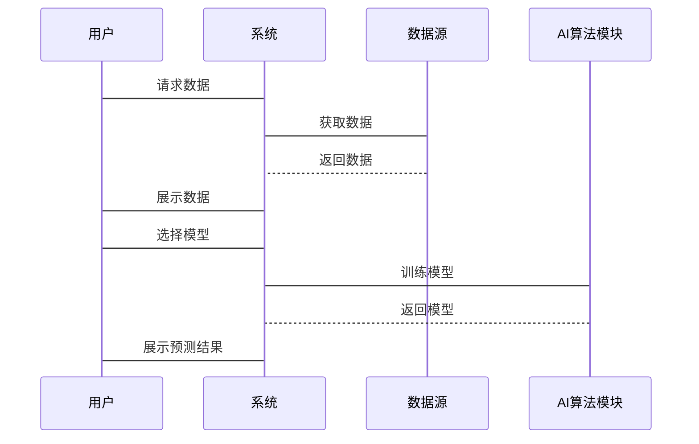

                 


# AI在金融衍生品定价模型动态选择与校准中的创新应用

## 关键词：AI，金融衍生品，定价模型，动态选择，校准，机器学习，随机森林，神经网络

## 摘要：本文系统地探讨了人工智能技术在金融衍生品定价模型中的创新应用，重点分析了动态选择与校准的核心概念、算法原理及实际应用。通过结合具体案例，深入讲解了随机森林、神经网络等算法在定价模型中的实现，并提供了完整的系统架构设计方案和项目实战指南，帮助读者全面理解并掌握AI在金融衍生品定价中的应用。

---

# 第1章: 金融衍生品与AI技术的结合

## 1.1 金融衍生品的基本概念

### 1.1.1 金融衍生品的定义与分类

金融衍生品是一种金融合约，其价值依赖于基础资产（如股票、债券、商品等）的价格变动。常见的衍生品包括期货、期权、掉期和互换等。衍生品的种类可以根据其结算方式、交易场所和标的资产进行分类。

- 按结算方式分类：远期合约、期货合约、期权合约。
- 按交易场所分类：场内交易和场外交易。
- 按标的资产分类：股票衍生品、债券衍生品、商品衍生品等。

### 1.1.2 金融衍生品的定价模型概述

衍生品的定价模型是金融数学的重要组成部分。传统的定价模型包括Black-Scholes模型（适用于期权定价）和久期分析模型（适用于债券衍生品）。这些模型通常假设资产价格服从几何布朗运动，并依赖于无风险利率、波动率、到期时间等参数。

### 1.1.3 AI技术在金融领域的应用背景

随着大数据和计算能力的提升，人工智能技术在金融领域的应用越来越广泛。AI技术可以通过分析历史价格数据、市场情绪、新闻事件等非结构化数据，提高金融衍生品定价模型的准确性和实时性。

---

## 1.2 AI技术在金融衍生品定价中的作用

### 1.2.1 AI技术的核心优势

AI技术在金融衍生品定价中的优势主要体现在以下几个方面：

1. **数据处理能力**：AI能够处理海量的结构化和非结构化数据，提取有用的特征。
2. **非线性关系建模**：传统定价模型假设资产价格服从布朗运动，而AI模型可以捕捉复杂的非线性关系。
3. **实时性**：AI模型可以实时更新参数，适应市场的快速变化。

### 1.2.2 AI在金融衍生品定价中的创新应用

AI技术在金融衍生品定价中的创新应用主要体现在动态选择与校准两个方面：

1. **动态选择**：根据市场环境的变化，动态选择最优的定价模型。
2. **校准**：利用AI算法对模型参数进行优化，提高定价模型的准确性。

### 1.2.3 金融衍生品定价模型的动态选择与校准

动态选择是指根据市场环境的变化，选择适合当前市场的定价模型。校准则是指通过历史数据和实时数据，对模型的参数进行优化，使模型能够更好地反映市场的实际情况。

---

## 1.3 本书的核心目标与结构

### 1.3.1 本书的研究目标

本书的核心目标是探讨AI技术在金融衍生品定价模型中的创新应用，特别是动态选择与校准的实现方法。通过理论分析和实践案例，帮助读者理解AI技术在金融衍生品定价中的应用。

### 1.3.2 本书的主要内容框架

1. 第1章：介绍金融衍生品和AI技术的基本概念。
2. 第2章：分析AI在金融衍生品定价模型中的核心概念与联系。
3. 第3章：探讨常见AI算法在金融衍生品定价中的应用。
4. 第4章：详细讲解随机森林和神经网络算法的原理和实现。
5. 第5章：分析金融衍生品定价模型的系统架构设计。
6. 第6章：提供项目实战，包括环境搭建、代码实现和案例分析。
7. 第7章：总结AI在金融衍生品定价中的应用，并展望未来的发展方向。

### 1.3.3 本书的读者群体与应用价值

本书的读者群体包括金融从业者、数据科学家、AI工程师以及对金融衍生品定价感兴趣的读者。通过阅读本书，读者可以掌握AI技术在金融衍生品定价中的应用方法，并能够将这些方法应用到实际工作中。

---

# 第2章: AI驱动的金融衍生品定价模型

## 2.1 机器学习模型在金融定价中的应用

### 2.1.1 机器学习的基本概念

机器学习是一种人工智能技术，通过数据训练模型，使其能够自动学习和预测。机器学习模型可以分为监督学习、无监督学习和强化学习三类。

### 2.1.2 常见机器学习算法在金融定价中的应用

1. **线性回归**：用于预测资产的未来价格。
2. **支持向量机（SVM）**：用于分类和回归任务。
3. **随机森林**：用于特征选择和模型预测。

### 2.1.3 机器学习模型的优缺点对比

| 算法 | 优点 | 缺点 |
|------|------|------|
| 线性回归 | 简单，易于解释 | 无法处理非线性关系 |
| SVM | 分类能力强 | 对噪声数据敏感 |
| 随机森林 | 鲁棒性强 | 计算复杂度高 |

---

## 2.2 动态选择与校准的定义与原理

### 2.2.1 动态选择的定义与实现方法

动态选择是指根据市场环境的变化，动态选择最优的定价模型。其实现方法包括：

1. **模型性能评估**：通过历史数据评估模型的准确性。
2. **市场环境分析**：分析当前市场环境的变化，选择适合的模型。

### 2.2.2 校准的定义与实现方法

校准是指通过历史数据和实时数据，对模型的参数进行优化，使模型能够更好地反映市场的实际情况。其实现方法包括：

1. **参数优化**：通过遗传算法、梯度下降等方法优化模型参数。
2. **模型训练**：利用历史数据训练模型，提高模型的预测能力。

### 2.2.3 金融衍生品定价模型的核心要素

定价模型的核心要素包括：

1. **输入变量**：如无风险利率、波动率、到期时间等。
2. **输出变量**：如期权的理论价格。
3. **评估指标**：如均方误差（MSE）、平均绝对误差（MAE）等。

---

## 2.3 AI与金融衍生品定价模型的结合

### 2.3.1 AI在定价模型动态选择中的应用

通过AI技术，可以实时分析市场环境的变化，动态选择最优的定价模型。例如，当市场波动率显著增加时，可以选择更加稳健的模型。

### 2.3.2 AI在定价模型校准中的应用

AI技术可以自动优化模型的参数，提高模型的准确性。例如，利用随机森林算法进行特征选择，利用神经网络算法进行模型训练。

### 2.3.3 AI在定价模型优化中的应用

AI技术可以通过分析历史数据和实时数据，优化定价模型的结构和参数，提高模型的预测能力。

---

# 第3章: 常见AI算法在金融衍生品定价中的应用

## 3.1 随机森林算法在定价模型中的应用

### 3.1.1 随机森林算法的定义与原理

随机森林是一种基于树的集成算法，通过随机选择特征和样本，构建多个决策树，最终通过投票或平均的方式进行预测。

### 3.1.2 随机森林算法在定价模型中的实现步骤

1. **数据预处理**：清洗数据，处理缺失值。
2. **特征选择**：随机选择特征，构建决策树。
3. **模型训练**：利用训练数据训练随机森林模型。
4. **模型预测**：利用测试数据进行预测，计算模型的准确率。

### 3.1.3 随机森林算法的优缺点分析

- **优点**：鲁棒性强，能够处理高维数据。
- **缺点**：计算复杂度高，难以解释。

---

## 3.2 神经网络算法在定价模型中的应用

### 3.2.1 神经网络算法的定义与原理

神经网络是一种模仿人脑结构和功能的AI算法，通过多层神经元网络进行特征提取和模型训练。

### 3.2.2 神经网络算法在定价模型中的实现步骤

1. **数据预处理**：清洗数据，归一化处理。
2. **网络构建**：设计神经网络的结构，包括输入层、隐藏层和输出层。
3. **模型训练**：利用训练数据训练神经网络模型。
4. **模型预测**：利用测试数据进行预测，计算模型的准确率。

### 3.2.3 神经网络算法的优缺点分析

- **优点**：能够捕捉复杂的非线性关系，预测能力强。
- **缺点**：计算复杂度高，难以解释。

---

## 3.3 支持向量机算法在定价模型中的应用

### 3.3.1 支持向量机算法的定义与原理

支持向量机是一种监督学习算法，通过寻找最优超平面，将数据分为两类。

### 3.3.2 支持向量机算法在定价模型中的实现步骤

1. **数据预处理**：清洗数据，处理缺失值。
2. **特征选择**：选择重要的特征，构建模型。
3. **模型训练**：利用训练数据训练支持向量机模型。
4. **模型预测**：利用测试数据进行预测，计算模型的准确率。

### 3.3.3 支持向量机算法的优缺点分析

- **优点**：适用于小规模数据，分类能力强。
- **缺点**：难以处理大规模数据，计算复杂度高。

---

# 第4章: 金融衍生品定价模型的系统架构设计

## 4.1 问题场景介绍

金融衍生品定价模型的动态选择与校准需要解决以下问题：

1. **数据获取**：如何获取高质量的金融数据。
2. **模型选择**：如何动态选择最优的定价模型。
3. **模型校准**：如何优化模型的参数，提高模型的准确性。

## 4.2 系统功能设计

### 4.2.1 领域模型（mermaid类图）


### 4.2.2 系统架构设计（mermaid架构图）

```mermaid
archiecture
    定价模型管理模块 --> 数据获取模块
    数据获取模块 --> 数据存储模块
    数据存储模块 --> 数据处理模块
    数据处理模块 --> AI算法模块
    AI算法模块 --> 模型选择模块
    模型选择模块 --> 模型校准模块
    模型校准模块 --> 预测结果展示模块
```

### 4.2.3 系统接口设计与交互（mermaid序列图）



---

## 4.3 项目实战

### 4.3.1 环境安装

1. **安装Python**：下载并安装Python 3.8或更高版本。
2. **安装相关库**：安装NumPy、Pandas、Scikit-learn、XGBoost等库。

### 4.3.2 系统核心实现源代码

```python
import numpy as np
import pandas as pd
from sklearn.ensemble import RandomForestRegressor
from sklearn.metrics import mean_squared_error

# 数据预处理
data = pd.read_csv('financial_data.csv')
X = data.drop('target', axis=1)
y = data['target']

# 特征选择
selector = RandomForestRegressor(max_depth=2, random_state=42)
selector.fit(X, y)
selected_features = selector.feature_importances_

# 模型训练
model = RandomForestRegressor(n_estimators=100, max_depth=2, random_state=42)
model.fit(X[selected_features], y)

# 模型预测
predictions = model.predict(X[selected_features])
print(mean_squared_error(y, predictions))
```

### 4.3.3 代码应用解读与分析

1. **数据预处理**：读取数据并进行特征选择，去除不重要的特征。
2. **模型训练**：利用随机森林算法训练模型，优化模型参数。
3. **模型预测**：利用测试数据进行预测，计算模型的均方误差。

### 4.3.4 实际案例分析

假设我们有一个股票期权的定价模型，可以通过动态选择和校准的方法，实时更新模型参数，提高定价的准确性。

### 4.3.5 项目小结

通过项目实战，我们可以看到AI技术在金融衍生品定价中的巨大潜力。动态选择与校准的方法可以显著提高模型的准确性和实时性。

---

## 第5章: 总结与展望

### 5.1 总结

本文系统地探讨了AI技术在金融衍生品定价模型中的创新应用，特别是动态选择与校准的核心概念和实现方法。通过理论分析和实践案例，帮助读者理解AI技术在金融衍生品定价中的应用。

### 5.2 最佳实践 tips

1. 在实际应用中，需要根据市场环境的变化，动态选择最优的定价模型。
2. 在模型校准过程中，需要结合历史数据和实时数据，优化模型的参数。
3. 在项目实战中，需要注意数据的质量和模型的解释性。

### 5.3 注意事项

1. 在实际应用中，需要考虑市场环境的变化对模型的影响。
2. 在模型校准过程中，需要结合实际业务需求，选择合适的算法。
3. 在项目实战中，需要注意数据的安全性和隐私保护。

### 5.4 拓展阅读

1. 《金融衍生品定价模型》
2. 《机器学习在金融中的应用》
3. 《深度学习在金融中的应用》

---

通过本文的探讨，我们可以看到AI技术在金融衍生品定价模型中的巨大潜力。未来，随着AI技术的不断发展，金融衍生品定价模型的动态选择与校准将更加精准和高效。

