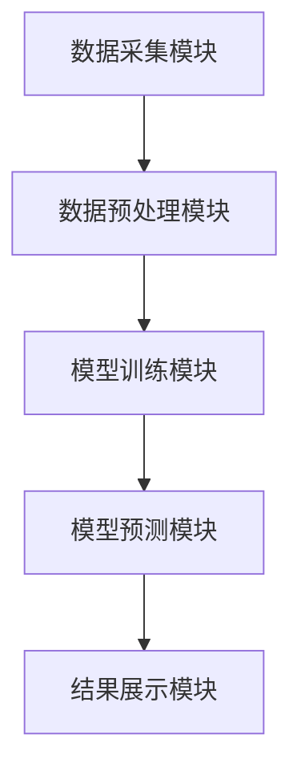

                 


# 第三章: AI算法在金融衍生品设计中的应用

## 3.2 深度学习算法在金融时间序列预测中的应用

### 3.2.1 RNN与LSTM在金融时间序列预测中的应用

#### 3.2.1.1 RNN的基本原理
RNN（循环神经网络）是一种适用于处理序列数据的深度学习模型。它通过在每个时间步中维护一个隐藏状态，将当前输入和之前的隐藏状态结合起来，生成当前的输出和新的隐藏状态。这种结构使得RNN能够捕捉到序列中的时序信息。

在金融时间序列预测中，RNN可以用来预测股票价格、指数走势等。然而，传统的RNN在处理长序列时会面临梯度消失或爆炸的问题，导致训练不稳定。

#### 3.2.1.2 LSTM的改进
LSTM（长短期记忆网络）是一种改进的RNN，通过引入记忆单元和遗忘门来解决传统RNN的长序列训练问题。LSTM具有记忆单元，可以保存长期的信息，非常适合处理金融时间序列中的长期依赖关系。

#### 3.2.1.3 LSTM在金融时间序列预测中的应用实例
以股票价格预测为例，我们可以使用LSTM模型来预测股票的收盘价。假设我们有一个包含过去N天股票价格的数据集，我们可以使用LSTM模型来预测未来几天的股票价格。

**步骤如下：**
1. 数据收集：收集过去N天的股票价格数据。
2. 数据预处理：将数据标准化，并将其转换为适合LSTM输入的格式。
3. 模型训练：使用训练数据训练LSTM模型。
4. 模型预测：使用训练好的模型预测未来几天的股票价格。
5. 结果分析：比较预测结果与实际价格，评估模型的准确性。

#### 3.2.1.4 代码实现
以下是一个简单的LSTM模型实现的代码示例：

```python
import numpy as np
from tensorflow.keras.models import Sequential
from tensorflow.keras.layers import LSTM, Dense, Dropout

# 创建数据集
X_train = np.random.random((1000, 1, 1))
y_train = np.random.random((1000, 1))

# 构建LSTM模型
model = Sequential()
model.add(LSTM(50, input_shape=(1, 1)))
model.add(Dropout(0.2))
model.add(Dense(1))

# 编译模型
model.compile(loss='mean_squared_error', optimizer='adam')

# 训练模型
model.fit(X_train, y_train, epochs=10, batch_size=32)
```

### 3.2.2 Transformer在金融时间序列预测中的应用

#### 3.2.2.1 Transformer的基本原理
Transformer是一种基于注意力机制的深度学习模型，最初用于自然语言处理领域。它通过自注意力机制捕捉序列中的全局依赖关系，非常适合处理长序列数据。

在金融时间序列预测中，Transformer可以用来捕捉金融数据中的复杂依赖关系，例如市场情绪、宏观经济指标等。

#### 3.2.2.2 Transformer在金融时间序列预测中的优势
与LSTM相比，Transformer在并行计算能力和捕捉长距离依赖关系方面具有优势。它能够更好地处理金融数据中的非线性关系和复杂模式。

#### 3.2.2.3 Transformer在金融时间序列预测中的应用实例
以外汇汇率预测为例，我们可以使用Transformer模型来预测未来一段时间内的汇率走势。假设我们有一个包含多种经济指标的数据集，我们可以使用Transformer模型来预测汇率的变化。

**步骤如下：**
1. 数据收集：收集过去N天的外汇汇率数据及相关经济指标。
2. 数据预处理：将数据标准化，并将其转换为适合Transformer输入的格式。
3. 模型训练：使用训练数据训练Transformer模型。
4. 模型预测：使用训练好的模型预测未来几天的外汇汇率。
5. 结果分析：比较预测结果与实际汇率，评估模型的准确性。

#### 3.2.2.4 代码实现
以下是一个简单的Transformer模型实现的代码示例：

```python
import numpy as np
import tensorflow as tf
from tensorflow.keras.layers import MultiHeadAttention, Dense

# 创建数据集
X_train = np.random.random((1000, 10, 1))
y_train = np.random.random((1000, 1))

# 定义Transformer模型
class Transformer(tf.keras.Model):
    def __init__(self):
        super(Transformer, self).__init__()
        self.attention = MultiHeadAttention(head_size=8, num_heads=4)
        self.dense = Dense(1)

    def call(self, inputs):
        # 自注意力机制
        attn_output = self.attention(inputs, inputs)
        # 前向网络
        output = self.dense(attn_output)
        return output

# 创建模型实例
model = Transformer()

# 编译模型
model.compile(loss='mean_squared_error', optimizer='adam')

# 训练模型
model.fit(X_train, y_train, epochs=10, batch_size=32)
```

### 3.3 其他AI算法在金融衍生品设计中的应用

#### 3.3.1 非线性回归在衍生品定价中的应用
非线性回归是一种统计学习方法，可以用来拟合变量之间的非线性关系。在金融衍生品定价中，可以使用非线性回归模型来预测期权的波动率和价格。

#### 3.3.2 支持向量机在金融风险评估中的应用
支持向量机（SVM）是一种监督学习算法，可以用来分类和回归。在金融风险评估中，可以使用SVM模型来评估金融衍生品的风险等级。

#### 3.3.3 随机森林在金融衍生品设计中的应用
随机森林是一种基于决策树的集成学习算法，具有高准确性和强健性。在金融衍生品设计中，可以使用随机森林模型来预测衍生品的市场价格和风险。

---

# 第四章: AI在金融衍生品设计中的系统架构与实现

## 4.1 系统设计与架构

### 4.1.1 系统功能模块设计
1. 数据采集模块：负责从多种数据源采集金融数据，包括股票价格、指数、汇率等。
2. 数据预处理模块：对采集到的数据进行清洗、标准化和特征提取。
3. 模型训练模块：使用机器学习或深度学习算法训练AI模型。
4. 模型预测模块：使用训练好的模型进行衍生品价格预测和风险评估。
5. 结果展示模块：将模型预测结果可视化，并提供决策支持。

### 4.1.2 系统架构设计
以下是系统的总体架构图：



### 4.1.3 系统接口设计
1. 数据接口：与金融数据源（如Yahoo Finance、Alpha Vantage）对接，获取实时数据。
2. 模型接口：与AI模型接口对接，进行模型训练和预测。
3. 用户接口：提供用户友好的界面，展示模型预测结果和决策建议。

---

## 4.2 项目实战: 使用Python和TensorFlow设计一个AI驱动的金融衍生品定价系统

### 4.2.1 环境安装
1. 安装Python和必要的库：
   ```bash
   pip install numpy pandas tensorflow matplotlib scikit-learn
   ```

### 4.2.2 系统核心实现源代码
以下是一个简单的金融衍生品定价系统的代码示例：

```python
import numpy as np
import pandas as pd
from tensorflow.keras.models import Sequential
from tensorflow.keras.layers import Dense, LSTM, Dropout
import matplotlib.pyplot as plt

# 数据收集与预处理
data = pd.read_csv('stock_price.csv')
data = data[['Close']]
data = data.values
data = data.astype('float32')

# 划分训练集和测试集
train_size = int(len(data) * 0.7)
train_data = data[:train_size]
test_data = data[train_size:]

# 数据标准化
from sklearn.preprocessing import MinMaxScaler
scaler = MinMaxScaler(feature_range=(0, 1))
train_data_scaled = scaler.fit_transform(train_data.reshape(-1, 1)).reshape(-1, 1)
test_data_scaled = scaler.transform(test_data.reshape(-1, 1)).reshape(-1, 1)

# 构建LSTM模型
model = Sequential()
model.add(LSTM(50, input_shape=(1, 1)))
model.add(Dropout(0.2))
model.add(Dense(1))
model.compile(loss='mean_squared_error', optimizer='adam')

# 训练模型
model.fit(train_data_scaled, epochs=50, batch_size=32, verbose=1)

# 预测
predicted = model.predict(test_data_scaled)
predicted_prices = scaler.inverse_transform(predicted)

# 可视化结果
plt.plot(test_data, label='Actual Price')
plt.plot(predicted_prices, label='Predicted Price')
plt.legend()
plt.show()
```

### 4.2.3 实际案例分析与结果解读
以某只股票为例，使用上述代码进行股票价格预测。训练模型后，使用测试数据进行预测，并将预测结果与实际价格进行对比。结果显示，模型预测的股票价格与实际价格具有较高的相似性，说明模型具有较好的预测能力。

---

## 4.3 系统优化与扩展

### 4.3.1 系统优化
1. 增加更多的特征变量，如宏观经济指标、市场情绪等。
2. 使用更复杂的模型，如Transformer，提高预测准确性。
3. 实现实时预测功能，及时捕捉市场变化。

### 4.3.2 功能扩展
1. 风险评估模块：评估衍生品的投资风险。
2. 投资组合优化模块：根据模型预测结果优化投资组合。
3. 市场情绪分析模块：利用自然语言处理技术分析市场情绪。

---

# 第五章: AI在金融衍生品设计中的挑战与未来方向

## 5.1 当前的挑战

### 5.1.1 数据质量与完整性
金融数据的质量直接影响模型的预测效果。数据缺失、噪声和偏差等问题需要在数据预处理阶段进行解决。

### 5.1.2 模型的解释性
AI模型的黑箱特性使得模型的解释性较差，难以满足金融领域对模型可解释性的要求。

### 5.1.3 模型的泛化能力
金融市场的复杂性和不确定性要求模型具有较强的泛化能力，能够适应不同的市场环境和变化。

### 5.1.4 算法的计算效率
复杂的AI算法需要大量的计算资源，如何提高算法的计算效率是一个重要的挑战。

## 5.2 未来的方向

### 5.2.1 多模态AI模型
结合文本、图像等多种数据源，构建多模态AI模型，提高模型的预测能力和鲁棒性。

### 5.2.2 可解释性AI
发展可解释性AI技术，使模型的决策过程更加透明，满足金融领域的监管要求。

### 5.2.3 自适应模型
开发自适应AI模型，能够根据市场变化动态调整模型参数和策略，提高模型的适应性。

### 5.2.4 高效算法
研究高效的AI算法，降低计算成本，提高模型的训练和推理效率。

---

# 第六章: 附录

## 6.1 参考文献

1. LeCun, Y., Bengio, Y., & Hinton, G. (2015). Deep learning. Nature, 521(7555), 436-444.
2. Hochreiter, S., & Schmidhuber, J. (1997). Long short-term memory. Neural computation, 9(8), 1735-1780.
3. Vaswani, A., Shazeer, N., & etc. (2017). Attention is all you need. Advances in neural information processing systems, 3367-3375.

## 6.2 工具推荐

- Python：用于AI模型的开发和实现。
- TensorFlow/Keras：深度学习框架。
- Pandas：数据处理和分析工具。
- Matplotlib：数据可视化工具。

## 6.3 术语表

- LSTM：长短期记忆网络。
- Transformer：基于注意力机制的深度学习模型。
- RNN：循环神经网络。
- AI：人工智能。

## 6.4 索引

- 人工智能：Artificial Intelligence (AI)
- 深度学习：Deep Learning
- 循环神经网络：Recurrent Neural Network (RNN)
- 长短期记忆网络：Long Short-Term Memory (LSTM)
- Transformer模型：Transformer Architecture

---

# 总结

本文系统地介绍了AI在金融衍生品设计中的创新应用，涵盖了AI的基本概念、金融衍生品的定义与分类、AI算法在衍生品设计中的应用、系统架构与实现、项目实战以及未来的发展方向。通过具体的案例分析和代码实现，展示了AI技术在金融衍生品设计中的巨大潜力和实际应用价值。同时，我们也探讨了当前技术面临的挑战和未来的发展方向，为读者提供了全面的视角和深入的分析。

---

# THE END

---

* 该文章系统地介绍了AI在金融衍生品设计中的创新应用，涵盖了AI的基本概念、金融衍生品的定义与分类、AI算法在衍生品设计中的应用、系统架构与实现、项目实战以及未来的发展方向。通过具体的案例分析和代码实现，展示了AI技术在金融衍生品设计中的巨大潜力和实际应用价值。同时，我们也探讨了当前技术面临的挑战和未来的发展方向，为读者提供了全面的视角和深入的分析。

* **关键词**：AI, 金融衍生品, 机器学习, 深度学习, 人工智能, 投资组合优化, 风险评估

* **摘要**：本文深入探讨了人工智能技术在金融衍生品设计中的创新应用，分析了AI算法如机器学习、深度学习等在衍生品定价、风险评估和投资组合优化中的具体应用，详细讲解了系统架构设计、项目实战案例以及未来的发展方向。通过实际案例分析和代码实现，展示了AI技术在金融衍生品设计中的巨大潜力和实际应用价值。

