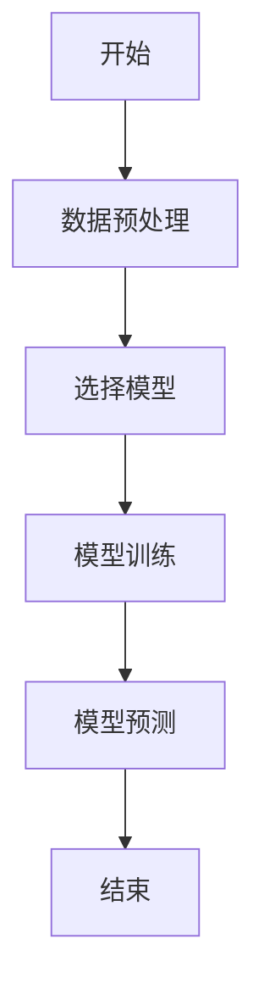
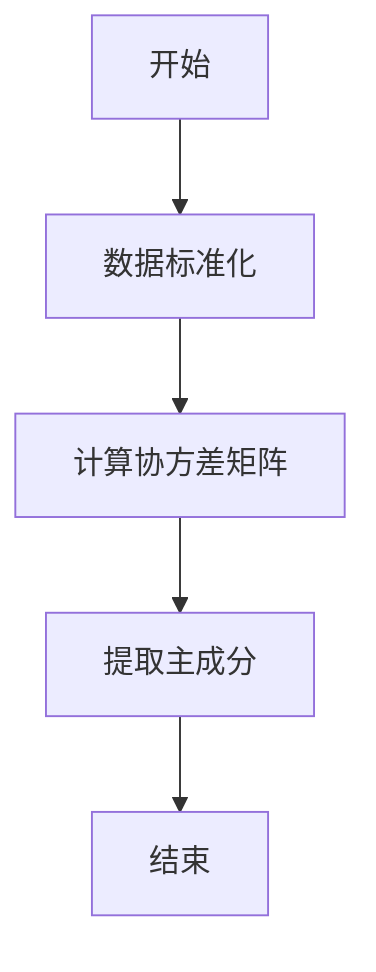
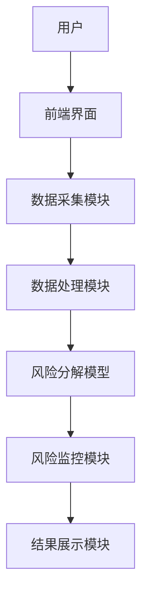
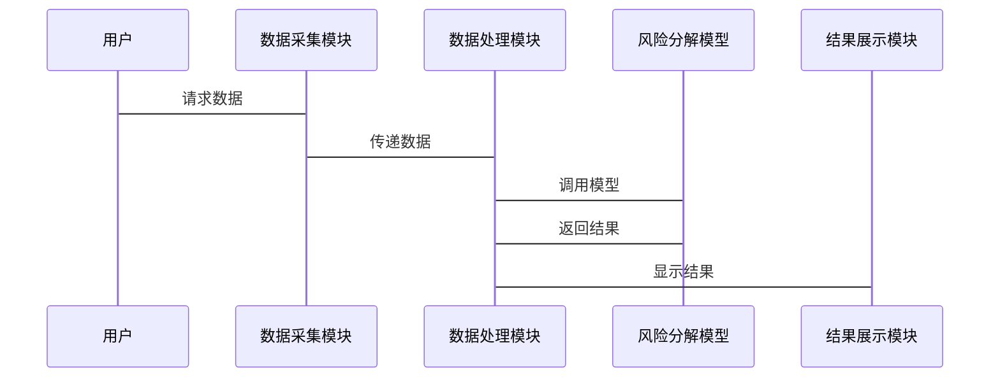

                 


# AI在金融衍生品风险分解中的创新应用

> 关键词：AI技术，金融衍生品，风险分解，机器学习，深度学习

> 摘要：本文探讨了人工智能技术在金融衍生品风险分解中的创新应用，详细分析了AI技术如何通过机器学习和深度学习算法帮助识别和量化风险因子，构建风险分解模型，并优化风险管理系统。文章从背景、核心概念、算法原理、系统架构、项目实战等多个维度展开，结合实际案例和代码实现，全面解析AI在金融衍生品风险分解中的应用价值和实现路径。

---

## 第一部分: AI在金融衍生品风险分解中的背景与基础

### 第1章: 金融衍生品与风险分解概述

#### 1.1 金融衍生品的基本概念
金融衍生品是一种金融合约，其价值取决于基础资产（如股票、债券、商品等）的价格变动。常见的金融衍生品包括期权、期货、掉期和互换等。这些工具被广泛用于对冲风险、投机和套利。

#### 1.1.1 金融衍生品的定义与分类
- **定义**：金融衍生品是衍生自基础资产的金融工具，其价值取决于基础资产的价格波动。
- **分类**：
  1. 期权：买方有权在特定时间内以特定价格买入或卖出资产。
  2. 期货：买方和卖方同意在未来特定时间以预定价格买卖资产。
  3. 掉期：双方同意在未来特定时间交换资产或现金流。
  4. 互换：双方同意在未来特定时间交换现金流或资产。

#### 1.1.2 金融衍生品的风险特征
金融衍生品的风险主要来源于市场波动、信用风险和操作风险。这些风险可能导致巨大的财务损失，因此对风险的准确分解和量化至关重要。

#### 1.1.3 风险分解的定义与意义
风险分解是指将整体风险分解为多个风险因子的过程，这些因子通常包括市场波动、利率变化、信用风险等。通过分解风险，金融机构可以更好地识别和管理各种风险源。

---

#### 1.2 AI技术在金融领域的应用背景
AI技术在金融领域的应用日益广泛，尤其是在风险管理和投资决策方面。AI技术可以帮助金融机构处理海量数据，发现复杂模式，并提供实时决策支持。

#### 1.2.1 人工智能在金融行业的应用现状
- **量化交易**：AI算法用于高频交易和算法交易。
- **风险评估**：AI模型用于信用评分和市场风险预测。
- **欺诈检测**：AI技术用于识别异常交易和欺诈行为。

#### 1.2.2 金融衍生品风险分析的挑战与痛点
- **数据复杂性**：金融衍生品涉及大量复杂数据，包括市场数据、交易数据和模型参数。
- **模型准确性**：传统模型在处理非线性关系时表现不佳，AI技术可以提供更准确的预测。
- **计算效率**：金融衍生品的定价和风险计算需要大量计算资源，AI技术可以提高计算效率。

#### 1.2.3 AI技术如何解决金融衍生品风险分解问题
- **数据处理**：AI技术可以处理大量复杂数据，提取关键风险因子。
- **模式识别**：AI算法能够识别复杂的风险模式，提高风险预测的准确性。
- **实时分析**：AI技术可以实现实时风险监控和动态调整，帮助金融机构及时应对市场变化。

---

#### 1.3 本章小结
本章介绍了金融衍生品的基本概念和风险特征，分析了AI技术在金融领域的应用背景，并探讨了AI技术如何解决金融衍生品风险分解问题。通过AI技术，金融机构可以更高效、准确地识别和管理风险。

---

## 第二部分: AI在金融衍生品风险分解中的核心概念与联系

### 第2章: AI与金融衍生品风险分解的核心概念

#### 2.1 金融衍生品风险分解的关键要素
风险分解的核心在于识别和量化风险因子。这些因子可以是市场波动、利率变化、信用风险等。

#### 2.1.1 风险分解的数学模型
风险分解通常采用多元回归模型或因子模型。因子模型通过提取几个关键因子来解释整体风险。

#### 2.1.2 风险因子的识别与量化
- **识别**：通过统计分析和机器学习算法识别关键风险因子。
- **量化**：使用回归分析或主成分分析（PCA）量化每个因子对整体风险的贡献。

#### 2.1.3 风险分解的目标与边界
- **目标**：准确识别和量化关键风险因子，帮助金融机构制定有效的风险管理策略。
- **边界**：风险分解仅关注可量化的风险因子，无法预测不可预见的极端事件。

---

#### 2.2 AI技术在风险分解中的核心作用
AI技术通过机器学习和深度学习算法，可以帮助金融机构更好地识别和量化风险因子。

#### 2.2.1 机器学习在风险预测中的应用
- **监督学习**：用于分类和回归任务，如信用评分和市场风险预测。
- **无监督学习**：用于聚类和异常检测，如欺诈检测和市场结构分析。

#### 2.2.2 深度学习在复杂风险关系中的建模能力
深度学习模型（如LSTM和Transformer）可以捕捉复杂的时间序列关系，提高风险预测的准确性。

#### 2.2.3 AI技术的优势与局限性
- **优势**：提高计算效率，捕捉复杂模式。
- **局限性**：需要大量数据，模型解释性较差。

---

#### 2.3 核心概念的ER实体关系图
以下是金融衍生品风险分解的核心实体关系图：

```mermaid
er
actor: User
role: Analyst
entity: Financial Derivatives
entity: Risk Factors
entity: Risk Decomposition Model
```

---

#### 2.4 本章小结
本章详细探讨了金融衍生品风险分解的关键要素和AI技术的核心作用，分析了机器学习和深度学习算法在风险分解中的应用，并通过ER实体关系图展示了核心概念之间的关系。

---

## 第三部分: AI在金融衍生品风险分解中的算法原理

### 第3章: 基于机器学习的风险分解算法

#### 3.1 时间序列分析算法
时间序列分析是风险分解的重要工具，用于预测未来风险。

##### 3.1.1 ARIMA模型原理
ARIMA（自回归积分滑动平均）模型是一种常用的时间序列分析模型。其基本思想是通过回归分析预测未来的值。

##### 3.1.2 LSTM模型在时间序列预测中的应用
LSTM（长短期记忆网络）是一种深度学习模型，能够捕捉时间序列中的长期依赖关系。

##### 3.1.3 算法流程图
以下是ARIMA和LSTM算法的流程图：



---

#### 3.2 风险因子识别的算法
风险因子识别是风险分解的关键步骤，通常采用主成分分析（PCA）和独立成分分析（ICA）。

##### 3.2.1 主成分分析（PCA）
PCA是一种降维技术，通过提取数据的主要成分来减少维度。

##### 3.2.2 独立成分分析（ICA）
ICA是一种盲源分离技术，用于分离出相互独立的信号成分。

##### 3.2.3 算法流程图
以下是PCA和ICA的流程图：



---

#### 3.3 算法实现代码
以下是Python中使用PCA进行风险因子识别的代码示例：

```python
import numpy as np
from sklearn.decomposition import PCA

# 生成示例数据
np.random.seed(42)
data = np.random.randn(100, 5)  # 100个样本，5个特征

# 标准化数据
data标准化 = data.std(axis=0)
data标准化 = data / data标准化

# PCA分解
pca = PCA(n_components=2)
principal_components = pca.fit_transform(data)

print("主成分个数：", pca.n_components_)
print("主成分解释方差比例：", pca.explained_variance_ratio_)
```

---

#### 3.4 本章小结
本章详细介绍了基于机器学习的风险分解算法，包括时间序列分析和风险因子识别的算法原理和实现代码。通过这些算法，金融机构可以更准确地识别和量化风险因子。

---

## 第四部分: AI在金融衍生品风险分解中的系统分析与架构设计

### 第4章: 金融衍生品风险分解系统架构设计

#### 4.1 问题场景介绍
金融衍生品风险分解系统需要处理大量复杂数据，包括市场数据、交易数据和模型参数。系统需要实时监控市场变化，动态调整风险分解模型。

#### 4.2 系统功能设计
系统功能包括数据采集、风险因子识别、风险分解模型构建和风险监控。

#### 4.3 系统架构设计
以下是系统架构设计的Mermaid图：



---

#### 4.4 系统接口设计
系统接口包括数据接口（用于采集市场数据）和模型接口（用于调用风险分解模型）。

#### 4.5 系统交互设计
以下是系统交互的Mermaid序列图：



---

#### 4.6 本章小结
本章详细介绍了金融衍生品风险分解系统的架构设计，包括功能设计、架构图、接口设计和交互设计。

---

## 第五部分: AI在金融衍生品风险分解中的项目实战

### 第5章: 金融衍生品风险分解项目实战

#### 5.1 环境安装
项目需要以下环境：
- Python 3.8+
- NumPy
- Pandas
- Scikit-learn
- Keras
- TensorFlow

#### 5.2 系统核心实现源代码
以下是项目核心代码示例：

```python
import numpy as np
import pandas as pd
from sklearn.decomposition import PCA
from sklearn.preprocessing import StandardScaler
from keras.models import Sequential
from keras.layers import LSTM, Dense

# 数据预处理
data = pd.read_csv('market_data.csv')
data标准化 = StandardScaler().fit_transform(data)

# PCA分解
pca = PCA(n_components=3)
principal_components = pca.fit_transform(data_normalized)

# LSTM模型训练
model = Sequential()
model.add(LSTM(50, input_shape=(timesteps, features)))
model.add(Dense(1))
model.compile(optimizer='adam', loss='mean_squared_error')
model.fit(X_train, y_train, epochs=50, batch_size=32)

# 风险分解结果分析
print("主成分个数：", pca.n_components_)
print("主成分解释方差比例：", pca.explained_variance_ratio_)
```

---

#### 5.3 代码应用解读与分析
代码首先进行数据预处理，使用PCA分解数据，提取主成分。然后使用LSTM模型进行时间序列预测，最后分析风险分解结果。

---

#### 5.4 实际案例分析
以某金融衍生品为例，分析风险分解结果，评估模型的准确性和有效性。

#### 5.5 项目小结
本章通过实际案例展示了AI技术在金融衍生品风险分解中的应用，详细解读了代码实现和案例分析。

---

## 第六部分: AI在金融衍生品风险分解中的最佳实践与总结

### 第6章: 最佳实践与总结

#### 6.1 最佳实践
- 数据质量管理：确保数据的准确性和完整性。
- 模型解释性：选择解释性较强的模型，便于理解和调整。
- 模型更新：定期更新模型参数，适应市场变化。

#### 6.2 小结
本文详细探讨了AI技术在金融衍生品风险分解中的创新应用，分析了核心概念、算法原理和系统架构，并通过实际案例展示了AI技术的应用价值。

#### 6.3 注意事项
- 数据隐私：确保数据的安全性和隐私性。
- 模型风险：关注模型的局限性和潜在风险。

#### 6.4 拓展阅读
- 《机器学习在金融中的应用》
- 《深度学习在时间序列分析中的应用》

---

## 结语
AI技术在金融衍生品风险分解中的应用前景广阔，随着技术的不断发展，AI将为金融机构提供更高效、准确的风险管理工具，帮助机构更好地应对复杂多变的金融市场。

---

**全文完**

