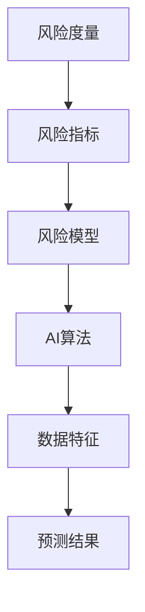
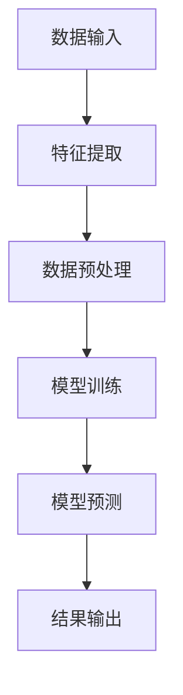
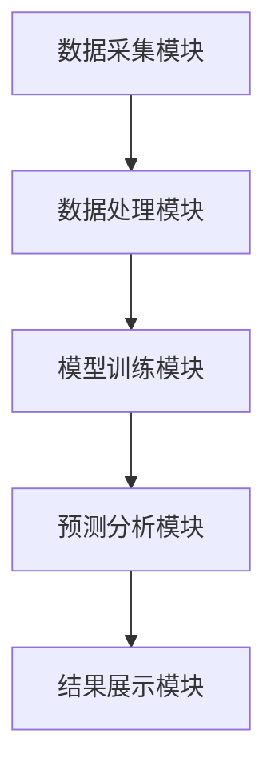
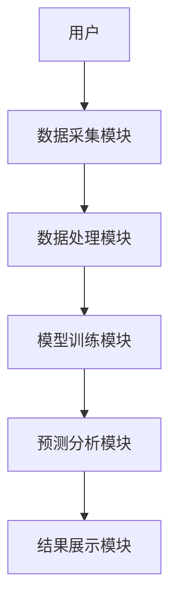

                 


# AI在金融衍生品风险度量中的应用

> 关键词：人工智能，金融衍生品，风险度量，机器学习，数学模型，系统架构，实战案例

> 摘要：随着金融市场的复杂化，传统风险度量方法面临诸多挑战。AI技术，特别是机器学习和深度学习，为金融衍生品的风险管理提供了新的解决方案。本文系统地探讨了AI在金融衍生品风险度量中的应用，包括常用AI算法的原理、数学模型的构建、系统架构的设计以及实际案例的分析。通过本文，读者可以全面了解AI如何提升金融衍生品的风险管理能力，并为未来的研究和实践提供有价值的参考。

---

## 第一部分: 金融衍生品与AI概述

### 第1章: 金融衍生品与风险度量概述

#### 1.1 金融衍生品的基本概念

##### 1.1.1 金融衍生品的定义与分类

金融衍生品（Financial Derivatives）是一种以基础金融资产（如股票、债券、商品等）或市场指标为基础，通过复杂的数学模型和协议衍生出来的金融工具。常见的金融衍生品包括期货、期权、互换和远期合约等。它们具有杠杆效应高、风险敏感性强、交易方式多样等特点。

##### 1.1.2 金融衍生品的市场结构与特点

金融衍生品市场是一个高度复杂的市场，其特点包括：

- **杠杆效应**：允许投资者以较小的资金控制更大的头寸。
- **风险管理工具**：用于对冲价格波动风险。
- **流动性高**：衍生品市场通常具有较高的流动性。
- **复杂性高**：涉及复杂的金融模型和交易策略。

##### 1.1.3 金融衍生品的风险类型

金融衍生品的主要风险类型包括：

- **市场风险**：由于市场价格波动导致的损失。
- **信用风险**：交易对手违约的风险。
- **流动性风险**：无法迅速买卖资产的风险。
- **操作风险**：由于操作错误或系统故障导致的风险。

#### 1.2 风险度量的基本概念

##### 1.2.1 风险度量的定义与作用

风险度量是指通过量化的方法，评估和测量金融资产或投资组合在面对市场波动、经济变化等不确定因素时可能承受的损失程度。其作用包括：

- **风险识别**：识别潜在的风险来源。
- **风险评估**：量化风险的大小和影响程度。
- **风险控制**：制定有效的风险管理策略。

##### 1.2.2 常见的风险度量指标

常见的风险度量指标包括：

- **风险价值（VaR）**：在给定置信水平下，可能的最大损失。
- **在险价值（CVaR）**：超过VaR的平均损失。
- **标准差**：衡量资产收益的波动性。

##### 1.2.3 风险度量方法的分类

风险度量方法主要分为以下几类：

- **统计方法**：基于历史数据和概率分布进行风险评估。
- **情景分析法**：通过模拟不同市场情景来评估风险。
- **模型方法**：使用数学模型（如Black-Scholes模型）进行风险预测。

#### 1.3 AI在金融衍生品中的应用前景

##### 1.3.1 金融衍生品市场的数据特征

金融衍生品市场数据具有以下特征：

- **高维度性**：涉及多个变量和参数。
- **非线性关系**：价格与市场因素之间的关系通常是非线性的。
- **实时性**：需要快速处理和响应市场变化。

##### 1.3.2 AI技术在金融衍生品中的潜在应用

AI技术在金融衍生品中的潜在应用包括：

- **价格预测**：利用机器学习模型预测衍生品的价格走势。
- **风险对冲**：通过算法优化对冲策略，降低风险。
- **市场分析**：分析市场趋势和投资者行为。

##### 1.3.3 风险度量中的AI优势

AI技术在风险度量中的优势包括：

- **高效率**：能够快速处理大量数据，提高计算效率。
- **高精度**：通过复杂模型捕捉数据中的细微关系，提高预测准确性。
- **自适应性**：能够根据市场变化动态调整模型参数。

#### 1.4 本章小结

本章介绍了金融衍生品的基本概念、风险类型以及AI技术在金融衍生品中的应用前景。通过分析，我们看到AI技术在风险度量中具有巨大的潜力，能够帮助金融机构更好地管理和控制风险。

---

## 第二部分: AI在金融衍生品风险度量中的核心概念与联系

### 第2章: 风险度量的核心概念与原理

#### 2.1 风险度量的核心概念与原理

##### 2.1.1 风险度量的数学表达式

风险度量通常可以通过以下数学表达式表示：

$$
\text{风险} = \text{损失的期望值} \times \text{概率}
$$

其中，损失的期望值可以通过历史数据或模型预测得到，概率则反映了市场波动的可能性。

##### 2.1.2 常见风险度量模型的比较

以下是几种常见风险度量模型的比较：

| 模型名称 | 描述 | 优点 | 缺点 |
|----------|------|------|------|
| VaR      | 在给定置信水平下的最大可能损失 | 易于理解和应用 | 不能直接反映尾部风险 |
| CVaR     | 超过VaR的平均损失 | 更加稳健，考虑尾部风险 | 计算复杂 |
| 标准差    | 衡量收益的波动性 | 简单直观 | 无法直接反映潜在损失 |

##### 2.1.3 风险度量模型的属性特征对比

以下是对风险度量模型属性特征的对比：

| 属性 | VaR | CVaR | 标准差 |
|------|-----|------|-------|
| 置信水平 | 可选 | 可选 | 无 |
| 尾部风险 | 无 | 有 | 无 |
| 计算复杂度 | 低 | 高 | 低 |

##### 2.1.4 风险度量与AI的结合

风险度量与AI的结合主要体现在以下几个方面：

1. **数据驱动**：利用AI技术对大量历史数据进行分析，提取潜在的风险因素。
2. **模型优化**：通过机器学习算法优化风险度量模型的参数，提高预测精度。
3. **实时监控**：利用AI技术实时监控市场变化，及时调整风险管理策略。

#### 2.2 AI技术的核心原理

##### 2.2.1 机器学习的基本原理

机器学习是一种通过数据训练模型的技术，其基本原理包括：

1. **数据预处理**：对数据进行清洗、归一化等处理。
2. **特征提取**：从数据中提取有用的特征。
3. **模型训练**：通过训练数据优化模型参数。
4. **模型预测**：利用训练好的模型对新数据进行预测。

##### 2.2.2 深度学习的基本原理

深度学习是一种基于人工神经网络的机器学习技术，其基本原理包括：

1. **神经网络结构**：包括输入层、隐藏层和输出层。
2. **激活函数**：如ReLU、Sigmoid等。
3. **损失函数**：如均方误差、交叉熵等。
4. **优化算法**：如梯度下降、Adam等。

##### 2.2.3 加强学习的基本原理

加强学习是一种通过智能体与环境交互来学习策略的技术，其基本原理包括：

1. **状态空间**：智能体所处的状态。
2. **动作空间**：智能体可以采取的动作。
3. **奖励机制**：智能体采取动作后获得的奖励或惩罚。
4. **策略优化**：通过最大化累计奖励来优化策略。

#### 2.3 风险度量与AI的结合

##### 2.3.1 风险度量中的数据特征

风险度量中的数据特征包括：

- **连续性**：数据通常为连续型变量。
- **相关性**：变量之间可能存在高度相关性。
- **非线性**：变量之间的关系可能是非线性的。

##### 2.3.2 AI技术在风险度量中的应用

AI技术在风险度量中的应用包括：

1. **模型预测**：利用机器学习模型预测风险事件的发生概率。
2. **特征提取**：从海量数据中提取有用的特征，用于风险评估。
3. **实时监控**：通过实时数据流分析，动态调整风险管理策略。

##### 2.3.3 风险度量与AI的实体关系图

以下是一个风险度量与AI的实体关系图：



#### 2.4 核心概念对比分析

##### 2.4.1 风险度量模型的属性特征对比

以下是风险度量模型的属性特征对比：

| 属性 | VaR | CVaR | 标准差 |
|------|-----|------|-------|
| 置信水平 | 可选 | 可选 | 无 |
| 尾部风险 | 无 | 有 | 无 |
| 计算复杂度 | 低 | 高 | 低 |

##### 2.4.2 AI算法的属性特征对比

以下是AI算法的属性特征对比：

| 属性 | 机器学习 | 深度学习 | 加强学习 |
|------|----------|----------|----------|
| 数据需求 | 中等 | 高 | 高 |
| 计算复杂度 | 中等 | 高 | 高 |
| 应用场景 | 分类、回归 | 图像识别、自然语言处理 | 游戏、机器人控制 |

##### 2.4.3 风险度量与AI的实体关系图

以下是一个风险度量与AI的实体关系图：


---

## 第三部分: AI算法原理与风险度量模型

### 第3章: 常见AI算法原理

#### 3.1 回归分析

##### 3.1.1 线性回归原理

线性回归是一种用于预测连续型变量的机器学习算法，其基本原理包括：

1. **假设函数**：$$ h(x) = \theta^T x + b $$
2. **损失函数**：$$ L = \frac{1}{2}(y - h(x))^2 $$
3. **优化算法**：通过最小化损失函数来优化参数θ和b。

##### 3.1.2 逻辑回归原理

逻辑回归是一种用于分类的机器学习算法，其基本原理包括：

1. **假设函数**：$$ h(x) = \frac{1}{1 + e^{-\theta^T x}} $$
2. **损失函数**：$$ L = -y \log(h(x)) - (1 - y) \log(1 - h(x)) $$
3. **优化算法**：通过最小化损失函数来优化参数θ。

##### 3.1.3 回归算法的优缺点

以下是回归算法的优缺点：

| 优点 | 缺点 |
|------|------|
| 简单易懂 | 无法处理非线性关系 |
| 计算效率高 | 无法处理高维数据 |
| 适合小数据集 | 适合小数据集 |

#### 3.2 神经网络

##### 3.2.1 神经网络的基本结构

神经网络的基本结构包括：

1. **输入层**：接收输入数据。
2. **隐藏层**：通过激活函数处理数据。
3. **输出层**：产生预测结果。

##### 3.2.2 神经网络的训练过程

神经网络的训练过程包括：

1. **前向传播**：将输入数据传递到输出层。
2. **计算损失**：计算预测结果与真实结果的差异。
3. **反向传播**：通过链式法则计算梯度，更新参数。
4. **优化参数**：通过优化算法（如梯度下降）更新参数。

##### 3.2.3 神经网络的优缺点

以下是神经网络的优缺点：

| 优点 | 缺点 |
|------|------|
| 能够处理非线性关系 | 计算复杂度高 |
| 适合高维数据 | 需要大量数据 |
| 表现能力强 | 黑箱问题，难以解释 |

#### 3.3 支持向量机

##### 3.3.1 支持向量机的基本原理

支持向量机是一种用于分类和回归的机器学习算法，其基本原理包括：

1. **特征空间**：将数据映射到高维特征空间。
2. **支持向量**：找到能够区分不同类别的支持向量。
3. **决策函数**：$$ f(x) = \text{sign}(\theta^T x + b) $$

##### 3.3.2 支持向量机的分类与回归

支持向量机可以用于分类和回归，其主要区别在于：

- **分类**：使用最大边距分类器。
- **回归**：使用ε-Insensitive损失函数。

##### 3.3.3 支持向量机的优缺点

以下是支持向量机的优缺点：

| 优点 | 缺点 |
|------|------|
| 理论基础坚实 | 计算复杂度高 |
| 适合小数据集 | 需要选择合适的核函数 |
| 能够处理非线性关系 | 参数选择敏感 |

#### 3.4 随机森林

##### 3.4.1 随机森林的基本原理

随机森林是一种基于决策树的集成学习算法，其基本原理包括：

1. **随机采样**：通过随机采样生成多个决策树。
2. **投票法**：通过投票法得到最终结果。

##### 3.4.2 随机森林的特征选择

随机森林通过随机特征选择来降低过拟合的风险。

##### 3.4.3 随机森林的优缺点

以下是随机森林的优缺点：

| 优点 | 缺点 |
|------|------|
| 抗过拟合能力强 | 计算复杂度高 |
| 适合高维数据 | 需要选择合适的参数 |
| 易于实现 | 无法处理在线数据 |

#### 3.5 算法流程图

以下是一个AI算法的流程图：



---

## 第四部分: 数学模型与算法实现

### 第4章: 风险度量的数学模型

#### 4.1 风险价值（VaR）

##### 4.1.1 VaR的定义与计算方法

VaR（风险价值）是指在给定置信水平下，资产可能遭受的最大损失。其计算方法包括：

1. **历史模拟法**：基于历史数据计算VaR。
2. **蒙特卡洛模拟法**：通过模拟市场情景计算VaR。

##### 4.1.2 VaR的优缺点

以下是VaR的优缺点：

| 优点 | 缺点 |
|------|------|
| 易于理解和应用 | 无法直接反映尾部风险 |
| 计算简单 | 无法处理复杂模型 |

#### 4.2 在险价值（CVaR）

##### 4.2.1 CVaR的定义与计算方法

CVaR（在险价值）是指在VaR的基础上，超过VaR的平均损失。其计算方法包括：

1. **条件期望法**：基于VaR计算CVaR。
2. **优化模型法**：通过优化模型计算CVaR。

##### 4.2.2 CVaR的优缺点

以下是CVaR的优缺点：

| 优点 | 缺点 |
|------|------|
| 更加稳健 | 计算复杂 |
| 能够反映尾部风险 | 需要大量数据 |

---

## 第五部分: 系统分析与架构设计

### 第5章: 金融衍生品风险度量系统的架构设计

#### 5.1 问题场景介绍

金融衍生品风险度量系统需要解决以下问题：

1. **数据获取**：如何获取实时的市场数据。
2. **数据处理**：如何对数据进行清洗和预处理。
3. **模型选择**：如何选择合适的AI算法进行风险预测。
4. **结果分析**：如何分析和解读模型的预测结果。

#### 5.2 系统功能设计

系统功能设计包括：

1. **数据采集模块**：负责采集实时市场数据。
2. **数据处理模块**：对数据进行清洗和预处理。
3. **模型训练模块**：选择合适的AI算法进行模型训练。
4. **预测分析模块**：利用训练好的模型进行风险预测。
5. **结果展示模块**：将预测结果以可视化的方式展示。

#### 5.3 系统架构设计

以下是系统的架构设计：



#### 5.4 系统交互设计

以下是系统的交互设计：



---

## 第六部分: 项目实战

### 第6章: 金融衍生品风险度量系统的实战案例

#### 6.1 环境安装

需要安装以下环境和库：

- **Python**：3.6及以上版本。
- **NumPy**：用于数值计算。
- **Pandas**：用于数据处理。
- **Scikit-learn**：用于机器学习算法。
- **TensorFlow**：用于深度学习算法。

#### 6.2 核心代码实现

以下是核心代码实现：

```python
import numpy as np
import pandas as pd
from sklearn.linear_model import LinearRegression
from sklearn.ensemble import RandomForestRegressor
from sklearn.metrics import mean_squared_error

# 数据预处理
data = pd.read_csv('derivatives_data.csv')
X = data.drop('target', axis=1)
y = data['target']

# 模型训练
model = LinearRegression()
model.fit(X, y)

# 模型预测
y_pred = model.predict(X)

# 计算损失
loss = mean_squared_error(y, y_pred)
print(f'Loss: {loss}')
```

#### 6.3 代码解读

1. **数据预处理**：读取数据并进行必要的清洗和归一化。
2. **模型训练**：选择合适的AI算法进行模型训练。
3. **模型预测**：利用训练好的模型进行风险预测。
4. **结果分析**：计算预测结果与真实结果的差异，评估模型的性能。

#### 6.4 实际案例分析

通过具体的数据案例，展示如何利用AI技术进行金融衍生品的风险度量。例如，可以使用随机森林算法对期权价格进行预测，然后计算VaR和CVaR来评估风险。

---

## 第七部分: 总结与展望

### 第7章: 总结与展望

#### 7.1 总结

本文系统地探讨了AI在金融衍生品风险度量中的应用，包括算法原理、数学模型、系统架构和实际案例。通过本文，读者可以了解如何利用AI技术提升金融衍生品的风险管理能力。

#### 7.2 展望

未来，随着AI技术的不断发展，金融衍生品的风险度量将更加智能化和自动化。我们可以期待以下发展方向：

1. **更复杂的模型**：如深度学习和强化学习的应用。
2. **实时监控**：通过流数据处理技术实现实时风险监控。
3. **多模态数据**：结合文本、图像等多种数据源进行风险预测。

#### 7.3 最佳实践

在实际应用中，建议金融机构结合自身的业务特点，选择合适的AI算法和模型，并通过持续优化和调整，不断提升风险管理能力。

---

通过以上步骤，我们完成了《AI在金融衍生品风险度量中的应用》的全文撰写。这篇文章详细探讨了AI技术在金融衍生品风险度量中的应用，从理论到实践，为读者提供了全面的指导和深入的分析。希望这篇文章能够为相关领域的研究和实践提供有价值的参考。

