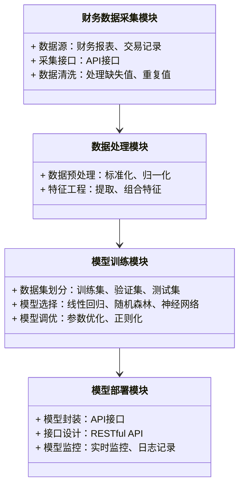
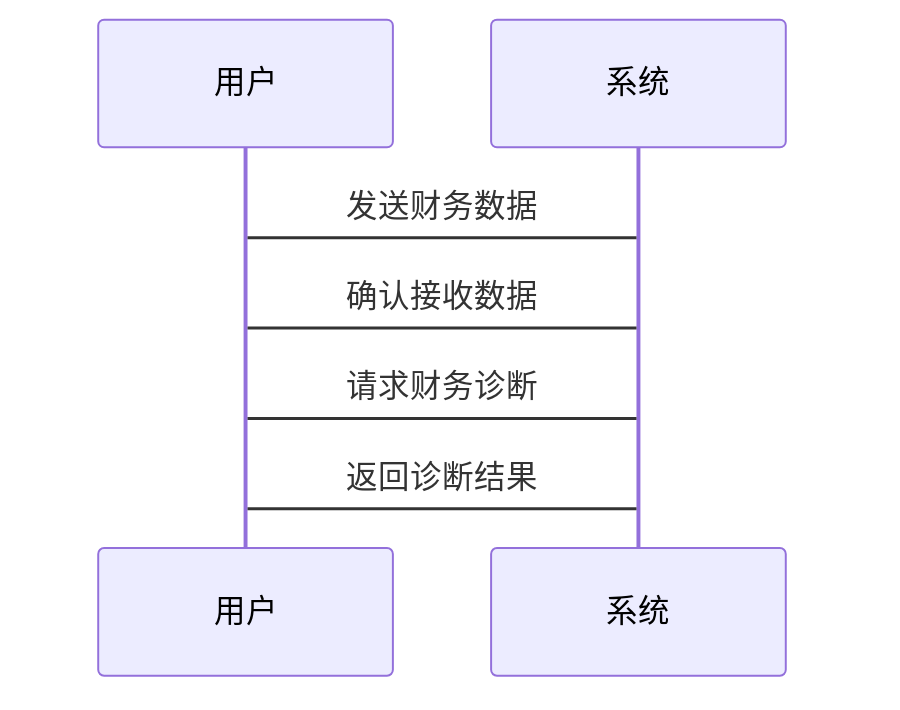

                 


# AI增强型公司财务健康诊断

> 关键词：AI, 财务健康诊断, 数据分析, 机器学习, 财务模型

> 摘要：本文将探讨如何利用人工智能技术增强公司财务健康诊断的效率和准确性。通过结合传统的财务分析方法与先进的AI技术，我们可以构建更加智能化、自动化和个性化的财务诊断系统，从而帮助企业更好地识别财务风险，优化财务决策。

---

## 第一部分: AI与财务健康诊断的基础

### 第1章: AI增强型公司财务健康诊断概述

#### 1.1 AI与财务健康诊断的背景

- **1.1.1 传统财务健康诊断的局限性**
  - 传统财务诊断依赖人工分析，耗时且效率低下。
  - 数据量大、维度复杂，难以快速提取关键信息。
  - 易受主观因素影响，诊断结果可能存在偏差。

- **1.1.2 AI技术在财务领域的应用前景**
  - AI技术能够快速处理海量数据，发现潜在规律。
  - 通过机器学习模型，可以预测财务风险，辅助决策。
  - AI技术可以实现财务诊断的自动化和智能化。

- **1.1.3 AI在财务诊断中的优势**
  - 提高诊断效率，缩短分析时间。
  - 增强诊断准确性，降低人为错误。
  - 支持多维度数据挖掘，发现传统方法难以察觉的财务问题。

- **1.1.4 本文的结构与目标**
  - 本文将从理论到实践，系统介绍AI增强型财务诊断的方法。
  - 通过实际案例分析，展示AI技术在财务诊断中的应用。
  - 帮助读者掌握AI技术在财务诊断中的核心原理和实战技巧。

---

### 第2章: 数据预处理与特征工程

#### 2.1 数据预处理的重要性

- **2.1.1 数据清洗的基本方法**
  - 删除重复数据。
  - 处理缺失值（填充、删除或标记）。
  - 标准化数据格式。

- **2.1.2 数据标准化与归一化**
  - 标准化：将数据按比例缩放到均值为0、标准差为1。
  - 归一化：将数据缩放到0到1的范围。

- **2.1.3 数据缺失值的处理**
  - 填充法：用均值、中位数或众数填充。
  - 删除法：删除包含缺失值的记录或特征。

#### 2.2 特征工程的核心技术

- **2.2.1 特征选择的策略**
  - 基于相关性分析选择重要特征。
  - 使用统计方法（如卡方检验）筛选特征。

- **2.2.2 特征提取的方法**
  - 主成分分析（PCA）：降低特征维度。
  - 线性判别分析（LDA）：提取区分度高的特征。

- **2.2.3 特征构建的技巧**
  - 组合特征：将多个特征组合成新特征。
  - 衍生特征：通过数学运算生成新特征。

#### 2.3 数据可视化与探索性分析

- **2.3.1 数据可视化的工具与方法**
  - 使用Matplotlib、Seaborn等工具绘制图表。
  - 常用图表类型：散点图、折线图、柱状图、热力图。

- **2.3.2 探索性分析的核心步骤**
  - 分析变量分布：识别数据的偏态和峰态。
  - 检测异常值：使用箱线图或Z-score方法。
  - 发现变量间的关系：通过相关系数矩阵或散点图矩阵。

- **2.3.3 数据分布与异常值的识别**
  - 使用箱线图识别异常值。
  - 通过Z-score方法计算异常值。

---

### 第3章: AI模型在财务诊断中的应用

#### 3.1 常见AI模型概述

- **3.1.1 线性回归模型**
  - 线性回归用于预测连续型变量。
  - 适用于简单线性关系的财务预测。

- **3.1.2 支持向量机（SVM）**
  - SVM用于分类和回归问题。
  - 适用于高维数据的分类任务。

- **3.1.3 随机森林与梯度提升树**
  - 随机森林：基于决策树的集成模型。
  - 梯度提升树：通过不断优化损失函数构建模型。

- **3.1.4 神经网络与深度学习模型**
  - 神经网络：模拟人脑神经网络的结构和功能。
  - 深度学习：使用多层神经网络处理复杂数据。

#### 3.2 财务诊断模型的选择与优化

- **3.2.1 模型选择的依据**
  - 数据类型：分类任务选择SVM或随机森林，回归任务选择线性回归或梯度提升树。
  - 数据规模：小数据适合线性模型，大数据适合深度学习模型。
  - 模型解释性：需要解释性时选择线性模型，不需要时选择深度学习模型。

- **3.2.2 模型调优的策略**
  - 参数调优：使用网格搜索或随机搜索找到最优参数。
  - 正则化：防止过拟合，使用L1或L2正则化。
  - 交叉验证：使用K折交叉验证评估模型性能。

- **3.2.3 模型评估的指标**
  - 分类任务：准确率、召回率、F1分数。
  - 回归任务：均方误差（MSE）、平均绝对误差（MAE）、R²分数。

#### 3.3 基于AI的财务诊断流程

- **3.3.1 数据准备**
  - 收集财务数据：包括收入、支出、利润、资产负债等。
  - 数据清洗与特征工程：处理缺失值、标准化数据、提取特征。

- **3.3.2 模型训练**
  - 选择合适的模型：根据任务类型选择模型。
  - 调参优化：使用网格搜索或随机搜索找到最优参数。
  - 交叉验证：评估模型性能，防止过拟合。

- **3.3.3 模型部署**
  - 模型封装：将训练好的模型封装成API或服务。
  - 接口设计：设计RESTful API，供其他系统调用。
  - 监控与维护：实时监控模型性能，定期更新模型。

---

## 第四部分: 项目实战

### 第4章: 项目实战

#### 4.1 项目背景与目标

- **项目背景**
  - 某公司希望利用AI技术优化财务诊断流程。
  - 目标：构建一个基于AI的财务健康诊断系统，能够快速识别财务风险，辅助决策。

#### 4.2 系统功能设计

- **4.2.1 功能模块**
  - 数据采集模块：从财务系统中获取数据。
  - 数据处理模块：清洗、特征工程。
  - 模型训练模块：选择模型、调参、训练。
  - 模型部署模块：封装模型、设计接口。

- **4.2.2 领域模型（Mermaid类图）**



#### 4.3 系统架构设计

- **4.3.1 系统架构（Mermaid架构图）**

```mermaid
archi
    数据采集模块 --> 数据处理模块
    数据处理模块 --> 模型训练模块
    模型训练模块 --> 模型部署模块
```

- **4.3.2 系统交互（Mermaid序列图）**



#### 4.4 代码实现

- **4.4.1 环境配置**

```python
# 安装所需库
import numpy as np
import pandas as pd
from sklearn.impute import SimpleImputer
from sklearn.preprocessing import StandardScaler
from sklearn.ensemble import RandomForestClassifier
from sklearn.metrics import accuracy_score
```

- **4.4.2 核心代码实现**

```python
# 数据预处理
data = pd.read_csv('financial_data.csv')
imputer = SimpleImputer(strategy='mean')
data_imputed = imputer.fit_transform(data)

# 特征工程
scaler = StandardScaler()
data_scaled = scaler.fit_transform(data_imputed)

# 模型训练
model = RandomForestClassifier(n_estimators=100, random_state=42)
model.fit(data_scaled, labels)

# 模型预测
predictions = model.predict(data_scaled)
print("Accuracy:", accuracy_score(labels, predictions))
```

- **4.4.3 案例分析与结果解读**

- 通过实际案例分析，展示模型如何识别财务风险。
- 对模型输出的结果进行解读，解释每个诊断的依据和意义。

---

## 第五部分: 拓展与总结

### 第5章: 扩展与总结

#### 5.1 模型的可解释性

- **5.1.1 模型可解释性的意义**
  - 帮助财务专家理解诊断结果。
  - 提供决策依据。

- **5.1.2 提升模型可解释性的方法**
  - 使用特征重要性分析。
  - 可视化模型决策过程。

#### 5.2 数据隐私与安全

- **5.2.1 数据隐私的重要性**
  - 保护公司财务数据的安全。
  - 遵守相关法律法规。

- **5.2.2 数据安全的保障措施**
  - 数据加密。
  - 权限控制。
  - 定期备份。

#### 5.3 最佳实践与注意事项

- **5.3.1 最佳实践**
  - 定期更新模型，确保其准确性。
  - 结合领域知识，优化特征工程。
  - 使用解释性工具，增强模型的可理解性。

- **5.3.2 注意事项**
  - 避免过度依赖AI技术，保持人工审核。
  - 数据质量和完整性是模型性能的基础。
  - 模型部署后，持续监控和维护。

---

### 总结

通过本文的介绍，我们了解了如何利用AI技术增强公司财务健康诊断的效率和准确性。从数据预处理到模型训练，再到系统部署，每一步都需要精心设计和实现。未来，随着AI技术的不断发展，财务健康诊断将更加智能化和个性化，为企业创造更大的价值。

---

以上是《AI增强型公司财务健康诊断》的技术博客文章的详细大纲和内容。希望对您有所帮助！

