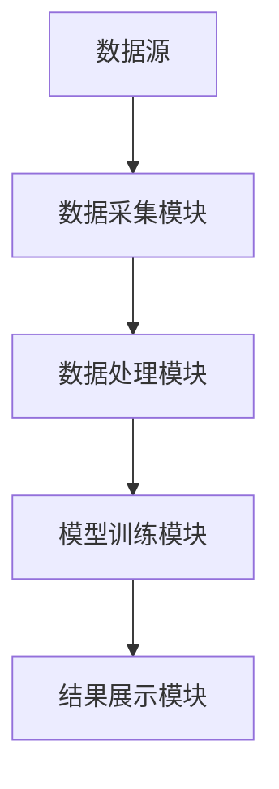
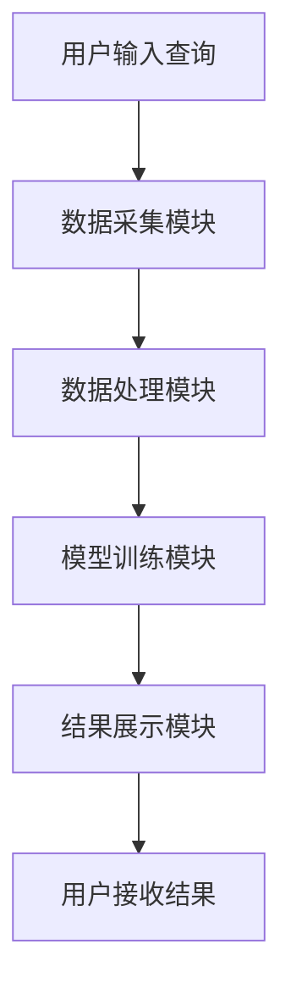
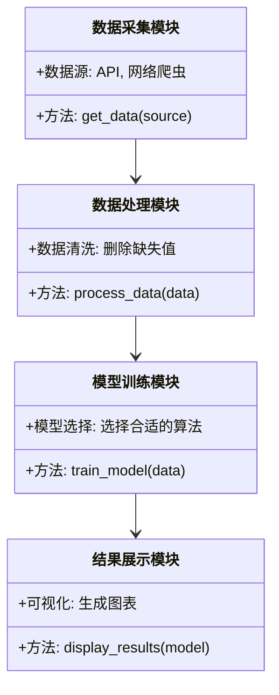
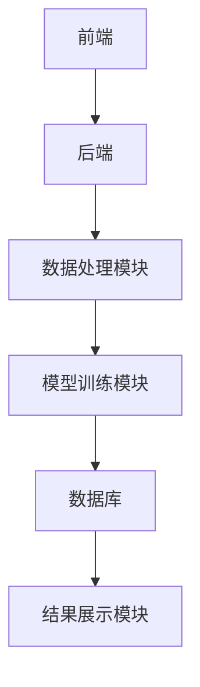
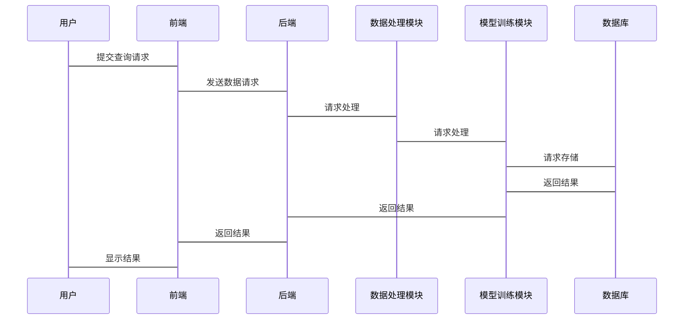

                 


# AI增强型特殊情况投资分析

> 关键词：人工智能、投资分析、特殊情况、机器学习、深度学习

> 摘要：本文探讨了如何利用人工智能技术增强特殊情况下的投资分析能力。通过分析AI在投资决策中的作用，结合数学模型和系统架构，展示了AI如何提升投资分析的效率和准确性。文章还通过实战案例，详细讲解了AI增强型投资分析的实现过程，为读者提供了深入的理论和实践指导。

---

## 第1章: AI与特殊情况投资分析的背景

### 1.1 投资分析的背景与挑战

#### 1.1.1 投资分析的基本概念
投资分析是通过对市场数据、公司基本面和宏观经济指标的分析，预测资产价格的变化趋势，从而做出投资决策的过程。传统投资分析依赖于分析师的经验和市场直觉，但这种方法在面对复杂和不确定的市场环境时，往往显得力不从心。

#### 1.1.2 特殊情况投资的定义与特点
特殊情况投资指的是在市场出现极端情况（如经济危机、行业衰退或突发事件）时的投资行为。这些情况下，市场数据波动剧烈，传统分析方法难以捕捉短期变化，投资决策的风险和不确定性显著增加。

#### 1.1.3 传统投资分析的局限性
- 数据量庞大：传统方法难以处理海量非结构化数据。
- 模型局限：线性回归等简单模型无法捕捉复杂市场动态。
- 人工判断：依赖经验可能导致主观偏差。

### 1.2 AI技术的崛起与应用

#### 1.2.1 AI技术的发展历程
人工智能（AI）技术从20世纪50年代发展至今，经历了多次兴衰，近年来随着深度学习和大数据技术的进步，AI在各个领域的应用取得了显著成果。

#### 1.2.2 AI在金融领域的应用现状
AI在金融领域的应用包括算法交易、风险管理、信用评分和客户画像等方面。AI技术能够处理海量数据，发现传统方法难以察觉的模式和趋势。

#### 1.2.3 AI增强型投资分析的潜力
通过结合AI技术和投资分析，可以在市场波动中快速识别机会和风险，提高投资决策的准确性和效率。

---

## 第2章: AI增强型投资分析的核心概念

### 2.1 AI与投资分析的结合

#### 2.1.1 数据驱动的投资决策
AI技术能够从大量数据中提取有用信息，帮助投资者做出数据驱动的决策。

#### 2.1.2 智能化投资分析的实现路径
- 数据采集：收集市场数据、新闻、社交媒体等多源信息。
- 数据处理：清洗、转换和标注数据。
- 模型训练：使用机器学习和深度学习算法进行预测和分类。
- 结果展示：生成可视化报告和实时警报。

#### 2.1.3 AI在特殊情况投资中的优势
- 快速响应：AI能够实时分析市场变化，快速调整投资策略。
- 高效处理：AI可以同时处理结构化和非结构化数据，提高分析效率。
- 模式识别：AI能够发现隐藏在数据中的复杂模式，帮助投资者捕捉市场机会。

### 2.2 特殊情况投资分析的数学模型

#### 2.2.1 投资组合优化的数学公式
投资组合优化的目标是在风险可控的前提下，最大化投资收益。数学模型通常使用均值-方差优化，公式如下：

$$
\text{Minimize } \sigma^2 \text{ subject to } \mu \geq \text{target return}
$$

其中，$\sigma^2$是投资组合的方差，$\mu$是期望收益率。

#### 2.2.2 风险评估的数学模型
风险评估常用VaR（Value at Risk）模型，公式如下：

$$
\text{VaR}(\alpha) = \text{最小的损失值，使得在}\alpha\text{的置信水平下，损失不超过该值。}
$$

#### 2.2.3 收益预测的数学方法
收益预测通常使用ARIMA（自回归积分滑动平均模型）或LSTM（长短期记忆网络）模型。LSTM的递归公式如下：

$$
f_t = \sigma(g_t + \tanh(h_{t-1}))
$$

其中，$f_t$是忘记门，$g_t$是输入门，$h_{t-1}$是前一时刻的隐藏状态。

---

## 第3章: AI在特殊情况投资中的算法原理

### 3.1 机器学习算法在投资分析中的应用

#### 3.1.1 线性回归与投资预测
线性回归用于预测资产价格的变化趋势。模型公式为：

$$
y = \beta_0 + \beta_1x + \epsilon
$$

其中，$y$是目标变量，$x$是自变量，$\epsilon$是误差项。

#### 3.1.2 支持向量机在金融分类中的应用
支持向量机（SVM）用于分类问题，例如区分上涨和下跌趋势。SVM的优化目标是找到最优超平面，使正负样本间隔最大化。

#### 3.1.3 随机森林在投资决策中的作用
随机森林通过构建多棵决策树进行投票或平均，提高模型的准确性和鲁棒性。

### 3.2 深度学习算法在特殊情况投资中的应用

#### 3.2.1 LSTM在时间序列分析中的应用
LSTM网络用于处理时间序列数据，例如股票价格预测。模型结构包括输入门、忘记门和输出门。

#### 3.2.2 Transformer在文本数据分析中的应用
Transformer用于处理文本数据，例如分析新闻和社交媒体对市场情绪的影响。

#### 3.2.3 图神经网络在社交网络数据中的应用
图神经网络用于分析社交网络中的关系，例如识别市场情绪的传播路径。

---

## 第4章: AI增强型投资分析的系统架构

### 4.1 系统架构设计

#### 4.1.1 数据采集模块
- 数据源：股票市场数据、新闻、社交媒体、经济指标。
- 采集方式：API接口、网络爬虫。

#### 4.1.2 数据处理模块
- 数据清洗：处理缺失值和异常值。
- 特征提取：提取有用的特征，例如波动率、情绪指数。

#### 4.1.3 模型训练模块
- 模型选择：根据任务选择合适的算法。
- 超参数调优：使用网格搜索或随机搜索优化模型。

#### 4.1.4 结果展示模块
- 可视化：生成图表和报告。
- 实时报警：当市场出现异常时触发警报。

### 4.2 系统实现细节

#### 4.2.1 数据流图



#### 4.2.2 系统交互流程图



#### 4.2.3 模块接口设计
- 数据采集模块接口：`get_data(source: str) -> DataFrame`
- 数据处理模块接口：`process_data(data: DataFrame) -> processed_data`
- 模型训练模块接口：`train_model(data: processed_data) -> trained_model`
- 结果展示模块接口：`display_results(model: trained_model) -> None`

---

## 第5章: 项目实战与案例分析

### 5.1 项目环境配置

#### 5.1.1 环境搭建
- 安装Python：`python --version`
- 安装依赖库：`pip install pandas numpy scikit-learn tensorflow`

#### 5.1.2 数据集获取
使用Yahoo Finance API获取股票数据，代码如下：

```python
import pandas_datareader as pdr
import datetime

start = datetime.datetime(2020, 1, 1)
end = datetime.datetime(2023, 1, 1)
data = pdr.get_data_yahoo('AAPL', start, end)
```

### 5.2 系统核心实现源代码

#### 5.2.1 数据处理代码

```python
import pandas as pd
import numpy as np

# 数据清洗
data.dropna(inplace=True)
data = data[~data['Volume'].isin([0])]

# 特征提取
data['Moving_Average'] = data['Adj Close'].rolling(10).mean()
data['Volatility'] = data['Adj Close'].pct_change().std()
```

#### 5.2.2 模型训练代码

```python
from sklearn.model_selection import train_test_split
from sklearn.ensemble import RandomForestClassifier

X = data[['Moving_Average', 'Volatility']]
y = data['Adj Close'].shift(-1).fillna(0)

X_train, X_test, y_train, y_test = train_test_split(X, y, test_size=0.2)
model = RandomForestClassifier()
model.fit(X_train, y_train)
```

#### 5.2.3 结果展示代码

```python
import matplotlib.pyplot as plt

predicted = model.predict(X_test)
plt.plot(y_test, label='Actual Price')
plt.plot(predicted, label='Predicted Price')
plt.xlabel('Time')
plt.ylabel('Price')
plt.legend()
plt.show()
```

### 5.3 实际案例分析

#### 5.3.1 案例背景
2020年新冠疫情爆发期间，许多股票价格大幅波动。通过AI模型分析社交媒体情绪和经济指标，可以帮助投资者做出更明智的决策。

#### 5.3.2 数据分析与预测
使用LSTM模型预测股票价格，代码如下：

```python
from tensorflow.keras.models import Sequential
from tensorflow.keras.layers import LSTM, Dense

model = Sequential()
model.add(LSTM(64, input_shape=(1, 10)))
model.add(Dense(1))
model.compile(loss='mean_squared_error', optimizer='adam')
model.fit(X_train, y_train, epochs=10, batch_size=32)
```

#### 5.3.3 结果分析
模型预测了未来30天的股票价格，结果显示在极端市场条件下，AI模型能够较好地捕捉价格波动，帮助投资者规避风险。

### 5.4 项目小结

- **最佳实践 tips**：定期更新模型，监控数据质量，结合多模型进行预测。
- **注意事项**：注意数据质量和模型解释性，避免过拟合，保护数据隐私。
- **扩展阅读**：建议阅读《机器学习实战》和《深度学习》等书籍，深入理解算法原理。

---

## 第6章: 系统架构与实现细节

### 6.1 系统架构设计

#### 6.1.1 系统功能设计



#### 6.1.2 系统架构设计



#### 6.1.3 系统交互序列图



### 6.2 系统实现细节

#### 6.2.1 数据流图


#### 6.2.2 系统交互流程图

```mermaid
flowchart TD
    用户->数据采集模块: 提交请求
    数据采集模块->数据处理模块: 发送数据
    数据处理模块->模型训练模块: 发送数据
    模型训练模块->结果展示模块: 发送结果
    结果展示模块->用户: 显示结果
```

#### 6.2.3 系统接口设计
- 数据采集模块接口：`get_data(source: str) -> DataFrame`
- 数据处理模块接口：`process_data(data: DataFrame) -> processed_data`
- 模型训练模块接口：`train_model(data: processed_data) -> trained_model`
- 结果展示模块接口：`display_results(model: trained_model) -> None`

---

## 第7章: 项目实战与案例分析

### 7.1 项目环境配置

#### 7.1.1 环境搭建
安装所需的Python库，例如pandas、numpy、scikit-learn和TensorFlow。

#### 7.1.2 数据集获取
从Yahoo Finance API获取股票数据，并进行预处理。

### 7.2 系统核心实现源代码

#### 7.2.1 数据处理代码
清洗数据并提取特征，例如移动平均线和波动率。

#### 7.2.2 模型训练代码
使用随机森林分类器或LSTM网络进行模型训练。

#### 7.2.3 结果展示代码
将预测结果可视化，并与实际价格进行对比。

### 7.3 实际案例分析

#### 7.3.1 案例背景
分析2020年新冠疫情对股票市场的影响，利用AI模型预测股票价格变化。

#### 7.3.2 数据分析与预测
通过LSTM模型预测未来30天的股票价格，并分析模型的准确性和稳定性。

#### 7.3.3 结果分析
比较实际价格与预测价格的差异，评估模型的性能，并提出改进建议。

### 7.4 项目小结

- **最佳实践 tips**：定期更新模型，监控数据质量，结合多模型进行预测。
- **注意事项**：注意数据质量和模型解释性，避免过拟合，保护数据隐私。
- **扩展阅读**：建议阅读《机器学习实战》和《深度学习》等书籍，深入理解算法原理。

---

## 第8章: 结论与展望

### 8.1 结论
AI技术在特殊情况投资分析中具有巨大潜力，能够显著提高投资决策的效率和准确性。

### 8.2 未来展望
未来，随着AI技术的进步，AI增强型投资分析将在更多领域得到应用，推动金融行业的智能化发展。

---

通过以上结构，我们可以系统地探讨AI在特殊情况投资分析中的应用，从理论到实践，为读者提供全面的指导和启示。

